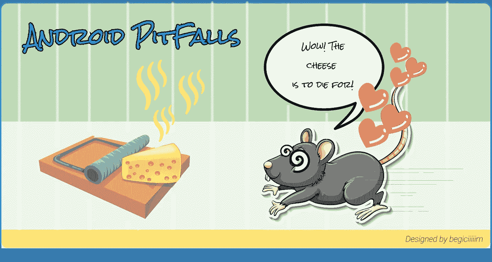
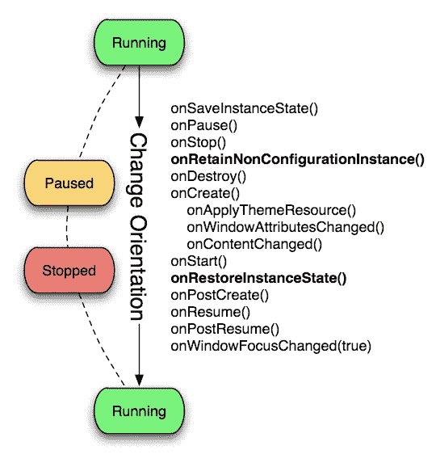
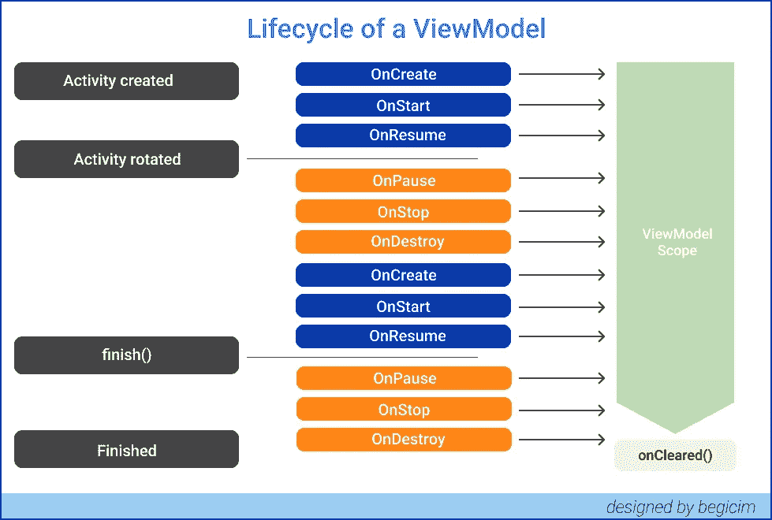
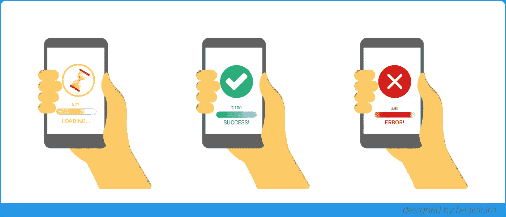

# 最常见的 Android 问题——Android 陷阱🐭 🧀

> 原文：<https://blog.kotlin-academy.com/most-common-android-problems-android-pitfalls-d7f3e11dabff?source=collection_archive---------0----------------------->



大家好，希望一切顺利！

在这篇文章中，我将解释 Android 的常见问题以及我们应该如何解决它们。我将在三个标题下讨论这些问题；**核心，UI，网络**。

我们开始吧！🏁

# 核心⚡️

## 屏幕旋转🤸🏼‍♀


Photo by [Lauren Mancke](https://unsplash.com/@laurenmancke?utm_source=medium&utm_medium=referral) on [Unsplash](https://unsplash.com?utm_source=medium&utm_medium=referral)

***旋转屏幕会发生什么？在我们考虑这个问题之前，让我们试着理解 Android 是如何处理这个问题的。***

当用户旋转他们的手机**时，活动的配置会改变，因此 android 操作系统会破坏该活动并再次创建它**。

幕后；当设备方向改变时，首先当调用`**onPause**` **、** `**onStop**` **和** `**onDestroy**`方法时，活动将消失一毫秒。几毫秒后，活动将重新启动，并调用`**onCreate**`、`**onStart**`和`**onResume**`方法。



Photo from [https://stackoverflow.com/questions/28954134](https://stackoverflow.com/questions/28954134)

如上图所示，随着屏幕的旋转，再次调用`onCreate`方法，暗示我们的旧数据丢失了。这是我们在设计 Android 应用时面临的常见场景。没有进一步的犹豫，有两种流行的方法来处理这个问题！

*   **使用视图模型:** ViewModel 类被设计用来保存和管理 **UI 相关的数据**也保留配置变化中的数据，比如屏幕旋转。这就是为什么当我们使用它们来保持我们的状态时，我们不需要担心电话轮换。



*   **通过使用** `onSaveInstanceState()` **:** 我们可以将数据存储在一个包中，并使用`onRestoreInstanceState`方法进行检索。

*   **您的清单>活动标签添加** `android:configChanges="orientation|keyboardHidden|screenSize"` **:** 这可以防止您的活动在旋转或改变方向时被重新创建，从而不会丢失任何数据(将保留您以前的值)

## 片段空校验

下一个主题是在使用片段管理器添加片段之前检查是否创建了活动。

***为什么在添加新片段之前，需要在 onCreate 时检查*** `savedInstanceState` ***参数是否为空？*** —答案在这里👉🏻当您的活动被重新创建时，例如在屏幕旋转或其他[配置更改](http://developer.android.com/guide/topics/resources/runtime-changes.html)之后，片段会被自动重新附加。通过在`onCreate`检查`savedInstanceState == null`，你确保你没有重新添加已经为你添加的片段。

你可以使用`findFragmentByTag`或`findFragmentById`函数来获得一个片段。如果提到的方法返回 null，那么该片段不存在。如果一个片段存在，你不必创建一个新的，你应该使用现有的！

```
Fragment fragmentA = fragmentManager.findFragmentByTag("frag1");
if (fragmentA == null) {
  // not exist
} else {
  // fragment exist
}
```

顺便说一下，你不需要声明引用 Fragment 实例的变量。相反，通过标签保存你的片段，然后获取它。像那样；

## 与碎片交流

*   **通过定义接口在片段之间传递数据:**在片段之间传递数据的最常见的方式是通过使用由容器活动实现的方法来定义接口。你可以认为我们有一个项目的清单和项目的细节片段。列表片段调用由活动实现的方法，并将数据(项目 id)传递给它。活动中的方法找到项目细节片段，并通过调用细节片段中定义的 setter 方法来设置从项目片段接收的数据。

让我们看看如何做到这一点！

首先，我创建了一个名为 Communicator 的接口，这里有一个方法`sendSelectedItemId`,我们从 ListItem 片段中发送选中项目的 id。

我们通过用 **MainActivity** 中的 **DetailFragment** 替换 **ListItemFragment** 来显示新片段，就像这样；

在我们发送了来自**列表项** **片段**的值之后，就该从我们的**细节片段**中检索它并将其显示在屏幕上了。

*   **使用 ViewModel 在片段之间传递数据:**使用 ViewModel 和 LiveData 在活动的两个片段之间传递数据的最佳解决方案之一。

我们来看例子。

当用户点击一个按钮时，FragmentA 将更新 ViewModel 中的实时数据。代码如下所示:

正在观察 SharedViewModel 的选定实时数据的任何人现在都可以对实时数据中的变化做出反应。如果 FragmentB 想要注意到变化，它将看起来像这样:

活动也观察变化；

*   **片段结果监听器:**你可以通过使用 Fragment Result Listener 找到如何在片段间传递结果的最佳解释，请阅读此[文档](https://developer.android.com/guide/fragments/communicate#fragment-result)！

# 用户界面🔮

让我们想象一下，你已经开始开发应用程序，你要在你的用户界面上显示数据。我们会面临什么样的情况？🧐

让我们看看第一种情况！

## 没有互联网连接

你完成了任务，获取了数据，并在你的应用程序上显示出来，一切都很好，但如果互联网**瘫痪**，用户会怎么办？

在这个场景中，将自己 ***视为用户*** 。 ***你想在屏幕上看到什么？*** ***什么都没有？以前的数据？相关信息？..***

我想没有人想在屏幕上看到任何东西。我们可能会显示相关的消息，我认为这比在这个场景中什么都不显示要好，但是我的方法是“显示**以前的** **数据**！”我们来看看怎么做吧！

> 首先，为了做到这一点，用户必须在连接互联网时至少使用一次应用程序****；否则，我们无法这样做，因为我们需要获取数据以便保存它！****

****当用户第一次启动应用程序时，所有数据都保存在数据库中(例如 SQLite、房间等)。如果用户有互联网连接，以前存储在数据库中的数据将被删除，然后新数据(更新)将被一次又一次地保存到数据库中…****

****这太好了，因为我们希望保留最新的数据。当用户没有互联网连接时，我们可以显示存储在我们 app 上的数据。****

****但是请密切注意那里，因为我们需要小心我们显示的数据！例如，您可能有服装数据(图片、详细信息、价格、尺寸等) ***您希望显示哪个字段？*** 我更喜欢**而不是**显示服装价格，因为它们可能会在没有互联网连接的情况下发生变化。我只会分享衣服的图片，细节和尺寸，这些都是静态的信息。****

## ****如果您的数据为空，该怎么办？****

****让我们回顾一下这个场景。您已经获取了数据并将它们列在 UI 上，一切看起来都是有序的，但是如果一些数据是空的呢？！ ***作为用户，你期望在屏幕上看到什么？*******

****实际上，作为一个用户，我更喜欢看到一些东西，而不是什么都没有的！
作为开发人员，如果图像数据为空，我会显示信息图像，对于文本数据，我会显示类似***‘对不起，我们找不到尺寸信息’或‘不适用’***的信息文本****

> ****请记住，我们不管理服务数据，但我们可以更清楚地显示它。****

****您可以在这段代码中看到我是如何处理它的👇🏻****

## ****用户界面状态(加载、成功、错误)****

********

****我们向服务发出了请求，正在等待响应；因此， ***在这种情况下，您的方法是什么(直到您收到服务的响应)？*** ***您会简单地等待响应还是通知用户这种情况？*******

****如果我是一个**用户**，如果我在得到服务的响应之前没有在屏幕上看到变化，我会认为这个应用程序被冻结了，无法工作，我会退出它。****

****作为一个**开发者**，在这样的情况下我会采取以下做法:首先，不管服务的响应(成功，错误)，我们都必须提供用户应该等待的消息，即加载消息。如果结果是一个错误，我们必须向用户显示相同的错误消息。如果我们的服务结果是成功的，我们必须展示我们的数据。****

****在我的例子中，我使用了 MVVM 架构，因此我在 ProductViewModel 类中更新了我的 UI 状态。当 UI 状态被触发时，我还调用了`bindApiStatus`函数。****

****在这种情况下，另一个问题是**装载**的状态。我们向服务发出请求，从那时起的过程，直到我们得到响应，就是我们的加载状态生命周期。****

****所以，让我们想象一下这样一个场景，我们有产品并列出它们，当用户点击其中一个时，它会把他们带到产品的详细页面。 ***这种情况下装载状态应该放在哪里？*** 🧐请在评论中分享你的想法！****

# ****⛓网络****

## ****SSL 固定****

********

****Reference from techuz.com****

*******什么是 SSL？—*** SSL Pinning 代表**安全套接字层**。SSL 是在**客户端**和**服务器**之间建立加密链接的标准安全技术。SSL 证书有一个密钥对，即一个**公钥**和一个**私钥**。****

*******为什么需要 SSL 证书钉住？*** — SSL pinning 允许应用程序只信任有效的或预定义的**证书**或**公钥。**应用程序开发人员使用 **SSL pinning** 技术作为应用程序流量的附加安全层。通常，应用程序信任自定义的**证书**，并允许应用程序拦截流量。****

****锁定可信证书集可以防止攻击者分析服务器通信。****

****我在**参考文献**部分添加了一些关于 SSL 固定的文章，强烈推荐您阅读。你可以在这里了解更多！****

## ****ProGuard-Android****

****ProGuard 是一个可以帮助你**缩小**、**混淆**和**优化**你的代码的程序。这对于减少你的 Android 应用程序的整体大小以及删除那些导致 Android 应用程序固有的 64k 方法限制的不使用的类和方法是非常有效的。因此，ProGuard 经常被建议用于开发和生产，特别是对于**更大的**项目。****

****通过指定 **minifyEnabled** 参数，可为任何建筑类型激活 ProGuard。强烈建议，如果您打算将它用于**生产**，也在您的**开发**中启用它。如果您没有在您的开发版本上彻底测试 ProGuard，您可能会遇到意外的崩溃或应用程序无法按预期执行的情况。****

****Android SDK 包括 ProGuard 和默认设置文件，名为 **proguard-android.txt** 。包含这个文件是非常重要的，因为它包含了显式的配置设置，比如明确指定所有的视图 getter 和 setter 方法都不应该被移除。您将用来配置的文件是 proguard-rules.pro。****

****感谢您的阅读。我希望它对你有帮助😌请随时在 [Github](https://github.com/BegumYazici) 和 [LinkedIn](https://www.linkedin.com/in/begumyazici/) 上联系我。回头见！****

# ****参考🔍****

****[](https://stackoverflow.com/questions/31277979/why-is-it-necessary-to-check-savedinstancestate-inside-of-oncreate/31278014#31278014) [## 为什么需要在 OnCreate 内部检查 savedInstanceState？

### onCreate()方法中 if 块的用途是什么？为什么需要检查 savedInstanceState 是否…

stackoverflow.com](https://stackoverflow.com/questions/31277979/why-is-it-necessary-to-check-savedinstancestate-inside-of-oncreate/31278014#31278014) 

[https://developer.android.com/guide/fragments/communicate](https://developer.android.com/guide/fragments/communicate)

[](https://medium.com/@anuj.rai2489/ssl-pinning-254fa8ca2109) [## SSL 固定

### SSL pinning 代表安全套接字层。SSL 证书通过建立一个安全的…

medium.com](https://medium.com/@anuj.rai2489/ssl-pinning-254fa8ca2109) 

[https://mailapurvpandey . medium . com/SSL-pinning-in-Android-90 dddfa 3 e 051 #:~:text = SSL % 20 pinning % 20 is % 20a % 20 process，' pinned ' % 20 to % 20% 20 host](https://mailapurvpandey.medium.com/ssl-pinning-in-android-90dddfa3e051#:~:text=SSL%20pinning%20is%20a%20process,'pinned'%20to%20the%20host)。

[https://developer . Android . com/guide/fragments/communicate # fragment-result](https://developer.android.com/guide/fragments/communicate#fragment-result)

[](https://kotlin-academy.us17.list-manage.com/subscribe?u=5d3a48e1893758cb5be5c2919&id=d2ba84960a)****