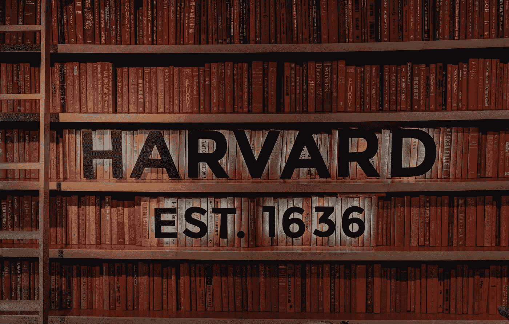
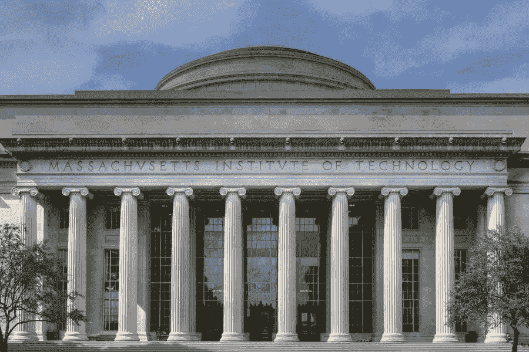
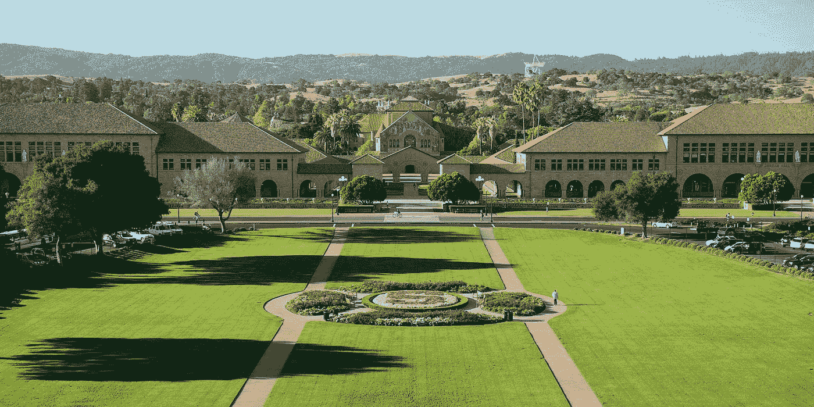
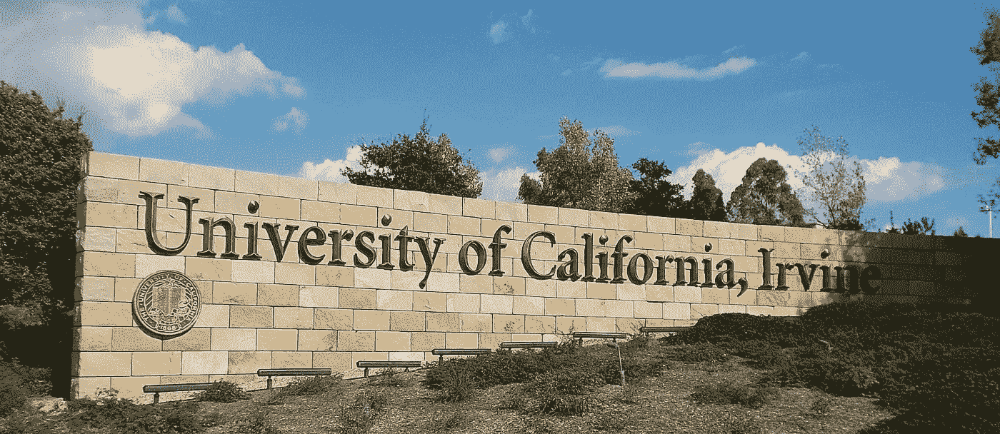

# 顶尖大学最有用的免费在线课程

> 原文：<https://medium.com/quick-code/most-useful-free-online-courses-from-top-universities-aa47bf0f13a5?source=collection_archive---------0----------------------->

## 哈佛、斯坦福、麻省理工等顶尖大学的最佳免费课程列表。

Photo by [Pascal Bernardon](https://unsplash.com/@pbernardon?utm_source=medium&utm_medium=referral) on [Unsplash](https://unsplash.com?utm_source=medium&utm_medium=referral)

在线课程非常棒，不仅仅是因为你可以足不出户地从世界一流的大学学习。有几个原因可以解释为什么网络课程对你来说很棒。你已经知道了，顶尖大学的在线课程是不缺的。有几百个，很多都是免费的。

斯坦福大学、哈佛大学、麻省理工学院和 UCI 大学是世界上最负盛名的大学。他们提供很多高质量的课程，而且很多课程是免费的。这篇文章将看看这些顶尖大学的一些最好的免费在线课程，以帮助你扩大视野。

## [哈佛大学](https://pll.harvard.edu/catalog?keywords=&subject%5B%5D=1&max_price=&start_date_range%5Bmin%5D%5Bdate%5D=&start_date_range%5Bmax%5D%5Bdate%5D=)

Photo by [Clay Banks](https://unsplash.com/@claybanks?utm_source=medium&utm_medium=referral) on [Unsplash](https://unsplash.com?utm_source=medium&utm_medium=referral)

通过选修哈佛大学提供的 138 门免费在线课程，你可以免费体验常春藤盟校的教育。以下是哈佛大学提供的几个热门学科领域，以及一些你可能会感兴趣的项目:

*   **艺术&设计:**
*   商业:非营利财务管理网络研讨会:介绍会计和财务报表、弹性领导力、薪资谈判技巧等。
*   **计算机科学:**律师用 CS50，CS50 用 Python 做人工智能入门，TinyML 基础，用 Python 做研究等。
*   **数据科学:** [数据科学:顶点](https://coursesity.com/course-detail/data-science-capstone)，数据科学:可视化，数据科学:R 基础，数据科学:推理与建模等。
*   **教育&教学:**幼儿发展:干预的全球战略、学习的领导者、家庭参与教育的介绍等。
*   **健康&医学:**气候变化对健康的影响，埃博拉的教训:预防下一个疫情，改善全球健康:关注质量和安全等。
*   **人文:**宗教、冲突与和平、数字人文入门、有形之物、印度教经其经文等。
*   **数学:** Fat Chance:从头开始的概率，微积分应用等。
*   **编程:** CS50 的游戏开发入门，CS50:计算机科学入门，CS50 的用 Python 做人工智能入门等。
*   **理科:**环境约束下的能源，大学化学中的微型教师计划，生物化学原理，[超级地球与生命](https://coursesity.com/course-detail/super-earths-and-life)等。
*   **社会科学:**美国的公民政治:民意、选举、利益集团、媒体、哈佛肯尼迪学院高管教育等。

## [麻省理工学院](https://ocw.mit.edu/courses/find-by-topic/#cat=business)

Photo by [MIT University](https://news.mit.edu/2015/mit-named-best-university-worldwide-social-sciences-1109)

尽管麻省理工学院拥有最多的工程和自然科学项目，但它在经济学、政治学、城市研究、语言学和哲学方面也很出色。以下是麻省理工大学提供的几个热门学科领域，以及一些你可能会感兴趣的顶级课程:

*   **商业:**成为企业家，创业 101:谁是你的客户？
*   **发展:**重要城市基础设施的网络安全
*   **设计:**网站在线规划
*   **工程:**航空航天工程概论:航天学和载人航天学
*   音乐:世界音乐:巴厘节奏
*   数学:概率——不确定性和数据的科学
*   科学:分子生物学:RNA 加工和翻译，生物技术的科学和商业
*   社会科学:结构材料:选择和经济学，评估社会项目

## [斯坦福大学](https://online.stanford.edu/explore?type=All&free_or_paid%5Bfree%5D=free)

Photo by [Stanford University](https://scpd.stanford.edu/)

斯坦福大学一直名列全国前十名大学，赢得了美国一流教育机构的声誉。除了杰出的学术成就，斯坦福大学的学生还以他们的创业精神和高投资回报率而闻名。

斯坦福大学提供的免费课程包括:

*   [机器学习](https://coursesity.com/course-detail/machine-learning-4)
*   医疗保健中的人工智能
*   [密码学 II](https://coursesity.com/course-detail/cryptography-ii)
*   分而治之、排序和搜索以及随机化算法
*   国际妇女健康和人权
*   贪婪算法、最小生成树和动态规划
*   感染的故事
*   图形搜索、最短路径和数据结构
*   最短路径重访，NP 完全问题和如何处理它们

## 加州大学欧文分校

Photo by [UCI Office of Research](https://research.uci.edu/)

根据《美国新闻与世界报道》, UCI 大学是美国十所最好的公立大学之一。它成立于 1965 年，是著名的美国大学协会最年轻的成员。除了产生了三位诺贝尔奖获得者，该校园还因其学术成就、卓越的研究和食蚁兽吉祥物而闻名。

UCI 提供的学科领域有:艺术、生物科学、商业、教育、工程、人文、信息和计算机科学、跨学科研究、法律、自然科学、社会生态学和社会科学。

UCI 大学提供的免费课程包括:

*   [区块链](https://coursesity.com/course-detail/the-blockchain)
*   语法和标点符号
*   冲突管理
*   启动和规划项目
*   物联网和嵌入式系统简介
*   项目管理项目
*   论文写作研究导论
*   [围棋入门](https://coursesity.com/course-detail/getting-started-with-go-)
*   英语学术讨论
*   虚拟教师

感谢您花时间阅读本文。欢迎您留下您的评论，如果它有助于您学习上述任何主题。

 [## 学习 Python 的 7 个必备技巧

### 学习这些 Python 技巧来智胜其他开发者，成为更好版本的自己。

medium.com](/quick-code/7-must-know-python-skills-to-advance-in-python-ff752ff760f6)