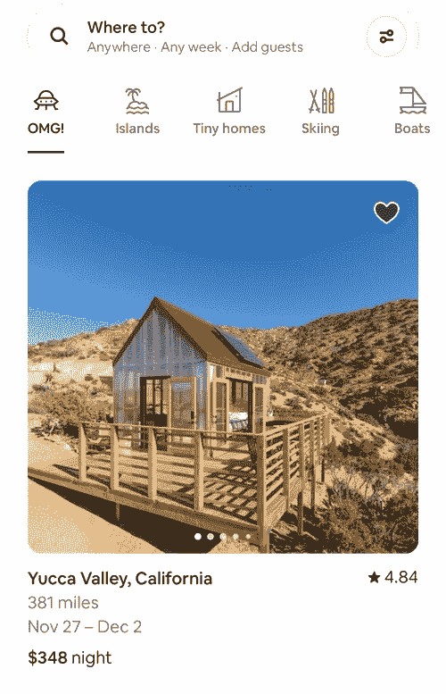
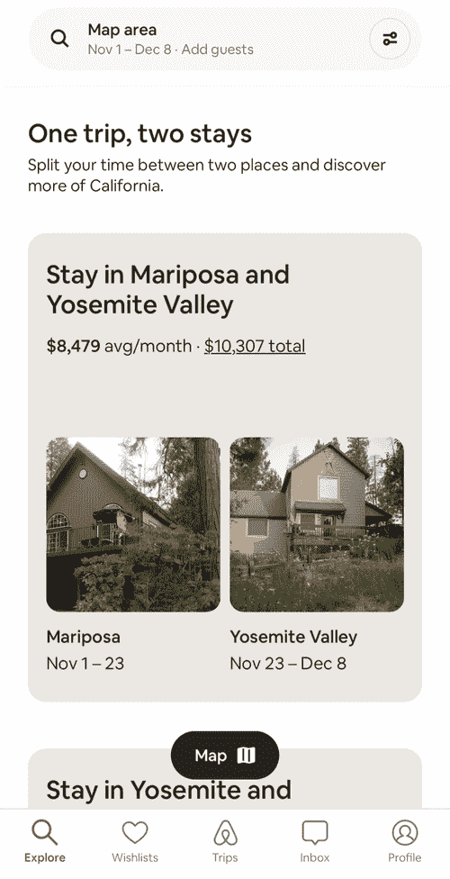
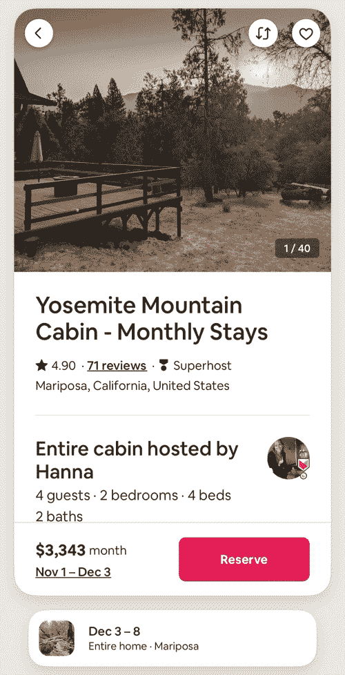
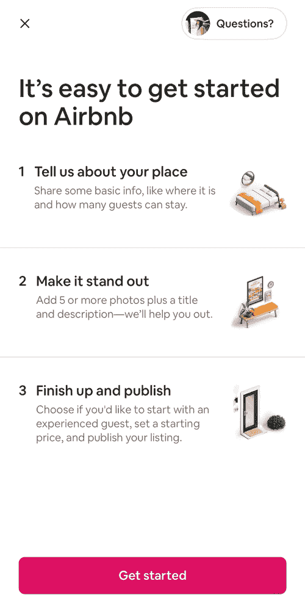
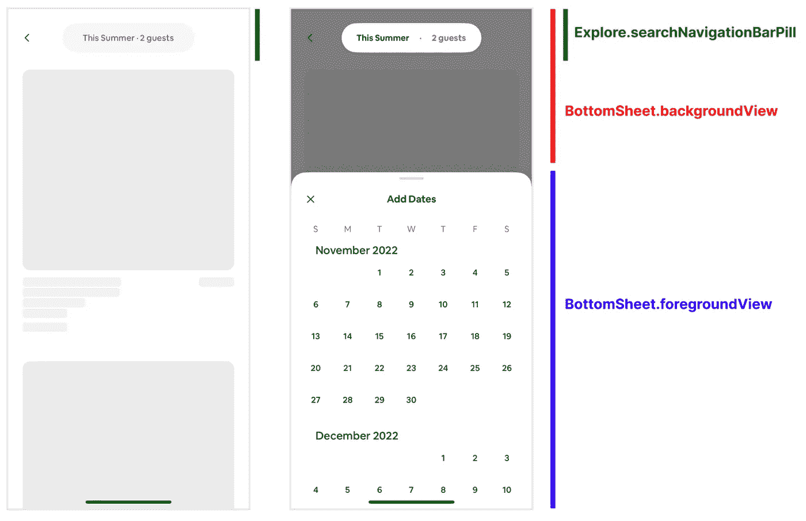
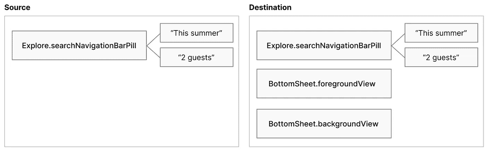
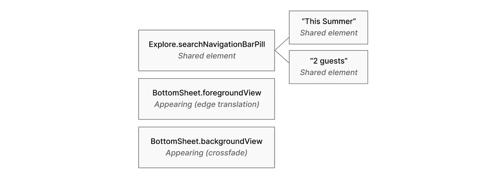

# 大规模运动工程

> 原文：<https://medium.com/airbnb-engineering/motion-engineering-at-scale-5ffabfc878?source=collection_archive---------2----------------------->

Airbnb 如何应用声明式设计模式快速构建流畅的过渡动画

**作者:** [卡尔·斯蒂芬斯](https://www.linkedin.com/in/calstephens/)


动作是让数字体验变得既简单又愉快的一个关键因素。状态和屏幕之间的流畅转换是帮助用户在浏览功能时保留上下文的关键。动画的快速发展使应用程序变得生动，并有助于赋予它鲜明的个性。

在 Airbnb，我们推出了数百项由许多团队的工程师开发的功能和实验。在进行这种规模的建设时，考虑我们整个技术体系的效率和可维护性至关重要，motion 也不例外。将动画添加到一个特征需要快速和容易。该工具必须与我们的特征架构的其他组件相配合。如果一个动画需要很长时间来构建，或者很难与整体功能架构集成，那么当从设计转换到实现时，它通常是产品体验的第一部分。

在本帖中，我们将讨论我们为帮助实现这一愿景而创建的 iOS 新框架。

# 强制性 UIKit 转换

让我们考虑一下 Airbnb 应用主页上的这种转变，它将用户从搜索结果带到一个扩展的搜索输入屏幕:



An example transition from Airbnb’s iOS app of expanding and collapsing the search input screen

过渡是设计的关键部分，使整个搜索体验感觉有凝聚力和轻量级。

在传统的 UIKit 模式中，有两种方法可以构建这样的转换。一个是创建一个单一的大规模视图控制器，包含搜索结果和搜索输入屏幕，并使用命令式 [*UIView* 动画块](https://developer.apple.com/documentation/uikit/uiview/1622418-animate)协调两种状态之间的转换。虽然这种方法很容易构建，但它的缺点是这两个屏幕紧密耦合，使得它们的可维护性和可移植性大大降低。

另一种方法是将每个屏幕实现为一个单独的视图控制器，并创建一个定制的[*UIViewControllerAnimatedTransitioning*](https://developer.apple.com/documentation/uikit/uiviewcontrolleranimatedtransitioning?language=objc)实现，该实现从每个视图层次结构中提取相关视图，然后将它们动画化。这通常实现起来更复杂，但是有一个关键的好处，那就是让每个单独的屏幕作为一个单独的 *UIViewController* 来构建，就像你对任何其他功能所做的那样。

在过去，我们已经用这两种方法构建了转换，并且发现它们通常都需要数百行脆弱的命令式代码。这意味着定制化的过渡构建起来很耗时，并且很难维护，所以它们通常不被包含在团队的主要特性开发流程中。

一个共同的趋势是从这种*命令式*系统设计转向*声明式*模式。我们在 Airbnb 广泛使用声明系统——我们利用像[环氧树脂](/airbnb-engineering/introducing-epoxy-for-ios-6bf062be1670)和 SwiftUI 这样的框架来声明性地定义每个屏幕的布局。使用[声明性](https://github.com/airbnb/epoxy-ios#epoxypresentations) [导航](https://github.com/airbnb/epoxy-ios#epoxynavigationcontroller)API 将屏幕组合成功能和流程。我们发现，这些声明式系统通过让工程师专注于定义应用程序应该如何运行，并抽象出复杂的底层实现细节，释放出大量的生产力收益。

# 声明性过渡动画

为了简化和加快向我们的应用程序添加过渡的过程，我们创建了一个新的**框架，用于以声明方式**构建过渡，而不是像以前那样强制构建。我们发现，这种新方法使构建自定义过渡变得更加简单，因此，更多的工程师能够轻松地将丰富而令人愉快的过渡添加到他们的屏幕上，即使是在时间紧迫的情况下。

要使用这个框架执行转换，您只需提供*初始*状态和*最终*状态(或者在屏幕转换的情况下，提供*源*和*目的*视图控制器 *)* 以及一个声明性的*转换定义*，说明屏幕上的每个元素应该如何被动画化。框架的通用*UIViewControllerAnimatedTransitioning*实现自动处理所有其他事情。

这个新的框架已经成为我们构建特性的工具。它为 Airbnb 2022 年夏季发布的*和 2022 年冬季发布的*中的许多新功能提供了动力，有助于使它们易于使用，令人愉快:**

************

**Example transitions in Airbnb’s iOS app from new features introduced in 2022**

**作为介绍，我们先举个例子。这里有一个简单的“搜索”交互，底部表单中的日期选择器在一页内容上滑动:**

****

**An example transition for a simple “search” feature**

**在本例中，有两个独立的视图控制器:搜索结果屏幕和日期选择器屏幕。我们要制作动画的每个组件都标有一个标识符，以确定它们的身份。**

****

***Diagram showing the search results screen and date picker screen annotated with component identifiers***

**这些标识符让我们通过名称在语义上引用每个组件，而不是直接引用 *UIView* 实例。例如，每个屏幕上的*explore . searchnavigationbarpill*组件是一个独立的 *UIView* 实例，但是因为它们被标记了相同的标识符，所以这两个视图实例被认为是同一组件的独立“状态”。**

**现在我们已经确定了我们想要制作动画的组件，我们可以定义*它们应该如何制作动画。对于这种转变，我们希望:***

1.  **淡入的背景**
2.  **从屏幕底部向上滑动的底部表单**
3.  **在第一状态和第二状态之间动画显示的导航栏(“共享元素”动画)。**

**我们可以将其表达为一个简单的转换定义:**

```
**let transitionDefinition: TransitionDefinition = [
  BottomSheet.backgroundView: .crossfade,
  BottomSheet.foregroundView: .edgeTranslation(.bottom),
  Explore.searchNavigationBarPill: .sharedElement,
]**
```

**回顾上面扩展和折叠搜索输入屏幕的例子，我们需要:**

1.  **要模糊的背景**
2.  **要滑入的顶部栏和底部栏**
3.  **主屏幕搜索栏过渡到“你要去哪里？”卡片**
4.  **另外两张搜索卡淡入，同时相对于“你要去哪里？卡片**

**下面是如何使用声明性转换定义语法定义动画的:**

```
**let transitionDefinition: TransitionDefinition = [
  SearchInput.background: .blur,
  SearchInput.topBar: .translateY(-40),
  SearchInput.bottomBar: .edgeTranslation(.bottom),

  SearchInput.whereCard: .sharedElement,
  SearchInput.whereCardContent: .crossfade,
  SearchInput.searchInput: .crossfade,

  SearchInput.whenCard: .anchorTranslation(relativeTo: SearchInput.whereCard),
  SearchInput.whoCard: .anchorTranslation(relativeTo: SearchInput.whereCard),
]**
```

# **它是如何工作的**

**这个声明性的*转换定义* API 是强大而灵活的，但是它只讲述了故事的一半。为了实际执行动画，我们的框架提供了一个通用的*UIViewControllerAnimatedTransitioning*实现，它接受转换定义并编排转换动画。为了探索这个实现是如何工作的，我们将返回到简单的“搜索”交互。**

**首先，框架遍历*源*和*目的地*屏幕的视图层次，为每个被动画化的标识符提取 *UIView* 。这决定了给定的标识符是否出现在每个屏幕上，并形成了一个*标识符层次*(很像屏幕的视图层次)。**

****

***The “identifier hierarchy” of the source and destination screens***

***源*和*目的地*的标识符层次结构是不同的，以确定单个组件是否被添加、删除或出现在两者中。如果添加或删除了视图，框架将使用转换定义中指定的动画。如果视图在两种状态下都存在，框架会执行一个“共享元素动画”,其中组件从其初始位置到其最终位置动画化，同时更新其内容。这些共享元素是递归动画——每个组件都可以提供自己的子元素标识符层次结构，这是不同的，也是动画。**

****

***The final identifier hierarchy after diffing the source and destination screens***

**为了实际执行这些动画，我们需要一个与我们的*标识符层次结构*相匹配的*视图层次结构*。我们不能通过将源屏幕和目的屏幕层叠在一起的方式将它们合并到一个视图层次结构中，因为这种排序是错误的。在这种情况下，如果我们只是将目标屏幕放在源屏幕上，那么源*explore . searchnavigationbarpill*视图将位于目标*bottom sheet . background view*元素之下，这与标识符层次结构不匹配。**

**相反，我们必须创建一个与标识符层次结构相匹配的单独的视图层次结构。这需要制作动画组件的副本，并将它们添加到 UIKit 转换容器中。大多数 *UIView* s 都不是普通的可复制的，所以副本通常是通过“快照”视图(将其渲染为图像)来制作的。我们在播放动画时暂时隐藏“原始视图”，所以只有快照是可见的。**

**一旦框架建立了转换容器的视图层次结构，并确定了用于每个组件的特定动画，就只需要应用和播放动画了。这是执行底层命令式 *UIView* 动画的地方。**

# **结论**

**就像使用 [Epoxy](/airbnb-engineering/introducing-epoxy-for-ios-6bf062be1670) 和其他声明式系统一样，抽象出底层的复杂性并提供一个简单的声明式接口，使得工程师们可以专注于*什么*而不是*如何*。这些动画的声明性转换定义只有几行代码，这本身就是对任何可行的命令式实现的巨大改进。由于我们的声明式功能构建 API 对 UIKit[*UIViewControllerAnimatedTransitioning*](https://developer.apple.com/documentation/uikit/uiviewcontrolleranimatedtransitioning?language=objc)实现提供了一流的支持，这些声明式转换可以集成到现有的功能中，而无需进行任何架构更改。这极大地加速了特性开发，使得创建高度完善的转换比以往任何时候都更容易，同时也支持长期的灵活性和可维护性。**

**我们有一个完整的路线图。积极工作的一个领域是提高与 SwiftUI 的互操作性。这使我们能够在 UIKit 和基于 SwiftUI 的屏幕之间无缝转换，从而在我们的应用程序中逐步采用 SwiftUI，而不必牺牲运动。我们也在探索让类似的框架在 web 和 Android 上可用。我们的长期目标是在所有平台上尽可能容易地将我们设计师的伟大想法转化为实际的运输产品。**

**有兴趣在 Airbnb 工作吗？查看这些开放的角色:**

**[软件工程师，愿望清单](https://careers.airbnb.com/positions/4693375/)**

**[员工软件工程师，嘉宾&主持人](https://careers.airbnb.com/positions/4665949/)**

**[员工 Android 软件工程师，嘉宾](https://careers.airbnb.com/positions/4590099/)**

# **感谢**

**非常感谢 Eric Horacek 和 Matthew Cheok 对 Airbnb 的 motion architecture 和我们的声明式转换框架做出的重大贡献。**

***所有产品名称、标识和品牌均为其各自所有者的财产。本网站中使用的所有公司、产品和服务名称仅用于识别目的。使用这些名称、标志和品牌并不意味着认可。***