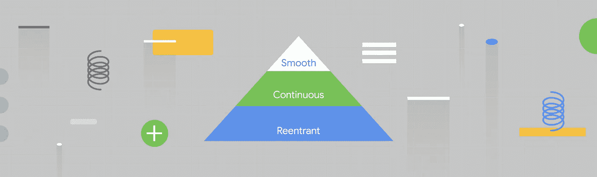
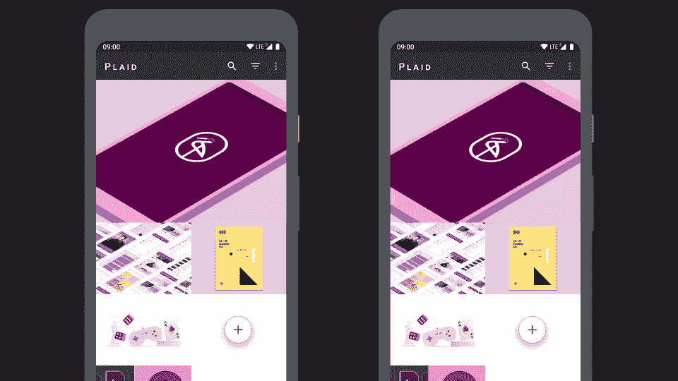
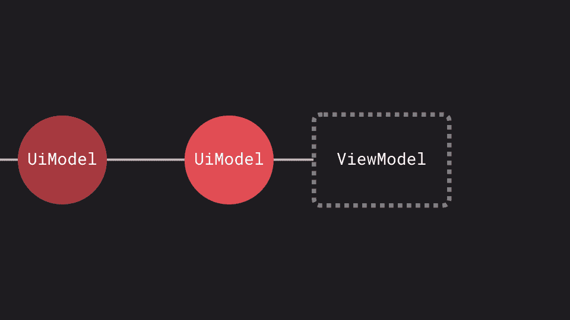
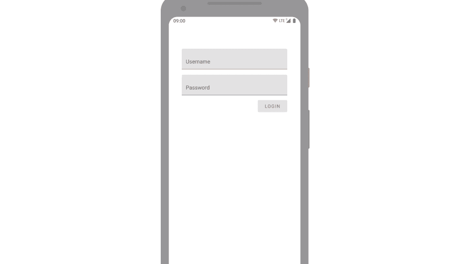
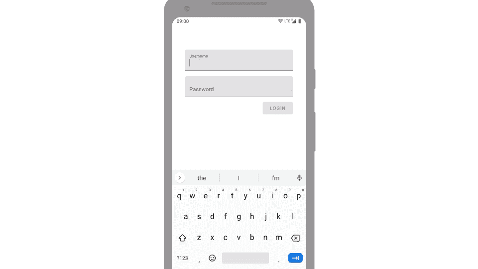
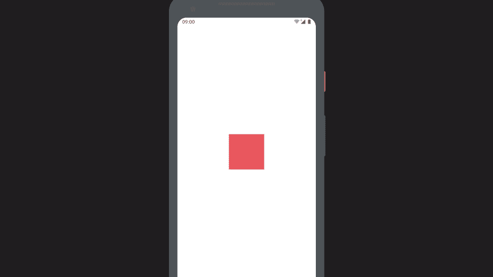
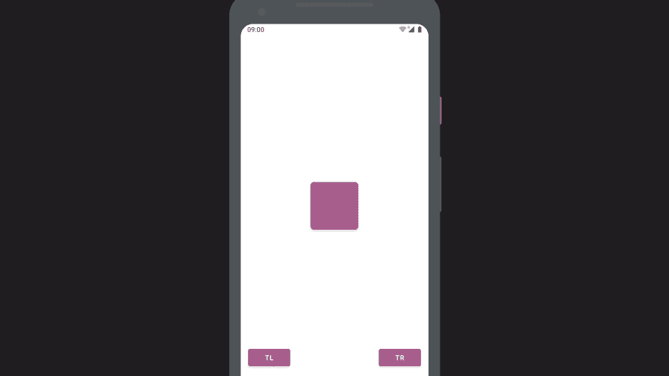
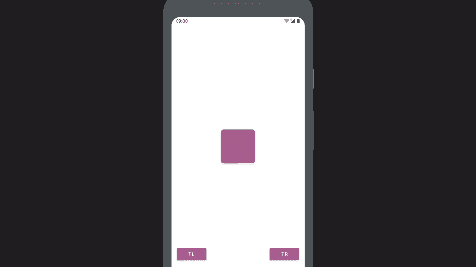
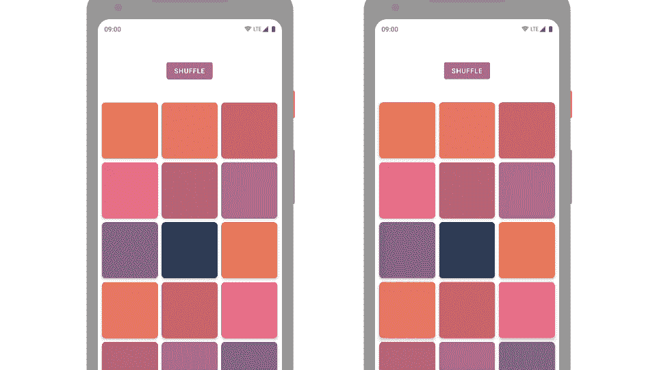
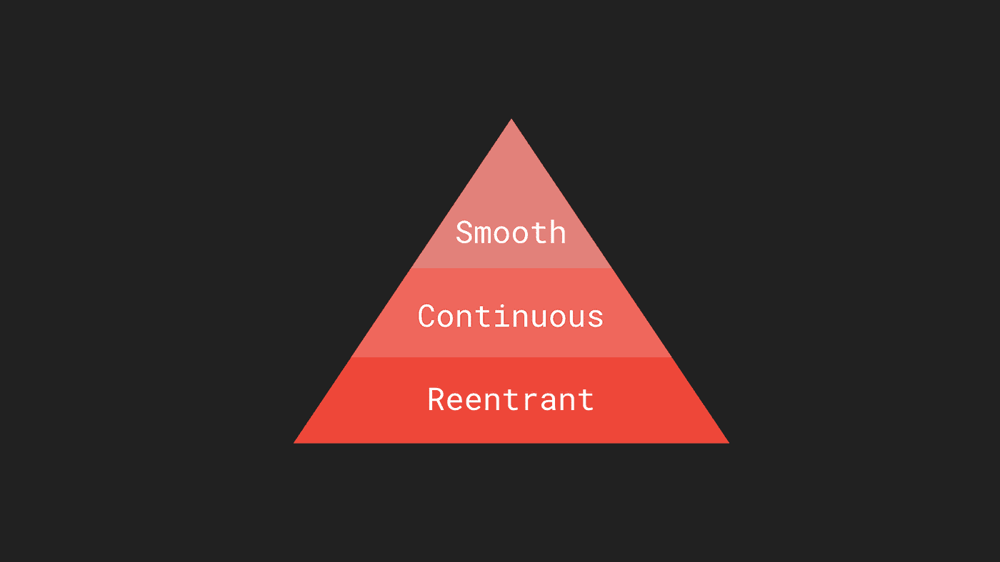

# 运动智能:构建更智能的动画

> 原文：<https://medium.com/androiddevelopers/motional-intelligence-build-smarter-animations-821af4d5f8c0?source=collection_archive---------0----------------------->

Illustration by [Virginia Poltrack](https://twitter.com/VPoltrack)

最近在 [Google I/O](http://google.com/io) 上，我展示了一些在你的 Android 应用中编写更智能的动画的技术，特别是让动画与反应式架构很好地配合:

## TL；dw？

我知道看一个 32 分钟的视频不是每个人都喜欢的，所以这里有一篇关于这个主题的文章。☕️

# #动画问题

我认为动画对你的应用程序的可用性很重要；它们解释状态变化或转换，建立空间模型或引导注意力。它们帮助用户理解和导航我们的应用。

*👈 with animations & without 👉*

这个例子显示了应用程序中的相同流程——动画在左边启用，在右边禁用。没有动画，体验感觉很突兀；在各种状态之间跳跃，却不解释发生了什么变化。

因此，虽然我认为动画很重要，但我也认为，由于我们设计现代应用程序的方式发生了变化，动画变得越来越难。我们将大多数状态管理[从视图层](https://developer.android.com/jetpack/docs/guide#drive-ui-from-model)转移到某个控制器(如`ViewModel`)，然后该控制器发布某种状态对象，例如封装了呈现视图所需的应用程序当前状态的`UiModel`。每当我们的数据模型发生变化，例如网络请求返回或用户发起的操作完成，我们就会发布一个新的 UI 模型，封装整个更新后的状态。

*A* `*ViewModel*` *publishing a stream of state objects*

今天我不想关注这种模式或它的好处。在这方面有很多好的资源:寻找单向数据流或 MVI 或像 [MvRx](https://github.com/airbnb/MvRx) 或 [Mobius](https://github.com/spotify/mobius) 这样的库。但是我确实想关注这个流的另一端:视图观察这个模型流并将它们绑定到 UI。这就像一个纯粹的函数，给定一个新的状态，我们希望将它完全绑定到我们的 UI。我们不想考虑 UI 的当前状态。也就是说，数据到 UI 的绑定应该是 state **less** 。然而，动画充满了状态**。它们都是关于随着时间的推移从一个价值转移到另一个价值。这是我在这篇文章中想要关注的基本张力。因为现在我担心许多应用程序因为这种紧张而删除动画，导致可用性的真正损失。**

> **…将数据绑定到您的 UI 希望是无状态的。然而动画是有状态的**。****

# **有什么问题？**

**为了具体地看看我们如何在这个反应式的世界中保留动画以及我们需要解决的挑战，这里有一个最小的例子:一个登录屏幕。**

****

***A login screen where the login button and progress indicator fade in/out as they become visible/invisible***

**当用户点击登录时，我们希望隐藏登录按钮并显示一个进度指示器，但我们希望淡出登录按钮并淡入进度指示器。**

**该屏幕的状态对象和(静态)绑定逻辑可能如下所示:**

**因此，如果我们想要*动画化*这种变化，最初的尝试可能是这样的，我们动画化 alpha 属性(最后在淡出的情况下设置可见性值):**

**然而，这可能会导致意想不到的结果:**

****

***The kind of issues you may encounter adding animations to a reactive app***

**在这里，一个新的 UI 模型在每次按键时都被发布，但是你可以看到进度指示器总是出乎意料地出现！或者，如果你点击提交按钮(演示的动画持续时间被夸大了)，我们可能会陷入一个糟糕的状态，按钮和进度指示器都消失了。这是因为我们的动画有副作用，比如[终端监听器](https://developer.android.com/reference/kotlin/androidx/core/animation/package-summary#(android.animation.Animator).doOnEnd(kotlin.Function1))，没有被正确处理。**

**在这个反应式的世界中编写动画时，你的动画代码需要一些品质。我将它们归类为:**

*   **凹角**
*   **连续的**
*   **光滑的**

# **凹角**

**可重入性意味着你的动画需要做好随时被中断和再次调用的准备。如果新的状态对象可以在任何时候发布，那么我们运行的任何动画都需要为一个新的状态做好准备，以便在 动画运行的同时 ***绑定。要做到这一点，我们需要能够取消或重新定位任何正在运行的动画，并清理任何副作用(如听众)。*****

# **连续的**

**连续性是指避免动画中的值发生突然变化。为了演示这个属性，考虑一个视图，当按下/释放时，它的比例和颜色会产生动画效果:**

****

***Animating scale and color on press***

**当我们运行动画到完成时，一切看起来都很好，但是如果我们快速点击，我们会看到动画在大小和颜色上跳跃。这是在我们的绑定代码中进行假设的结果，例如，假设渐变动画总是从 0 alpha 开始。**

# **平滑**

**为了理解这个属性，考虑这个例子，其中一个视图在响应一个事件时动画显示到左上角或右上角:**

****

***Stuttering animations***

**如果我们快速连续两次将它发送到右上角，那么视图会在中途停止，然后慢慢继续到达目的地。如果我们中途改变目的地，那么它又会停下来，突然改变方向。这种突然的停止或方向的改变看起来不自然——现实世界中没有这样的行为。我们应该致力于避免这些行为，以保持我们的动画流畅。**

# **Fixme**

**因此，让我们回到我们的可见性绑定函数，并解决这些问题。首先，让我们看看**连续性**。我们可以看到，我们的阿尔法动画总是从一个初始值运行到一个最终值，例如从 0 到 1 淡入。我们可以省略初始值，只提供最终值。**

**如果你忽略初始值，那么动画师将[读取当前值](https://developer.android.com/reference/android/util/Property.html)并从那里开始。这正是我们想要的，将避免任何突然的属性动画跳转。**

**现在让我们使函数**可重入**；任何时候再打电话都是安全的。首先，我们可以偷懒，避免做任何我们不需要的工作。如果视图已经达到目标值，那么我们可以提前返回。**

**接下来，我们需要存储正在运行的动画师和监听器，这样我们就可以在开始一个新的动画之前取消它们。存储它的逻辑位置是在视图本身…但是`View`已经提供了一个方便的机制来做这件事:`[ViewPropertyAnimator](https://developer.android.com/reference/android/view/ViewPropertyAnimator.html)`。这是调用`View.animate()`返回的对象，如果你开始一个新的动画，它**会自动**取消当前正在运行的动画——太棒了！`ViewPropertyAnimator`还提供了一个`[withEndAction](https://developer.android.com/reference/android/view/ViewPropertyAnimator.html#withEndAction(java.lang.Runnable))`方法，只有当动画正常运行完成时才会运行，**不会**如果取消。这也正是我们想要的行为，这意味着如果动画被新的目标值取消，任何副作用(如可见性变化)都不会发生。切换到一个`ViewPropertyAnimator`使我们的函数可重入。**

**我们说过`ViewPropertyAnimator`会取消在同一属性上运行的任何动画，并开始一个新的。这违反了我们的**平滑度**属性，并可能导致我们之前看到的断续问题，即一个动画突然停止，另一个动画开始(持续时间相同，尽管距离较短)。为了解决这个问题，我们可以看看一个动画库，我不认为许多开发人员熟悉它。**

# **斯普林特鲁德**

**Springs 是[‘动态动画’Jetpack 库](https://developer.android.com/guide/topics/graphics/spring-animation)的一部分。我想很多人在看到非常有弹性的动画时可能会跳过这个库——虽然这种效果很有用，但并不总是需要或想要的。然而，这种弹性可以被*禁用*，留给我们一个由物理模型支持的动画系统，它有许多属性**对一般动画**有用；特别是可中断性和重定位。**

**回到我们之前的例子，如果我们用 spring 动画重新实现它，我们可以看到它没有平滑问题。相反，它处理改变目的地和重复开始，考虑当前速度以产生平滑的动画:**

****

***Spring based animations maintain velocity when being re-targeted***

**写一个`[SpringAnimation](https://developer.android.com/reference/androidx/dynamicanimation/animation/SpringAnimation.html)`看起来很像常规的`Animator`；大部分好处来自于使用`[animateToFinalPosition](https://developer.android.com/reference/androidx/dynamicanimation/animation/SpringAnimation.html#animateToFinalPosition(float))`方法，而不是调用`start()`。这将启动一个动画，如果它还没有启动，但重要的是，如果有一个动画正在进行，它将**重定向**到一个新的目的地，保持动力而不是突然改变。**

**不幸的是，没有像`View.animate`这样方便的`View` API 来使用 springs(只有 Jetpack 但是我们可以构建一个作为扩展功能:**

**这将为给定的`[ViewProperty](https://developer.android.com/reference/androidx/dynamicanimation/animation/DynamicAnimation.ViewProperty)` ( [平移、旋转等](https://developer.android.com/reference/androidx/dynamicanimation/animation/DynamicAnimation#fields_1))创建或检索一个弹簧，并将其存储在视图的标签中。然后我们可以很容易地使用`animateToFinalPosition`方法来更新正在运行的动画。在我们的可见性绑定函数中使用它:**

**我们还需要切换结束动作，以使用 spring 动画结束侦听器。你可以在[这个要点](https://gist.github.com/nickbutcher/3b18682130a6b1c008a425af2c1179a5)中找到完整的代码。您可能还希望能够对动画进行一些配置；与指定持续时间和插值器的常规动画不同，弹簧可以通过设置其刚度和阻尼比来配置。我们可以增强我们的扩展函数来接受这方面的参数，这使得配置调用点变得容易，但是提供了合理的缺省值。查看[这里的](https://github.com/android/plaid/pull/751/files#diff-02877e05f7cadd07c732fe9755337c3bR31-R49)获得更完整的实现。**

**因此，我们使可见性绑定可重入、连续且平滑。虽然实现这一点看起来很复杂，但实际上您只需要这些绑定函数中的几个就可以在整个应用程序中使用。这里有一个库，它打包了这个 spring 技术以便于使用。**

# **项目动画师**

**让我们看看另一个使用这种动画的例子；将这些原则应用到一个`[RecyclerView.ItemAnimator](https://developer.android.com/reference/androidx/recyclerview/widget/RecyclerView.ItemAnimator.html)`。**

****

***👈 DefaultItemAnimator vs a Spring based ItemAnimator 👉***

**这个例子模拟了在动画运行时使用 shuffle 按钮对数据集进行的更新。请注意，当我们快速连续按下按钮两次时，基于 spring 的 animator 的平滑度产生了很大的不同。在左边，盒子停下来，然后改变方向。在右边，它平稳地改变方向。我敢打赌，大多数应用程序从网络上加载信息，并显示在一个`RecyclerView`中，可能来自多个来源。这种灵活的动画为您的应用程序增加了一层润色，使体验更加流畅。[这里有个 PR](https://github.com/android/plaid/pull/751) 给[格子样本](https://github.com/android/plaid)添加这种动画师。**

# **更智能地制作动画**

**希望我在这篇文章中列出的原则能帮助你在反应式应用中编写动画，提高它们的可用性。实际上，它们是有序列表:**

****

***@crafty’s hierarchy of animation needs***

**可重入是关于正确性的，如果你没有这个属性，那么你的动画可能会被破坏。使用`ViewPropertyAnimator`或者在你的动画代码中小心处理可能被中断和再次调用的情况。**

**连续性有助于改善用户体验，避免突然的变化或跳跃。这是关于避免动画代码中的假设，并确保动画之间的简单交接。**

**流畅是蛋糕上的糖衣🎂。它让你的动画感觉更自然，并支持动态变化，中断和重新定位。**

**我真的相信，动画不仅让我们的应用程序使用起来更愉快、更有趣，而且更容易理解。我鼓励你学习这些技术，这样你就可以在你的应用中成功地运用它们。**