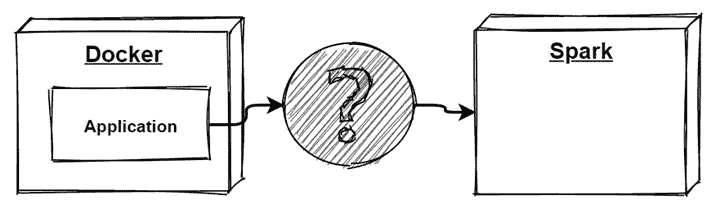
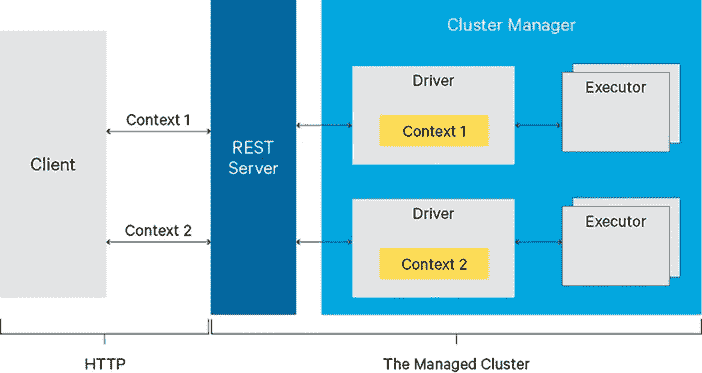
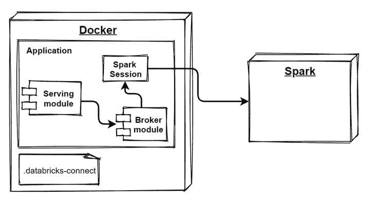

# 连接到 Spark

> 原文：<https://medium.com/version-1/motivation-2d8e6bf61c3c?source=collection_archive---------3----------------------->

# 动机

Spark 是数据工程、数据科学和机器学习任务的伟大引擎。Spark 提供了完成工作的能力，这在普通工作站上是不可能的，它通过提供一个可以执行代码和提取结果的分布式环境来管理。这很好，但是，如何从 Docker 容器中运行的应用程序中利用 Spark 功能呢？



# 选择

对于手头的任务，我们有什么选择？有几个选项可供选择:

Apache Livy 声称允许我们与 Spark 容器进行交互，运行作业或进行交互会话。

**Databricks Connect** ，声称允许我们将定制应用程序直接连接到 Databriks 集群。

这两种方法都有缺点和优点，下面列出了其中一些。

# 阿帕奇·李维

Apache Livy 是一个通过 REST 接口与 Spark 集群轻松交互的服务。这个应用程序需要一些设置，并且需要访问 Spark 安装目录。

然而，该服务提供了 REST 访问，这种访问与构建消费应用程序的语言无关。此外，Livy 还提供了一些其他功能，如安全性、容错和共享缓存数据。该服务的用例是一个无法使用云服务而必须使用现场 Spark 实例的场景。



来自 https://livy.apache.org[的](https://livy.apache.org)

# 数据块连接

Databricks connect 允许您将 IDE 或自定义应用程序连接到 Databricks 集群，并根据需要运行代码。这是一个非常简单的设置，不需要许多配置步骤或安装。

这种方法的一个明显缺点是依赖于数据块，因为这种方法不能用于 plain Spark。如果由于这样或那样的原因，您不能使用云，而必须使用现场 Spark，那么这种方法是不合适的。然而，如果可以使用云和数据库，那么这种方法似乎相对简单易用。

# 履行

在本次评估中，我们选择了 Databricks Connect 来连接 Spark，因为我们没有异地 Spark，并且我们可以使用云来存储数据和应用程序。

# 配置

这里的[介绍了安装和配置，不会重复，因此您需要运行配置步骤。然而，确保所有现有的 **pyspark** 库都从包含连接器的 Python 虚拟环境中移除是很重要的。](https://docs.databricks.com/dev-tools/databricks-connect.html)

该配置创建了**。用户主目录中的 databricks-connect** 文件。配置期间该文件的内容看起来有点像这样:

{

《主持人》:"https://adb-453245345.4.azuredatabricks.net/？o=45645645645645# "，

" token ":" ewrtdfg 56456 dhgdfgh 5 dgjjkljkldfgd "，

" org_id": "45645645645645 "，

“端口”:“15001”，

" cluster _ id ":" 34534–345345-ices 56567 "

}

所有的值都可以在数据库门户中获得；创建用户令牌的位置。成功配置后，复制**。将**文件连接到项目目录中。

# 码头工人

您还需要更新您的 Docker 文件以包含一行代码，它复制了**。将**文件连接到主目录。

收到。数据块-连接/根

根据您的设置，如果您还没有 JDK，您可能还需要在配置中包含它。

# 应用

应用程序部分是这里的最后一步。这种方法不是说明性的，它描述了 POC 是如何完成的。

该应用程序由一个 Flask 应用程序组成，它通过公开 REST 端点来充当服务模块。这并没有什么特别的原因，除了我们需要一个按钮，这样我们就可以看到这个过程在工作。



服务模块从代理包中创建一个代理实例。代理的实例是创建和封装 Spark 会话的实例。

```
self.spark = SparkSession.builder.getOrCreate()
```

代理的同一个实例公开了与 Spark 会话交互的函数。在创建 Spark 会话的过程中，将连接到在**中定义的集群。数据块-用适当的凭证连接**。现在，您可以根据需要使用这个 Spark 会话。

# 结论

有几种方法可以从本地环境连接到 Spark 集群，并通过 REST 接口访问 Spark 会话或运行代码。使用主要取决于外部因素(比如使用云的可能性)，次要取决于个人偏好。

Apache Livy 方式似乎更适合于现场环境，它为不同的消费者提供了一个公共接口，并且适合于某些产品。

上面使用和描述的数据块连接提供了对 Spark 会话的访问，并提供了对 Spark 集群的快速和直接的访问。

Apache Livy 和 Databricks Connect 构建了不同的策略来处理对 Spark 集群的访问。


亚历山大·苏沃罗夫是第一版的顾问。