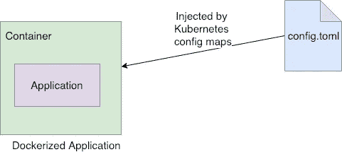

# Mount File ke Kubernetes Pod Tanpa Menghapus Existing File

> 原文：<https://medium.easyread.co/mount-file-ke-kubernetes-pod-tanpa-menghapus-existing-file-1d9fc444c91a?source=collection_archive---------5----------------------->

## Hal penting yang saya pelajari ketika mencoba mount volume ke docker container tanpa harus menghapus file yang ada di dalam container dalam folder yang sama


Photo by [Isaac Smith](https://unsplash.com/@isaacmsmith?utm_source=medium&utm_medium=referral) on [Unsplash](https://unsplash.com?utm_source=medium&utm_medium=referral)

Beberapa minggu yang lalu, saya membuat sebuah series berbahasa Indonesia dengan judul [**"Kube X-Mas"**](https://medium.com/easyread/christmas-tale-of-sofware-engineer-project-kube-xmas-9167ebca70d2) yang bercerita tentang bagaimana membuat Kubernetes Clusters di Google Cloud Platform (GCP).

Di proyek tersebut, saya akan mendeploy aplikasi Golang ke dalam sebuah *cluster* Kubernetes di GCP. Seperti yang kita ketahui, ketika membangun sebuah aplikasi, ada baiknya file konfigurasi diletakkan secara terpisah. Terserah apakah konfigurasi berupa *environment* *variable* atau dalam bentuk *file* (.json, .yaml, .toml). Konfigurasi tersebut akan membuat aplikasi menjadi lebih fleksibel dan memudahkan kita untuk dapat menggonta-ganti *environment* dari aplikasi.

Dalam kasus saya kali ini, saya akan men- *dockerize* sebuah aplikasi ke dalam *Docker Image,* lalu kemudian mendeploynya ke dalam Kubernetes. Untuk kasus ini, saya menggunakan Kubernetes Controller untuk meng- *inject* file konfigurasinya, sehingga aplikasi saya dapat berjalan di dalam Kubernetes cluster dengan konfigurasi yang telah saya sisipkan.

Sebenarnya untuk men- *inject* file ke dalam container di Kubernetes dapat kita lakukan dengan [Volumes](https://kubernetes.io/docs/concepts/storage/volumes/) dan [ConfigMap](https://kubernetes.io/docs/tasks/configure-pod-container/configure-pod-configmap/) . Yang nantinya pertama kali kita lakukan adalah mendefine *config* *maps* yang akan menjadi konfigurasi file kita, lalu memasukkannya ke dalam container aplikasi kita menggunakan Volumes.

## The Issue

Seperti yang saya sebutkan sebelumnya, saya memiliki aplikasi Golang yang akan di build dan di containerized di dalam sebuah docker-image. Aplikasi ini telah di compile, dan disimpan dalam sebuah docker image. Berikut `Dockerfile` yang saya define.

Jadi, dari *dockerfile* tersebut dapat kita lihat, kita akan membuat sebuah docker-image yang di dalamnya terdapat aplikasi Golang yang telah terkompile dan hasil kompilenya disimpan di folder: `/app/engine` . Namun aplikasi ini tentunya butuh *config-file* , *nah* *config-file* inilah yang akan di *inject* oleh Kubernetes.



inject file to docker using kubernetes

Berikut cara saya pertama kali ketika melakukan *injection* *file* *config* ke dalam container saya.

Lalu, *issue* ini pun terjadi. Apa yang saya harapkan adalah ketika menyisipkan file config ke dalam docker container saya, kedua file saya, aplikasi serta confignya terdapat di dalam folder yang sama dan bisa jalan.

Karena saya menggunakan folder `/app` , maka ilustrasinya seperti berikut:

Sebelum inject config-file:

```
app
└── engine
```

Yang saya harapkan setelah inject config-file:

```
app
├── config.toml
└── engine
```

Yang sebenarnya terjadi setelah inject config-file:

```
app
└── config.toml
```

Yang terjadi adalah direktorinya berganti. Sehingga yang ada di dalam container aplikasi saya hanya *config-file* yang saya *inject* . Kubernetes mengganti semua file yang ada, sehingga aplikasi saya tidak bisa jalan.

Kemarin saya terjebak di *issue* ini untuk lebih dari 4 jam.Awalnya saya belum sadar mengapa ini bisa terjadi. Saya bingung dan hampir stress 😅. Pods aplikasinya selalu *crash* dan *restarted* secara berulang-ulang. Sampai kemudian, saya mencoba *debug* secara perlahan, tentunya setelah cukup segar. Barulah saya sadar kesalahannya.

## Solutions

Setelah menyadari issuenya, ada 2 pilihan yang saya tempuh. Namun saat itu saya memilih pilihan 1.

*   Memisahkan `WORKDIR` di dalam *docker* container. Sebelumnya `/app` dimana di dalam `/app` terdapat aplikasi saya. Jadi solusinya, saya akan membuat `WORKDIR` terpisah, yang nantinya file configuration akan disimpan disini, lalu aplikasi saya tetap di folder `/app` . Sehingga dengan demikian aplikasi saya tetap berada di dalam container dan bisa berjalan.
*   Mencoba sampai *"mampus"* dengan memasukkan *config-file* ke dalam folder yang sama.

Kemarin, saya memilih pilihan 1, karena belum menyelesaikan masalah cara yang ke-2\. Namun beberapa hari kemudian, atas nama *“curiosity”,* saya mencoba mencari solusinya. Saya membaca ulang beberapa dokumentasi dan beberapa blog, mungkin saja ada yang mengalami *issue* yang sama.

Hasilnya, saya tidak menemukan apapun, kecuali sebuah artikel yang menjelaskan tentang Kubernetes volumes disini: [https://blog.sebastian-daschner.com/entries/multiple-kubernetes-volumes-directory](https://blog.sebastian-daschner.com/entries/multiple-kubernetes-volumes-directory) .

Akhirnya saya memutuskan untuk mencoba solusi yang dia sebutkan dengan menggunakan `subPath` pada volumes yang saya gunakan.

Sebelumnya:

```
- name: configs          
  mountPath: /app
```

Dan saya ubah menjadi:

```
- name: configs
  mountPath: /app/config.toml
  subPath: config.toml
```

Diluar dugaan, *syntax* ini berhasil 😙. Hanya single line *syntax* , yang membuat saya hampir *stress* , terjebak hingga 4 jam lebih.

Sehingga Kubernetes deployment.yaml file saya menjadi berikut.

Saya mendapat satu pelajaran berharga ketika mencoba menyelesaikan masalah ini, meski awalnya saya terjebak selama 4–6 jam. Meski hanya dengan satu baris *code* masalah terselesaikan, saya tetap bahagia bisa menyelesaikan ini 😄

References:

*   [https://blog.sebastian-daschner.com/entries/multiple-kubernetes-volumes-directory](https://blog.sebastian-daschner.com/entries/multiple-kubernetes-volumes-directory)

*Anyway, jika artikel ini berguna, mungkin kamu dapat membagikannya kepada lingkaran pertemananmu, agar yang membutuhkan tidak terjatuh pada lubang yang sama. Dan jangan lupa subscribe Easyread untuk selalu update dengan cerita seperti ini, juga cerita perjalanan saya di dunia Software Engineering :).*