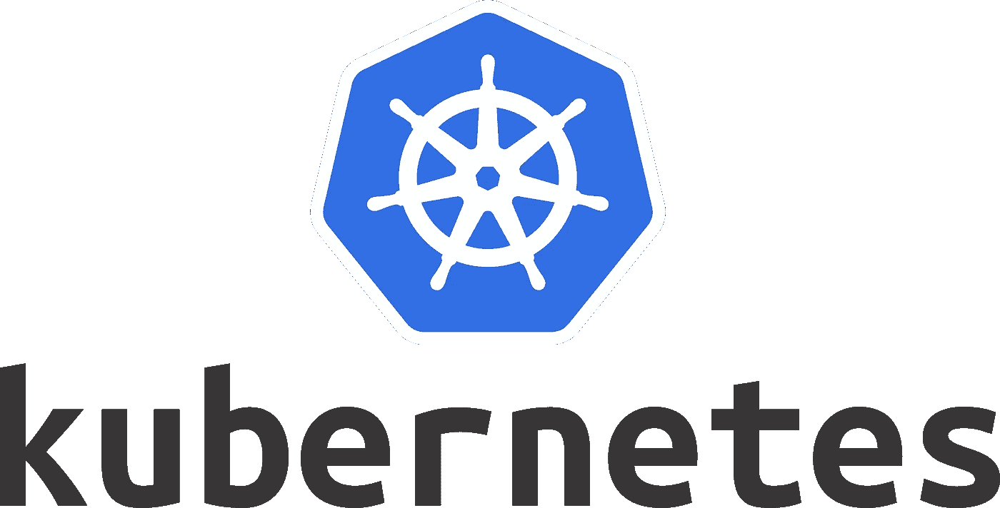

# 在库伯内特斯装上一个 GCP 桶作为 NFS

> 原文：<https://medium.com/compendium/mounting-a-gcp-bucket-as-nfs-in-kubernetes-8f6d3faf4da3?source=collection_archive---------0----------------------->



创建一个无限大小的文件共享，就像 NFS 安装在 kubernetes 集群中的一个桶上一样？不管这是不是一个好主意，这里有一个我们所面临的问题和我们如何解决它的小描述。

# 背景

为什么我首先想要这个作为 NFS 服务器？为什么不使用 gcsfuse 简单地将它安装在需要它的 pod 中呢？

对于我当前的客户来说，Kubernetes 集群是一个托管的 airflow 实例(cloud composer)，我已经设置了一个 NFS 服务器，它在这个集群中平稳运行([遵循这个伟大的指南](https://estl.tech/multi-writer-file-storage-on-gke-6d044ec96a46))。这个 NFS 共享由使用 [kubernetes 操作符](https://airflow.apache.org/kubernetes.html)的进程使用，该操作符在 composer 集群中产生 pod。

在 Kubernetes 集群内部运行 NFS 服务器的缺点是“很难”在集群外部获得卷。对于开发人员和其他过程都是如此。

开始出现的一个棘手问题是为开发人员列出一个文件这样简单的事情。人们不得不躲进一个豆荚里做一个 ls。实际上，以桶的形式查看文件会非常方便。磁盘增长怎么办？

我可以直接在吊舱中使用 gcsfuse，对吗？

不尽然——因为 pod 是使用 Airflow Kubernetes 操作符创建的，所以我对创建环境没有完全的控制权，并且我没有找到一种好的方法来针对不同的图像以通用的方式运行 gcsfuse。除了添加它，还有一堆脚本到 dockerfile 文件中。但我的蜘蛛感觉一直告诉我，将来有人会忘记一些事情，这不会有好结果。我想要一些简单的东西，如卷和安装，可以应用于所有的工作，而不改变 docker 的形象。

可以安装一个铲斗吗？这当然很好。无限磁盘存储？易于在集群外用于各种作业？或者直接使用原生 bucket API。

实际上没有文章描述如何做到这一点(也许是有充分的理由？—桶并不是真正的文件系统，不像我们习惯的那样有锁。此外，还有入口和出口..)

# 解决办法

我最初的想法是修改 NFS 服务器，只使用 gcsfuse 来挂载一个桶，而不是获取一个卷声明。

# 创建一个密码来保存服务帐户

首先，您显然要创建服务帐户并下载它，然后授予它所需的访问权限。例如，首先在本地测试服务帐户访问，并确保您可以在 bucket 上使用 gsutil。

```
kubectl create secret generic sa-THE-SERVICE-ACCOUNT --from-file=key.json=sa.json
```

# 创建复制控制器

```
*yaml/nfs-bucket-server-rc.yaml***apiVersion:** v1
**kind:** ReplicationController
**metadata:
  name:** nfs-bucket-server
**spec:
  replicas:** 1
  **selector:
    role:** nfs-bucket-server
  **template:
    metadata:
      labels:
        role:** nfs-bucket-server
    **spec:
      volumes:** - **name:** sa-THE-SERVICE-ACCOUNT
          **secret:
            secretName:** sa-THE-SERVICE-ACCOUNT
      **containers:** - **name:** nfs-bucket-server
        **image:** anderselton/nfs-bucket-server:latest
        **env:** - **name:** BUCKET
          **value:** "CHANGE-ME"
        **ports:** - **name:** nfs
            **containerPort:** 2049
          - **name:** mountd
            **containerPort:** 20048
          - **name:** rpcbind
            **containerPort:** 111
        **volumeMounts:** - **name:** sa-THE-SERVICE-ACCOUNT
            **mountPath:** "/accounts"
            **readOnly:** true
        **securityContext:
          privileged:** true
```

奔跑

```
*kubectl* apply -f yaml/nfs-bucket-server-rc.yaml
```

# 创建服务以向其他 pod 公开服务器

```
*yaml/nfs-bucket-server-service.yaml***kind:** Service
**apiVersion:** v1
**metadata:
  name:** nfs-bucket-server
**spec:
  ports:** - **name:** nfs
      **port:** 2049
    - **name:** mountd
      **port:** 20048
    - **name:** rpcbind
      **port:** 111
  **selector:
    role:** nfs-bucket-server
```

奔跑

```
*kubectl* apply -f yaml/nfs-bucket-server-service.yaml
```

# 创建 NFS 卷并申请(供其他 pod 使用)

```
*yaml/nfs-bucket-pv.yaml***apiVersion:** v1
**kind:** PersistentVolume
**metadata:
  name:** nfs-bucket
**spec:
  capacity:
    storage:** 1Mi
  **accessModes:** - ReadWriteMany
  **nfs:
    server:** nfs-bucket-server.default.svc.cluster.local
    **path:** "/" *yaml/nfs-bucket-pvc.yaml***apiVersion:** v1
**kind:** PersistentVolumeClaim
**metadata:
  name:** nfs-bucket
**spec:
  accessModes:** - ReadWriteMany
  **storageClassName:** ""
  **resources:
    requests:
      storage:** 1Mi
```

奔跑

```
*kubectl* apply -f yaml/nfs-bucket-pv.yaml
*kubectl* apply -f yaml/nfs-bucket-pvc.yaml
```

由于不存在完成这一特定任务的映像，我不得不编写一个自定义的 dockerfile 来包含 NFS 服务器、gcsfuse 和一个启动脚本，以便将它们粘在一起。当然还有一堆 yaml 配置文件。

完整的 GitHub repo，包含在您自己的集群中执行此操作所需的一切:

[https://github . com/ael-computas/GCP-kubernetes-bucket-NFS-server](https://github.com/ael-computas/gcp-kubernetes-bucket-nfs-server)

你可以(或许应该)做的是:

*   只需使用 bucket 原生 API
*   如果你需要做本地开发，可能抽象在你这边，所以开发的时候从本地 FS 读取，云/生产的时候从 bucket 读取。

事实可能证明这是一个非常糟糕的想法，我们应该使用原生 API 来代替，并进行我们需要的重写。