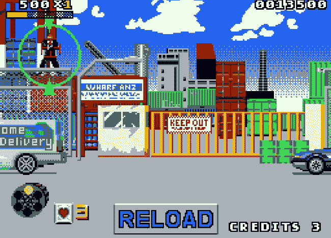
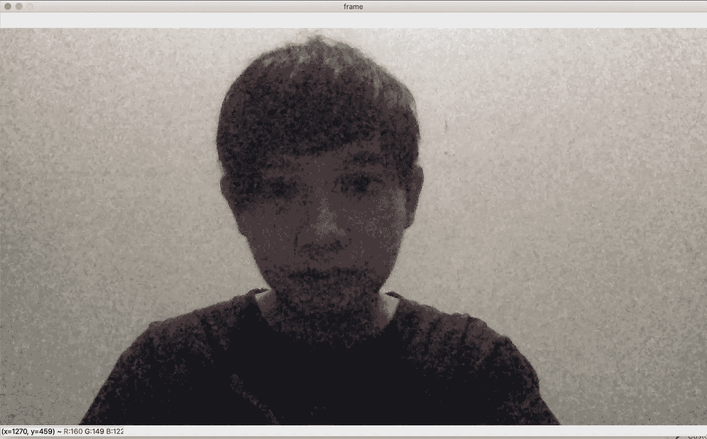

# 用 OpenCV 和 Python 实现射击游戏的鼠标控制

> 原文：<https://medium.easyread.co/mouse-control-for-shooting-game-using-opencv-and-python-452c3446d1a3?source=collection_archive---------0----------------------->

## 如何在不触摸鼠标的情况下控制鼠标的基本概念/想法。


Photo by [pixabay.com](https://pixabay.com/photos/children-win-success-video-game-593313/)

大家好！在差不多两个星期没有发布新的故事之后，我终于回来了！！我仍然想分享一些与软件工程领域技术相关的经验、想法或观点！！最近，我了解了人工智能，尤其是在计算机视觉领域。当我们谈论计算机视觉时，也许 OpenCV 会首先出现在我们的脑海中。是的，因为 OpenCV 是一个非常受欢迎的计算机视觉库，并且是 BSD 许可下的开源库！请访问官方网站[https://opencv.org/](https://opencv.org/)了解更多信息！

OpenCV 的应用领域非常广泛，例如面部识别系统、手势识别、运动跟踪等。然而，在本主题中，我们将只尝试图像处理区域来检测对象的颜色。正如这个故事的标题，我们将尝试玩一个简单的射击游戏，它只需要一个动作和鼠标左键点击，但我们将使用 OpenCV 识别的对象颜色来控制它！！对于编程语言，我们将使用 Python，因为它在人工智能、物联网等领域非常流行。

我将总结一下这个实验我们需要什么。

*   简单的射击游戏
*   2 个对象
*   计算机编程语言
*   OpenCV

# 射击游戏

我们将玩什么游戏？它叫做地铁警察。经典世嘉街机游戏 Virtua Cop 的 Demake，如果你玩过的话。游戏可以在这个链接【https://helpcomputer.itch.io/metro-cop[的](https://helpcomputer.itch.io/metro-cop)中在线获得。我们可以用浏览器轻松播放。就像我说的，这个游戏只需要移动和点击鼠标。



Picture Metro Cop Game by indieretronews.com

# 目标

在这个例子中，我使用了两个物体，橙色的用于移动，绿色的用于点击。


Picture 1 My Objects

# 计算机编程语言

运行这个实验的时候我的 Python 版本是 3.7.7。访问位于 https://www.python.org/[的 Python 官方网站](https://www.python.org/)，了解更多关于如何在您的环境中安装的信息。因为我假设您的机器上已经安装了 Python。

# OpenCV

而我写这个故事的时候 OpenCV 版本是 4.2.0。我还假设您已经安装了 OpenCV。访问我之前提到的官方链接，了解更多关于如何安装 OpenCV 的信息。

# 构建基本应用程序

确保您的系统上安装了 pip。Pip 是 Python 的一个包安装程序。通常，当我们使用从[python.org](https://www.python.org/)下载的 Python 2 >=2.7.9 或 Python 3 >=3.4 时，pip 就已经安装好了。这次我的 pip 版本是 20.0.2。

接下来，我们需要为 Python 安装 OpenCV 包。请点击此链接[https://pypi.org/project/opencv-python/](https://pypi.org/project/opencv-python/)获取指导。

为了验证我们的环境是否已经准备好，编写一个简单的应用程序来读取我们的网络摄像头，并在一个窗口中输出视频。将文件保存为`**main.py**`。使用命令`**python3 main.py**`运行应用程序



Picture 2 Basic OpenCV App

如果你得到了如上图的结果，是的，这意味着我们准备好进入下一步了！我将快速解释一下代码。

首先，我们需要使用`**import cv2**`导入开放的 cv 库。然后使用此代码`**cap = cv2.VideoCapture(0)**` **0** 访问我们的摄像头以捕捉视频，0 表示我们的 PC/笔记本电脑的默认摄像头，如果我们有几个摄像头，则该数字是指 USB 端口号。

接下来，我们需要使用`**while True**`将捕获的图像作为视频输出进行循环。之后要用`**cap.read()**`功能逐帧捕捉。默认情况下，相框不像我们在镜子里看到的自己。我个人比较喜欢翻翻。我们需要`**frame = cv2.flip(frame, 1)**`来制作这个。
`**1(>0)**` 为横向，`**0**`为纵向，`**<1**`为纵向和横向。

`**cv2.waitKey(1)**`将显示一帧 1 ms，之后显示屏将自动关闭。`**if key == 27**`表示`**ESC**`键码，当我们按下时，窗口将关闭。

然后，使用`**cv2.imshow("frame", frame)**`显示结果帧。“框架”字符串将成为窗口的标题。一切完成后，使用`**cap.release()**`和`**cv2.destroyAllWindows()**`释放捕捉

# 寻找物体的颜色

也许我们对颜色名称有相同的理解。比方说，在这个实验中，我提到了橙色和绿色。但是在你这边，对我来说可能是另一种橙绿色。解决方案是我们将使用 OpenCV 跟踪颜色，为我们的“橙色”或“绿色”找到最佳范围。我们将转换为 HSV(色调、饱和度、值)，而不是使用 RGB(红、绿、蓝)颜色模型值。让我们构建这个简单的轨迹颜色应用程序。

保存文件，假设为`**main.py**`并使用`**python3 main.py**`命令运行。我们将得到 3 个帧:命名为 ***帧*** 、 ***蒙版、*** 和 ***结果*** 和一个跟踪条的小窗口。要查找对象的颜色，请将对象放在框架内，并在跟踪条中调整“下”(左高、L-S、左低)和“上”( U-高、U-S、U-V)的值。


Picture 3 Tracking Object Color

是的，我们得到了橙色范围！正如你所看到的，遮罩和结果框将只显示橙色！还是，迷茫？让我解释一下，也是为了代码。

首先，我们通过添加以下代码来创建跟踪条。

```
def nothing(x):
    passcap = cv2.VideoCapture(0)cv2.namedWindow('Trackbars')
cv2.createTrackbar('L - H', 'Trackbars', 0, 179, nothing)
cv2.createTrackbar('L - S', 'Trackbars', 0, 255, nothing)
cv2.createTrackbar('L - V', 'Trackbars', 0, 255, nothing)
cv2.createTrackbar('U - H', 'Trackbars', 179, 179, nothing)
cv2.createTrackbar('U - S', 'Trackbars', 255, 255, nothing)
cv2.createTrackbar('U - V', 'Trackbars', 255, 255, nothing)
```

开始时，`**cv2.nameWindows('windowName')**`会根据输入值创建一个新的命名窗口。
接下来，`**cv2.createTrackbar('trackbarName', ‘windowName’, minValue, maxValue, callBackOnChange)**`将根据配置创建跟踪条:跟踪条名称、引用窗口名称、最小值、最大值，以及调用更改。因为色相最大值是 179，我们只为 h .设置，其余为 255。因为我们不想做任何事情，所以我们创建了一个函数，对回调做任何事情。

接下来，我们将使用这个代码`**hsv = cv2.cvtColor(frame, cv2.COLOR_BGR2HSV)**`把颜色转换成 HSV。HSV 框架看起来怎么样？你可以看到下面的图片，似乎令人毛骨悚然:)


Picture 4 HSV Look Like

然后，我们将根据跟踪条和窗口名称从跟踪条中获取值。

```
l_h = cv2.getTrackbarPos('L - H', 'Trackbars')
l_s = cv2.getTrackbarPos('L - S', 'Trackbars')
l_v = cv2.getTrackbarPos('L - V', 'Trackbars')
u_h = cv2.getTrackbarPos('U - H', 'Trackbars')
u_s = cv2.getTrackbarPos('U - S', 'Trackbars')
u_v = cv2.getTrackbarPos('U - V', 'Trackbars')
```

接下来，我们将从 HSV 帧中找出我们已经调整过的从下到上的对象颜色。这一帧的输出，正如你在 ***图 3*** 上看到的，是第二帧。我们将得到白色的物体颜色，黑色的背景。为了方便使用数组，我们使用了`**numpy**`。并且`inRange`代码将在较低和较高 HSV 值之间查看对象。

```
import numpy as np...lower = np.array([l_h, l_s, l_v])
upper = np.array([u_h, u_s, u_v])
mask = cv2.inRange(hsv, lower, upper)
```

接下来，`**bitwise_and**`代码将在**画面 3** 上创建第三帧输出。基于遮罩框架，我们将获得相同的对象，但具有原始颜色。

```
**result = cv2.bitwise_and(frame, frame, mask=mask)**
```

最后，用这段代码显示所有的帧。

```
cv2.imshow('frame', frame)
cv2.imshow('mask', mask)
cv2.imshow('result', result)
```

按照上面的步骤找出绿色。最后，这是我的颜色范围:

```
lower_orange = np.array([0, 109, 195])
upper_orange = np.array([17, 255, 255])lower_green = np.array([37, 130, 95])
upper_green = np.array([48, 190, 173])
```


Picture 5 Tracking Another Object Color

# 构建应用程序

好了，我们已经得到了物体的颜色范围，是时候构建应用程序了！

一开始，有一个调整窗口大小的函数(`**image_resize**`)。我用这个是因为我想保留两个游戏，我们的框架可以一起放在屏幕上。调整窗口大小但仍然保持纵横比的参考来自这里:[https://stack overflow . com/questions/44650888/resize-an-image-without-distortion-opencv](https://stackoverflow.com/questions/44650888/resize-an-image-without-distortion-opencv)

接下来，也许我们会跳入`**cv2.findCountours**`代码。像`cv2.itwise_and`一样，我们将基于遮罩框创建轮廓。轮廓可以简单地解释为连接所有连续点(沿边界)的曲线，具有相同的颜色或强度。**RETR _ 外部**表示仅检索最外轮廓。并且 **CHAIN_APPROX_SIMPLE** 将压缩水平、垂直和对角线段，只留下它们的端点。

轮廓包含多个坐标，这就是为什么我们需要使用`**for c in contours**`代码循环轮廓。我们还需要检查轮廓大小区域，确保使用`**cv2.contourArea(contour)**`检测到的区域大小合理。为了绘制轮廓，我们使用了`**cv2.drawContours(img, contours, countourIdx, color, thickness)**`功能。绘制轮廓的结果会像下图一样。


Picture 6 Draw Countour Based on Mask Color

很好，现在，我们将整合轮廓和鼠标控制功能。经过研究，我发现了几个控制鼠标的模块。首先，PyAutoGUI([https://pypi.org/project/PyAutoGUI/](https://pypi.org/project/PyAutoGUI/))。但是，在我看来，很慢。跟不上我们的手势。然后，我寻找另一种解决方案，找到了 py mouse([https://pypi.org/project/PyMouse/](https://pypi.org/project/PyMouse/))。这样更好！我想我对目前的状况没有意见。

那么，我们如何移动和点击鼠标呢？PyMouse 已经有这个功能了。我们需要使用`**from pymouse import PyMouse**`导入模块，并像这样初始化变量`**m = PyMouse()**`

然后，我们可以使用`**m.move(x, y)**`和`**m.click(x, y, 1)**`来控制鼠标。`**(x, y)**`表示指针的坐标。我们在哪里可以得到坐标？实际上是轮廓。如果我们看橙色轮廓，我们会看到`**x, y, _, _ = cv2.boundingRect(c)**`，它将从我们的轮廓返回位置。而且 PyMouse 还有一个返回当前位置的函数，所以如果我们要点击什么东西，就需要坐标，对吧？然后，我们应该得到当前位置，以避免在使用`**x, y = m.position()**`进行点击时错过位置。

*耶*，我想这就是对这个简单实验的解释了。*哦对了，*我正在添加一个规则，用于延迟点击。因为根据我的经验，如果我们在检测到绿色时没有实现这一点，它会在点击功能上快速循环，我们的手势无法处理这一速度。这就是为什么我要设置一些规则来检查最后一次点击，以避免多次点击。

好吧，玩这个怎么样？下面这张图你可以跟着我的手。当我们想开枪的时候，我们会张开大拇指。


Picture 7 Object Position

# 测试

酷，我们已经建立了应用程序。是时候做测试了！我们需要使用`python3 main.py`运行应用程序，并使用浏览器打开游戏的 URL。确保浏览器选项卡处于活动模式。试着移动橙色的东西作为我们的指针。很好，是工作！接下来，试着打开我们的拇指检测绿色作为点击功能。耶！点击了！现在我们可以不用触摸鼠标/触摸板就可以玩游戏了！！


Picture 8 Testing the App

# 改进

我知道这是一个基本的应用程序，或者只是一个不用直接触摸就能控制鼠标的想法。也许有很多功能不能正常工作。我找到的例子是:

*   指针无法到达屏幕底部。当你这边的游戏屏幕变大时，这将成为一个问题。
*   当我们周围的背景颜色相同时，颜色可能会发生冲突。也许我们可以添加额外的规则，比如形状+颜色，而不是只使用颜色。

这就是为什么如果你对此有一些改进的想法或建议，可以直接做个 PR！谢谢大家！这里是这个实验的 GitHub 库。

[](https://github.com/moemoe89/py-opencv-kumis) [## moemoe89/py-opencv-kumis

### 在 GitHub 上创建一个帐户，为 moemoe89/py-opencv-kumis 开发做贡献。

github.com](https://github.com/moemoe89/py-opencv-kumis) 

# 参考

*   [https://pysource.com/](https://pysource.com/)
*   https://www.pyimagesearch.com/