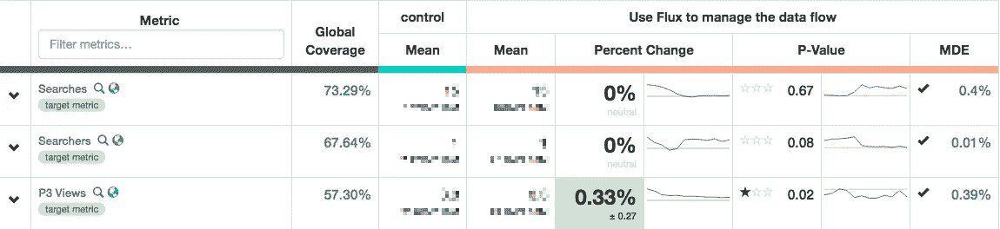
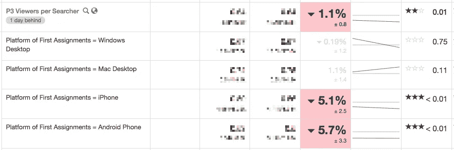
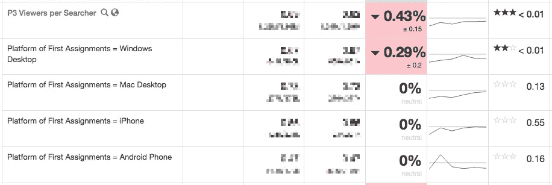

# 移动 Airbnb 搜索以做出反应

> 原文：<https://medium.com/airbnb-engineering/moving-airbnb-search-to-react-b85b815e166c?source=collection_archive---------3----------------------->

## 使用实验自信地解决大规模重构

2015 年初，Airbnb 工程团队决定采用 React 作为其规范的前端视图框架。从那以后，我们围绕 React 建立了一个[重要的](https://github.com/airbnb/enzyme) [数量](https://github.com/airbnb/react-dates) [的工具](https://github.com/airbnb/react-with-styles)，以使它成为一个尽可能令人愉快的开发环境，并且我们已经向开源社区贡献了许多这样的工具。

不幸的是，因为[我们的搜索页面](https://www.airbnb.com/s/San-Francisco--CA)是使用一个很大程度上无人维护的框架( [Twitter 的 Flight](https://github.com/flightjs/flight) )编写的，该框架在我们网站的其他任何地方都没有使用过，所以它无法从这些工具投资和围绕使用 React 的机构知识积累中受益。搜索页面代码也缺乏一套全面的测试。因此，与其他类似大小的代码库相比，在搜索页面代码库中工作通常要困难得多。

2016 年初，我们决定开始将搜索页面重构为 React。搜索页面的简单 UX 掩盖了其复杂的实现；通常，有许多外部团队在页面上运行实验，更不用说各种特定于地区和市场的定制了。这种复杂性，加上单薄的测试覆盖，意味着任何实质性的重构都可能导致一些行为上的倒退。由于搜索页面位于访客漏斗的顶端，我们需要*绝对确定*回归将被最小化，以减少对我们核心业务的任何负面影响。在这篇博文中，我们将讨论如何通过实验自信地启动重构后的搜索页面。

# 输入 ERF

[实验报告框架](http://nerds.airbnb.com/experiment-reporting-framework/) (ERF)是由我们的数据工具团队开发的内部工具，它简化了实验设置、数据分析和结果可视化的任务。它让我们能够执行分割测试，并根据各种指标(包括与我们的核心业务相关的指标)分析每种处理方式的影响。我们还能够按照地区、国家、浏览器和平台等维度对这些指标进行细分；这在缩小回归范围方面被证明是无价的，我们将在后面讨论。Airbnb 推出的几乎所有产品和功能都使用 ERF。

ERF dashboard for an experiment

这里的想法是使用 ERF 在原始代码和重构的 React 代码之间进行分割测试。如果重构的代码包含回归，我们的假设是它将对关键指标产生有意义的影响，我们将在实验仪表板上看到这一点。在确定每个实验的范围时，我们试图在运行更少的实验(因为数据收集阶段通常需要一些时间)和保持每个实验的变化集尽可能小(使我们更容易隔离回归)之间取得平衡。

# 安装

与 React 中一样，Flight 将行为封装到组件中，并建立了组件层次结构，Flight 引入的组件层次结构与我们在 React 中想象的很大程度上重叠。这使得重构的过程更加容易；因此，我们的方法是在 React 中重新实现一个飞行组件，并使用 ERF 在两者之间进行分割测试。

在 Flight 组件被 React 组件完全取代之前，Flight 还负责管理所有的数据流，所以我们也不得不在 Flight 和 React 之间建立一个互操作层；这采取了在每个重构组件周围的[高阶组件(HOC)包装器](/@dan_abramov/mixins-are-dead-long-live-higher-order-components-94a0d2f9e750#.x8x9hlbdo)的形式，该包装器翻译飞行事件以对道具和状态变化做出反应，反之亦然。完成搭建和填补后，我们可以继续重构组件本身，并用实验测试它们。

# 捕捉回归

重构的目标组件是列表卡，我们可以在搜索页面上自由使用它。

An example listing card

列表卡是搜索页面上最复杂的组件之一；在许多代码路径后面隐藏着许多行为，所以重构无法移植一些行为并不奇怪。果然，当我们运行实验来比较原始的清单卡片和重构后的副本时，我们看到清单页面的视图比搜索页面有所下降。按平台细分揭示了一个有趣的模式——这种下降仅限于 iPhone 和 Android 平台:

ERF dashboard showing a regression in listing page (P3) views for mobile platforms

我们的列表卡是[响应组件](https://responsivewebdesign.com/podcast/airbnb/)——小(读取:移动)断点上的列表卡与大(读取:桌面)断点上的列表卡的行为略有不同。旧列表卡在小断点上的行为会在单击或点击时打开列表页面的新标签。

在 ERF 提出问题后，我们深入研究代码，发现重构后的 React 清单卡没有为小断点实现这种新的 tab 行为；它在同一个选项卡中打开列表页面。使用该修复程序重新运行实验，结果显示指标有了显著提高:

ERF dashboard showing that the regression was fixed

移动平台特有的回归已经消失；这些数字现在是中性的。作为额外的补救措施，我们编写了回归测试，以确保我们不会在将来破坏标签打开行为。

我们在剩下的重构中使用了这种验证方法，并且能够发现其他几个回归，这些回归总的来说会对我们的核心业务产生实质性的负面影响。

# 警告

使用实验来验证重构有几个注意事项。回归的影响有可能没有被发现，因为相关的度量标准还没有被开发出来。在我们的案例中，我们有理由相信我们的度量套件的覆盖范围对于我们的目的来说是足够的；几年来，该套件已经见证了众多产品团队的贡献，测试了从页面加载性能到创建的支持票等各种各样的东西。

另一个警告是，这种验证策略通常在高吞吐量的页面上更有效——收集足够的数据以达到显著性所需的时间更少。由于搜索页面位于我们访客漏斗的顶端(因此获得了大量的流量)，它对我们来说工作得很好。

在启动实验和收集足够的数据以做出明智的决定之间也有一个滞后时间——我们需要仔细地安排工作，这样我们就不会在等待数据到来的时候无所事事。

# 结论

使用实验来验证重构的代码被证明是一种发现问题的非常有价值的方法，它允许我们修复它们，并且自信地逐步启动重构，而不会影响核心业务。这是一种验证策略，我们可以在将来重构关键的高吞吐量面向用户的流时采用。