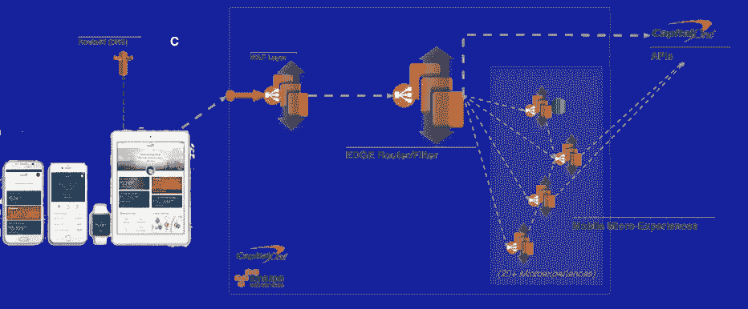

# 将 Capital One 最大的面向客户的应用之一迁移到 AWS

> 原文：<https://medium.com/capital-one-tech/moving-one-of-capital-ones-largest-customer-facing-apps-to-aws-668d797af6fc?source=collection_archive---------1----------------------->

雄心勃勃的大规模云迁移是什么样子的？去年秋天，Andy Rosenbaum 和我领导的团队完成了对 Capital One 移动服务平台系统的重大重新设计和迁移。拥有数千万用户的活跃移动用户群，迁移我们最大和最常用的面向客户的应用程序之一当然不是一件小事。

Capital One Mobile 项目不仅仅是一项“提升和运输”或叉车工作。该项目代表了我们编排系统的全面重新架构，包括围绕它们的许多支持工具，使我们能够充分利用云及其产品。

随着这一迁移的结束，我们的团队认为这是一个很好的机会，可以花一点时间来分享我们在这一过程中学到的一些经验。

# 伟大的工程师已经有了云就绪的心态

虽然像 AWS 这样的高级云产品是令人惊讶的使能器(我们将谈到所有这些)，但是在云中看到的大多数现代开发实践也可以应用于许多其他基础设施模型。构建云就绪软件为全面向云迁移创造了健康的基础。同时，它还引入了一些非常智能的安全措施/特性，可以让管理您的系统变得更加容易。

以我们的移动后端为例，在云为我们做好准备之前，我们的应用程序有几个方面已经为云做好了准备。以下是帮助我们做好准备并为向云过渡铺平道路的主要促成因素:

*   **微体验应用程序设计**
    我们应用程序中的各种体验已经被构建到可单独部署的独立功能应用程序中。今天存在的所有相同的构造([我们的边缘层【网飞 OSS Zuul】和微体验](/capital-one-developers/mobile-orchestration-innovation-on-the-edge-9835e4cbd69e#.decw0crxv))在云出现之前就已经存在了。
*   **部署自动化和渠道切换**
    在云出现之前，我们的应用已经利用了成熟的软件自动化技术，例如全自动应用部署和蓝/绿渠道切换。虽然自从迁移到云之后，这种工作方式背后的“如何”发生了变化，但是我们的功能、CI/CD 堆栈以及我们对 Ansible 作为配置工具的使用仍然保持不变。
*   **上游和下游容错**
    我们编排层的一个主要特性是它能够在上游或下游出现问题时进行干预。上游容错的例子包括特征切换和节流机制。在下游问题方面，我们的流程编排团队利用了网飞 OSS 项目 [Hystrix](https://github.com/Netflix/hystrix) 。这确保了所有后端服务都有一个故障切换或折旧体验选项，可以在自动或人工启动故障切换时触发。
*   **全球主动/主动弹性**
    *(给我们所有人的末日准备者)*

## 重要的事情先来

正如我在上面概述的那样，我们的应用程序从一开始就是云就绪的。这意味着为云重新设计它也相当简单。从基础设施的角度来看，我们希望打破我们的微观体验设计，以考虑到:

*   每个组件都要单独部署。
*   新版本将与旧版本一起部署。
*   独特的单个 Zuul 集群处理分散的入站应用程序的过滤。
*   其中的每一个都将部署到它们自己独立的基础设施中。(每个服务一组自动缩放的实例)

例如，以上是 Capital One 在 AWS 重新设计后的移动环境(简化版)。在此之前，边缘路由器和支持微体验等组件已经存在，但是它们都包含在同一个基础设施中。AWS 迁移后，其中每一项现在都驻留在各自独立扩展/管理/调整的基础架构中。

## 深入挖掘

让上述设计成为现实对我们的团队来说是一大乐趣。虽然我们遇到了相当多的障碍，但是大部分可见的工作在努力的早期就很容易地完成了。在实施该阶段时，我们:

*   用 Route53 替换了我们公司的 GTM 解决方案。
*   利用 ASG 创建了蓝/绿部署方法。
*   构建了一个部署单一服务而不是整个堆栈的模式。
*   创建了 2-3 个自定义 ami，这些 ami 包含在我们所有的服务器级依赖项中。
*   将我们的数据存储转移到 RDS。

*(可能还做了其他一些非常重要/令人印象深刻的事情，在这篇文章因遗漏而发表后，团队会对我发火。)*

## 兔子洞再往下一点…

像大多数项目一样，我们迁移的最后 10%的工作包含一些被低估的挑战。

首先是性能测试。这并不是说我们没有广泛的性能数据、测试脚本、模拟等—我们肯定有—但是我们在过去从未对我们的基础架构规模调整/调整进行过这种级别的控制。结果，一些非常棒的工程师被分配了几周的任务，进行调优和测试活动，设置新的 Hystrix 阈值，调优 tomcat/http/apache，调优 ASG 扩展/缩减事件(避免循环、考虑冷却等)，并发现/修复我们的应用程序中预先存在的小性能缺陷(由于我们过度配置硬件，我们永远不会在内部发现这些缺陷)。

事实上，中途我们发现我们的公司模拟软件无法处理我们作为这项工作的一部分运行的大量性能测试*(我们在这个过程中完全粉碎了一些漂亮的工业企业软件)*。因此，我们决定将整个程序转移到一个基于 OSS-的蒙太奇解决方案上，这个解决方案带有一个自定义条款，使我们能够按需扩展/收缩我们的模拟需求。

除了性能工作之外，转向自动扩展领域并将服务器视为“牲口”也带来了一些独特的挑战。当我们第一次开始时，我们知道 Ansible(如果你不熟悉这个工具，它是无代理/基于推送的)需要一点补充。我们选择了[安斯比尔塔](https://www.ansible.com/tower)来填补空缺。通过 Tower，我们能够解决任何新服务器在配置或自动扩展事件中需要的任何配置后需求(如部署正确的应用程序、注册任何监控代理等)。除了 Tower 之外，在我们的工作接近尾声时，我们还发现了对更多应用级服务发现的额外需求(我们的第一个例子是让包装在 Hystrix 中的新服务向 Turbine 注册，这是网飞 OSS 堆栈的另一部分)。它引领了整合[网飞的尤里卡](https://github.com/Netflix/eureka)服务发现引擎的道路，并解决了我们云迁移的最后一块。

## 上线

有一个小注意事项——在我们开始引入用户流量之前，并不是所有这些都 100%完成了。对我们来说，当我们的优化工作和最后的润色还在进行的时候，让真实用户接受新的设计是非常必要的。这样，我们可以剔除任何传统测试中没有发现的新问题。为了在一个阶段进行迁移，我们采取了以下步骤:

1.  用 Route53 替换我们的企业 GTM 解决方案。
    *(注意，这在任何其他迁移活动之前就已经做好了，这让我们的项目团队能够即时控制所有未来活动的用户流量。)*
2.  专注于单可用性区域部署，从大规模内部试点开始，以确定生产缺陷。
3.  将 1%的生产流量快速转移到上述单一 AWS 区域部署。(老实说，这可能是我们项目最大的里程碑。除了感觉像是一个坚实的胜利之外，它还帮助我们发现了生产基础架构中几个负载驱动的细微差别。)
4.  慢慢转换我们的应用程序流量，直到我们在数据中心跨越 50%,在单个 AWS 区域跨越 50%,将每个主要流量的工程目标提高到 50%。
5.  设计第二个区域部署，并重复步骤 3 和 4。

## 后续步骤

总而言之，将我们的移动服务平台迁移到 AWS 是一次非常棒的体验。回想一下我之前关于优秀工程师和云思维的观点——对于从事这项工作的人来说，转向 AWS 是一种消除阻碍他们开发理想应用的约束的方式。这一举措既不是法令也不是产品目标，而是用我们最好的技能和工具来构建最好的应用程序的一种方式。

展望未来，Capital One Mobile(以及我们团队拥有的其他面向消费者的产品)的基础设施将能够跟上我们产品的需求。在未来的几个月里，我们期待着进一步探索云继续带来的优势。以及重新定义我们团队对“早发货、常发货”的定义

## 本博客中重点介绍的外部/ OSS 项目的链接:

*   **安迪·罗森鲍姆《资本一号移动边缘概述:**[https://medium . com/Capital-One-developers/Mobile-orchestration-innovation-on-the-Edge-9835 E4 CBD 69 e # . 1 akzjvb 51](/capital-one-developers/mobile-orchestration-innovation-on-the-edge-9835e4cbd69e#.1akzjvb51)
*   **Zuul:**https://github.com/Netflix/zuul
*   **子宫:**[https://github.com/Netflix/hystrix](https://github.com/Netflix/hystrix)
*   **找到了:**[https://github.com/Netflix/eureka](https://github.com/Netflix/eureka)
*   **可译:**https://www.ansible.com/T21
*   **https://www.ansible.com/blog/autoscaling-infrastructures 用安身之塔管理 ASG 的教程:**
*   **江湖郎中:**【http://www.mbtest.org/】T2

***声明:以上观点仅代表作者个人观点。除非本帖中另有说明，否则 Capital One 不属于所提及的任何公司，也不被其认可。使用或展示的所有商标和其他知识产权都是其各自所有者的所有权。本文为 2017 首都一。***

***欲了解更多关于 Capital One 的 API、开源、社区活动和开发人员文化，请访问我们的一站式开发人员门户网站 DevExchange。***[***developer.capitalone.com/***](https://developer.capitalone.com/)