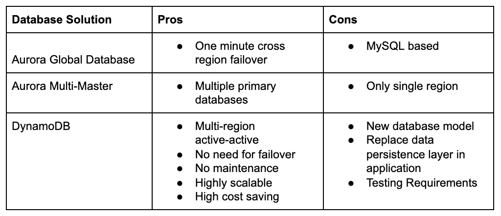

# 转向 DynamoDB 以提高应用弹性

> 原文：<https://medium.com/capital-one-tech/moving-to-dynamodb-to-increase-application-resiliency-106d753d38b1?source=collection_archive---------2----------------------->

## 从 PostgreSQL 迁移到 DynamoDB 如何让我的开发团队自动化地区故障转移

弹性是每个应用程序的目标——没有人希望他们的应用程序失败——但实际实现这个目标是一个挑战。在云中构建提供了增强弹性的能力，但这不会自动发生。必须在堆栈和应用程序的所有级别中规划和构建弹性，其中最具挑战性的一层是数据库。传统的 SQL 数据库运行在一个主实例上，所有的更新都发生在这个主实例上。单个数据库实例的故障会导致大多数应用程序无法运行。

今年早些时候，我的团队开始寻找提高应用弹性的方法。我们的堆栈在 East 和 West AWS 区域都以主动-主动配置运行，并且我们已经将我们的服务配置为自动故障转移。大部分堆栈的故障转移时间几乎是即时的，但是 PostgreSQL 关系数据库需要几分钟时间让主实例切换区域。

# 评估 AWS 数据库平台— DynamoDB、Aurora 全球数据库和 Aurora Multi-Master

我们的配置是多区域 SQL 数据库故障转移的典型配置；主数据库位于一个区域，而读取副本位于另一个区域。如果发生区域性故障切换，读取副本将提升为主副本，数据库流量将被重新路由到新的主副本。将读取复制副本提升为主副本需要 10 到 15 分钟。从历史上看，这对于区域性故障转移来说是可以接受的，但是对现代应用程序的期望是没有停机时间。

我们的团队开始寻找当前配置的替代方案。我们希望继续使用 AWS 中的托管数据库解决方案，以避免自行安装和维护数据库——这样我们就可以将大部分时间用于开发应用程序的新功能，而不是应用最新的数据库更新。这意味着我们没有考虑可能满足我们需求的非托管数据库，如 [MongoDB](https://www.mongodb.com/) 、 [Apache Cassandra](https://cassandra.apache.org/) ，甚至 AWS RDS 不支持的功能，如 [MySQL Clusters](https://www.mysql.com/products/cluster/faq.html) 。

我们开始在 RDS 中搜索，确定了几种可能性。我们确定了用例的优点和缺点，如下所示:

**数据库解决利弊**[**DynamoDB**](https://aws.amazon.com/dynamodb/)**[**极光全局数据库**](https://aws.amazon.com/rds/aurora/global-database/)**&**[**极光多主**](https://docs.aws.amazon.com/AmazonRDS/latest/AuroraUserGuide/aurora-multi-master.html)**

****

## **极光全球数据库**

**我们看到的第一个选项是 2018 年 11 月推出的[极光全球数据库](https://aws.amazon.com/rds/aurora/global-database/)。此 Aurora 包含减少跨区域复制延迟的功能，并支持从区域性中断中快速恢复。[据 AWS it](https://aws.amazon.com/rds/aurora/global-database/) ，*“…为您的应用程序提供 1 秒的有效恢复点目标(RPO)和不到 1 分钟的恢复时间目标(RTO)，为全球业务连续性计划奠定坚实的基础。”***

**Aurora 全球数据库解决了我们的主要问题，*数据库故障转移时间。* Aurora 全局数据库可以在一分钟或更短时间内在区域之间进行故障转移。这比我们之前处理的故障转移时间快了一个数量级。虽然我们希望采用主动-主动解决方案，但这是团队早期的最爱，我们甚至进行了概念验证来测试故障转移，结果非常好。**

**然而，Aurora Global 数据库的缺点是有时只与 MySQL 兼容，这需要对我们的应用程序进行一些调整，但不需要进行重大的重写。**

*****注—自我们最初调查以来，极光全球数据库已经*** [***增加了 PostgreSQL 支持***](https://aws.amazon.com/about-aws/whats-new/2020/03/amazon-aurora-with-postgresql-compatibility-supports-amazon-aurora-global-database/) ***。*****

## **极光多主**

**当我们看到[亚马逊在 2019 年 8 月发布了一个多主数据库](https://aws.amazon.com/about-aws/whats-new/2019/08/amazon-aurora-multimaster-now-generally-available/)供通用的消息时，我们的团队非常兴奋，就在我们开始研究增加我们的数据库弹性的时候。几年来，Amazon 一直承诺提供主动-主动 Aurora 数据库解决方案，由于时机的原因，我们能够将 Aurora Multi-Master 纳入我们对数据库替代方案的研究中。**

**[Aurora 多主集群](https://docs.aws.amazon.com/AmazonRDS/latest/AuroraUserGuide/aurora-multi-master.html)为并行运行的多个数据库提供了我们一直在寻找的主动-主动支持，可以更新数据库。这种能力提高了数据库的弹性，防止单个数据库故障导致应用程序无法运行。但是，目前它仅支持单个区域内的主动-主动模式，多区域故障转移是我们的应用程序的一项要求。**

## **DynamoDB**

**我们考虑的最后一个选项是 DynamoDB。虽然不在 RDS 中，但它是一个托管数据库解决方案。DynamoDB 具有我们一直在寻找的关键特性——主动-主动跨区域支持。然而，我们担心迁移到 NoSQL 数据库，以及更新应用程序的数据持久层所需的工作量。**

**DynamoDB 的许多特性使它成为一个引人注目的选择。亚马逊最初开发 DynamoDB 供其零售业务内部使用，当时该公司正以惊人的速度增长，其传统的关系数据库无法随着需求的增长而扩展。**

**根据 [AWS 主页上的 DynamoDB](https://aws.amazon.com/dynamodb/) ，*“dynamo db 每天可以处理超过 10 万亿个请求，每秒可以支持超过 2000 万个请求的峰值。”* DynamoDB 甚至可以扩展到要求最苛刻的应用。出于本文的目的，它有太多的特性需要深入研究，但这里有一些亮点:**

*   **完全托管的 NoSQL 数据库**
*   **无限可扩展(对于无限的合理定义)**
*   **高可用性和耐用性**
*   **多区域主动-主动支持**
*   **实时数据处理**
*   **集成缓存**
*   **时间点备份**
*   **成本缩放**

*****注—***[***AWS dynamo db 特性***](https://aws.amazon.com/dynamodb/features/) ***页面很好地介绍了平台上可用的许多特性。*****

# **选择数据库**

**我们的团队就哪个数据库是最佳解决方案进行了多次讨论，强烈支持 Aurora Global Database 和 DynamoDB。虽然 Aurora Multi-Master 在某些应用程序中是一个不错的选择，但由于缺乏多区域支持，它不适合我们的应用程序。Aurora Global Database 将极大地减少区域故障转移时间，并且在应用程序端进行迁移所需的工作量较低，但 DynamoDB 是最佳解决方案，因为它是唯一支持多区域主动-主动支持的数据库。**

# **DynamoDB 表设计和多区域主动-主动用例**

**由于多区域主动-主动支持是推动我们做出决定的关键能力，因此有必要更深入地讨论一下它是如何工作的。支持此功能的特性称为[全局表](https://aws.amazon.com/dynamodb/global-tables/)。在 AWS 控制台中，您可以启用全局表并选择一个区域进行复制，这将在所选区域中创建表的副本。这些表使用 DynamoDB 的流特性进行同步，自动将更改从一个区域复制到另一个区域。数据最终是一致的，复制信息所需的时间被称为*复制延迟。*根据 [AWS 全球表格文档](https://aws.amazon.com/dynamodb/global-tables/#Benefits)，复制延迟大约为一秒钟。我们发现这个估计在常规操作期间是准确的，但是在重负载下延迟增加了。我们的重点是双区域配置，但是全局表跨多个区域工作，保持所有区域同步。**

**NoSQL 数据建模与许多开发人员熟悉的关系数据库设计非常不同。例如，在 NoSQL 设计中，一个应用程序通常只有一个表。将数据规范化到多个表中的做法已经过时了。NoSQL 设计的目标是将表结构基于访问模式，而不是继承域结构。这并不意味着你可以放弃你的领域模型；您仍然需要理解数据的元素以及它们之间的关系。但是，一个实体的所有数据通常都包含在一个条目中。这打破了关系设计的许多原则，复制数据并在记录中存储多个相关实体。因为您在单个表中存储不同的实体类型，所以实体类型的固定前缀、公共前缀和辅助索引可能包含基于实体类型的不同类型的数据。例如，如果我们在数据库中存储三角形、正方形和多边形，主索引可以使用形状类型和 id 的前缀，如 tri#id、squ#id 或 poly#id，而辅助索引可以是三角形的类型、正方形的面积和多边形的边数。从访问的角度对数据建模可能需要一段时间才能习惯，但是访问性能比 SQL 查询更有效。**

**尽管 DynamoDB 有很多好处，但它并不是所有情况下的最佳解决方案。NoSQL 数据库适合处理大量事务，但通常不适合用于报表数据库。数据是围绕事务处理构建的，导致报告性能不佳，特别是即席查询。如果您需要高性能的处理和报告，您可能需要将数据移动到传统的关系数据库或数据仓库解决方案中。数据迁移的常见方法是使用流功能将数据实时移动到另一个数据库中，或者在不需要实时报告的情况下按计划进行数据传输。**

# **将 DynamoDB 应用于我们的应用程序**

**应用程序的数据层替换并不像预测的那样广泛。然而，我们在转型过程中遇到了挑战。我们遇到的第一个问题是 DynamoDB 不支持 nulls 或空白值。有两种方法可以处理这个问题，您可以从数据中排除属性，或者使用结构来指示空值。我们采用了空结构方法。我们还有一个日期问题，因为 DynamoDB 中没有日期或时间数据类型。日期被转换为 ISO UTC 格式(即 2020–09–18t 23:35:46Z)并存储为字符串。这种格式是人类可读的，并且是可排序和可搜索的，这方便了我们的服务所使用的日期范围查询。**

**即使解决了这些限制，当测试显示我们的原始设计不如预期的有效时，我们也不得不调整我们的表结构几次。在我们的一个表中，我们需要找到在一个时间范围内匹配两个数据字段的所有条目。我们创建了一个复合主键，将两个数据字段结合在一起，并将时间戳作为排序键。由于对平台不熟悉，我们也犯了一些错误，例如，我们对我们的一个服务使用了过滤器，这导致了表扫描，而不是使用查询，这样效率更高。在对我们的查询和表结构进行了几次迭代测试和修改之后，我们最小化了数据库读取，这既提高了性能又降低了成本。DynamoDB 的一个很好的特性是，您可以在查询中设置 ReturnConsumedCapacity 属性，以获取所消耗的读取容量单位的数量。当您在优化查询时，这非常有用。**

**为了降低对我们的应用程序架构进行如此重大更改的风险，我们创建了一个使用两个数据库的实现来测试 DynamoDB，而无需完全切换。在双数据库模式下，应用程序读写 DynamoDB 和 PostgreSQL，但只将 PostgreSQL 数据返回给用户。这种配置降低了风险，因为在生产环境中测试新数据库实现时，原始数据库仍然存在。在生产环境中运行了几周后，没有出现任何错误，我们关闭了 PostgreSQL，将应用程序完全切换到 DynamoDB。**

# **结论**

**AWS 中有许多可用的数据库选项。如果您想自己实现数据库，有几乎无限的选择；但是托管解决方案是一个受欢迎的选择，尤其是在需要低维护解决方案的开发团队中。使用托管数据库减少了您必须选择的数据库数量，但 AWS 仍在不断创新其产品，增加它们提供的托管解决方案的弹性和功能。**

**我们的团队将我们的选择过程缩小到三个 AWS 数据库解决方案:DynamoDB、Aurora Global Database 和 Aurora Multi-Master。Aurora Multi-Master 为需要 SQL 支持且不需要跨区域写入功能的应用程序提供了高度弹性的数据库。Aurora Global Database 非常适合需要支持跨区域读取、低延迟更新和区域间快速故障转移能力的应用程序。DynamoDB 提供了高性能的跨区域主动-主动功能，但是您失去了基于 SQL 的数据库所具有的一些数据访问灵活性。**

**迁移到 DynamoDB 的结果是我们的应用程序故障转移时间减少了 99%。消除了数据层上区域性故障转移的流程和脚本。数据库没有故障转移，因为应用程序在它所在的区域写入数据库，数据由 AWS 复制，保持区域同步。我们保持了相同或更好的查询性能，尽管一些改进是由于原始数据库设计中缺乏优化。尽管在这个过程中出现了一些小问题，但迁移是值得的，因为它提高了速度，降低了故障转移的复杂性。**

***披露声明:2021 资本一。观点是作者个人的观点。除非本帖中另有说明，否则 Capital One 不隶属于所提及的任何公司，也不被这些公司认可。使用或展示的所有商标和其他知识产权是其各自所有者的财产。***