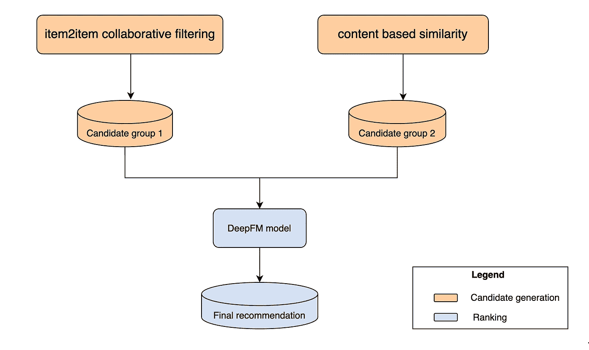

# Mozrt 是一个深度学习推荐系统，为沃尔玛商店员工提供个性化的学习体验

> 原文：<https://medium.com/walmartglobaltech/mozrt-a-deep-learning-recommendation-system-empowering-walmart-store-associates-with-a-5d42c08d88da?source=collection_archive---------0----------------------->

Image by [Fox Valley Symphony Orchestra](https://www.foxvalleysymphony.com/about-us/musicians-and-conductor/)

# **业务背景**

沃尔玛在美国的 4，700 多家商店雇用了近 160 万名员工。每个员工负责完成各种任务，这些任务经常根据他们的日常日程和任务进行更新和修改。为了专业和准确地完成这些任务，为每个任务设置了协议。向员工提供最新的、易于获取的相关信息对员工和沃尔玛的成功至关重要。我们开发了 Mozrt，这是一个用于沃尔玛学院应用程序的深度学习推荐系统，是沃尔玛商店和供应链员工的培训内容门户。沃尔玛学院应用程序可在所有公司管理的移动和桌面设备上使用。每次员工登录时，Mozrt 都会提供一系列推荐转盘，帮助沃尔玛员工在销售区为顾客服务时，在正确的时间找到正确的内容。

Figure 1\. Mozrt on Walmart Academy App

# **提议的模型架构**

整个系统架构是一个两阶段推荐系统，如下图所示。有两个主要部分:1)内容候选生成 2)内容排序算法。候选生成快速筛选出最终推荐入选几率较低的候选内容，并为下一步生成一个简短的内容列表。排名算法使用候选生成中生成的入围内容作为输入来重新排名，并生成最终的推荐内容轮播。

当处理非常大的内容候选池时，两阶段推荐系统提供了有效的解决方案。例如，对于 10，000 个内容，每个内容需要 10 毫秒来生成预测分数，排名算法将需要 100 秒来对所有内容进行排名。这对于实时应用程序来说是不可接受的。利用两阶段推荐系统，内容候选生成过滤掉大约 9，980 个内容。排名算法可以在 200 毫秒内处理剩余的 20 个内容。

我们使用协作过滤和基于内容的相似性模型作为候选人生成系统，根据历史观点来估计员工的内容需求。然后，内容候选流入深度学习排名模型。排名模型将考虑员工信息，如工作信息、工作区域、登录时间/日期和 skip-gram 算法中的内容嵌入，以高精度预测员工每次与沃尔玛学院应用程序互动时的需求。

Figure 2\. Mozrt model architecture

# **模型训练第一步:候选生成**

## **协同过滤候选生成**

Item2item 协同过滤是推荐系统领域最流行的算法之一。例如，在 Mozrt 学习内容推荐系统中，我们将每个学习内容视为一个“项目”,并使用不同同事生成的点击历史来识别每个项目在向量空间中的位置。之后，我们找到前 K 个最近的邻居并存储它们。该算法选择第一组候选内容作为深度学习排序算法的输入。

## **基于内容(NLP)的相似候选生成**

协同过滤可能无法找到对沃尔玛员工有价值的所有内容。例如，新创建的内容或具有很少观看历史的内容的用户点击矩阵将非常稀疏。因此，在向量空间中找到这些内容的准确位置将是一项挑战。因此，提出了基于内容的相似性模型来生成第二内容候选组作为深度学习排序算法的输入。

## **TextRank-IDF 关键词提取**

对于每个学习内容网页，我们通过混合文本摘要技术(TextRank-IDF 算法)获得一系列关键词并存储它们。

我们将学习网页文本中的每个单词视为图中的一个节点，上下文窗口中的任何两个单词对都被视为具有无向边。我们将上下文窗口表示为[W1，W2，…Wn]，并将上下文窗口大小指定为四个单词。例如:[W1，W2，W3，W4]。

Figure 3\. TextRank algorithm

我们使用 PageRank 算法迭代地计算每个“单词节点”的重要性分数。然后，我们通过逆文档频率(IDF)值来调整重要性分数。这个过程会对大多数学习内容中经常出现的单词进行加权(例如，Walmart、associate 等。).具有最高调整后重要性分数的单词被用作关键词。

## **内容相似度计算**

我们将一个学习内容页面中的关键字与第二个页面中的所有关键字进行比较，以计算基于内容的相似性得分。然后将所有关键字对的相似性得分汇总为一个得分。最终的相似性得分是从 word2vec 模型生成的嵌入中计算出来的。这个模型是从超过 7000 篇文章组成的整个沃尔玛学习内容语料库中训练出来的。

Figure 4\. Content-based similarity by keyword pairs. Note: URL_keywords refers the content in given URL.

我们找到 K 个最相似的学习内容页面并存储它们，其中 K 是相似学习内容页面的数量。

# 模型训练第二步:排序算法

Mozrt 使用深度因式分解机器算法作为排名算法[1]。训练数据从与内容(点击、观看、时间)的关联参与中收集，超参数通过离线贝叶斯优化来确定。

## **输入:跳过 gram 内容嵌入**

任何实体都可以用一系列数字来表示，包括学习内容网页。在机器学习术语中，这个过程被称为嵌入。最近，许多科技公司开发了从用户-物品交互数据中获取物品嵌入的算法，如 Airbnb 的租赁列表作为嵌入，Pinterest 的 Pin 作为嵌入在其 Pin2vec 算法中[2][3]。这些算法中的大多数都是使用神经语言模型(Word2vec)[4][5]开发的。

经典的 Word2vec 模型有两个基本组成部分:单词和句子。如果两个单词位于同一个句子中，并且它们的距离不长于某个长度(上下文窗口)，我们就认为它们是“邻居”Word2vec 模型为每个单词随机分配数字作为初始嵌入。在训练过程中，每个单词的嵌入被用作神经网络模型的输入，而其相邻单词的嵌入被用作输出(跳格)。在神经网络中多次迭代更新单词嵌入将实现每个单词的最终嵌入。

我们采用了与 Word2vec 类似的策略，为 Mozrt 的排名算法创建与学习内容相关的输入。我们利用员工的观看行为提出了单词和句子的概念。每个内容网页被分配一个唯一的内容 ID。内容 ID 被视为“单词”,相关点击序列被视为“句子”。点击序列有不同的长度，就像 Word2vec 模型中的句子一样。内容 ID 句子被定义为同一用户的点击，其中网页之间的时间间隔不超过 30 分钟。

Figure 5\. Word embedding and content embedding

随后，我们建立了一个 skip-gram 模型，为每个学习内容创建一个 n 维嵌入，表示它在向量空间中的位置。我们将嵌入内容存储为 Mozrt 排序算法的内容相关输入。

Figure 6\. DeepFM model input

## **宽而深的建筑**

准备好输入数据后，我们进入建模步骤。对于这一步，最大的障碍是**平衡概括和记忆的能力。**让我们稍微打开包装。

传统的深度学习算法具有良好的泛化能力。然而，这些算法有时无法“记住”历史数据中的模式。例如，我们希望推荐系统“记住”在感恩节之前向买家展示火鸡，但不要过度概括历史数据中的知识，并在另一个节日(如劳动节)之前推荐火鸡。

2016 年，Google 研究人员提出了 Wide & Deep 架构[1]；他们将一个宽组件与一个深组件结合起来，以提高深度神经网络的记忆能力。该架构由少数公司和研究机构(华为、脸书等)进行了优化。在接下来的几年里。

## 算法:**深度因式分解机**

既然我们已经选择了一个宽而深的架构来建立我们的排名模型，并使用宽组件来增加模型的记忆能力，下一个挑战是估计宽组件中交互特征的参数。

Mozrt 使用深度因式分解机[6]作为排序算法，这是 wide & deep 架构中性能最好的算法之一。DeepFM 的结构如图 7 所示。

Figure 7\. [Deep Factorization Machine](https://arxiv.org/pdf/1703.04247.pdf) [6]

宽分量是一个**一般线性回归**。它负责**记忆**历史信息。该组件的主要挑战是如何减少大量潜在交互特征的参数(权重)数量，假设每个集成特征都有一个参数。例如，如果我们有 2，000 个特性，并且每个特性都可能与其他特性交互，那么潜在的交互特性将接近 200 万个。因此，我们使用因式分解机来估计相互作用特征的参数。我们假设交互特征的每个**权重**可以分解为**两个潜在因子向量**，并且在估计交互特征的参数时只拟合潜在因子向量。如果潜在因素向量维数是 4，我们只需要拟合 8000 个参数。在“因子分解机”的帮助下，DeepFM 可以在大规模推荐系统中自动定义交互特征，大幅减少 wide component 中的参数数量。

**深度**组件是一个**前馈神经网络**。它负责**概括**，探索历史数据中从未出现过的特征组合。称为密集嵌入的深层组件中的关键层将独热编码特征转换成具有更少数值的密集(更少维度)矩阵(类似于单词嵌入，并将超过 10，000 个独热编码转换成大约 100 个维度。)

# **模特再培训渠道**

我们使用气流来实现深度学习推荐系统的再训练管道。在本节中，我们将回顾重新训练频率、数据漂移和模型质量检查器的基本原理。

## **不同型号部件的重新训练频率**

Figure 8\. Structure of Airflow re-train pipeline

DeepFM 模型具有很强的泛化能力。即使输入内容嵌入从未出现在训练数据中，DeepFM 算法也能够准确预测。重新训练一个深度学习模型要消耗大量的计算资源；因此，我们每月重新训练。

如果新创建的内容没有嵌入，它将不会收到来自 DeepFM 算法的预测，并且我们需要比 DeepFM 模型更频繁地重新训练内容嵌入模型。因此，内容嵌入模型计划每周重新训练。

候选生成模型是推荐系统的基础，尤其是在 Mozrt 中。如果 DeepFM 不产生预测，协同过滤和基于内容的相似性模型将作为“备份”并产生最终输出。因此，我们为这两个模型设置了每日再训练时间表。

Table 1\. Model retrain frequency

## **数据漂移检测**

我们在深度学习推荐系统中构建了一系列数据漂移检测器，监控异常离群值和意外的输入数据分布。如果有任何重大的数据漂移，重新训练过程将被暂停，一个自动的电子邮件警告将被发送到开发团队。

## **模型性能检查器**

我们设置了决策节点，以检查在重新训练过程中，所有模型组件是否运行正常，性能是否满足标准。例如，如果新的 DeepFM 模型的 AUC 小于 0.7，该模型将不会在 Azure 上注册，并且会自动向开发团队发送电子邮件提醒。

# **重述**

在 Mozrt 中，有两种候选生成算法。协同过滤通过关联的观看历史粗略地选择学习内容候选，而基于内容的相似性通过内容关键词相似性选择另一组候选。

每个内容都有一个唯一的内容 id。我们使用内容 id 作为“单词”,相关点击序列作为“句子”,并运行跳图神经语言模型来获取嵌入，作为深度学习排序算法的内容相关输入。

DeepFM 算法输出学习内容候选的最终排名。宽分量是具有因式分解机器参数估计的一般线性回归，负责记忆历史信息。深度组件是一个前馈神经网络，具有很强的泛化能力。这两个组件协同工作，以高精度预测员工与应用程序交互时所需的学习内容。

在模型再训练管道上设置了数据漂移检测器和模型性能检查器，以保证每个更新的模型版本都能正常工作。

**成功的简要示例**

Mozrt 学习推荐系统可以记住历史视图，并“预测”员工需要的内容。例如，唐娜是一名团队成员。当她在周三上午 9 点登录沃尔玛学院应用时，她会看到一篇文章，来自深度学习推荐系统的“完整的价格变化”，因为价格变化过程通常在工作日的早上实施。如果她在下午 3 点左右登录，她将获得“存放多余现金”的建议，因为这个过程通常在下午需要。

Figure 9\. Recommendations change at different time

## **与其他推荐转盘的关系**

我们在沃尔玛学院应用程序中编排了多个旋转木马，为员工提供全面的学习体验。基于您的查看历史记录的**轮播使用深度学习推荐系统提供高度个性化的学习内容推荐，而【T2 趋势】Now 和 **Popular with your team** 轮播显示整个公司和员工团队中最受欢迎的学习内容网页。基于客户反馈的**转盘**扫描客户语音数据，推荐学习内容以改善客户体验。**

****实施 DeepFM 的思路****

**推荐系统不是一个单一的模型，而是一个复杂的系统，有多个模型、数据管道和编排器。每个组件在提供准确的建议方面都扮演着重要的角色。因此，按顺序开发每个组件*并不是*最佳策略。这不仅延迟了产品发布，降低了吞吐量，而且导致了对隐藏技术债务的忽略([这里有一个超出范围的更详细的讨论](https://matthewmcateer.me/blog/machine-learning-technical-debt/))以及从一开始就过度强调模型的假设和复杂性。为了在开发过程中减少这些组件之间的依赖性，我们决定通过黑客马拉松活动开始构建整个系统架构，邀请数据工程、架构、网络安全、机器学习工程和软件开发方面的专家参加为期一周的作战室式讨论。我们首先在 Mozrt 的第一版中加入了一些启发式模型(基于频率的模型和基于分类的模型)。一旦开发并测试了 DeepFM 模型，我们很快在一个季度后的第二个版本中将 DeepFM 整合到现有系统中。该策略显著缩短了 Mozrt 的开发生命周期，提高了吞吐量。**

***鸣谢:我们是数据科学人员，是沃尔玛全球技术中数据、战略和见解的一部分。我们构建 AI/ML 解决方案，为全球 220 万名员工提供数字、数据驱动的解决方案。感谢我们 Learning scrum 团队的 10 多名成员，以及我们在数据工程、关联产品、企业内容管理和学习技术领域的合作伙伴，是他们让这一切成为现实。***

# ****参考****

**[1] Cheng，H. T .，Koc L .，Harmsen，J. *等* (2016)。推荐系统的深度学习。*第一届推荐系统深度学习研讨会论文集。[https://arxiv.org/pdf/1606.07792.pdf](https://arxiv.org/pdf/1606.07792.pdf)T21***

**[2]格博维奇，m .，，程，H. (2018)。使用 airbnb 搜索排名嵌入的实时个性化。第 24 届 ACM SIGKDD 知识发现国际会议论文集&数据挖掘。[https://www . KDD . org/KDD 2018/accepted-papers/view/real-time-personalization-using-embeddings-for-search-ranking-at-Airbnb](https://www.kdd.org/kdd2018/accepted-papers/view/real-time-personalization-using-embeddings-for-search-ranking-at-airbnb)**

**[3][https://medium . com/the-graph/applying-deep-learning-to-related-pins-a6 fee 3c 92 f 5e](/the-graph/applying-deep-learning-to-related-pins-a6fee3c92f5e)**

**[4]t . miko lov，陈，k .，Corrado，g .，& Dean，J. (2013)。向量空间中单词表示的有效估计。[https://arxiv.org/pdf/1301.3781.pdf](https://arxiv.org/pdf/1301.3781.pdf)**

**[https://code.google.com/archive/p/word2vec/](https://code.google.com/archive/p/word2vec/)**

**[6]郭，黄，唐，叶，杨，李，何，谢(2017).一个基于因子分解机器的神经网络用于 CTR 预测。第 26 届国际人工智能联合会议论文集。(IJCAI-17)[https://www.ijcai.org/proceedings/2017/0239.pdf](https://www.ijcai.org/proceedings/2017/0239.pdf)**

**[7]Naumov，m .，Mudigere，d .，Shi，H. J. M. *等* (2019)。个性化和推荐系统的深度学习推荐模型。[https://arxiv.org/pdf/1906.00091.pdf](https://arxiv.org/pdf/1906.00091.pdf)**