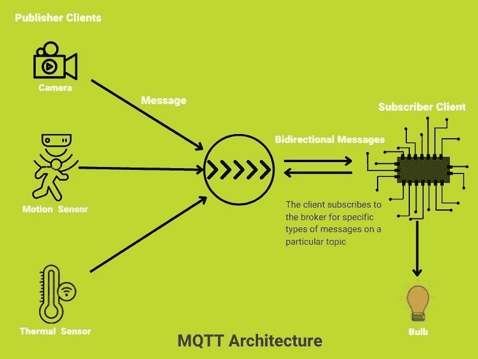

# MQTT 协议:架构和更多内容

> 原文：<https://medium.com/globant/mqtt-protocol-architecture-lots-more-c24bc5489e1?source=collection_archive---------0----------------------->

OASIS standard messaging protocol for the Internet of Things (IoT)

MQTT 也是类似 [HTTP](/@rachid1982fsb/what-is-http-5b01392678d5) 的协议。当我了解 MQTT 时，我也感到非常新鲜和惊讶。我们将在本博客的最后介绍 MQTT 的这些令人惊叹的地方。

*   MQTT 是什么？
*   MQTT 协议的优势
*   MQTT 组件和架构
*   MQTT v/s HTTP
*   MQTT 应用和实时使用。

# **什么是 MQTT？**

MQTT(消息队列遥测传输)是一种协议，主要用于[物联网](/iotforall/what-is-iot-f825c7304368#:~:text=%E2%80%9CThe%20Internet%20of%20Things%20(IoT,%2Dto%2Dcomputer%20interaction.%E2%80%9D)领域中的**机器对机器**数据传输。简而言之，我可以说它是一个**轻量级发布/订阅**协议，支持嵌入式设备间通信的 [**分布式设计**](/enjoy-algorithm/distributed-system-a64c5acb015) 架构。

Pub/Sub

> p**publish:**当设备向服务器或代理发送数据时，那么这个操作就叫做 publish。
> 
> **订阅**:当客户端接收到来自代理的数据时，那么我们称这个操作为订阅。

# **利用 MQTT 协议**

*   **占用更少的带宽和内存**:这是一个可以安装的轻量级协议，甚至可以在 CPU 和 RAM 都很低的设备上运行。与其他协议如 [HTTP](/@rachid1982fsb/what-is-http-5b01392678d5) 和 AMQP **相比，它可以实现平滑的数据传输。**
*   双向:对我来说，MQTT 的惊人体验是它允许双向消息，从客户机到服务器或从服务器到客户机。
*   **可靠:** MQTT 遵循非常高的可靠性标准，因为在物联网领域有很多消息传递的情况。这是它的 **QOI** (指数质量)值为 0，1，2 的主要原因。在本博客的后续部分，我们将讨论这个话题。
*   **适用于远程应用**:该协议的主要目标是在只需要少量代码和网络容量受限的地方实现远程连接。

# **MQTT 组件和架构**

MQTT Architecture

**MQTT 组件:**

1.  消息
2.  客户
3.  服务器或代理
4.  主题

## **1)信息**:

消息就是数据，它将使用 MQTT 在网络上传输。

这 4 个参数出现在消息中:

**a)有效载荷数据**:每个消息包中包含一个结构化的有效载荷。通常 **JSON** 和 **XML** 可以作为其他设备可以读取的有效载荷发送。

**b)索引质量(qos)** :管理可以通过 qos 参数增加消息成功传输的可靠性。

*   **qos (0)** : **无法保证送达**，因为接收方不确认收到的消息。发送者也不发送该消息。就像**火了又忘**。
*   **qos (1)** :接收方确认收到的消息。如果发送方没有得到确认，它将重新发送消息。接收者可以得到两个重复的消息。
*   **qos (2)** :当发送方发送 qos 2 的消息时，接收方将向接收方发送与 qos 1 相同的确认，但 qos 2 的重复消息不会被接收方接受或接收。

> 如果客户端的会话是持久的，则所有使用 QoS 1 和 2 发送的消息都将为离线客户端排队，直到客户端再次可用。

c) **属性集合**

d) **题目名称**

## 2)客户:

在 MQTT 中，任何从代理获取或发送数据的设备都被称为**客户机**。它可以有两个角色:**发布/订阅**。

为了从代理获取消息，客户端需要向代理订阅一个特定主题**并向代理发布来自客户端的消息，应该指定主题。**

## 3)服务器/代理:

代理从设备接收消息，并向客户端发送消息。向代理发送消息的设备/客户端被称为**发布者** **客户端**，从代理接收消息的设备被称为**订阅者客户端**。

我了解到 broker 是通信的中心点，每个消息都应该通过它传递，它可以连接到需要发送消息的多个客户端设备。

代理将消息存储在**消息队列**中，并以 **FIFO** (先入先出)模式发送消息，它还管理客户端的认证和授权。

## **4)话题**:

我认为主题是一个非常重要的组成部分，因为它是一个特定类型的**有效载荷/消息**可以被客户端订阅并从服务器发布的标识。似乎与 **HTTP** 协议中的 **URI** 相同。

主题用正斜杠分隔的字符串表示。每个正斜杠表示一个**主题级别**。

Topic Structure

# MQTT v/s HTTP

MQTT v/s HTTP

# **MQTT 应用程序和实时使用。**

使用消息队列遥测传输(MQTT)的应用程序有:

1.  **智慧城市**:智慧城市包括(智能交通、智能医疗、智能学校、智能电表和智能家居)需要建立一个快速、更快和标准的通信协议，如 MQTT。
2.  **远程区域传感器**:安装在**远程**区域的基于传感器的设备/应用，定期向其服务器发送在低带宽互联网和低成本基础设施设置下运行所需的消息。MQTT 协议适合这些类型的应用程序。
3.  **可穿戴设备**:在智能手表、智能鞋等低能耗可穿戴设备中进行数据传输。
4.  **社交媒体应用**:脸书使用 MQTT 协议传输其 Instagram 和 Messenger 应用。它占用设备的低带宽和电池。
5.  **智能农业:**我们可以从不同的支持 MQTT 的物联网设备中获取天气、阳光、土壤 pH 值、水分和湿度的实时信息，这些信息可以提高农业效率。
6.  **制造:**物联网设备有各种传感器，可以监控温度、振动、电压、电流等。因此，这些支持 MQTT 的传感器可以帮助预测任何故障或停机的早期预警信号。
7.  **智能家庭自动化:**支持 MQTT 的家庭设备可以增强家庭的能效、安全性和成本节约。支持物联网的智能设备可以向代理发送数据，代理上的数据可以被任何移动应用程序读取。

# 参考

 [## MQTT——物联网消息标准

### MQTT 客户机非常小，需要最少的资源，因此可以在小型微控制器上使用。MQTT 消息头…

mqtt.org](https://mqtt.org/)  [## MQTT 要点

### 获取 72 页的 MQTT 教育和学习的 MQTT 基础电子书，适用于初学者和专家。立即获取电子书…

www.hivemq.com](https://www.hivemq.com/mqtt-essentials/)