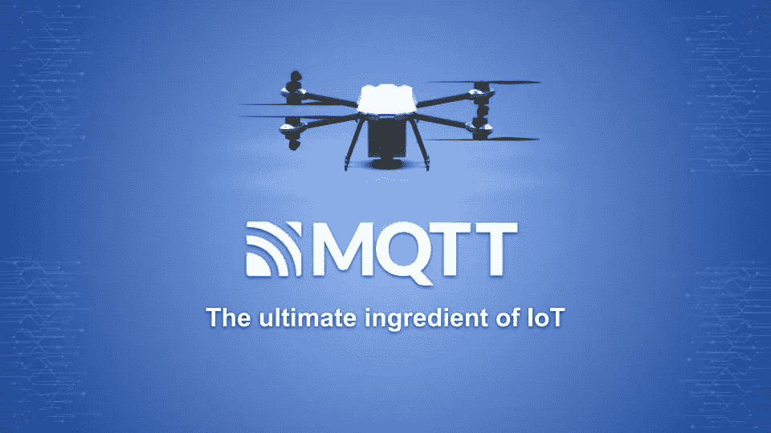
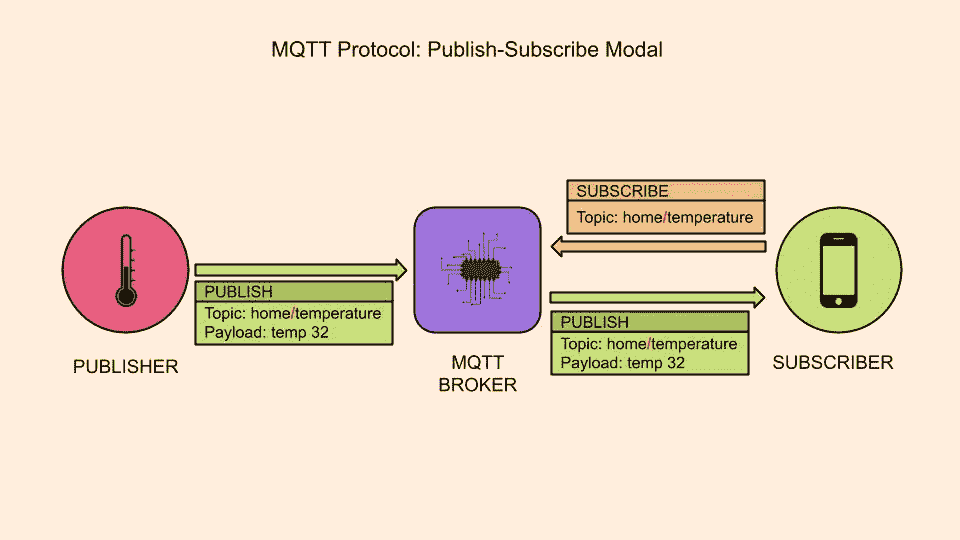
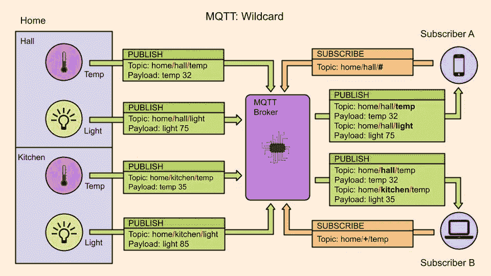
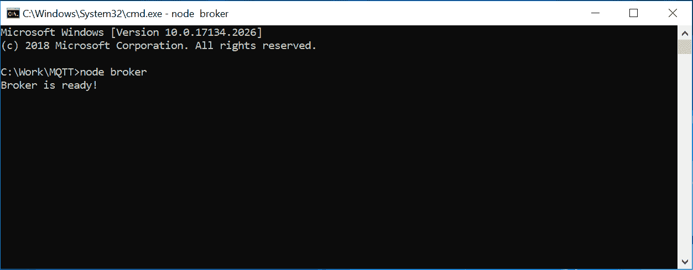
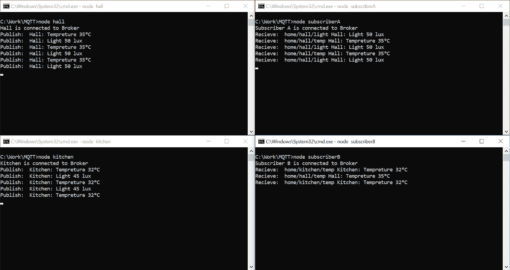
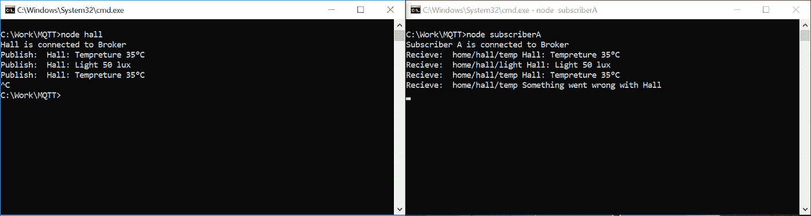

# MQTT——物联网的终极元素

> 原文：<https://medium.com/globant/mqtt-the-ultimate-ingredient-of-iot-e507ed77c35?source=collection_archive---------1----------------------->

## 让物联网味道更好的协议酱

如今，物联网已经成为我们生活中不可或缺的一部分，它正在彻底改变我们周围的一切，如购物、制造、旅行、健康监测、家庭自动化等。物联网的概念是将任何设备连接到互联网和其他连接的设备，如智能手表、微波炉、健身追踪器、电视、火灾探测器、灯泡等。物联网设备具有非常有限的带宽和较小的代码占用空间，因此它们需要轻量级和灵活的网络协议来进行通信，MQTT 是这方面的完美解决方案。

**消息队列遥测传输** (MQTT)是一种轻量级且灵活的网络协议，主要用于在设备之间传输消息。它构建在 TCP/IP 栈之上，但是，任何提供有序、无损和双向连接的网络协议都可以支持 MQTT。它被设计为使用小代码量和有限的带宽，这就是为什么它成为物联网的最终成分。

# **MQTT 组件**

MQTT 协议基于发布-订阅(发布者和订阅者)模型。这种模式**将发布者和订阅者彼此分离，他们从不直接联系。它们之间的连接和通信由称为**代理**的第三个组件处理。**

基于角色，MQTT 有 3 种类型的组件，

MQTT Protocol: Publish-Subscribe Modal

*   **发布者:**发布者或发送者是向 MQTT 代理组件发布消息的组件。每条消息都包含有效负载和主题。MQTT 是数据不可知的，所以发布者决定如何构造有效负载，它可以是二进制数据、文本数据，甚至是成熟的 XML 或 JSON。
*   **订阅者:**订阅者或接收者是连接到 MQTT 代理组件的组件。它从代理接收订阅主题的消息。订户向 MQTT 代理发送 subscribe 消息，该消息包含一个订阅列表和一个唯一的包。
*   **代理:**代理是发布者和订阅者之间的中间组件。代理的职责是接收来自发布者的信息，而不考虑主题，并将其广播给订阅了所接收主题的订阅者。

# **MQTT 话题**

MQTT 主题是一个轻量级的区分大小写的 UTF-8 字符串，其作用类似于路由。主题可以由多个主题级别组成，每个主题级别由一个正斜杠分隔(例如，家/大厅/温度)。代理使用该主题为每个连接的组件过滤消息。没有任何预先的初始化，代理可以接受任何有效的主题。发布者或订阅者在发布或订阅信息之前不需要创建主题。

订阅者可以订阅确切的主题，也可以使用通配符同时订阅多个主题。通配符有以下两种类型:

**单级+:** 单级通配符只替换一个由加号表示的主题级。

《出埃及记》话题 home/ **+** /temp 的订阅者会收到话题为 home/ **厅** /temp 和 home/ **厨房** /temp 的消息

**多级#:** 多级通配符用于覆盖由散列符号表示的多个主题级别。要确定匹配的主题，多级通配符必须放在主题的末尾，并以正斜杠开头。

《出埃及记》主题 home/hall/ **#** 的订阅者将收到主题为 home/hall/ **temp** 和 home/hall/ **light** 的消息

# **现实世界的例子**

现在我们对 MQTT 组件和主题有了更好的了解。让我们举一个真实世界的例子，

MQTT: Wildcard

在上图中，我们有一个带有 MQTT 的家庭自动化设置。我们有两个房间，即大厅和厨房。每个房间包含一个温度和一个光(环境)传感器，它们是**发布者**并连接到 MQTT 代理。每个传感器都向 MQTT 代理发布消息(包含主题和负载)。

另一方面，我们有两个**订户**连接到 MQTT 代理。订户 A 通过使用多级主题通配符订阅主题 home/hall/ **#** 。用户 A 将接收到所有以 home/hall 为主题前缀的消息，如 home/hall/ **temp** 和 home/hall/ **light** 。

另一方面，订户 B 通过使用单级主题通配符订阅主题 home/ **+** /temp。因此，订户 B 将接收包含诸如家/ **大厅**/临时和家/ **厨房**/临时的主题的消息。

到目前为止，我们已经讨论了 MQTT 协议、MQTT 组件和主题。

# 演示

让我们使用 [NodeJs](https://nodejs.org/en/download/) 、 [Mosca](https://www.npmjs.com/package/mosca) 和 [MQTT](https://www.npmjs.com/package/mqtt) 来构建这个家庭自动化示例。

[Mosca](https://www.npmjs.com/package/mosca) 是 node.js mqtt 代理， [MQTT](https://www.npmjs.com/package/mqtt) 是 [MQTT](https://mqtt.org/) 协议的客户端库，用 JavaScript 为 node.js 和浏览器编写。

我们需要做的第一件事是在您的机器上安装 [NodeJS](https://nodejs.org/en/download/) ，

下一步是创建一个名为 **MQTT** 的项目文件夹，

打开 MQTT 文件夹，使用 **npm init** 命令在文件夹中创建一个 package.json 文件(使用大多数默认设置)。

现在使用命令 **npm I mosca mqtt** 安装两个包，即 **Mosca** 和 **MQTT** 。

现在我们完成了所有的安装部分，您的 **package.json** 文件如下所示:

package.json

现在创建一个名为 **broker.js** 的新文件，这将是我们的 broker，

broker.js

在第 8 行，我们创建了一个带有设置的 Mosca 代理。

在第 11 行和第 16 行，我们分别添加了代理事件 **ready** 和 **published** 。

再创建一个名为 **hall.js** 的文件，这将是我们的第一个**发布者**。

hall.js

在第 5 行和第 6 行，我们创建了主题变量。

在第 9 行，我们创建了最后的遗嘱。

在第 15 行，我们创建了一个 MQTT 组件，并将其连接到一个代理，该代理位于“mqtt://localhost:1200”上，最后一个“will”是。

在第 18 行，我们添加了一个 **connect** 事件，一旦它连接到代理，我们就开始向代理发布消息。

在第 30 行和第 39 行，我们分别发布主题为 **home/hall/temp** 和 **home/hall/light** 的消息。

我们已经完成了第一个 publisher，让我们创建另一个。创建一个名为 **kitchen.js** 的新文件。

kitchen.js

这个 publisher 文件和 hall.js 几乎一样，只是主题不同。

在第 5 行和第 6 行，定义的主题是**家庭/厨房/温度**和**家庭/厨房/灯光**。

除了这一点不同，厨房出版商和大厅出版商是一样的。

现在我们已经和出版商谈完了。

让我们创建订阅者，创建一个名为 **subscriberA.js** 的新文件。

subscriberA.js

在第 5 行，我们创建了一个 MQTT 组件，并将其连接到一个代理，这个代理可以在“mqtt://localhost:1200”上找到。

在第 8 行，我们创建了一个多级通配符主题，即 **home/hall/#** 。

在 15 号线上，我们已经订阅了话题**家/厅/#。**现在，用户 A 将接收到具有主题前缀 home/hall/like**home/hall/temp**和 **home/hall/light** 的所有消息。

在第 19 行，我们添加了一个**消息**事件监听器。

我们已经完成了订户 A，让我们再创建一个订户。

创建一个名为 **subscriberB.js** 的新文件。

subscriberB.js

订户 B 与订户 A 几乎相同，只有一处不同。

在第 8 行，我们创建了一个单级通配符主题，即 **home/+/temp** 。现在，订户 B 将接收到关于诸如**家庭/大厅/临时**和**家庭/厨房/临时**等主题的所有消息。

酷，我们完成了所有的编码部分，现在让我们检查所有的代码，

要启动 MQTT 代理，在命令提示符下运行命令**节点代理**。

Broker is Ready

太棒了，我们的 MQTT 代理开始运行了。

让我们运行所有发布者和订阅者，我们已经打开了 4 个命令提示符，并使用命令 node hall、node kitchen、node subscriberA 和 node subscriberB 逐一启动 MQTT 组件。

在左侧，我们同时运营两家发行商，即 hall 和 kitchen。在右侧，我们运行两个订户，即 subscriberA 和 subscriberB。

Pub-Sub in Practical

我们可以看到订阅者只接收他们订阅的主题的消息。

SubscriberA 是多级主题的订户，因此它接收主题为 **home/hall/temp** 和 **home/hall/light 的消息。**

另一方面，SubscriberB 是单级主题的订户，因此它接收主题为 **home/hall/temp** 和 **home/kitchen/temp** 的消息。

最后但也是最重要的一点，如果任何一家出版商被不体面地断开连接，会发生什么？在我们的例子中，如果大厅被不恰当地断开连接，所有的用户会得到一个陈旧的温度值吗？别担心 MQTT 对此也有解决方案，叫做**遗嘱**。Last Will 是发布者发送给 MQTT 代理的一个特殊设置，它告诉代理在发布者意外断开连接时为所有订阅者发布一条特殊消息。

在我们的例子中，您可以在 hall.js 文件的第 9 行看到“最后的遗嘱”。我们已经定义了主题和最后一条消息，即有效载荷。因此，当我们断开与 hall 发布者的连接时，subscriberA 将从代理那里获得一个特殊的证明，即“Hall 出错了”。

Last Will and Testament

到目前为止，您应该对 MQTT 协议、MQTT 组件以及带有实际例子的主题有了更好的理解。我们还了解 MQTT 如何通过使用其可靠的发布-订阅模型来提高能效并在有限的带宽下工作。发布-订阅模式允许物联网设备仅接收来自订阅主题的消息。由于这些特性，MQTT 成为物联网社区的首选。

非常感谢，继续学习。:)