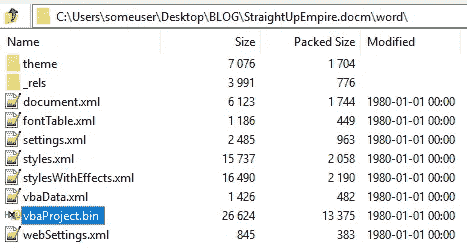
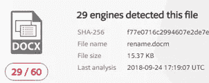
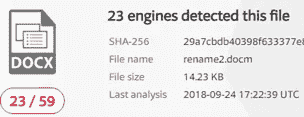

# MS Office 文件格式—高级恶意文档(Maldoc)技术

> 原文：<https://medium.com/walmartglobaltech/ms-office-file-formats-advanced-malicious-document-maldoc-techniques-b5f948950fdf?source=collection_archive---------2----------------------->

作者:Kirk say re([@ biggmacjpg](https://twitter.com/bigmacjpg))、Harold Ogden([@ haroldogden](https://twitter.com/haroldogden))和 Carrie Roberts([@ oronequalsone](https://twitter.com/OrOneEqualsOne))

欢迎阅读关于高级恶意文档(Maldoc)技术的一系列博客文章中的第一篇。本文将讨论 MS Office 使用的基本文件格式及其一些含义。这里提供的基础信息将为后续帖子奠定基础。对于其他一些激动人心的内容，一定要阅读后续的 ***躲躲闪闪的 VBA*** 和 ***VBA 跺脚*** 文章。

MS Office 文档的文件格式会影响防病毒解决方案处理该文件的方式。旧的 Office 97–2003 文件格式使用 OLE ( [对象链接和嵌入](https://msdn.microsoft.com/en-us/library/19z074ky.aspx))文件格式。这是一种复杂的二进制格式，不容易手动操作。另一方面，较新版本的 Office 保存为描述文档的较小单个文件的压缩存档(也称 zip 文件)。大多数文件都是人类可读的 XML 文件，但在某些情况下，如启用了宏的文档，存档也可以是 OLE 文件。特别感兴趣的是名为 vbaProject.bin 的 OLE 文件中启用宏的文档。该文件包含要执行的宏代码的详细信息。

Office 97-2003 Word 文档的文件扩展名始终为**。文档**，而较新的 Office 版本使用了一个**。docx** 为标准文件，**。docm** 用于包含宏的文件。如果没有**，MS Office 应用程序将拒绝保存包含宏的文档。docm** 扩展为新的 zip 存档文件格式。为了避免这种情况，您可以简单地在从 Office 保存后用另一个工具重命名该文件，或者您可以选择旧的 Office 97-2003 文件格式。

手动重命名一个**。docm** 到**。doc，**例如使用文件资源管理器，不会改变文件的“幻数”。幻数是文件开头的一系列字节，用于标识文件类型。在**的情况下。docm** ，幻数为 504b0304 表示是 zip 存档。将这样的文件重命名为**。doc** 不改变幻数，文件在 MS Office 中继续正常运行。旧的 MS Office 文件格式为**。doc** 文件以 d0cf11e 的幻数开头(“doc 文件”的可爱十六进制表示)。文件扩展名和幻数不匹配是不常见的，这可能表明作者有恶意。

如前所述，**。docm** 文件格式是许多其他文件的压缩存档。特别感兴趣的是解压缩 MS word 文档时在“Word”目录中找到的 vbaProject.bin 文件，如下所示。

vbaProject.bin 文件包含有关要执行的宏代码的信息。这是 MS Word 默认情况下保存文件的位置和文件名，但可以手动更改以破坏反病毒检测或反向工程。Philippe Lagadec 的 [OpenDocument 和 Open XML Security](http://www.decalage.info/files/JCV07_Lagadec_OpenDocument_OpenXML_v4_decalage.pdf) 论文描述了这种规避技术以及其他技术。重命名 vbaProject.bin 所需的步骤如下(来自 Philippe 的文档)。

1.将“vbaProject.bin”重命名为“no_macros_here.txt”

2.更新“word/_rels/document.xml.rels”中的关系

3.在“[内容类型]中。xml”，将“bin”替换为“txt”

作为反病毒规避的演示，向 Virus Total 上传了一个标准的攻击宏。一次上传未被修改，第二次上传将 vbaProject.bin 文件重命名为 ver.txt。

VT 哈希:f77e 0716 c 2994607 e 2e 2 de 7 ea 41d 04687 c 9 b 2533883753560 ea 4 f 4d 1d 29 ba 41 bbd 和 29 a7 cbdb 40398 f 63377 e 8 ad 99d 5 ecce D5 3 b 8 f 087 ef 2c 0 c 019835 BD 3 BC 1 f 7 b 2

病毒检测率降低了 6%，但文档的行为没有改变。除了重命名的文件之外，包含良性或误导性的虚拟 vbaProject.bin 文件也可能会分散分析师对真正恶意负载的注意力。

存档中另一个有趣的文件是 vbaData.xml 文件，它包含宏名。作为维护者，您可以利用这一点来禁用被配置为在文档打开时自动运行的宏。关于如何做到这一点的详细信息，请参见博客上的 ***VBA 跺脚*** 。