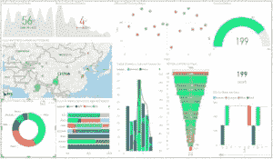

# MSBI vs Power BI —最佳 BI 工具之间的较量

> 原文：<https://medium.com/edureka/msbi-vs-power-bi-ef5dab26c463?source=collection_archive---------3----------------------->

MSBI vs Power BI -Edureka

MSBI 和 Power BI 都是当今商业智能领域的热门服务。所以，这里有一篇文章比较了两者，***vs 权力毕*** ，供各位读者参考。

现在，请记住，MSBI 是一个具有 ETL 功能的产品。它提取、转换和加载数据，可以组织和可视化多维数据，而 Power BI 是一种数据分析工具，提供数据建模功能，包括数据准备、数据发现和创建交互式仪表盘。因此，比较这两种产品是不公平的。

但是，我们可以比较这两种服务的报告工具。所以基本上，当我说 MSBI 时，我将只谈论 SQL Server 数据工具之一—**【SQL Server 报告服务】**

当我说 Power BI 时，我指的只是 Power BI 桌面，因为比较不同的报告服务是公平的。

以下是 MSBI 与功率 BI 进行比较的标准:

*   **定义**
*   **执照**
*   **实施**
*   **好处**
*   **学习方面**
*   **用户体验**
*   **数据**

# 定义

***SSRS*** 或***SQL Server Reporting Service***是一种基于服务器的数据分析和生成报告的 BI 服务。它是由微软在 2004 年开发的，与其一起开发的还有数据分析 ***(SSAS/SQL Server 分析服务)*** 和数据集成 ***(SSIS/SQL Server 集成服务)*** 对应产品。

它是一个全面的可扩展报告平台，包括一组集成的处理组件和编程接口。它用于设计测试和部署报告。

***Power BI*** 也是微软在 2017 年开发的一款数据分析工具，可以用于大范围数据源的报表和数据分析。Power BI desktop 允许其用户即时创建和发布报告，最终用户可以使用任何浏览器查看这些报告。

它简单易用，有助于提高业务分析师的技能，并使用户能够轻松地使用它。这对于分析复杂和庞大的数据集非常有用。它广泛用于不定型数据的建模和结构化。

# 履行

这两个系统之间最大的区别是它们的部署方式。

Power BI 是一种基于云的软件，托管在供应商的服务器上，通过网络浏览器访问，而 MSBI 是一种本地软件，安装在公司自己的计算机和服务器上。这两种服务都很有前途，这一事实引发了一场关于一种服务优于另一种服务的讨论。

最基本的一点是*不是所有的解决方案在云上或在本地托管解决方案中都能同样出色地工作*。这两种平台各有利弊。您在这些平台之间的选择将在很大程度上取决于您所考虑的需求、服务或软件的类型。

在 Power BI 的情况下，由于网络备份，硬件故障不会导致数据丢失。云计算使用远程资源，为组织节省了服务器和其他设备的成本。Power BI 中的 ***公用事业付费结构*** 使用户能够只为他们使用的资源付费。

然而，随着云服务的兴起，恐惧开始出现。毕竟，您信任其他人来托管您的数据，不是吗？这种恐惧如此普遍，以至于许多 IT 领导者认为这些强大的云服务是一个安全噩梦。

# 好处:

这两种服务各有各的好处。而的有着 ***更好的下钻能力*** 强大的 BI，另一方面，有着过多的 ***丰富的视觉效果*** 更好的呈现数据。

这基本上意味着，在 MSBI，可以有效地获取按某个因素分类/集中于某个因素的详细数据的信息。但是 Power BI 是一个更好的分析工具，因为它具有数据建模能力和强大的数据可视化表示。此外，由于它旨在提高老 SSRS 的自助服务能力，任何能够可视化数据的人都可以轻松使用它。

# 许可证

MSBI 的免费版持续 180 天，随后收费 931 美元(T21)。

Power BI 的免费版持续 **60 天**随后收费= **$9.99。**

***注:*** *我这里提到的价格只是基本价格，这些服务还有其他版本，每个版本的价格都不一样。*

# 学习方面

Power BI 是一个图形工具。所以，通过拖放，你可以满足你的大部分需求。但是它的后台进程是隐藏的，你无法理解它内部是如何处理的。

在 SSRS，开发人员必须完成报告的所有编码和设计，因此，开发人员对流程有更好的了解。

# 用户体验

与 SSRS 相比，Power BI 更具有图形元素。这使得前一种方式更有效、更易于使用，使得 SSRS 成为分析和生成报告的更手动和更困难的选择。

# 数据

Power BI 可以处理结构化和非结构化数据，但其数据容量仅限于 ***10 MB 或 33，000 行*** 的数据。

SSRS 处理结构化和半结构化数据，不会对数据引擎施加太大压力，因此，您可以在其上创建更大的报告。

# 结论:MSBI vs 权力毕

SSRS 是为您的像素完美，操作报告。Power BI 首先是一个分析工具，它允许您以不同的方式可视化您的数据，以便更深入地了解您的业务。

到目前为止，SSRS 已经有很多的存在，但现在权力 BI 已经使其存在在所有领域众所周知。在功率 BI 和 SSRS 之间的选择很可能是简单明了的，并且由需求驱动。如果您的组织只在内部使用分页报表，您会认为 SSRS 是一个更具成本效益的选择。另一方面，如果您需要在内部呈现交互式或分析性报表，或者您已经拥有带软件保障的 SQL Server 企业版，那么 Power BI Reporting Services 可能是您的首选。

*那么，现在你知道了这些服务的优缺点，你更喜欢哪一个？如果你喜欢这篇文章，并且想要更多关于商业智能的内容，请在下面的评论区告诉我们，我们会很乐意效劳。*

如果你想查看更多关于人工智能、DevOps、道德黑客等市场最热门技术的文章，你可以参考 Edureka 的官方网站。

请留意本系列中的其他文章，它们将解释 Power BI 的各个其他方面。

> 1. [Power BI 仪表盘](/edureka/power-bi-dashboard-fe37c2b9292c)
> 
> 2. [Power BI 桌面](/edureka/power-bi-desktop-42c867c712ca)
> 
> 3. [PowerBI KPI](/edureka/power-bi-kpi-c256a3749da5)
> 
> 4.[功率 BI 报告](/edureka/power-bi-reports-c64ee557e346)
> 
> 5.[电源 BI 教程](/edureka/power-bi-tutorial-ed9619113223)
> 
> 6. [DAX in Power BI](/edureka/power-bi-dax-basics-27008f4f7978)
> 
> 7.[有影响力的小技巧&互动力 BI 报道](/edureka/power-bi-reports-c64ee557e346)
> 
> 8.[电力 BI 开发人员工资](/edureka/power-bi-developer-salary-1ce0577f1013)
> 
> 9.[电力 BI 架构](/edureka/power-bi-architecture-270bdd8b5e25)

*原载于 2019 年 9 月 9 日*[*【www.edureka.co】*](https://www.edureka.co/blog/msbi-vs-power-bi/)*。*