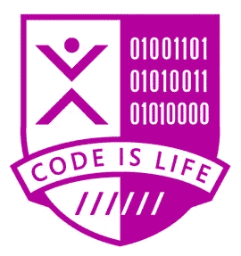

# MSP — Perjalanan menjadi Microsoft Student Partner

> 原文：<https://medium.easyread.co/msp-perjalanan-menjadi-microsoft-student-partner-732a89dc9187?source=collection_archive---------0----------------------->

## Road to be MSP Part I

> Sangat melelahkan namun menyenangkan

*Alhamdulillah* , saya mendapat kesempatan untuk mengikuti MSP 2018\. Saya seorang mahasiswa dan *ya* , kesempatan mengikuti MSP sangat melelahkan diikuti dengan sekian banyak tugas kuliah yang ada. Kita perlu mengerjakan *problem set* yang *Microsoft* berikan.

*Namun* , *coding* itu merupakan hal yang perlu dinikmati. Dan kalau teman-teman merasa lelah saat mengerjakannya, coba temukan cara untuk mengembalikan *mood* kalian lagi. Baik dengan bermain *game* atau ngobrol bareng temen2.

*Nah* , demi menyelesaikan **Challenge 102,** yaitu menulis blog. Berikut saya persembahkan apa yang telah saya ketahui dan pelajari sejauh ini.

## **Part 1\. Pelajari Teknologi Microsoft** melalui portal **Dicoding,** **Online Learning Microsoft Virtual Academy** dan **Channel 9**

Sumber yang saya gunakan saat mempelajari mengenai *Microsoft* itu paling banyak melalui ***Microsoft Virtual Academy*** *.* Dari sana, bahan pengajaran dan materi yang disediakan sangat terstruktur. Sedangkan untuk memahami penggunaannya pada *real-world* , saya mencarinya dari ***Dicoding*** karena banyak tersedia contoh kasus yang sesuai dengan terapannya di dunia kerja. Sedangkan di *Channel 9* sendiri terdiri banyak rekaman *event-event* yang lalu seperti *Imagine Cup 2017* dan lain sebagainya.

## ***Part 2\. Saksikan Video Introduction OPREC MSP dan Pengenalan serta tutorial Membangun Aplikasi Multiplatform:***

Video ini tersedia pada [*link*](https://channel9.msdn.com/Blogs/indonesia/OPREC-MSP-Indonesia-2018-Introduction-and-Challenge-Video) ini. Video ini memberikan langkah-langkah serta tips dan trik ( *redeem azure code, pembuatan apps, etc* ) ketika mengerjakan *problem set* pada *platform* Dicoding dan *challenge* lainnya dari *Microsoft* . Kamu perlu meluangkan waktu untuk menyaksikannya, *yaa* dengan begitu kamu tidak akan terlalu bingung ketika mengerjakan ***Challenge 101***

## ***Part 3\. Challenge 101 : Pahami dan selesaikan modul Membangun Aplikasi Multiplatform dari Dicoding Academy***

*Challenge* tersedia pada [link](https://www.dicoding.com/academies/20) ini. Kita tidak akan membahas terlalu dalam mengenai bagaimana pengerjaan *challenge* dari Dicoding ini.

Sedikit cerita, di kampus *alhamdulillah* saya dan teman-teman mendapatkan kesempatan (token beasiswa) untuk menyelesaikan *Dicoding* *challenge* dari dosen kami. Percayalah, saya pribadi juga belum mengenal apa pun mengenai *Xamarin* dan *alhamdulillah* saya bisa menyelesaikan *Challenge* -nya dan semua tugas ( *submisison* ) yang saya kumpulkan diterima.

*Dicoding* sendiri menyiapkan tempat [diskusi](https://www.dicoding.com/academies/20/discussions) , serta [Facebook Group](https://www.facebook.com/groups/1881090222157958/) untuk MSP. Kalian bisa langsung terjun dan bertanya di kedua tempat tersebut. Dan sudah banyak juga pertanyaan-pertanyaan atau error yang dialami peserta :)

Mungkin cukup sekian, ini saja yang ingin saya share XD

Ohya, saya juga buat notes untuk menemani pembelajaran. Saya share melalui [evernote](https://www.evernote.com/l/AZkF_kyADPlHG58EN9dOLkcbxe30m5O07kw) ini aja yaa~

Untuk [github](https://github.com/mochadwi/msp-dicoding-challenge-01) ssstttt, sebaiknya kamu coba dulu yaa kerjakan sendiri Challenge Dicoding-nya XD

***Happy coding, teman-teman~***

*Artikel ini di tulis oleh* [*Mochamad Iqbal Dwi Cahyo*](https://medium.com/u/62a4f05ca52a?source=post_page-----732a89dc9187--------------------------------) *beliau seorang enthusiast dan photographer. Follow profilnya untuk mendapatkan update-an terbaru artikel-artikel beliau.*

*Jika anda merasa artikel ini menarik dan bermanfaat, bagikan ke lingkaran pertemanan anda, agar mereka dapat membaca artikel ini.
Atau jika anda tertarik untuk membagikan cerita anda pada publikasi ini, anda boleh mengirimkan cerita anda ataupun mengikuti langkah-langkah yang ada* [***disini***](https://medium.com/easyread/about-easyread-74b20960e180) *.*