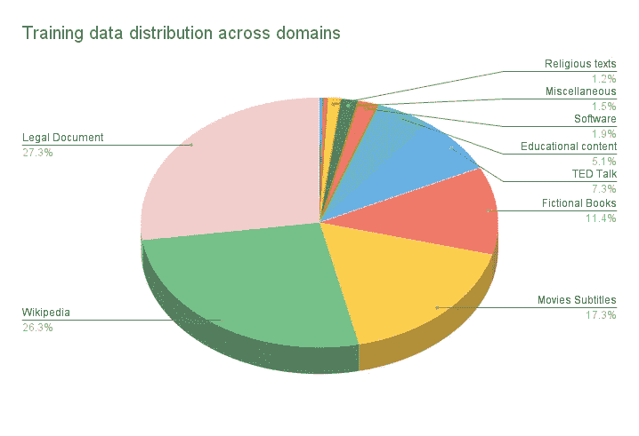
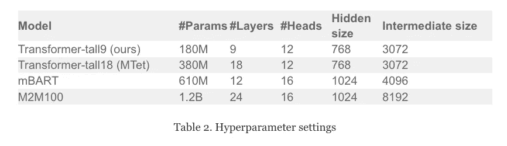
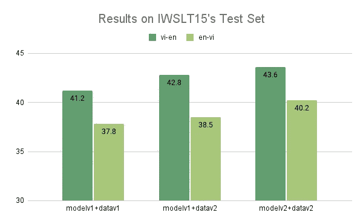
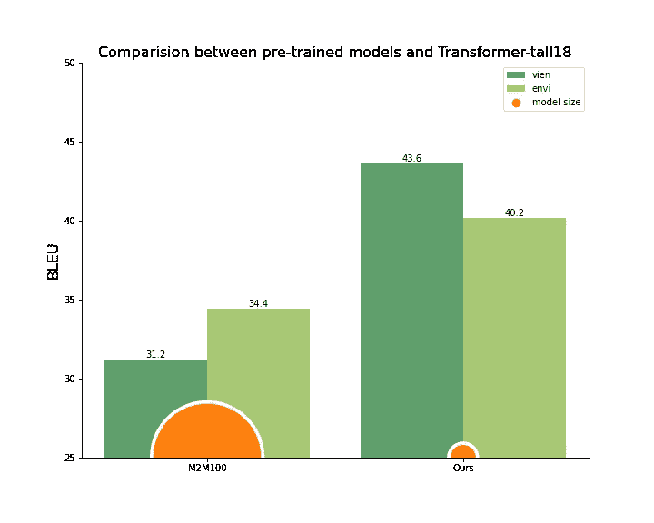

# MTet:英语和越南语的多领域翻译

> 原文：<https://medium.com/google-developer-experts/mtet-multi-domain-translation-for-english-and-vietnamese-2091116f0771?source=collection_archive---------6----------------------->

## 收集高质量的数据，并为越南语训练最先进的神经机器翻译模型。

# 介绍

机器翻译(MT)，即由计算机自动将内容从一种语言映射到另一种语言的任务，无疑是自然语言处理(NLP)最重要的应用之一。尽管使用人工智能，特别是深度学习和神经网络的机器翻译取得了很大进展，但英语-越南语翻译质量仍然落后，主要原因是缺乏大规模的高质量数据集。最近， [VietAI](https://vietai.org/) 已经[向研究社区发布了](https://blog.vietai.org/sat/)一个包含 330 万个例子的高质量英语-越南语翻译语料库，以促进研究的进一步发展。

继续这一努力，我们很高兴地介绍我们的第二个版本 VietAI 的 **MTet** 项目，它代表 **M** 多域 **T** 翻译为**E**English 和 Vie **T** namese。在此版本中，我们进一步改进了有史以来第一个大规模的多领域英语-越南语翻译数据集，发布了跨 11 个领域的多达 420 万个示例。此外，我们在[IWS lt’15](https://paperswithcode.com/sota/machine-translation-on-iwslt2015-english-1)上展示了最先进的结果(英语-越南语+3.5 BLEU)。我们希望我们的努力将激发人们为越南 NLP 社区不断增长的高质量数据集库做出更多贡献。

> VietAI 是一个非营利组织，其使命是在越南建立一个由世界级人工智能专家组成的社区。VietAI 培养和培训了数千名 AI 领域的学生和专家，其中 3 人是越南首批机器学习领域的谷歌开发者专家。

# 资料组

在此版本中，我们对第一个版本的数据集(datav1)进行了清理和重复数据删除，同时添加了来自各种文本源的 120 万个训练文本对。这使我们的数据集在 datav2 中从 3.0M 增长到接近 4.2M 的训练文本对。

附加数据来自两个来源。首先，我们使用 modelv1 对来自现有大型嘈杂来源(OpenSubtitles、MultiCCAligned 和 Wikilingua)的高质量数据进行评分、过滤和配对，这些数据尚未纳入 datav1。其次，我们从 30 个公共网站中混合执行自动和手动搜集，涵盖多个不同的领域，如医学出版物、宗教文本、工程文章、文学、新闻和诗歌。我们还校准了之前的测试集，以平衡不同的翻译域。



# 利用谷歌云平台、TPUs 和 Tensorflow

通过使用**TPU v3–8 和 TPU v3–32**，我们能够训练**更大的**变压器模型，并在多个测试集上获得最先进的结果。利用谷歌云存储的区域灵活性，我们还能够分发我们的数据管道，用于每个特定变压器型号和 TPU(v2–8、v3–8 和 v3–32)的培训。TPU v3 训练速度的提高(与 TPU v2–8 相比)也使我们能够更长时间、更快地训练大型模型。

感谢 **Google Cloud** 慷慨提供的 **GCP 信用**，我们能够并行运行 10 个 TPUv2，从非常大但有噪音的翻译数据集(如 MultiCC(2000 万句)和 open 字幕语料库(350 万句))中评分和过滤高质量的训练数据，最终贡献了近一半的新数据。

# 模型和结果

除了改善数据集大小和多样性，我们还采用了具有 Transformer-tall18 设置的普通 Transformer 架构，与 Transformer-tall9 相比，其大小增加了一倍，并且在 IWSLT2015 基准测试中的翻译质量更好。

一些好的结果:

```
**English**Without arguments, 'print' displays the entire partition table. However with the following arguments it performs various other actions.**Vietnamese**Khi không có đối số, " print " hiển thị toàn bộ bảng phân vùng. Nếu đưa ra các đối số theo sau, thì nó làm một số hành vi khác.**English**We report a seven-year-old female presenting with fever, dry cough, and abdominal pain after that.**Vietnamese**Chúng tôi báo cáo một trường hợp bệnh nhi nữ, 7 tuổi vào viện với triệu chứng ho khan, sốt và đau bụng dữ dội sau đó.
```

在 Google Cloud TPU v3 和 Google Cloud Platform 基础设施的帮助下，我们能够更快、更长时间地训练大型模型，最终在我们的 Transformer models v2 上实现最先进的翻译质量。



在图 1 中，我们报告了 IWSLT2015 翻译语料库上的 MTet 模型的结果。MTet Transformer-tall18 型号实现了最先进的越南语和英语翻译。在更大的 MTet 数据集上进行训练也有显著的改善，对 En-Vi 和 Vi-En 分别贡献了 0.7%和 1.6%。

我们的 Transformer-tall18 模型在我们新发布的高质量 VietAI 翻译数据集上进行训练，优于现有的 M2M100，后者是在更大但噪声更大的数据集上训练的更大模型(图 2)。我们在 En-Vi 和 Vi-En 任务上都取得了最先进的结果(分别比 M2M100 高 5.8%和 12.4%)，而体积却小得多。

这项工作是由 VietAI 研究小组(Chinh Ngo，Hieu Tran，Long Phan，Trieu H. Trinh，Hieu Nguyen，阮明，Minh-Thang Luong)进行的。

要查看更多细节，请查看 [VietAI 翻译项目](https://translate.vietai.org/)。



Figure 1\. Improvements made from our first release to this second release on on IWSLT15 test set.



Figure 2\. Comparison between pre-trained translation models and our purely supervised MTet.