# Mudahnya Continous Deployment (CI/CD) dengan Netlify dan GitHub

> 原文：<https://medium.easyread.co/mudahnya-ci-cd-dengan-netlify-dan-github-9ded1c9e3ada?source=collection_archive---------3----------------------->

## Bagaimana menghubungkan Netlify dengan Github?

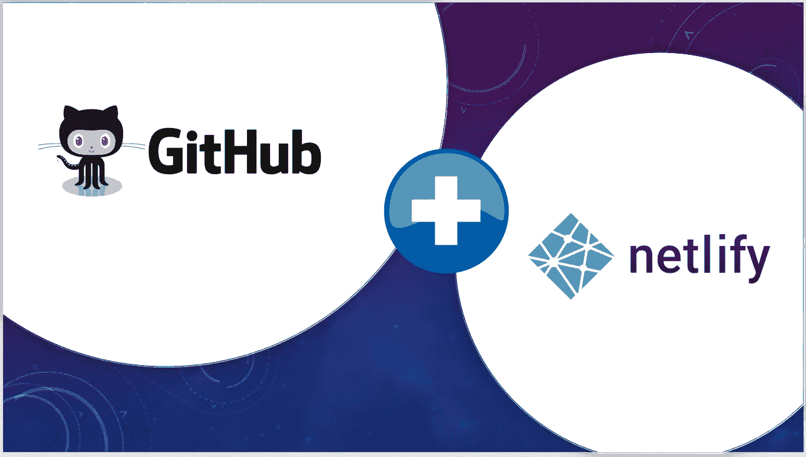

Sumber gambar: [https://medium.com/@cnuis2cool/step-by-step-guide-deploy-your-static-site-from-github-to-netlify-4790c0e2c633](https://medium.com/@cnuis2cool/step-by-step-guide-deploy-your-static-site-from-github-to-netlify-4790c0e2c633)

Netlify adalah salah satu platform penyedia layanan build tools sekaligus Continous Deployment. Selain karena kemudahannya untuk diintegrasikan dengan tiga git host terkenal yakni [Github](http://github.com) , [Gitlab](http://gitlab.com) , dan [Bitbucket](http://bitbucket.org) . Netlify menjadi populer belakangan ini karena kita dapat menggunakan fitur utamanya secara gratis.

Pada kesempatan kali ini, kita akan belajar bagaimana cara mengintegrasikan Netlify dengan GitHub. Kita akan mengautomasikan sebuah Web PWA + support push notification, [waktu-sholat](https://waktu-sholat.netlify.com/) . Yang sudah pernah dibahas pada artikel [“Membuat Progressive Web Application (PWA) sederhana menggunakan Vue.js”](https://medium.com/@alfari/membuat-progressive-web-application-pwa-sederhana-menggunakan-vue-js-9c1bc0803757) *.*

Berikut langkah-langkah yang harus dilakukan.

## Konfigurasi Akun Netlify

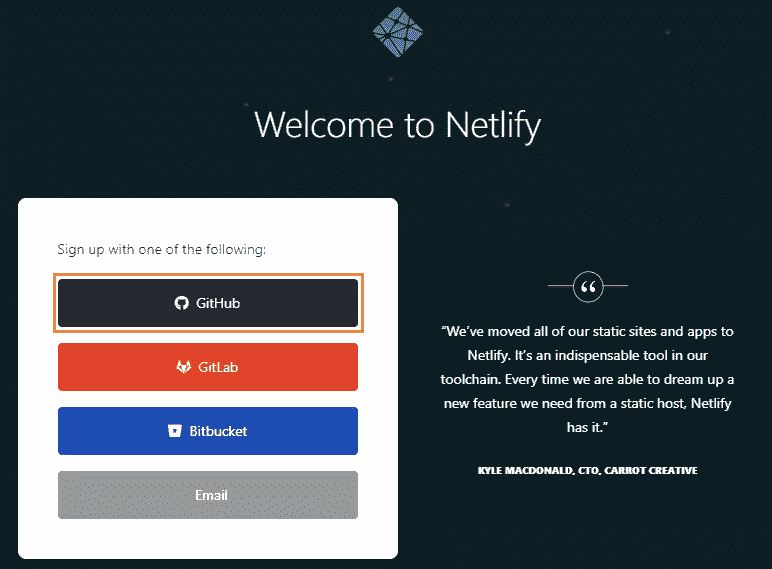

Kamu dapat memilih salah satu pilihan *signup with* yang terdapat pada halaman. Kita akan menggunakan akun github.

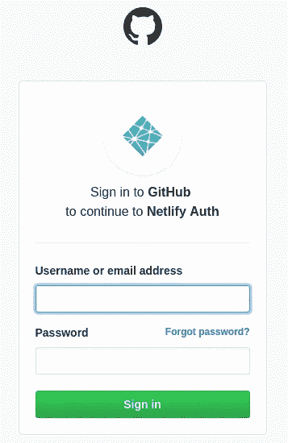

Masukan Username dan Password akun github, kemudian **Sign In** . Setelah *login* , kita akan dialihkan menuju *dashboard app* Netlify.

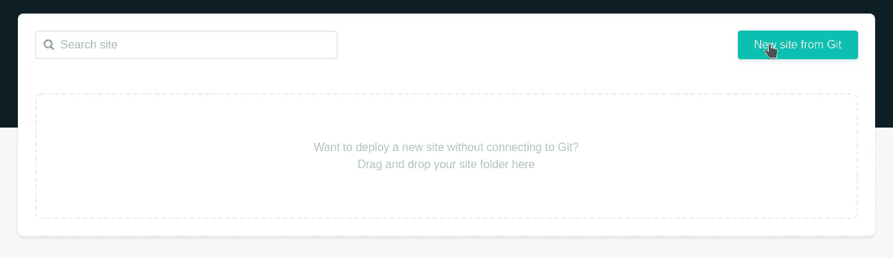

Kemudian, kita akan mengintegrasikan repository yang ada pada akun GitHub ke dalam *dashboard* Netlify dengan meng-klik **New site from Git** .

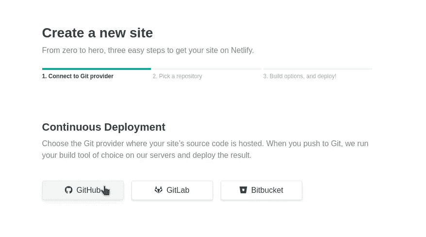

Pada bagian Continous Deployment, pilih GitHub.

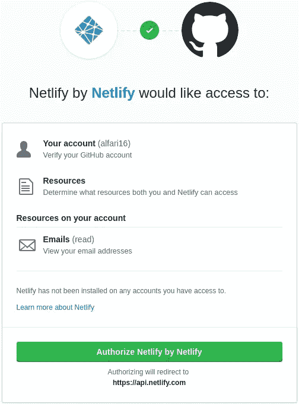

Kemudian Netlify akan meminta izin untuk mengakses akun GitHub kita. Klik **Authorize Netlify by Netlify** .

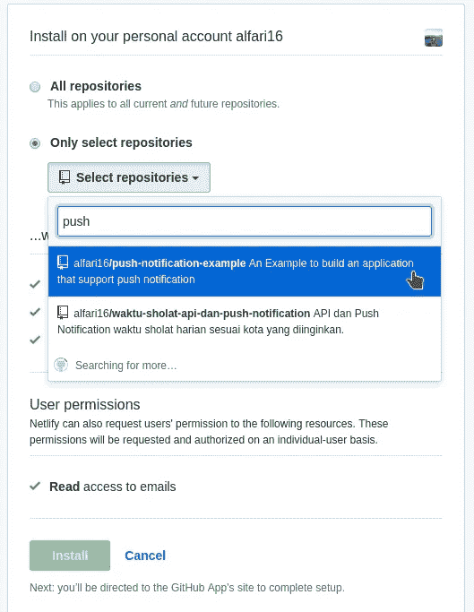

Pada tahap ini, kita dapat memilih apakah kita akan mengintegrasikan semua repository ke dalam Netlify, atau hanya sebagian. Kali ini, kita akan memilih untuk mengintegrasikan satu repository saja.

> *Jika nanti ingin menambah repository untuk diintegrasikan, maka cukup ulangi langkah klik tombol* ***New Site from Git*** *.*

Kemudian klik **Install** .

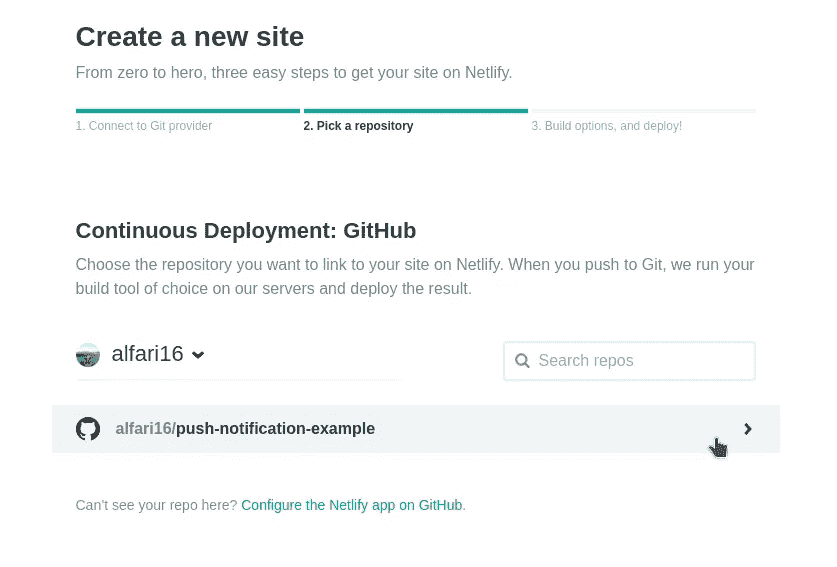

Setelah itu, kembali ke *dasboard* Netlify, pilih repository yang sudah kita tambahkan sebelumnya.

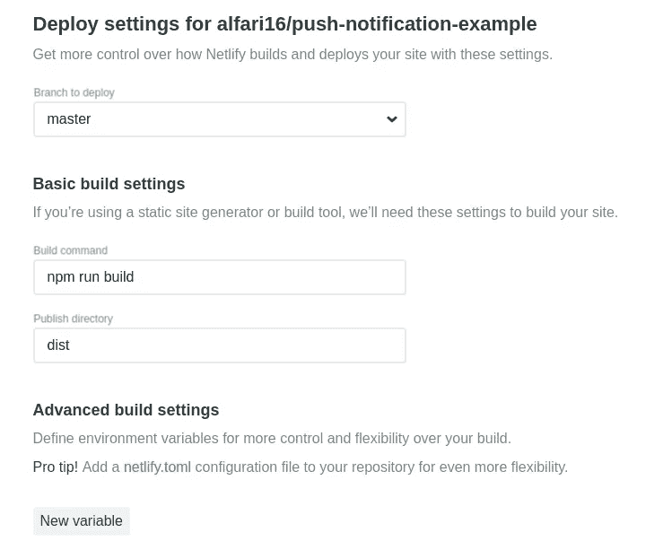

Pada tahap **Deploy Setting** , kita akan mengatur sedikit konfigurasi yang akan digunakan. Pada field **Branch to deploy,** secara *default* akan menuju pada branch master kita. Kemudian field **Build command** , inputkan script yang digunakan untuk mem- *bundle* aplikasi kita. **Publish directory** adalah dimana folder hasil *bundle* tersimpan setelah proses build berhasil dilakukan. Kita dapat menambahkan Environment Variable pada form **Advanced build settings** , dan/atau menambahkan file Netlify.toml untuk memudahkan *setting* konfigurasi *deployment* ke dalam satu file. Untuk dokumentasi lengkapnya, kamu dapat mengunjunginya [disini](https://www.netlify.com/docs/netlify-toml-reference/) .

Kemudian klik **Next** .

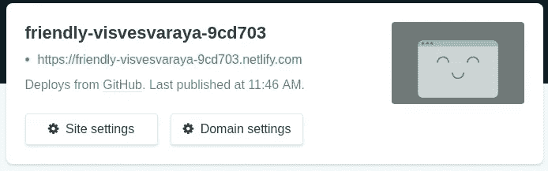

Tunggu hingga proses *build* selesai, lalu Netlify akan men- *generate*  sebuah URL random untuk sebagai domain project kita.

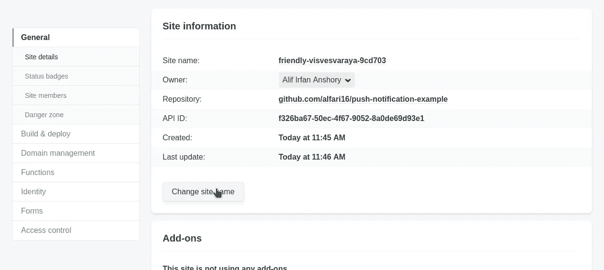

Jika ingin mengubah URL, klik pada **Change site name.**

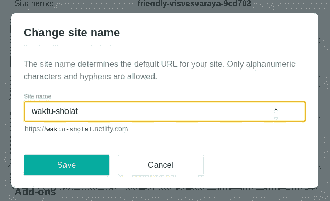

Kemudian akan muncul *dialog modal* , dan ganti menjadi URL yang diinginkan. Pada tahap ini, kita sudah berhasil melakukan proses *deployment* , dan *project* kita sudah dapat diakses pada URL [waktu-sholat.netlify.com](http://waktu-sholat.netlify.com) .

## Maintenance

Setelah mengintegrasikan Netlify dengan GitHub, semua aktivitas yang dilakukan pada GitHub akan secara otomatis melakukan *trigger* pada Netlify. Netlify menyediakan beberapa fitur *deployment* yang dapat kita gunakan. Diantaranya adalah sebagai berikut.

*   Production branch: Branch production digunakan sebagai branch utama yang dapat langsung terkoneksi dengan custom domain (e.g. `www.yourcustomdomain.com` and `yoursitename.netlify.com` ). Biasanya menggunakan branch master.
*   Production deploy: Ketika melakukan deploy dari branch production, maka Netlify akan langsung melakukan *build and deploy* pada alamat URL utama.
*   Branch deploy: Deploy yang dilakukan selain pada branch production. Kita dapat memilih branch apa saja yang dapat melakukan fungsi ini. Contohnya, jika menggunakan [git-flow](https://danielkummer.github.io/git-flow-cheatsheet/) , maka kita dapat men-set branch develop supaya dapat melakukan *auto-deploy* .
*   Deploy Preview: Deploy yang dilakukan ketika kita melakukan pull request atau merge request. Netlify akan secara otomatis melakukan *deploy* dan men- *generate* sebuah URL random dengan source code sesuai pull/merge request.

Untuk dokumentasi lebih lengkap mengenai konfigurasi *deployment* Netlify, kamu dapat langsung menuju [kesini](https://www.netlify.com/docs/continuous-deployment/) .

Untuk penggunaan lebih lanjut, kita dapat memanfaatkan Netlify untuk membangun sebuah Website atau Blog statis tanpa database yang dibungkus dengan framework static-site-generator seperti [gatsby.js](http://gatsbyjs.com)  + NetlifyCMS. Atau untuk *project* server-side, kita dapat mengautomasikannya dengan menggunakan [Lambda Functions](https://www.netlify.com/docs/functions/) . Yang InsyaAllah kedua topik tersebut akan kita bahas pada artikel yang akan datang.

Demikian sedikit penjelasan mengenai proses dan konfigurasi Continous Deployment menggunakan Netlify dan GitHub. Dapat kita simpulkan, dengan mengintegrasikan Netlify dalam project GitHub, kita dapat menghemat banyak waktu untuk fokus pada pengembangan aplikasi, tanpa harus mengurus proses *deployment.* Dan tentu yang paling penting, kita dapat menggunakan fitur ini secara gratis. :D

Semoga artikel ini bisa bermanfaat untuk kita semua. Apabila ada saran, silakan komentar dibawah.

Jika kamu tertarik untuk berkontribusi pada project [Waktu Sholat](http://waktu-sholat.netlify.com) , kamu dapat langsung berkontribusi disini:

 [## alfari16/push-notification-example

### An Example to build an application that support push notification - alfari16/push-notification-example

github.com](https://github.com/alfari16/push-notification-example)