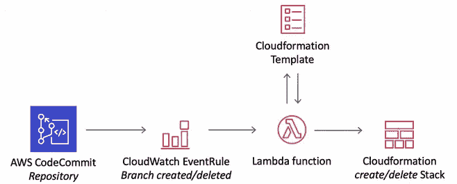

# 具有事件驱动架构和 AWS CDK 的多分支代码管道策略

> 原文：<https://medium.com/version-1/multi-branch-codepipeline-strategy-with-event-driven-architecture-and-aws-cdk-fbe0095f0730?source=collection_archive---------0----------------------->

Photo by [AltumCode](https://unsplash.com/@altumcode?utm_source=medium&utm_medium=referral) on [Unsplash](https://unsplash.com?utm_source=medium&utm_medium=referral)

在 AWS 的[具有事件驱动架构的多分支代码管道策略](https://aws.amazon.com/blogs/devops/multi-branch-codepipeline-strategy-with-event-driven-architecture/)博客中，CloudWatch 事件用于触发 Lambda 函数，该函数从预定义的 Cloudformation 模板提供管道。这允许使用 GitFlow 分支策略，开发人员可以在存储库上创建特性分支，它们各自的管道将被自动创建。

AWS’s multi-branch CodePipeline strategy with event-driven architecture

关于这种方法的更多讨论和示例，请参见企业快速入门的无服务器 CICD[此处](https://aws.amazon.com/quickstart/architecture/serverless-cicd-for-enterprise/)。然而，这篇博客描述了这种方法的演变。它着眼于用 Typescript 和 AWS CDK 实现该策略，并用 Codebuild 和 AWS CDK 命令替换 Lambda 和 Cloudformation 阶段。

> 相关阅读:[为什么您必须更新您现有的应用程序以实现更大的创新和灵活性](https://www.version1.com/it-service/digital-services/modernise-with-aws/)

# 第一步。创建存储库和新的分支规则

首先，创建一个 Codecommit 存储库，并为新分支添加一个规则。

# 第二步。创建 CDK 代码构建项目

接下来，为附加到上面存储库的规则创建一个目标 Codebuild 项目。引用的环境变量($REPO，$BRANCH)都是由 Cloudwatch 规则有效负载提供的，稍后将对其进行设置。

注意，Buildspec 还包含对 git-credential-helper 的引用，它为 Codebuild 提供了一种在构建时克隆我们的存储库的方法。

为了完成这个代码构建步骤，Codebuild 角色需要几个额外的策略语句。

在这里，我们添加策略声明，以便从新的存储库中提取代码，并且我们还允许 Codebuild 角色承担 CDK 部署和发布角色。这些角色是在 CDK 引导流程中创建的。

# 第三步。将代码构建目标添加到规则中

随着存储库、分支规则和目标 Codebuild 项目的创建，我们现在可以将它们连接在一起。我们通过将 Codebuild 项目作为目标添加到规则中来实现这一点。

这里的关键要点是，如何通过使用 Cloudwatch 事件数据作为目标 CDK Codebuild 项目的有效载荷，使规则变得动态。在`environmentVariablesOverride`中指定的变量可由 Codebuild 项目访问，这些变量用于在`cdk deploy`命令之前克隆和检出相关的存储库和分支。

# 第四步。部署

使用`cdk deploy`将项目部署到您的 AWS 帐户中。部署完成后，将您的 CDK **管道**项目推进到新的存储库中。在存储库中创建一个分支，并检查所有的连接是否正确:

*   新的分支将导致触发 Cloudwatch 规则/事件。
*   在 CodeBuild 中，您应该看到动态管道项目开始，检查环境变量以确保正确的 repo 和分支在那里。
*   CodeBuild 项目将克隆您的存储库，并检查您刚刚创建的分支。然后，它将尝试使用`cdk deploy`部署项目。
*   CodeBuild 项目完成后，检查 CodePipeline 以确保您的管道在那里并且正在运行。它的来源应该是您创建的新分支。

# 动态管道

这种方法的一个强大特性是为`cdk deploy`命令使用上下文参数。通过使用`-c`，例如`-c branch=$BRANCH`，可以向您的 CDK 应用程序提供上下文参数。这为部署您的 CDK 管道项目提供了很大的灵活性。

管道源代码可以读取上下文变量，并根据其值生成不同的模板。例如:

*   如果 branch 的上下文参数以“release”开始，synth 一个发布管道类，它通过手动批准步骤将角色分配给多个帐户。
*   在所有其他情况下，假设分支是一个功能，并使用仅部署到开发帐户的功能管道。

# 关键指针

请注意，在上面的动态管道应用程序示例中，我们使用分支名称来设置 **stackName** 属性。如果您希望在一个帐户中拥有**多个管道实例，这是非常必要的。此属性覆盖默认堆栈名称，如果没有此属性，您的 Codebuild cdk 部署步骤将在每次运行时更新相同的堆栈，而不管哪个分支触发了它。**

另外，请注意，如果您正在命名您的资源，并且在同一个帐户中创建了多个堆栈，您可能会遇到冲突。我删除了对我的资源的可选命名属性的所有引用，并让 CDK 框架为它们分配惟一的标识符。在必须提供名称的情况下(例如警报)，一个选项是重用上下文分支变量作为前缀。

# 包裹

在这篇博客中，我们研究了 CDK 管道应用程序的自动化部署，避免了对新分支的手动`cdk deploy`命令的需求。我们还研究了如何使用事件环境变量来提供动态代码构建和管道应用程序。