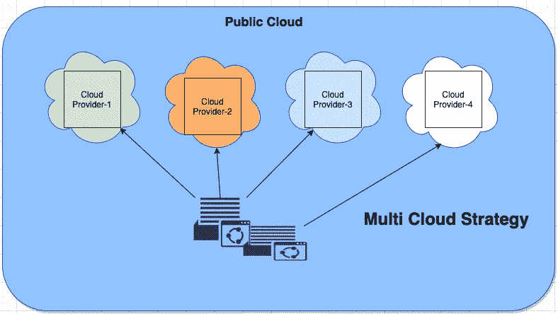

# 多云成本和性能优化策略

> 原文：<https://medium.com/walmartglobaltech/multi-cloud-cost-and-performance-optimization-strategy-c45eaa4e31bb?source=collection_archive---------0----------------------->

multi-cloud deployment

# **什么是多云部署**？

在当今的现代云计算世界中，多重云是一种更可取的云策略。多云战略使企业能够从两个或更多的云提供商那里选择云服务。大多数组织都在使用来自多个公共云提供商的服务，以满足其各种使用情形。如今，市场上有多家云提供商。它们为计算资源和服务提供了多种选择。多云方法通常与实现以下功能相关联:

*   为合适的服务选择合适的云
*   停机避免
*   避免供应商锁定
*   最佳方法

# **一些事实**

企业在云服务上花费了大量资金，这里更大的问题是，企业的支出是否明智、最优？当每月的账单开始到来时，真正的担忧就开始了。如果企业想要真正利用云计算的优势，成本优化和低延迟成为他们的首要任务。360°资源监控视图在多云环境中发挥着非常关键的作用。

研究公司 Gartner 预计，2019 年仅公共云基础设施(IaaS)的全球支出总额[就将达到 395 亿美元](https://www.gartner.com/en/newsroom/press-releases/2019-04-02-gartner-forecasts-worldwide-public-cloud-revenue-to-g)。与此同时，IDC 预测公共云支出(包括 IaaS、SaaS 和 PaaS)将在 2023 年接近[5000 亿美元](https://www.idc.com/getdoc.jsp?containerId=prUS45411519)。

然而，云成本管理供应商 ParkMyCloud 使用 Gartner 的 395 亿美元 IaaS 数字作为起点，估计今年公司将在不必要的公共云基础设施支出上浪费超过 140 亿美元，该公司认为该数字“可能很低”

让我们看看我们能做些什么来避免“140 亿美元”这个数字。

# **优化多云成本**

*   **避免过度配置云资源**:弹性是云计算的最大优势之一，基础设施可以根据应用需求和负载增长和收缩。开发团队经常过度配置资源以确保性能和可伸缩性。最佳实践是尽可能在云资源上设置自动扩展。
*   **在冷热存储层之间拆分数据:**在云计算和物联网的数字化时代，系统和应用必然要处理海量的数据。将数据划分到热存储层和冷存储层。将频繁访问的数据保存在 SQL/NoSQL 数据库等热存储中。将不常访问的数据移动到冷存储中，如文件和对象存储。通常，第 1 层数据库的成本是文件存储的 100 倍。
*   **监控和清理资源**:定期监控云资源的使用和配置，清理未使用的资源，移除任何不再使用的存储卷，这一点至关重要。我们还需要确保自动监控和警报流程到位，以便能够及时采取适当的行动。如果没有帮助他们精细分析数据的工具，云运营或基础架构管理团队可能无法避免云资源浪费。适当的监控可以帮助我们确定主要的成本驱动因素，并提出明智的建议来纠正正在使用的云资源的规模。
*   **创建通用层**:跨多个云的单点操作层可以提供对整个基础架构的重要可见性和控制，更好地管理安全性，并深入了解资源利用率。实施正确的治理有助于减少资源浪费，并通过提高资源利用率为现有资产带来新的效率。
*   **分离生产和非生产账单:**非生产环境上的云支出通常很大，我们不会对此进行跟踪。最好根据资源组来分离清单和分析成本。我们必须避免在较低的环境中存储大量数据和备份，如果负载不是很大，还应该提供最少的资源。使用 DevOps 进行资源调配和清理。
*   **为合适的工作提供合适的云服务:**我们需要在云提供商中选择适合我们工作的合适服务**。这个领域有很多竞争者。了解使用案例和具体的技术要求至关重要，不同的云提供商为工作提供或多或少类似的托管服务，但会从成本、安全性、合规性、治理等方面评估每项同等服务。**

# **在多云中实现低延迟**

在同一个云基础设施中移动数据比通过互联网传输数据要快。通过网络设备的网络连接是各种云彼此通信的唯一方式。这意味着在使用多云架构时，需要考虑网络带宽和延迟率。

*   **避免将大型数据集存储在一个云中:**避免将大量数据存储在一个云中，而在另一个云中处理。虽然一个云存储服务可能成本更低，但不值得潜在的性能问题，同时在将数据发送到另一个云之前尝试压缩数据。
*   **区域关联性:**大多数大型公共云提供商的数据中心分布在全球许多地区。当企业希望在多个云中部署其工作负载时，区域关联性起着至关重要的作用，选择第二个云中最接近您当前区域部署的区域对于最小化延迟非常重要。这是一个好主意，即使你现在不需要跨云连接，但是你将来可能会需要。
*   **将工作负载部署在靠近用户的地方**:将部署的应用程序移动到更靠近用户的地方，同时确保应用程序中的节点相互靠近。不建议从云 A 托管应用程序，从云 b 托管数据库。请始终评估入口流量的来源位置和云提供商数据中心的可用性。借助多云基础架构，距离最终用户最近的数据中心可以以最短的延迟提供所请求的数据。这种功能对于需要跨多个地理位置提供企业数据，同时保持统一的最终用户体验的全球性组织尤其有用。
*   **基于邻近度的路由:**当您为邻近度配置 GSLB 时，客户端请求会被转发到最近的数据中心。基于邻近度的 GSLB 方法的主要优势是，由于选择了最近的可用数据中心，因此响应时间更快。这种部署对于需要快速访问大量数据的应用程序至关重要。大多数公共云提供商都提供路由功能。

一方面，多云战略有其自身的优势，但另一方面，它也带来了组织在定义云战略之前需要考虑的具体挑战。低成本和延迟是需要考虑的两个主要驱动因素。

随着多云策略变得流行，决策者了解优势和劣势并采用同类最佳的方法非常重要。

请继续关注我关于多重云的下一篇文章！！