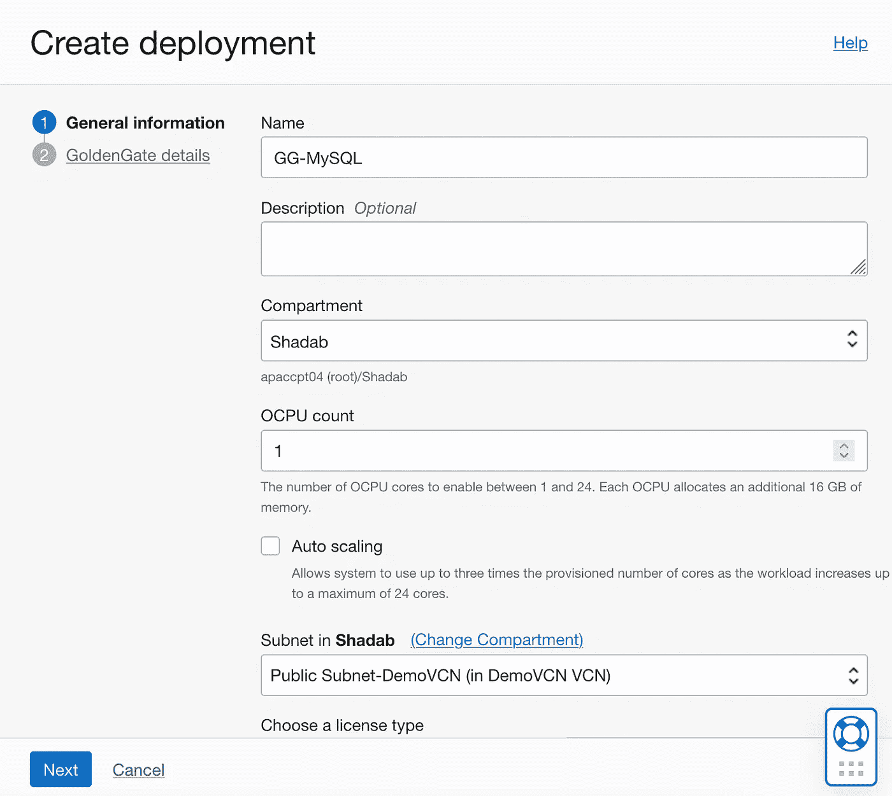
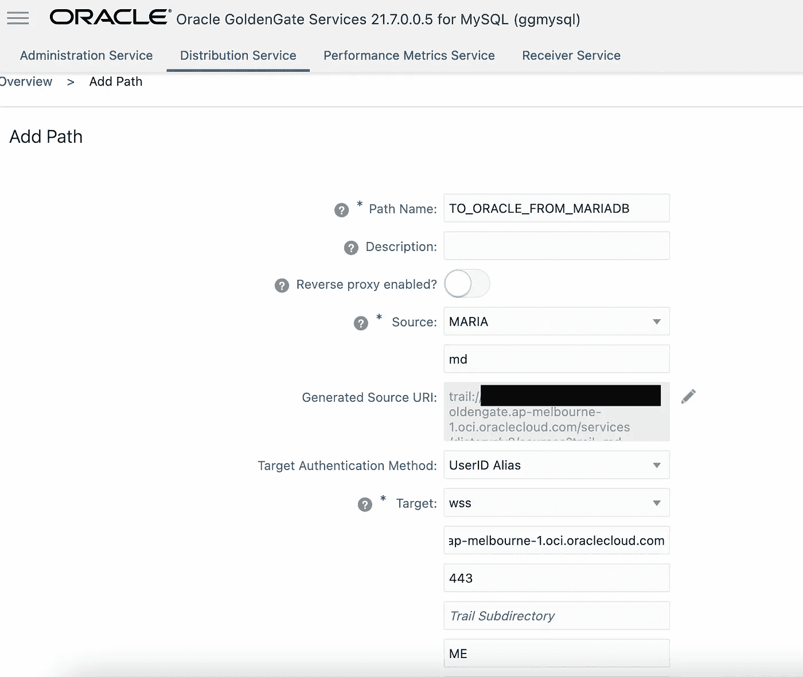
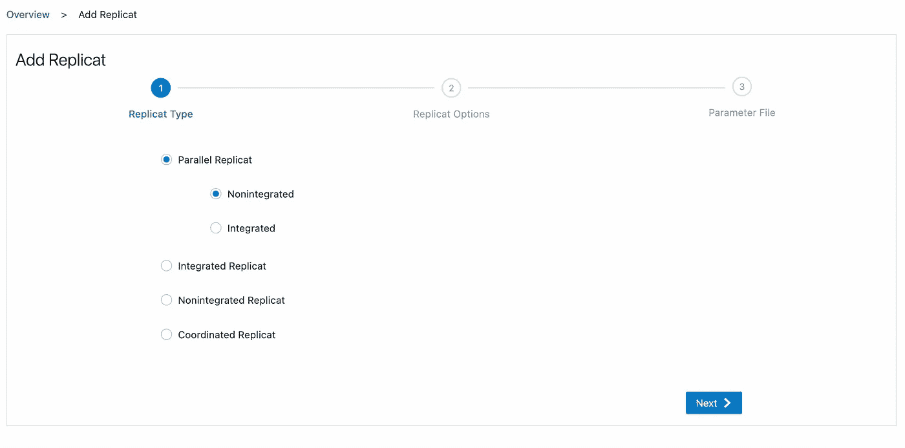

# 使用 OCI Goldengate 从 Amazon RDS MariaDB/MySQL 到 Oracle 自治数据库的多云数据复制

> 原文：<https://medium.com/oracledevs/multi-cloud-replication-from-amazon-rds-mariadb-mysql-to-oracle-autonomous-database-using-oci-85758bd8aa01?source=collection_archive---------0----------------------->

**甲骨文云基础设施(OCI)** 提供 **Goldengate** 作为完全托管的服务。Goldengate 提供了一个全面的变更数据捕获(CDC)复制平台，您可以使用它来构建复杂的数据复制拓扑，包括本地到云、云到云或任何其他混合模式。

[OCI Goldengate 支持 Oracle、MySQL、MariaDB、Apache Kafka、OCI 对象商店和 OCI 流](https://blogs.oracle.com/dataintegration/post/oci-goldengate-now-supports-mysql-apache-kafka-oci-object-store-and-oci-streaming)。对于 MySQL 和 MariaDB，它支持远程捕获和应用转换。


Image Credit : Unsplash

您的源可以在亚马逊 RDS MySQL 或 MariaDB 上运行，您可以从 OCI 捕获交易。这对于构建多云架构非常有用，例如:您的事务性应用程序可以在一个云上运行，而您可以在 OCI 上构建您的分析能力

在这篇博文中，我们将从 **Amazon RDS MariaDB 10.5** 实例中捕获事务，并将其写入 **Oracle 自治数据仓库**

# 体系结构


## 要求

*   运行在 Amazon RDS 上的 MariaDB 10.4 或 10.5 或 MySQL 5.7、8.0 实例
*   运行在 OCI 上的 Oracle 自治数据仓库
*   Oracle OCI golden gate 部署
*   MySQL 的 OCI Goldengate 部署
*   AWS 和 OCI 之间的低延迟连接([首选私有连接](https://blogs.oracle.com/cloud-infrastructure/post/connecting-oracle-cloud-infrastructure-to-amazon-vpc-with-megaport-cloud-router))

**重要链接:**[OCI golden gate 上 MySQL 支持的数据库版本](https://docs.oracle.com/en/cloud/paas/goldengate-service/wxntz/index.html#articletitle)

# 开始之前的 AWS 配置

这里执行的所有步骤都使用 Amazon RDS MariaDB 10.5，但您也可以使用 RDS MySQL 8.0，这些步骤几乎没有变化。

1.  为您正在使用的 MariaDB 版本创建一个新的参数组，并设置以下参数。


2.将新参数组应用于 RDS MariaDB 实例，并重新启动该实例。


3.创建一个名为 orders 的示例表。

```
CREATE TABLE demo.orders (
  order_id bigint PRIMARY KEY,
  customer_id bigint,
  product_id bigint,
  product_description VARCHAR(500),
  order_delivery_address VARCHAR(500),
  order_date_taken date,
  order_misc_notes VARCHAR(500)
);
```

在 RDS 实例上启用自动备份，并确保 binlog 保留足够长的时间，以承受任何与网络相关的中断。

`call mysql.rds_set_configuration('binlog retention hours', 24);`

# 入门前的 OCI 配置

## 1.为 MySQL 部署 OCI Goldengate 部署

使用这个 OCI GG 部署，您可以将它用于 MySQL 和 MariaDB 的捕获和应用。



OCI Goldengate for MySQL Source and Targets

## 2.为 Oracle 部署另一个 OCI Goldengate 部署


## 3.准备好 Oracle 自治数据仓库实例，并在 Oracle 中创建相同的表结构

```
CREATE TABLE admin.orders (
 order_id number,
 customer_id number,
 product_id number,
 product_description VARCHAR2(500),
 order_delivery_address VARCHAR2(500),
 order_date_taken date,
 order_misc_notes VARCHAR2(500),
 CONSTRAINT orders_pk PRIMARY KEY (order_id)
);
```

如果您需要将 MariaDB 模式转换为 Oracle，您可以使用这个免费的在线模式转换工具。

# 创建从亚马逊 RDS MariaDB 到 OCI 自治数据库的 CDC 复制的步骤

## 1.添加 AWS RDS MariaDB 实例作为连接，并将该连接分配给 MySQL 部署


## 2.在 AWS RDS 安全组上，确保允许来自 OCI Goldengate 的传入连接通过 tcp 端口 3306 进入。

如果您在 AWS VPC 和 OCI VCN 之间建立了专用虚拟电路，则可以使用 Goldengate 实例的专用 IP。


## 3.启动 OCI 黄金门 MySQL 控制台


## 4.连接到 MariaDB 连接以检查连接性并添加检查点表


## 5.创建提取(捕获)流程以从 RDS 中捕获事务


如果所有步骤都正确执行，那么您将看到提取流程正在运行。


## 6.创建分发路径，将 Goldengate 跟踪文件从 MySQL 发送到 Oracle 部署

a.在 OCI MySQL 部署上创建一个名为“distusr”的本地凭据。


b.为 Oracle 启动 OCI Goldengate 控制台，并添加一个类似命名的新用户“distusr”作为本地用户。


c.使用 OCI Oracle 部署的目标主机名在 OCI MySQL 部署上创建一个分发路径。



如果正确执行了所有步骤，您应该看到分发服务正在运行，跟踪文件'***【MD】***'作为跟踪文件' ***ME*** '被发送到 Oracle 部署。

## 7.在 OCI Goldengate 上为 Oracle 部署创建 Replicat (Apply ),以将事务应用于 ADW

创建到 OCI Goldengate 上自治数据库的连接，并分配到 OCI Goldengate Oracle 部署。


登录到 ADW 并添加检查点表。


在 OCI Goldengate 上为 Oracle 添加一个 Replicat，以应用来自 OCI MySQL 部署的踪迹。



如果所有步骤都成功执行，您可以看到 replicat 在 OCI Oracle Goldengate 部署上运行。

## 测试从 Amazon RDS MariaDB 到 Oracle 自治数据仓库的复制

在先前创建的 MariaDB 表上插入交易记录。

```
INSERT into demo.orders  values (1,1000,2048,"Chair","30/2 Acme Street, Pin : 9000, AZ-US","2022-12-25","Deliver to Doorstep");

INSERT into demo.orders  values (2,1000,2049,"Table","30/2 Acme Street, Pin : 9000, AZ-US","2022-12-25","Deliver to Doorstep");

INSERT into demo.orders  values (3,1000,2050,"Lounge","30/2 Acme Street, Pin : 9000, AZ-US","2022-12-25","Deliver to Doorstep");

INSERT into demo.orders  values (4,1000,2051,"TV","30/2 Acme Street, Pin : 9000, AZ-US","2022-12-25","Deliver to Doorstep");

INSERT into demo.orders  values (5,1000,2052,"Fridge","30/2 Acme Street, Pin : 9000, AZ-US","2022-12-25","Deliver to Doorstep");

INSERT into demo.orders  values (6,1000,2053,"Mattress","30/2 Acme Street, Pin : 9000, AZ-US","2022-12-31","Deliver to Doorstep");
```


从 SQL 工具检查自治数据库。


从摘录的统计数据中确认。


从复制品的统计数据中确认。


## 步骤总结

*   配置 Amazon RDS 实例以在 MariaDB 实例上启用 binlog
*   为 Oracle 和 MySQL 创建 OCI 自治数据库、OCI Goldengate 部署
*   在两个 OCI Goldengate 部署上将连接分配给源和目标
*   创建 Extract 以从 Amazon RDS MariaDB 中捕获事务
*   为 MySQL 在 OCI Goldengate 上创建分发路径，以将捕获的踪迹文件发送到 OCI Goldengate Oracle
*   创建 Replicat，将来自远程跟踪的事务应用到自治数据库

# 结论

使用 OCI Goldengate 部署组合，我们可以轻松创建从 MariaDB/MySQL 到 Oracle 自治数据库的复制。您甚至可以使用相同的 MySQL 部署作为复制中心来创建 MariaDB/MySQL 到 MariaDB/MySQL 的复制。

Oracle Cloud infra structure golden gate 提供了一个非常强大的数据集成平台，可用于多种源数据库和目标数据库。

# 参考资料:

[OCI GoldenGate 现在支持 MySQL、Apache Kafka、OCI 对象商店和 OCI 流](https://blogs.oracle.com/dataintegration/post/oci-goldengate-now-supports-mysql-apache-kafka-oci-object-store-and-oci-streaming)

[OCI GG 文档](https://docs.oracle.com/en/cloud/paas/goldengate-service/druyg/index.html)

[从 OCI MySQL 数据库复制数据到自治数据仓库](https://docs.oracle.com/en/cloud/paas/goldengate-service/amyql/index.html#articletitle)

[了解 MySQL 支持什么](https://docs.oracle.com/en/middleware/goldengate/core/21.3/gghdb/understanding-whats-supported-mysql.html#GUID-6A22FBB5-540B-4DAA-8D76-990FB38C2B3B)

[OCI golden gate 上支持 MySQL 和 Oracle 的数据库版本](https://docs.oracle.com/en/cloud/paas/goldengate-service/wxntz/index.html#articletitle)

# Oracle 开发人员和 Oracle OCI 自由层

加入我们在 Slack 上的 [Oracle 开发人员频道](https://bit.ly/odevrel_slack)来讨论这个和其他话题吧！

免费在 Oracle 云上构建、测试和部署您的应用！访问 [OCI 云免费层](https://www.oracle.com/cloud/free/)！