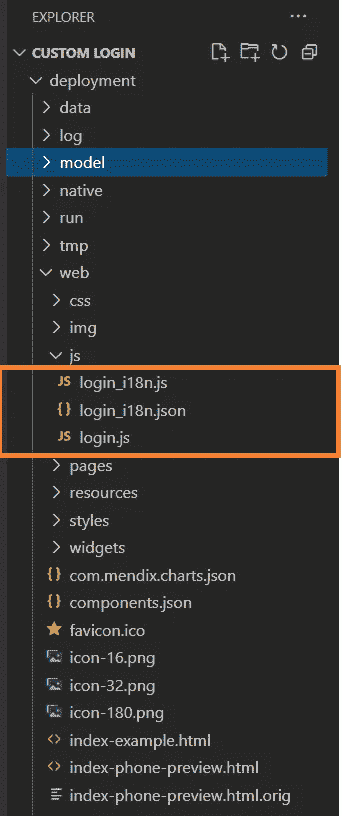
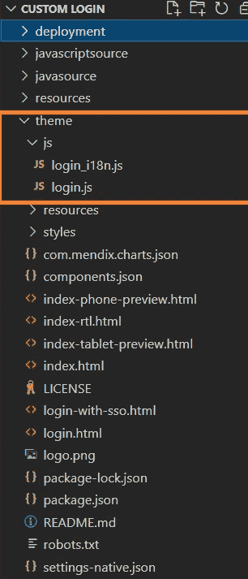
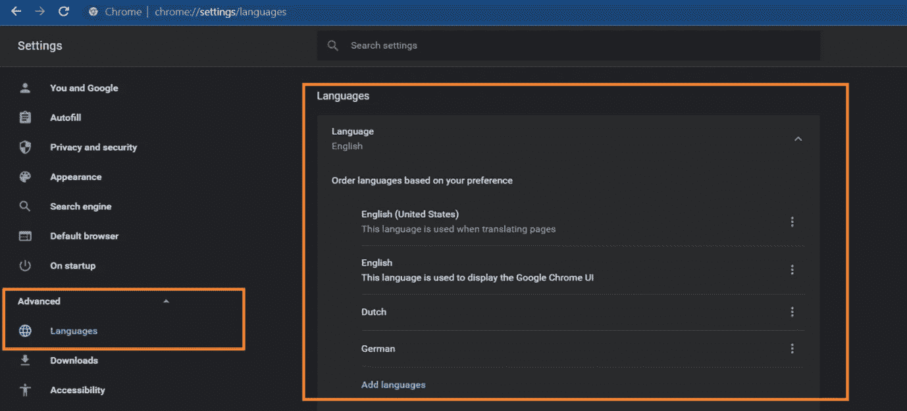
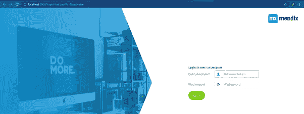
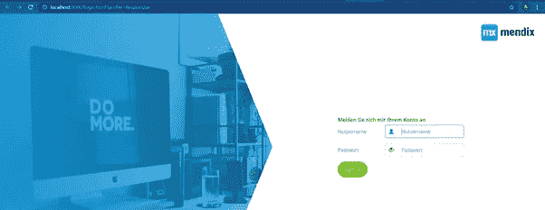
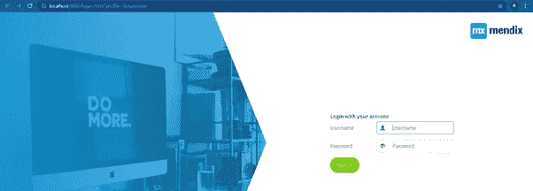

# Mendix 应用程序的多语言登录页面

> 原文：<https://medium.com/mendix/multi-lingual-login-page-for-mendix-apps-c98686e1493b?source=collection_archive---------1----------------------->


Multi-lingual Login Page for Mendix Apps

# 你们中的许多人已经知道 Mendix 允许我们构建开箱即用的多语言应用程序。有很多应用程序可以做到这一点，也有很多客户有这样的要求。在一次这样的需求中，我开始思考。我已经知道如何让一个应用程序支持多种语言，但是到目前为止，我还没有真正构建任何支持多语言登录页面的应用程序。所以今天，我们就要这么做。

在我们开始之前，最好知道任何解决方案都可以通过多种方式进行设计。但是我们将会看到一种实现它的方法。

## **什么是 i18n？**

> **国际化**，有时被称为 i18n，是设计和准备您的项目在世界各地使用的过程。本地化是为不同地区构建项目版本的过程。

本地化流程包括以下操作:

提取要翻译成不同语言的文本
为特定区域设置数据格式

语言环境标识人们使用特定语言或语言变体的地区。可能的区域包括国家和地理区域。区域设置决定以下详细信息的格式和解析:

计量单位包括日期和时间、数字和货币
翻译名称包括时区、语言和国家


[https://www.mendix.com/pricing/](https://www.mendix.com/pricing/)

## **先决条件**

Mendix Studio Pro 8.12.5 版本，但您可以轻松地使用不同的版本。请注意，在这种情况下，您可能需要根据应用程序的文件夹结构进行调整。
Visual Studio 代码，但你也可以轻松地使用自己选择的编辑器。
应该打开应用程序的安全性。

## **我们开始吧**

为了准备好解决方案，我们将遵循一些步骤:

1.  找到文件 **login.js** 和 **login_i18n.js**

要在项目目录中找到这些文件，您需要至少运行一次应用程序。因为我们将在部署目录中找到这些文件。一旦在本地运行应用程序，就会生成部署目录。

运行应用程序后，进入项目->在资源管理器中显示项目目录

右键单击项目文件夹，在您选择的编辑器中打开整个项目。

导航到部署-> web -> js 文件夹，注意突出显示的文件:



Location of login.js and login_i18n.js

2.**复制文件**

现在您已经成功地识别了文件，让我们进入下一步，添加翻译。

首先，让我们将所需的文件从部署目录复制到我们的主题文件夹中。在主题文件夹下创建一个 js 文件夹，并将 login_i18n.js 和 login.js 文件添加到 js 文件夹中。一旦这样做了，您应该会看到如下内容:



Files copied to theme folder under js

3.**自定义 Login.html**文件

这一步是可选的，但是如果你想知道引入一个新元素后会发生什么，这一步会很有帮助。

您可以在应用程序的主题文件夹下找到 login.html 文件。添加一个 ID 为 login-local-label 的新标签，如下所示:

```
<div><!-- New field introduced --><label id="login-local-label">Login in with your account</label><div id="loginMessage" class="alert alert-danger"></div><div class="form-group">
```

4.**添加翻译**并基于**用户浏览器语言**显示

我们将假设我们希望在应用程序中有 3 种语言—荷兰语、德语，最后是英语。

将文件内容替换为以下内容。代码本身是自我解释的。但本质上，我们从浏览器中识别用户(首选)语言，并以该特定语言设置不同的字段。

提示:如果你在你的 login.html 页面上添加任何新元素，那么它们应该有相关的翻译。为您想要翻译的任何附加元素添加一个键值。login.js 中需要进一步的修改，我将在下一步中展示这一点。

我已经选择了名为 login-local-label 的值

```
//Customized login_i18n.js file to support multiple language logins// Identify the language of the users browservar language = navigator.language.toLowerCase();// Dutch languageif (language == "nl"){window.i18nMap = {"username": "Gebruikersnaam","password": "Wachtwoord","loginButton": "Aanmelden","http401": "De opgegeven gebruikersnaam of het opgegeven wachtwoord is onjuist.","http404": "Server niet gevonden.","http500": "Er is een interne serverfout opgetreden.","http503": "Service niet beschikbaar.","httpdefault": "Aanmelden mislukt.","http402": "De huidige licentie staat niet toe dat er meer gebruikers inloggen.","http460": "U bent uitgelogd, omdat u ergens anders hebt ingelogd.","http419": "Uw sessie is verlopen. Vul uw gebruikersnaam en wachtwoord in om verder te gaan.","goHomeButton": "Terug naar de startpagina","http403": "U hebt niet genoeg rechten om deze pagina te openen. U kunt proberen aan te melden als een andere gebruiker.","cancel": "Annuleren","loginlocallabel": "Login in met uw account"}}// German languageelse if (language == "de"){window.i18nMap = {"username": "Nutzername","password": "Passwort","loginButton": "Anmeldung","http401": "Der von Ihnen eingegebene Benutzername oder Passwort ist falsch.","http404": "Server nicht gefunden.","http500": "Ein interner Serverfehler ist aufgetreten.","http503": "Dienst nicht verfügbar.","httpdefault": "Anmeldung fehlgeschlagen.","http402": "Die aktuelle Lizenz erlaubt nicht mehr Benutzern, sich anzumelden.","http460": "Sie wurden abgemeldet, weil Sie sich woanders angemeldet haben.","http419": "Deine Sitzung ist abgelaufen. Bitte geben Sie Ihren Benutzernamen und Ihr Passwort ein, um mit der Arbeit fortzufahren.","goHomeButton": "Zurück zur Startseite","http403": "Sie haben nicht genügend Berechtigungen, um auf diese Seite zuzugreifen. Sie können versuchen, als anderer Benutzer zu loggen.","cancel": "Stornieren","loginlocallabel": "Melden Sie sich mit Ihrem Konto an"}}//Default is English languageelse {window.i18nMap = {"username": "Username","password": "Password","loginButton": "Login","http401": "The username or password you entered is incorrect.","http404": "Server not found.","http500": "An internal server error occurred.","http503": "Service not available.","httpdefault": "Sign in failed.","http402": "The current license does not allow more users to sign in.","http460": "You were signed out, because you signed in somewhere else.","http419": "Your session has expired. Please enter your user name and password to continue working.","goHomeButton": "Back to homepage","http403": "You don't have enough permissions to access this page. You may try to logic as a different user.","cancel": "Cancel","loginlocallabel": "Login with your account"}}
```

5.**修改 login.js** 文件以捕获翻译

如果你不改变你的 login.html 文件，那么你可以跳过这一步。但是，如果您确实修改了文件并添加了新元素，那么这一步与您相关。

相关变更已标注步骤和说明。

```
(function() {var byId = function(id) {return document.getElementById(id);};var loginForm = byId("loginForm"),loginMessage = byId("loginMessage"),usernameLabel = byId("usernameLabel"),usernameInput = byId("usernameInput"),passwordLabel = byId("passwordLabel"),passwordInput = byId("passwordInput"),loginButton = byId("loginButton"),goHomeButton = byId("goHomeButton"),// STEP 1: Get the controlloginlocallabel = byId("login-local-label");var showMessage = function(str) {loginMessage.textContent = str || "";loginMessage.style.display = str ? "block" : "none";};var hideMessage = function() {showMessage("");};var removeMessageCode = function(search) {var searchParams = search.substring(1).split("&").filter(function(param) {return param.split("=")[0] !== "messageCode";});return searchParams.length > 0 ? "?" + searchParams.join("&") : "";}var submit = function() {loginButton.setAttribute("disabled", "disabled");var xhr = new XMLHttpRequest(),json = JSON.stringify({action: "login",params: {username: usernameInput.value,password: passwordInput.value}});xhr.open("POST", "xas/" , true);xhr.setRequestHeader("Content-type", "application/json");xhr.onreadystatechange = function() {if (xhr.readyState != 4) return;var msg;switch (xhr.status) {case 200:var url = /login\.html/.test(window.location.pathname) ? "index.html" : "index3.html";window.location = url + removeMessageCode(window.location.search) + window.location.hash;return;case 400:case 401:case 403:msg = i18nMap.http401;break;case 402:msg = i18nMap.http402;break;case 404:msg = i18nMap.http404;break;case 500:msg = i18nMap.http500;break;case 503:msg = i18nMap.http503;break;default:msg = i18nMap.httpdefault;}showMessage(msg);loginButton.removeAttribute("disabled");}xhr.send(json);return false;};var goHome = function() {var url = /login\.html/.test(window.location.pathname) ? "index.html" : "index3.html";window.location = url;};if (i18nMap) {var usernameText = i18nMap.username,passwordText = i18nMap.password,buttonText = i18nMap.loginButton,goHomeButtonText = i18nMap.goHomeButton;// Step 2 - Get the value for the controlloginlocallabelText = i18nMap.loginlocallabel;if (usernameText) {usernameLabel.textContent = usernameText;usernameInput.setAttribute("placeholder", usernameText);}if (passwordText) {passwordLabel.textContent = passwordText;passwordInput.setAttribute("placeholder", passwordText);}if (buttonText) {loginButton.value = buttonText;}if (goHomeButton && goHomeButtonText) {goHomeButton.value = goHomeButtonText}// STEP 3a - Set the translated value for the elementif (loginlocallabel) {loginlocallabel.innerHTML =  loginlocallabelText;}}loginForm.onsubmit = submit;usernameInput.onkeydown = hideMessage;passwordInput.onkeydown = hideMessage;if (goHomeButton) {goHomeButton.onclick = goHome;goHomeButton.style.display = "none";}usernameInput.focus();if (window.location.search) {var messageCodeParameter = window.location.search.substring(1).split("&").filter(function(item) {return item.split("=")[0] === "messageCode";})[0];if (messageCodeParameter) {var messageCode = messageCodeParameter.split("=")[1];showMessage(window.i18nMap["http" + messageCode]);if (messageCode === "403") goHomeButton.style.display = "";}}var cookieParts = ["originURI=" + location.pathname,"max-age=" + (60 * 60 * 24 * 365),];if (window.location.protocol === "https:") {cookieParts.push("SameSite=None", "Secure");}document.cookie = cookieParts.join(";");})();
```

6.**在浏览器&中查看应用**更改语言

## 现在是时候看看我们的结果了。

为此，我们需要更改浏览器语言，并重新打开应用程序的登录页面。遵循以下步骤，并在您的登录页面中查看不同之处！我们将在 Chrome 上做。

1.  确保您已经在浏览器中添加了语言

导航到 chrome://设置->高级->语言



Adding languages to Chrome browser

2.**切换语言**并打开您的应用程序登录页面

你可以点击语言旁边的 3 个点，然后选择**以该语言显示谷歌浏览器。**

3.**刷新**页面查看结果

***荷兰语登录页面***



Dutch Login page

***德语登录页面***



German Login page

***登录页面默认英文***



Default Login page

# **阅读更多:**

[](https://developer.mozilla.org/en-US/docs/Mozilla/Add-ons/WebExtensions/Internationalization) [## 国际化- Mozilla | MDN

### WebExtensions API 有一个相当方便的模块可用于国际化扩展- i18n。在本文中…

developer.mozilla.org](https://developer.mozilla.org/en-US/docs/Mozilla/Add-ons/WebExtensions/Internationalization) [](https://www.science.co.il/language/Locale-codes.php) [## 语言代码-排序依据

### 注意:代码页是一种过时的字符编码方法。现在最好使用 16 位字符集…

www.science.co.il](https://www.science.co.il/language/Locale-codes.php)  [## 翻译您的应用程序内容- Studio Pro 9 操作指南| Mendix 文档

### 以多种语言发布您的 Mendix 应用程序是获得广泛受众的一项重要能力。大多数的…

docs.mendix.com](https://docs.mendix.com/howto/collaboration-requirements-management/translate-your-app-content)  [## 语言设置- Studio Pro 9 指南| Mendix 文档

### Mendix 旨在供多种语言的用户使用。应用程序设置的语言标签允许您…

docs.mendix.com](https://docs.mendix.com/refguide/language-settings) 

*来自发布者-*

*如果你喜欢这篇文章，你可以在我们的* [*中页*](https://medium.com/mendix) *找到更多喜欢的。*

*对于希望开始使用 Mendix 平台的创客，您可以注册一个* [*免费帐户*](https://signup.mendix.com/link/signup/?source=direct) *，并通过我们的* [*学院*](https://academy.mendix.com/link/home) *获得即时学习。*

有兴趣加入我们的社区吗？你可以加入我们的 [*懈怠社区频道*](https://join.slack.com/t/mendixcommunity/shared_invite/zt-hwhwkcxu-~59ywyjqHlUHXmrw5heqpQ) *或者想更多参与的人，看看加入我们的* [*遇见 ups*](https://developers.mendix.com/meetups/#meetupsNearYou) *。*