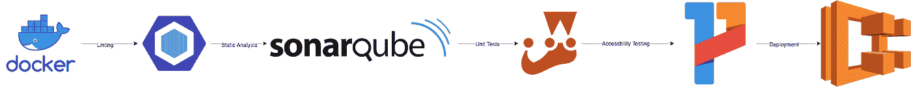
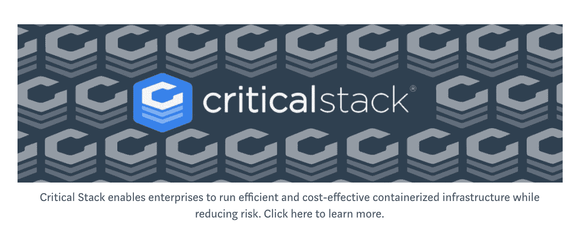

# 使用多阶段构建来简化和标准化构建过程

> 原文：<https://medium.com/capital-one-tech/multi-stage-builds-and-dockerfile-b5866d9e2f84?source=collection_archive---------1----------------------->


# 介绍

Capital One DevOps 工程师面临的挑战之一是为他们的开发人员提供一致的构建、运行和部署环境。在我的例子中，我的开发人员支持大约 65 个不同的网站，这意味着维护管道和构建过程很快变得复杂。为了满足合规性，保持代码质量，并防止问题，我们在构建中加入了各种工具和测试；依靠 CICD 平台来管理这些测试和工具过于依赖外部依赖，如 Jenkins 插件升级、CICD 平台上的二进制升级以及底层软件的新版本。

想象一个应用程序的普通管道。它可能看起来像这样:



每个阶段——构建、lint、测试(单元、集成、可访问性和回归)、静态代码分析、动态代码分析以及最终的部署——都需要访问不同的工具、系统和二进制文件。每次开发人员运行一个构建或推送到 GitHub 时，他们可能会发现管道中的新问题，并不得不迭代解决它们。这将我们希望开发人员拥有的信息推到了开发过程的右边，这是次优的。可以对该过程进行两种改进:

1.  **将信息左移—** 无论是安全性、合规性、可访问性、代码覆盖率还是林挺，我们都希望开发人员能够在流程的早期获得结果。
2.  **标准化命令—** 这样，无论特定的阶段在哪里运行，都会返回相同的结果。

多阶段 Dockerfile 构建以一种优雅的方式解决了这两个问题。利用多阶段 Dockerfiles 意味着开发人员可以运行与 CICD 服务器完全相同的命令，并且因为它运行在一个容器中，所以每次都应该返回相同的结果。

# 什么是多阶段构建？

多阶段构建是一种组织 Docker 文件的方法，可以最小化最终容器的大小，提高运行时性能，更好地组织 Docker 命令和文件，并提供运行构建操作的标准化方法。多阶段构建是通过创建 done 文件的不同部分来完成的，每个部分引用一个不同的基本映像。这允许多阶段构建通过使用多个 docker 文件、在容器之间复制文件或运行不同的管道来实现先前填充的功能。

更多关于多级船坞建造规格的具体阅读请见[这里](https://docs.docker.com/develop/develop-images/multistage-build/)。Docker 文档很好地介绍了多阶段构建。然而，介绍并不是真实世界的例子。所以让我们深入一个。

# 编写多阶段 Dockerfile 文件

现在，我们已经了解了什么是多阶段构建，以及它要解决的问题，让我们尝试为我们的示例管道编写一个 docker 文件——涵盖构建、lint、测试、静态代码分析、动态代码分析，最后是部署。

# 建筑物

对于这个示例，我们将通过管道放置一个节点应用程序，并且我们将使用一个多级 docker 文件来完成这项工作。为此，我们将使用一个运行 NPM 安装的基本 docker 文件。现在，我们要做的就是添加一个标题。

```
```
# Copies in our code and runs NPM Install
FROM node:latest as builder
WORKDIR /usr/src/app
COPY package* ./
COPY src/ src/
RUN [“npm”, “install”]```
```

# 林挺

也许我们需要运行一个 linter 来对抗一组规则，比如 AirBnB 的 ES6 规则组。为此，我们将复制前一阶段——构建器——以确保我们不会以修改或额外的代码结束。我们只希望查看来自初始副本的代码。在我使用的 eslinter 的图形中，虽然有各种 javascript linters 可用，但另一种选择是 jslint。

```
```# Lints Code
FROM node:latest as linting
WORKDIR /usr/src/app
COPY — from=builder /usr/src/app/src .
RUN [“npm”, “lint”]```
```

# 静态分析

像许多公司的许多应用程序一样，您可能会使用一些静态代码分析。这里我使用 SonarQube 作为例子，因为它是开源的，易于使用，易于设置。然而，您也可以为您的公司或应用程序使用的任何静态分析工具编写 Dockerfile 扫描器；在[维基百科](https://en.wikipedia.org/wiki/List_of_tools_for_static_code_analysis)上列出了 Sonarqube 的各种替代品。

```
```# Gets Sonarqube Scanner from Dockerhub and runs it
FROM newtmitch/sonar-scanner:latest as sonarqube
COPY — from=builder /usr/src/app/src /root/src```
```

# 单元测试

希望您正在编写单元测试，对吗？并且确保您已经用测试覆盖了您的业务逻辑代码，这些测试显示是否发生了错误，数据是否被验证，等等。？这是一个简单的、一般化的例子，但是它确保了通过从先前的测试阶段复制来只测试预期的代码。这有助于保证可重复的结果。在图形/代码中，我使用 jest 来表示单元测试，尽管还有一长串的测试框架。例子包括:JSUnit、Mocha 和 Jasmine。

```
```# Runs Unit Tests
FROM node:latest as unit-tests
WORKDIR /usr/src/app
COPY --from=builder /usr/src/app/ .
RUN [“npm”, “test”]
```
```

# 可访问性测试

类似于单元测试，我们运行任何需要的可访问性测试。希望你这样做是为了让色盲的人可以使用你的应用程序/网站。关于可访问性测试的更多信息，请参见这篇[文章](https://marcysutton.github.io/a11y-automated-testing/#/)。在图形和代码中，我使用 Pa11y 来表示单元测试，尽管有开源和闭源的替代方案，如 Paypal 的 AATT。

```
```# Runs Accessibility Tests
FROM node:latest as access-tests
WORKDIR /usr/src/app
COPY --from=builder /usr/src/app/ .
RUN [“npm”, “access-tests”]
```
```

# 启动应用程序

最后是实际应用阶段。在此阶段，我们从目标复制构建文件和任何 package.json/package-lock.json 文件，然后运行 npm start。然而，如果您使用其他语言/方法运行应用程序，这显然会有所不同。

```
```# Starts and Serves Web Page
FROM node:latest as serve
WORKDIR /usr/src/app
COPY --from=builder /usr/src/app/dest ./
COPY --from=builder /usr/src/app/package* ./
RUN [“npm”, “start”]```
```

既然我们已经编写了每个单独的阶段，那么完整的 docker 文件将类似于这样:

```
# Copies in our code and runs NPM Install
FROM node:latest as builder
WORKDIR /usr/src/app
COPY package* ./
COPY src/ src/
RUN [“npm”, “install”]# Lints Code
FROM node:latest as linting
WORKDIR /usr/src/app
COPY --from=builder /usr/src/app/ .
RUN [“npm”, “lint”]# Gets Sonarqube Scanner from Dockerhub and runs it
FROM newmitch/sonar-scanner:latest as sonarqube
COPY --from=builder /usr/src/app/src /root/src# Runs Unit Tests
FROM node:latest as unit-tests
WORKDIR /usr/src/app
COPY --from=builder /usr/src/app/ .
RUN [“npm”, “test”]# Runs Accessibility Tests
FROM node:latest as access-tests
WORKDIR /usr/src/app
COPY --from=builder /usr/src/app/ .
RUN [“npm”, “access-tests”]# Starts and Serves Web Page
FROM node:latest as serve
WORKDIR /usr/src/app
COPY --from=builder /usr/src/app/dest ./
COPY --from=builder /usr/src/app/package* ./
RUN [“npm”, “start”]
```

您会注意到，在每个部分中，在基本图像之后，有一个如下列出的名称:`as`这允许通过 do:`docker build --target builder -t example-node:latest`来运行各个部分。如果你想运行你的单元测试，你可以通过`docker build --target unit-tests -t example-node:latest`来运行它们。当需要为运行/部署构建应用程序时，您可以像构建任何其他容器一样使用`docker build -t example-node:latest`来构建它。这将在一个小的、可部署的映像中生成最终的应用程序容器。

这使得开发人员可以很快在本地看到与等待 CICD 服务器返回相同的结果。这也允许开发人员确定当 CICD 服务器调用或构建特定部分时将运行什么命令。

# 为什么不使用多阶段构建

使用多阶段构建有很多很好的理由。可以创建一个阶段，根据不同的环境进行不同的构建，或者将不同的数据加载到基于特定客户端的应用程序中，这种可能性是无限的。但是多阶段构建并不总是有意义的。

虽然多阶段构建提供了跨构建和运行环境的一致性，但在组织构建和运行阶段、增加 docker 文件的物理大小和逻辑组织以及管理阶段之间复制的文件方面存在挑战。如果您试图使 docker 文件尽可能简单，多阶段构建可能也不适合您，因为您的开发人员不像他们的传统工具那样习惯于它。它还需要围绕应用程序中常见的钩子进行讨论，例如，`build`命令将总是产生一个构建好的工件。这些不一定是使用多阶段构建所独有的，但是在你编写阶段时要记住。这些问题通常会作为代码在 Jenkinsfile 或其他管道中解决。虽然您移动了阶段和信息，但也增加了管理中间 Docker 容器、映像和依赖项的复杂性。

# 为什么使用多阶段构建

多阶段构建允许您将需要单独 docker 文件的构建、测试和运行时环境分开。它们允许您最小化您部署的最终 Docker 容器的实际大小，因为各种层不再存储在最终容器中。这可以将你的容器减少一半，甚至三分之二，这取决于你的阶段和用例。它还允许您确保部署的容器中没有额外的二进制文件，从而减少您的攻击媒介。它可以很容易地突出您构建过程中的低效之处，并允许统一优化，因为只需更新 Dockerfile/base 映像。这可以让您标准化您的命令，防止不必要的混乱，并移动在编写代码过程中留下的信息。

多阶段构建的另一个好处是能够并行运行各个步骤/阶段。随着您的测试框架和存储库的增长，集成也在增长，并且需求改变了同时运行所有阶段的能力，并且减少了使用任何 CICD 工具或本地的构建时间。消除开发人员获取信息的时间障碍是 DevOps 的基础部分，它的目标是将信息向左移动，多阶段构建是如何在独立的阶段并行运行以获得开发人员所需的东西的一个很好的代表。

多阶段构建简化了我的团队的许多 CICD 管道，并为我们的开发人员提供了一种在生产部署过程中与各种预期关口进行交互的简单方法。这极大地提高了我们应用程序的一致性，并为我们的开发人员和审计人员提供了一个统一的获取结果的方法。

[](https://criticalstack.com/)

## 相关:

*   [安全 Docker 容器需要安全应用](/capital-one-tech/secure-docker-containers-require-secure-applications-75eb358abef9)
*   [冰箱里的鲸鱼——码头工人简介](/capital-one-tech/the-whale-in-the-refrigerator-80f659fea1a4)
*   [杂货店里的鲸鱼 Docker 文件和 Docker 图像介绍](/capital-one-tech/whale-in-the-grocery-store-an-introduction-to-docker-and-docker-images-311319688692)

这些是作者的观点。除非本帖中另有说明，否则 Capital One 不隶属于所提及的任何公司，也不被其认可。使用或展示的所有商标和其他知识产权都是其各自所有者的所有权。本文为 2019 首都一。