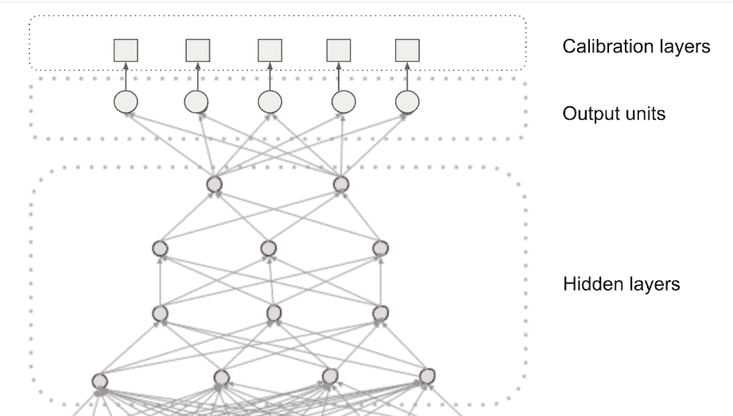

# 基于效用的家庭饲料分级的多任务学习和校准

> 原文：<https://medium.com/pinterest-engineering/multi-task-learning-and-calibration-for-utility-based-home-feed-ranking-64087a7bcbad?source=collection_archive---------0----------------------->

埃克雷姆·科卡古纳利|软件工程师，Homefeed 排名，德鲁维尔·德文·巴达尼|软件工程师，Homefeed 排名，Sangmin Shin|工程经理，Homefeed 排名

Home feed 是 Pinterest 最重要的界面之一，每月有超过 4 亿人访问该网站。从商业角度来看，home feed 也是一个收入来源，大多数广告都是向 Pinners 展示的。因此，我们在 home feed 中呈现个性化、引人入胜和鼓舞人心的推荐的方式至关重要。

在这篇文章中，我们将介绍如何从单输出节点深度神经网络(DNN)转换到基于多任务学习(MTL)的 DNN。我们还将介绍如何校准每个输出节点的概率预测，以组合成一个效用值，以及这种新架构的优势。

# 背景和动机

我们曾经使用逻辑损失 DNN 模型(图 1)的单输出对每个用户 pin 对进行评分，并使用这些分数对 pin 进行排名。这是对模型进行排序的一个常见场景:像点击这样的动作被确定为要优化的对象；排名器基于历史参与度数据学习点击概率，然后用于排名。

*Figure 1\. The ranking model with a single output node.*

然而，在 Pinterest，参与是多目标的:有长点击、特写和重复。单输出 DNN 通过使用行动权重增加成本函数中的逻辑损失，将这些目标合并到排名得分中。y(i) ∈ {0，1}是实际标签，y(i) ∈ [0，1]是等式 1 中的 *m* 个实例中的 *i(th)* 个实例的预测得分。这种模型的输出不是一个概率，而是一个排名分数，可以捕捉到哪个大头针会更有吸引力(点击、长时间点击、特写和 repin 的组合)。我们称这个综合排名分数为*可定位性*分数。

Pinnability score 在排列用户-pin 对方面是有效的，但是它有一些缺点:不同行为的商业价值被烘焙到训练数据和加权损失中。因此，可定位性分数只是一个用于排名的浮点数，但它不是一个概率，也不能从一个模型到另一个模型进行比较。这使得模型的调试和可解释性相当具有挑战性。

因此，我们转而采用一种更灵活、更易理解的排名方法，这种方法基于 Pin 对 Pinner 的效用。在高层次上，Pin 的效用是不同动作的概率值的组合，如等式 3 所示。在我们的排名中使用的实际效用函数比等式 3 更复杂，其细节超出了本文的范围。

为了获得特定于动作的概率值 *P(action)* ，我们采用了 MTL，其中每个输出节点预测一个特定于动作的概率。然而，一旦我们决定了动作权重 *W* ( *动作*)，我们需要不同模型之间的概率值是稳定且准确的。为此，我们使用了校准模型。

通过 MTL 和校准进行的基于效用的排名使我们能够做得更好:

*   **快速改变 home feed 特性:**如等式 3 所示，我们对每个动作进行不同的加权。在任何时候，我们都可以根据业务需求决定改变表面特征(例如，推广更多视频或推广更多可重复/可点击的内容)。这些类型的转变以前需要一个训练数据扩充、模型参数更新和跨越数周的多个 A/B 实验的周期。现在，我们可以简单地调整治疗组的效用权重，并在几个小时内观察效果。
*   **能够比较不同的引脚类型 *:*** 过去很难比较不同的引脚类型，如有机引脚和视频引脚。例如，我们主要通过视频引脚上的观看时间来衡量参与度。当前的设置使我们能够为不同的引脚类型提供不同的实用功能。
*   **改进的模型可解释性:**由于我们可以监控每种行动类型的校准，我们可以更好地解释变化，例如，如果我们看到候选发电机的分布增加，我们可以检查其校准并确定增加是否合理。

# 多任务学习模式

MTL 使我们能够共享多个输出节点的表示[1]。每个输出节点(头部)针对特定的动作类型进行优化，例如 repin 或 click。

每个头预测一个二元标签:动作发生或没有发生。每个头部的预测值被设计成一个概率得分。我们当前的 MTL 模型和其他校准模型如图 2 所示。

*Figure 2\. MTL-based ranking model with multiple output nodes for separate action types and corresponding calibration models.*

我们还需要重新定义成本函数。与之前的可定位性模型不同，在之前的模型中，我们只有一个二进制标签，在这个模型中，标签是 n 个动作的向量(在第一个版本中，n=4)。因此，每轮预测的损失在所有 4 次行动中求和，如等式 4 所示，其中 yij ∈ ℝ4and ℒ是等式 1 中给出的逻辑损失。由于 MTL 在不同目标之间提供参数共享，切换到 MTL 单独，没有基于效用的排名，提供了参与度指标的改善。

图 2 中的 DNN 只是我们用于排名的更大的 AutoML 模型的最后一部分(称为全连接层)。较大的模型由 4 个组件组成，其中我们从原始特征中学习特征表示。虽然我们不会在这篇博文中深入讨论前 3 个组件，但可以说它们负责学习表示和特性之间的交叉，而不需要工程师担心特性工程。

# 通过校准模型校准输出节点预测

我们是否预测过度/预测不足的关系通过校准给出，校准是一种用于提高学习者概率估计的后处理技术。有许多技术可以使用，如普拉特缩放、保序回归[6]或下采样校正[3]。对于二元分类，校准测量观察到的行为(例如，经验点击率)和预测的行为(例如，预测的 CTR)之间的关系，如等式 5 中给出的。我们需要在每个 DNN 输出节点上建立一个校准模型，以确保预测的概率与经验的比率保持一致。

最初，我们试图简单地将正下采样速率𝛼和负下采样速率𝛽合并到等式 6 中，其中 *p* 是 DNN 的概率估计，而 *q* 是调整后的概率。

这种方法效果不佳，因为我们的训练数据生成管道不仅对正面和负面数据进行降采样，还围绕地理、用户状态和正面/负面分布进行分层采样(这有助于我们更好地排名，但使校准更加困难)。

我们意识到，校准必须充当迁移学习层，将排名优化概率映射到经验比率。对于这项工作，我们选择了逻辑回归(LR)模型，这可以被视为一个高度改变的普拉特缩放技术。与等式 7 和 8 中仅使用概率得分( *p* )权重和偏差项( *b* )来学习校准概率( *p** )不同，我们使用了具有 80+个特征的 LR 模型。

# 培训数据生成和特征化

为了训练可以学习经验比率的校准模型，我们创建了一个新的训练数据生成管道，没有任何分层采样。

管道由两部分组成:

1.  来自应用服务器的原始数据日志，其中有 Pin IDs、上下文信息以及特征化所需的原始日志(如图 3 中紫色所示)
2.  标签信息是我们在引脚视图后获得的，并对已施加的引脚采取行动，这些信息存储在 feedview 日志中(在图 3 中以橙色显示)。

结合 1)和 2)为我们提供了标签和原始特征信息，以创建每个校准模型的训练数据。

除了标签之外，每个校准模型的数据都是相同的。repin 校准数据仅将 repin 标记为阳性标签，单击数据仅将单击标记为阳性，依此类推。

*Figure 3\. Calibration model training data generation pipeline.*

我们对 10%的用户日志进行统一采样，以减少训练数据量。我们收集了 7 天的日志作为训练数据，以消除任何星期几的影响，并使用第二天作为测试数据。测试数据的性能与模型的在线校准性能相匹配。

虽然我们主要依靠总校准误差(公式 5)和可靠性图表，但我们也使用以下性能指标:

*   原木损失
*   预期校准误差[4，5]

## 特征和模型训练

为了从基于分层采样数据训练的 DNN 中学习良好的概率映射，我们需要为模型提供大量捕捉不同方面的特征:

*   **偏差和位置特征:**二元和分类特征，例如应用类型、设备类型、性别、分桶位置和集群 id。群集 id 由内部算法生成，将引脚映射到群集池。
*   **用户和 pin 性能特征:**过去 3 小时、1 天、3 天、30 天、90 天等不同时间粒度的 Pin 和 Pinners 的性能(repin 率、点击率、特写率)。
*   **反馈回路特征:**平台上过去 30 分钟的实证行动率按总体、国家、性别-跨国汇总。这些特征是为了捕捉一天中的波动。

对于模型，我们选择了交叉熵损失训练的逻辑回归模型。基于预测的概率，CE-loss 导致更小或更大的损失值的事实有助于 LR 实现良好的校准。基于类别和预测的概率，CE 损失将更小或更大，其中它奖励正确的分类并以高确定性高度惩罚错误的分类(图 4)。

*Figure 4\. Cross-entropy loss and why LR calibrates well.*

最终模型类似于普拉特扩展，具有大量功能:

## 在校准训练数据上重放新的 DNN

到目前为止，我们还没有解决的一个问题是为新训练的 DNNnew 训练一个校准模型。它不提供服务的事实意味着所有校准训练数据都由生产 DNNprod 提供。这意味着不同的校准特征，因为 DNNnew 和 DNNprod 可能具有不同的预测分数。

我们通过三步模拟流程解决了这个问题(图 5):

1.  我们确保为相同的 10%用户保留 DNN 日志和校准日志。让我们称这些*为“公共日志”*(虽然用于训练的校准和 DNN 日志是不同的，但是它们是为相同的用户-pin 对创建的)。
2.  根据公共日志生成的 DNN 评估数据，从 DNNnew 获取预测。
3.  用步骤 2 中的预测替换校准训练日志中未校准的概率特征值。

*Figure 5\. Featurization step with simulation.*

# 监控和警报

我们实时监控和警告生产模型的校准概率。

我们还有一份每日报告来监控生产和实验模型的校准误差。如果在任何被监控的动作中，它们超过或低于某个阈值，我们会提醒 oncall 工程师。

校准误差和校准概率对特征的变化高度敏感。这些变化既可以发生在 DNN 特征中(这会影响未校准的概率值，而未校准的概率值又会影响校准的概率)，也可以发生在校准特征中。我们能够通过校准监控和警报在系统中捕获事件，以免它们严重影响顶线指标。

# 其他使用案例

除了基于效用的排名，MTL /校准框架还开启了多个用例。

## 视频分发

视频分发是我们 2019 年的主要目标之一，通过旧框架实现它很困难。在 MTL 框架中，我们首先为视频定义了一个积极的标签:视频被观看的时间是否超过 10 秒？然后，我们向 MTL 添加了一个新的输出节点来预测这个标签。然后，我们校准了这个节点，并将其添加到工具中，只包括视频特定的动作:重复、特写和 10 秒钟的视图。这使我们的视频分发量增加了 40%,同时提高了参与度。

## 隐藏建模

我们还能够使用 MTL 框架对消极参与进行建模，在效用函数上做了一点小小的改动。

类似于视频，我们先定义了一个消极投入的标签:Pin hides。然后，我们添加了一个 MTL 节点和隐藏校准模型。最后，我们在隐藏概率上增加了一个高的负权重(等式 11)。

# 学习和陷阱

尽管 MTL 是处理多重目标的强大工具，但它也有缺陷。例如，在我们使用的硬参数共享方法[1]中，隐藏层由多个目标共享。因此，每个新添加的目标都会影响其他目标。因此，重要的是任务是互补的:只是增加兽皮头增加兽皮。通过有效地将具有高隐藏预测的图钉推到列表的末尾，我们能够在效用函数中逆转这一点。

MTL 也不是银弹。建模任务仍然需要大量的训练数据来影响共享的隐藏层。例如，除了隐藏之外，我们还尝试对 Pin 报告进行建模，但是，这个报告数量可能很小。为报告添加输出节点没有效果，我们无法校准该操作。

# 结论

这项工作使我们在 Pinner 参与度、业务目标和开发速度方面取得了几项成功:

*   通过提高预测的准确性，我们能够向用户显示更多相关的 pin。
*   我们通过将模型预测从排序层中分离出来，提高了工程速度。我们现在可以通过修改效用项来迭代排名函数，同时进行模型迭代。
*   我们通过支持利益相关者根据业务需求快速调整排名来帮助业务。

## 感谢

这是一个大项目，涉及许多工程师和经理的贡献。我们尤其要感谢乌特库·伊尔马克、、、、梁、科斯明·内格罗塞里、亚龙·格雷夫、德里克·程志远、程涛、兰德尔·凯勒、穆昆德·纳拉辛汗和维贾伊·纳拉亚南。

## 参考

[1]鲁德，塞巴斯蒂安。“深度神经网络中多任务学习的概述。” *arXiv 预印本 arXiv:1706.05098* (2017)。

[2] Bella，Antonio，等，“机器学习模型的校准”*机器学习应用研究手册*(2009):128–146。

[3]何，，等，“预测 facebook 广告点击量的实践经验”第八届在线广告数据挖掘国际研讨会会议录。美国计算机学会，2014 年。

[4]郭，传，等.“论现代神经网络的校准”*第 34 届机器学习国际会议论文集——第 70 卷*。JMLR。org，2017。

5 nae ini、Mahdi Pakdaman、Gregory Cooper 和 Milos Hauskrecht。"使用贝叶斯宁滨获得校准好的概率."*第二十九届 AAAI 人工智能大会*。2015.

[6] McMahan，H. Brendan 等，“广告点击预测:来自战壕的观点”*第 19 届 ACM SIGKDD 知识发现和数据挖掘国际会议论文集*。2013.