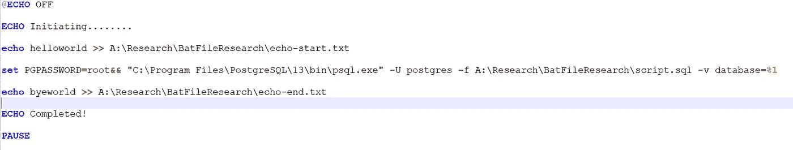

# 门迪克斯的多租户----第一部分

> 原文：<https://medium.com/mendix/multi-tenancy-in-mendix-platform-part-i-463b8b892364?source=collection_archive---------2----------------------->

# 大家好。我希望每个人在这个艰难的时刻都过得很好。在这篇博客中，我将谈论一个重要的话题——云计算和 SaaS(软件即服务)，也称为多租户。

> 多租户不仅仅是一个 SaaS 实现:许多**企业希望根据他们的业务部门和垂直领域隔离他们的数据。**

首先，对于那些不熟悉多租户的人，我想花点时间解释一下什么是多租户。

术语“多租户”指的是 ***一种软件架构，其中一个软件实例运行在一台服务器上，为多个租户*服务**。为了更清楚起见，我建议每个人阅读下面的维基百科条目[多租户——维基百科](https://en.wikipedia.org/wiki/Multitenancy)

一般来说，在任何平台上实现多租户有两种选择。

1.  **所有租户的共享数据库**。
2.  **为每个租户提供单独的数据库或模式**。

我们将讨论选项 2 - **为每个租户提供单独的数据库或模式**。

> 术语“模式”指的是数据的组织，它是如何构建数据库的蓝图

## 操作数据库

我们将使用 [PostgreSQL](https://www.postgresql.org/) 作为后端，以便进行数据库操作。

必须有一个管理员动态创建租户的界面。通过这个界面，管理员可以命名租户，并在运行时启动数据库创建。

我们将通过四个步骤实现这一点，一个微流将调用 Java 操作，Java 操作又调用批处理文件，批处理文件又调用 sql 脚本文件。

*   第一步-门迪克斯
*   步骤 2 - Java 操作
*   步骤 3 -批处理文件(Windows)
*   步骤 4 - SQL 脚本文件。

[https://bit.ly/MXW21](https://bit.ly/MXW21)

我们需要一个市场模块的帮助来支持这个实现，[数据库连接器](https://marketplace.mendix.com/link/component/2888)。这将有助于从所有外部数据源中检索数据。

创建一个微流并调用一个 java 动作

假设 NewSchema 对象将被创建并作为输入参数传递给这个微流，随后是 java 动作中的一段 java 代码，指定文件路径和批处理文件名。

executeAction()方法下的这段代码调用批处理文件，批处理文件脚本应该如下所示。

sql 脚本文件将包含如下脚本。

SQL Script

因此，通过这些机制，您将能够为每个租户创建单独的数据库或模式。

在下一部分中，我们将看到用户如何从创建的数据库或模式中提交和检索数据。

在那之前。保持安全，保持快乐，保持愚蠢。

## 阅读更多

 [## Mendix World 2021 |召集您的应用开发团队 2021 年 9 月 7 日至 9 日

### 好像你需要说服…在一个全球制造商社区，他们想通过探索什么来相互学习…

bit.ly](https://bit.ly/MXW21)  [## 曲目|门迪克斯世界 2021

### 在今年 Mendix World 开幕之前，手工制作您的议程。浏览专为您量身定制的 8 个专题讲座中的 85 个以上专题讲座…

www.mendix.com](https://www.mendix.com/mendix-world/tracks/) 

*   [https://docs . mendix . com/app store/connectors/database-connector](https://docs.mendix.com/appstore/connectors/database-connector)
*   [https://medium . com/mendix/4-reasons-switch-to-a-multi-tenant-architecture-with-mendix-447 AE 10107 b 7](/mendix/4-reasons-to-switch-to-a-multi-tenant-architecture-with-mendix-447ae10107b7)
*   [https://www . lucid chart . com/pages/database-diagram/database-schema](https://www.lucidchart.com/pages/database-diagram/database-schema)
*   [https://docs . mendix . com/how to/security/best-practices-security](https://docs.mendix.com/howto/security/best-practices-security)

*来自发布者-*

*如果你喜欢这篇文章，你可以在我们的* [*媒体页面*](https://medium.com/mendix) *或我们自己的* [*社区博客网站*](https://developers.mendix.com/community-blog/) *找到更多类似的内容。*

*希望入门的创客，可以注册一个* [*免费账号*](https://signup.mendix.com/link/signup/?source=direct) *，通过我们的* [*学苑*](https://academy.mendix.com/link/home) *获得即时学习权限。*

有兴趣加入我们的社区吗？你可以加入我们的 [*Slack 社区频道*](https://join.slack.com/t/mendixcommunity/shared_invite/zt-hwhwkcxu-~59ywyjqHlUHXmrw5heqpQ) *或者想更多参与的人，看看加入我们的*[*Meet ups*](https://developers.mendix.com/meetups/#meetupsNearYou)*。*