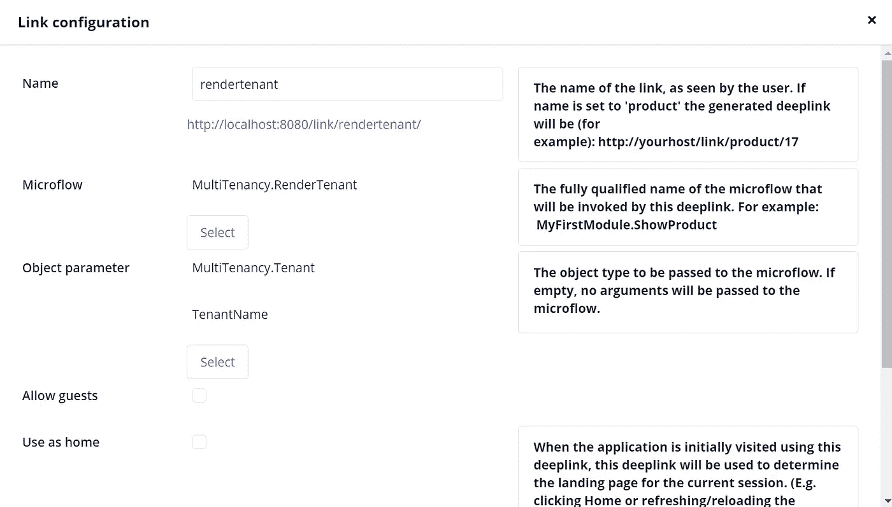

# Mendix 平台中的多租户-第二部分

> 原文：<https://medium.com/mendix/multi-tenancy-in-mendix-platform-part-ii-a118ea643052?source=collection_archive---------1----------------------->

# 朋友们好，很高兴回来讨论我最喜欢的话题——Mendix。

# 作为第一部分 Mendix 的多租户的延续。这篇博客将纯粹关注基于租户的页面链接、基于租户的数据存储和检索的附加实现。

虽然实现多租户有多种方法，但我选择了由 Mendix 自己创建的 Deep link 模块。我发现在 Mendix 平台中实现多租户非常简单。

通常，深度链接模块会将请求处理程序添加到我们的应用程序中，这将触发微流。

> 我建议浏览并遵循官方文档，以了解更多关于[深度链接模块](https://docs.mendix.com/appstore/modules/deep-link)的信息。

在深度链接模块被配置和设置之后。我们被要求调用微流 *DeepLink。创建 DeeplinkConfig* 通过以您希望的任何方式传递所需的参数，可以是设计时的微流(可以在启动后的微流中调用)，也可以是运行时的微流(通过市场模块中包含的 Deeplink 概览页面中的浏览器)。

CreateDeeplinkConfig Microflow — parameters

这里要记住的重要一点是，参数 N ***ame*** 应该以小写形式保存值，并且它应该与我们在下面要求作为参数传递的微流名称完全相似。所以这个微流将创建实际的*深层链接*，如下所示"[*http://localhost:8008/link/render tenant/*](http://localhost:8008/link/rendertenant/)*"*

正如我们从 image1 中看到的那样，ObjectAsParameter 的最后一个参数应该设置为 true，以便以对象形式传递租户名称，例如[*http://localhost:8008/link/render tenant/tenant _ one*](http://localhost:8008/link/rendertenant/tenant-one)或[*http://localhost:8008/link/render tenant/tenant*](http://localhost:8008/link/rendertenant/tenant-one)_*two*

Tenant — Entity

上面的 tenant_one & tenant_two 是租户实体的 TenantName 属性值。当用户在网络浏览器中点击上面提到的任何 url 链接时，定制微流*多租户就出现了。RenderTenant* 将被触发。这完全是在深度链接模块的帮助下完成的，我们甚至还没有开始这个版本的多租户方面的工作！

[https://bit.ly/MXW21](https://bit.ly/MXW21)

我有一个用例来实现和展示我在 mendix 中构建的多租户机制，这将作为一个企业管理门户，管理员可以根据需要创建租户，还可以创建与各个租户相关联的记录，他们也可以将一些数据存储到租户数据库中。

因此，创建的应用程序将与其自己的数据库一起用作接口，用于轻型数据库事务，以便保存租户的基本信息用于客户端验证。例如，我们可能需要限制管理员，以避免冗余，在数据库已经存在的情况下，租户名称将被创建。

Creation of new tenant — microflow

创建数据库模式后，管理员可以生成深层链接，并在特定业务部门的用户之间共享。

Deep link configuration for RenderTenant

但是，用户将使用管理员共享的 url 登录到门户网站，进行一些数据库操作。

Domain model

这里，TargetDB 用于保存主数据库连接细节，如主机、端口、数据库、用户名和密码。

NewSchema 类似于一个 [POJO](https://en.wikipedia.org/wiki/Plain_old_Java_object) 对象，只需要在启动租户创建之前从接口捕获租户名称。

租户是多租户实现真正需要的主要实体。

> 这三个实体都是持久的。

除了*持久化实体*，我们还有一些非持久化实体，它们将有助于通过检索外部数据(基于租户的数据)并最终将这些数据对象呈现到接口中来保存数据。

*非持久性实体*——权力机构、机构和地址可以是您用例中的任何东西。

但是，当从 Mendix 应用程序向外部数据源提交数据时，需要租户实体和非持久实体之间的关系。

Tenant-1 details page

Tenant-2 details page

你可以看到上面类似[*http://localhost:8008/p/【GUID】*](http://localhost:8008/p/[GUID])的页面的 URL，这是从[*http://localhost:8008/link/render tenant/【tenant name】重新路由过来的东西。*](http://localhost:8008/link/rendertenant/tenant_one.)

通过*创建权限*和*创建机构*选项，用户可以将其数据发布到基于租户的外部数据源。在这个用例中，我使用 PostgreSQL 和 PgAdmin 作为客户端 GUI。

Create Authority — microflow

最重要的事情是编写和组织 SQL 查询。我们都知道 Mendix 一般不允许我们编写 SQL 查询，它会处理所有的事情。

有一点**很重要**要记住，出于**安全原因**你应该确保使用“**执行参数化查询**”和“**执行参数化语句**”。这是因为当使用 SQL 直接与数据库交互时，您正在将用户输入插入到 SQL 语句中，否则可能会将您的应用暴露给 [SQL 注入](https://en.wikipedia.org/wiki/SQL_injection)，并带来严重的安全风险。通过使用参数化操作，您可以通过用户提供的值来防范 SQL 注入攻击。你可以在文档[这里](https://docs.mendix.com/appstore/connectors/database-connector#3-getting-started)读到更多。

但是为了实现多租户的中间层数据隔离，我们应该遵循这种方法。大多数 Mendix 业务工程师应该对 SQL 有所了解，这样他们才能深入研究实现。但是要编写 DDL 查询，必须对 SQL 有深入的了解。

例如，这就是我们如何形成一个 SQL 查询。没有多少 SQL 知识的人可以使用 [pgadmin](https://www.pgadmin.org/) 来检查正确的 SQL 查询的正确语法。

Create Variable — SQL

PgAdmin — Backend client GUI

我们可以交叉检查不同租户数据库中的数据。

Tenant-1 Authority data

Tenant-2 Institution data

同样，如果需要，我们可以用各自的数据库交叉检查数据。现在，我们终于可以在基于租户的界面中看到一些数据。

Tenant-1 details page with data

Tenant-2 details page with data

接下来，你可以期待在 Mendix 市场上有一个关于这个实现的公共模块。以便 Mendix 社区的每个人都可以使用它。

在那之前，**注意安全！保持快乐！！保持愚蠢！！！**

## 阅读更多

 [## Mendix World 2021 |召集您的应用开发团队 2021 年 9 月 7 日至 9 日

### 好像你需要说服…在一个全球制造商社区，他们想通过探索什么来相互学习…

bit.ly](https://bit.ly/MXW21)  [## 曲目|门迪克斯世界 2021

### 在今年 Mendix World 开幕之前，手工制作您的议程。浏览专为您量身定制的 8 个专题讲座中的 85 个以上专题讲座…

www.mendix.com](https://www.mendix.com/mendix-world/tracks/)  [## Mx 模型反映-市场指南| Mendix 文档

### Mx 模型反射模块可用于显示您的域模型中配置的反射。该模块…

docs.mendix.com](https://docs.mendix.com/appstore/modules/model-reflection)  [## 深度链接-市场指南| Mendix 文档

### 使用深度链接向您的应用程序添加将触发微流的请求处理程序。典型的使用场景是…

docs.mendix.com](https://docs.mendix.com/appstore/modules/deep-link)  [## 数据库-市场指南| Mendix 文档

### 使用数据库连接器将外部数据直接合并到 Mendix 应用程序中。这个连接器…

docs.mendix.com](https://docs.mendix.com/appstore/connectors/database-connector)  [## 多租户-维基百科

### 术语“软件多租户”指的是一种软件架构，其中软件的单个实例运行在一个…

en.wikipedia.org](https://en.wikipedia.org/wiki/Multitenancy) 

*来自发布者-*

*如果你喜欢这篇文章，你可以在我们的* [*媒体页面*](https://medium.com/mendix) *或我们自己的* [*社区博客网站*](https://developers.mendix.com/community-blog/) *找到更多类似的文章。*

*希望入门的创客，可以注册一个* [*免费账号*](https://signup.mendix.com/link/signup/?source=direct) *，通过我们的* [*学苑*](https://academy.mendix.com/link/home) *即时获取学习。*

有兴趣更多地参与我们的社区吗？你可以加入我们的 [*Slack 社区频道*](https://join.slack.com/t/mendixcommunity/shared_invite/zt-hwhwkcxu-~59ywyjqHlUHXmrw5heqpQ) *或者想更多参与的人，看看加入我们的* [*遇见 ups*](https://developers.mendix.com/meetups/#meetupsNearYou) *。*