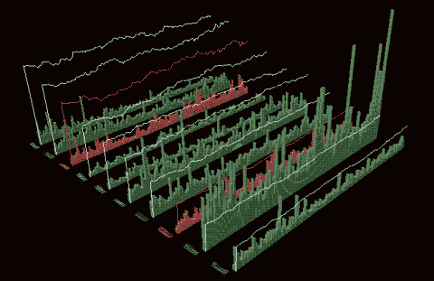

# Spark 中的多时间序列预测

> 原文：<https://medium.com/walmartglobaltech/multi-time-series-forecasting-in-spark-cc42be812393?source=collection_archive---------0----------------------->

Source: [time series](http://www3.sympatico.ca/blevis/thesis49observations.html)

Spark 是一个很好的并行机器学习算法的平台。像聚类，随机森林这样的算法已经有了 PySpark 库，主要在 mllibrary(以前称为 ml lib)下可用。

然而，当涉及到时间序列预测时，Spark 中可用的选项乍一看可能不是很明显。很多时候，我们可能想要运行多个时间序列模型…