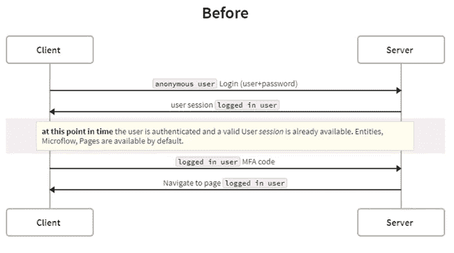
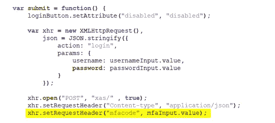

# Mendix 的多因素认证

> 原文：<https://medium.com/mendix/multifactor-authentication-for-mendix-31ffd721e0?source=collection_archive---------2----------------------->


# 什么是多重身份认证？

多因素认证或 **MFA** (也称为**双因素认证**或 **2FA** ，以及类似的术语)是一种电子认证方法，在该方法中，用户只有在向认证机制成功提交两个或多个证据(或因素)后，才被授予访问网站或应用程序的权限，例如:

*   **知识**:只有用户**知道的东西**。
*   **拥有**:只有使用者**拥有**的东西。
*   **固有**:用户**是**的东西。

MFA 保护用户免受试图访问其数据(如个人 ID 详细信息或金融资产)的未知人员的攻击。

*“第三方认证器(TPA)应用支持双因素认证，通常通过显示随机生成并不断刷新的代码来进行认证。”-* 维基百科

# 我们解决的问题是什么？

市场中可用的多因素实现在登录过程中向 Mendix 应用程序的最终用户提供从 SMS、电子邮件输入的代码，或者在实际登录(以及创建用户会话)之后由验证者(Google)生成的代码。请参见下图:



[https://swimlanes.io/d/zEPQlLV3T](https://swimlanes.io/d/zEPQlLV3T)

在成功登录时以及在输入 MFA 代码之前，用户已经具有有效的用户会话以及对用户的授权页面、微流等的访问。(但是您看不到它们，也不容易访问它们)。这种方法仅在动态角色分配时有效，并且在有效的 MFA 代码之后完成(在 Mendix 中默认情况下不这样做)。

# 解决方法是什么？

我们已经构建了一个扩展 Mendix LoginAction 的 MFA 模块，记录在[这里](https://apidocs.rnd.mendix.com/7/runtime/com/mendix/core/action/user/LoginAction.html)。

首先验证 MFA 代码，然后模块创建一个用户会话，授权用户访问他们的页面、微流等。


[https://swimlanes.io/u/4o7jaAOjY](https://swimlanes.io/u/4o7jaAOjY)

在第一步登录后的时间点:

```
mx.data.get({ xpath:”//System.User”, callback:function(data){console.log(data);} })
```

它仍然返回匿名用户对象，如下所示:


# 我们如何证明这个模块是安全的？

涵盖的场景:

o 禁用 MFA 的帐户默认通过 login.html 登录。

o 为禁用 MFA 的帐户通过小组件进行默认登录。

o web service 和 REST 帐户的默认登录。

o 通过启用 MFA 的自定义 login.html 登录(仅 login-with-mfa.html+登录-mfa.js +验证器应用程序代码。通过 SMS 或电子邮件发送的不兼容代码)。

o 默认登录小部件，但扩展了输入 MFA 代码并启用 MFA 的能力。

# 这个模块在你的 Mendix 应用中的易用性如何？

从 Mendix Marketplace [**这里**](https://marketplace.mendix.com/link/component/116892) 或者从 [Github](https://github.com/appronto/multifactor-authentication/releases/) 下载该模块。

**有几样东西要配置:**

启动后配置:
1。启动后在您的中添加 *ASU_MFA* 微流。

2.更改 SUB _ MFA _ UserDisabledCheck 以调用您的逻辑来确定登录用户是否需要进行多因素身份验证。向帐户实体添加新属性 HasMFAenabled(布尔值)和 LastLogin2FA(日期时间)。

3.在*SUB _ validatemafoforuser*中添加您的多因子认证方法:

提供 3 种样品:

**谷歌认证器连接器**

o 模块下载:[https://marketplace.mendix.com/link/component/2948](https://marketplace.mendix.com/link/component/2948)

https://play.google.com/store/apps/details?:谷歌 Play 商店 id = com . Google . Android . apps . authenticator 2&HL = en

o 苹果应用商店:[https://apps . Apple . com/us/App/Google-authenticator/id 388497605](https://apps.apple.com/us/app/google-authenticator/id388497605)

**短信**

o 更改*SUB _ InformMFACodeForUser*发送短信

o 发送短信息，例如 Twilio:

o 在这里尝试 Twilio:[http://appron.to/try-twilio](http://appron.to/try-twilio)并在[https://www.twilio.com/console/project/settings](https://www.twilio.com/console/project/settings)上创建一个 API 键

**用代码验证的电子邮件验证**

o 更改*SUB _ InformMFACodeForUser*以发送电子邮件

o 使用默认的 Emailtemplate 模块或 Sendgrid API 为您的用户撰写此电子邮件。

4.将代码片段 *SN_MFA_LoginPage* 添加到您的登录页面

5.如果适用，将 login-with-mfa.html 和 js/login-mfa.js 从资源目录移动到您的主题目录，以支持从这些页面使用 mfa 的登录操作。

6.将常量 **EnabledMFA** 设置为 true 即可开始！

**以后从 Appstore 升级模块时请记住:**

> 这将破坏登录机制，但您会得到通知，因为默认情况下，如果没有用您自己的 MFA 逻辑(正确地)配置模块，将会引发异常。像这样“处理请求时发生错误:java.lang.Exception:创建代码尚未实现”。

# 我们学到了什么

我们更喜欢使用非持久的方法来跟踪匿名用户的登录步骤(首先是登录，其次是 MFA 代码)。我们发现，当第一次尝试被成功验证时，在传递 MFA 代码的第二步中，与先前匿名会话的上下文/关系被删除。因此，我们无法将此与第一步联系起来。当我们使用一个持久的 MFA 实体(并在第一次登录后提交 MFA 对象)时，它是有效的。

**高级:java 挑战:**

当扩展 Login Action 类并试图在我们的扩展类中设置这个类的参数时，我们发现这不可能与 **super.execute()** 方法结合使用。我们决定使用**创作期**。我们已经在第一步中验证了用户名和密码，匿名用户不能修改/创建 MFA 对象(并且还要检查两次)。

我们还希望该模块通过 login.html 变体和定制的 login-with-mfa.html 兼容。因此，有必要将 MFA 代码与您的用户名和密码一起发送。我们需要通过头部传递这个 MFA 代码，因为有效负载被核心的 LoginAction 功能剥离了。

使用-mfa.html 登录:


登录-mfa.js:



多因子 AuthLoginAction.java:


# 请报告问题

您是否在本模块中发现了问题或漏洞？请联系 [pim@appronto.nl](mailto:pim@appronto.nl) 。我会奖励你一个精美的礼包，并在市场上发布新版本。

*来自发布者-*

*如果你喜欢这篇文章，你可以在我们的* [*媒体页面*](https://medium.com/mendix) *或者我们自己的* [*社区博客网站*](https://developers.mendix.com/community-blog/) *找到更多喜欢的。*

*希望入门的创客，可以注册一个* [*免费账号*](https://signup.mendix.com/link/signup/?source=direct) *，通过我们的* [*学苑*](https://academy.mendix.com/link/home) *获得即时学习权限。*

有兴趣更多地参与我们的社区吗？你可以加入我们的 [*闲散社区频道*](https://join.slack.com/t/mendixcommunity/shared_invite/zt-hwhwkcxu-~59ywyjqHlUHXmrw5heqpQ) *或者想更多参与的人，看看加入我们的* [*遇见 ups*](https://developers.mendix.com/meetups/#meetupsNearYou) *。*