# 在 19 . 1 . 3 Oracle Content and Experience(OCE)中，多语言站点支持变得很容易。

> 原文：<https://medium.com/oracledevs/multilingual-sites-support-is-easy-in-19-1-3-oracle-content-and-experience-oce-b8f26fd250c6?source=collection_archive---------0----------------------->

多语言网站(MLS)是一个可以使用多种语言的网站。尽管网站的页面结构和内容是相同的，但是所请求的语言可能是不同的。在 19.1.3 中，Oracle Content and Experience (OCE)支持轻松地将一种语言翻译成其他语言。

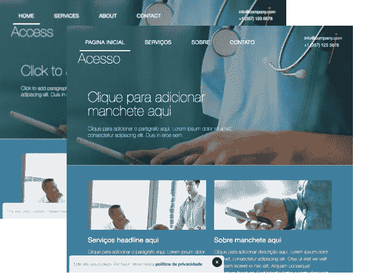

构建企业网站时，必须选择默认语言。这种默认语言在两个方面很重要:

1.  使用默认网站 URL 对网站的访问使用默认语言呈现。

*   https:// <*服务器*>/站点/ < *我的站点* >

要访问网站使用的其他翻译语言，您可以使用带有<language-locale>的 URL 格式:</language-locale>

*   https:// <*服务器*>/站点/ < *我的站点* > / < *语言环境* >

例如，访问葡萄牙语(巴西)(pt-BR)将使用:

*   https:// <*服务器*>/站点/ < *我的站点* > /pt-BR

如果您试图访问网站未翻译的语言，将使用默认语言。

2.网站的更新以默认语言完成，网站被翻译成其他语言。

企业网站必须有一种或多种必需的语言。它可能有可选语言。这种信息由本地化策略表示。本地化策略是一种业务规则，它决定了网站在发布之前必须翻译成哪种语言。只有当网站被翻译成本地化政策中要求的所有语言后，才可以发布。

对于这个博客，我们将从一个现成的模板生成的站点开始。我们将使用默认/必需语言英语(美国)和可选语言葡萄牙语(巴西)。然后我们将创建一个翻译作业，以拉出翻译所需的字符串。我们将从英语(美国)翻译成葡萄牙语(巴西)。最后，我们将把翻译导入回 OCE，并展示如何测试它。为了简化这篇博客，我们将不讨论资产，这将在另一篇博客中讨论。

在创建企业站点之前，我们必须创建本地化策略和存储库。本地化政策决定了网站可用的语言。让我们创建一个本地化策略，该策略包含必需语言英语(美国)(en-US)和可选语言葡萄牙语(巴西)(pt-BR)。

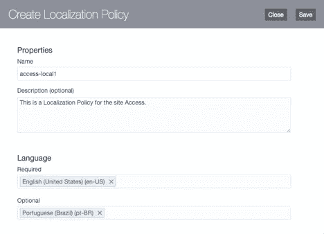

接下来，我们将创建一个存储库。存储库用于包含站点中使用的任何资产，并且是创建站点所必需的。我们将在一个单独的博客中介绍如何向多语言站点添加资产。

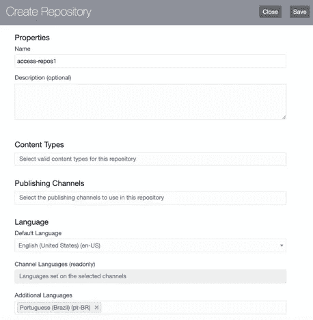

现在我们必须创建网站。使用的模板将是现成的模板访问。

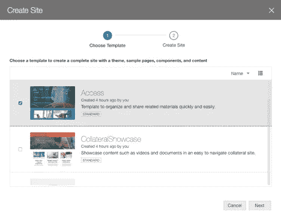

该存储库将是前面创建的 *access-repos1，*。本地化策略将是之前创建的 *access-local1，*。默认语言将是英语(美国)。由于该网站的默认语言是英语(美国)(en-US)，因此在 URL 中没有区域设置的情况下访问该网站将显示为英语。例如，以下两个 URL 将以英文显示网站:

*   https:// <*服务器*>/站点/访问
*   https:// <*服务器*>/站点/访问/en-US

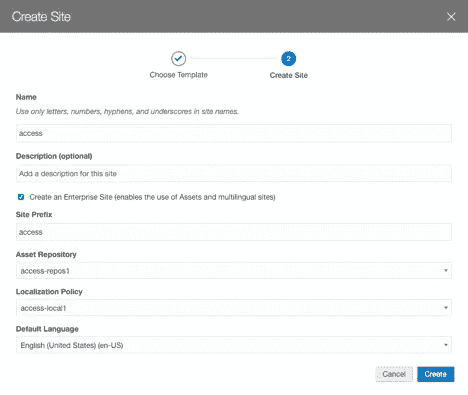

这将创建网站。我们不打算修改网站，但目前将只使用模板中的页面，以保持简单。但应该注意的是，当对网站进行更新时，它们将只使用默认语言。

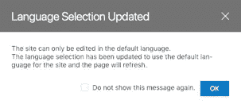

现在我们要翻译这个网站。要开始翻译站点，请选择它，然后在“更多”菜单上选择“翻译”以调用“创建翻译作业”对话框。

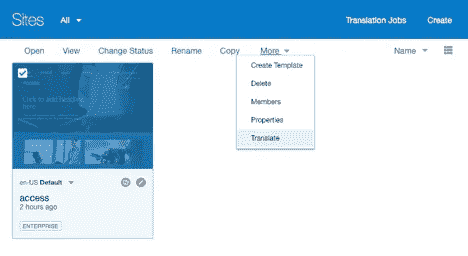

在“创建翻译作业”对话框中，输入一个名称(即 *access-translate1* )，英语(美国)(en-US)将用作源语言，因为这是站点的默认语言。选择葡萄牙语(巴西)(pt-BR)作为目标语言。

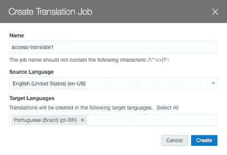

创建翻译作业后，您可以单击“翻译作业”来查看网站翻译作业列表。

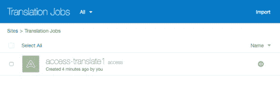

单击特定的翻译作业将显示作业的详细信息，如源语言和目标语言以及状态。

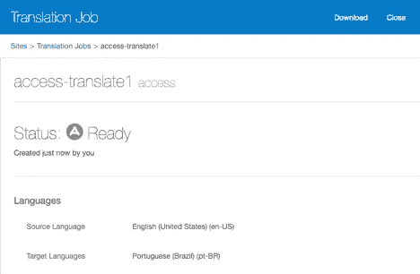

单击**下载**链接下载翻译包的 zip 文件。翻译包如下所示:

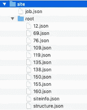

在翻译包中，您可以看到一个包含 *job.json* 和*根*文件夹的站点文件夹。 *job.json* 文件包含翻译作业名称、页面列表、目标/源语言等等。*根*文件夹包含 *siteinfo.json* 、 *structure.json* 和 pages 的 json。siteinfo.json 包含可翻译的字符串，比如页眉、页脚、描述和关键字。 *structure.json* 包含可翻译的字符串，比如页面名称。页面的 json 包含添加到页面的组件的可翻译字符串列表。根文件夹下的所有内容都应该被复制并翻译成每种目标语言。

在这个练习中，我们将把*根*文件夹下的所有内容都翻译到另一个文件夹，葡萄牙语巴西的 *pt-BR* 。文件夹 *root* 和 *pt-BR* 会在同一个文件夹下，叫做 *sites* 。对于本练习，您可以下载已经翻译好的 [**pt-BR.zip**](https://drive.google.com/open?id=1zZTvAQa7zqw9IkeiWQj6A0hAgvD9GA2X) 并将其解压缩到与*根*文件夹处于同一级别的*站点*文件夹下。这将提供葡萄牙语巴西(pt-BR)的翻译。这是 [**pt-BR.zip**](https://drive.google.com/open?id=1zZTvAQa7zqw9IkeiWQj6A0hAgvD9GA2X) 在*站点*文件夹下解压后的翻译包的样子。

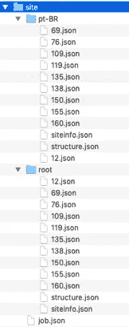

例如，包含页面名称的*site/pt-BR/structure . JSON*将被翻译为葡萄牙语巴西(pt-BR):

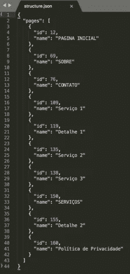

翻译完成后，必须压缩整个*站点*文件夹，以便将其导入回 OCE。要创建 zip 文件，例如在 Mac 上，单击*站点*文件夹并选择**压缩“站点”**。在 Windows 上，右击*站点*文件夹，勾选**发送到>压缩文件夹**。zip 文件中的顶层文件夹必须是*站点*文件夹。您可以随意命名这个 zip 文件。它不必被称为 site.zip。然后这个 zip 文件可以从翻译作业页面上的**导入**链接导入。

zip 文件将使用上传链接上传到 OCE。

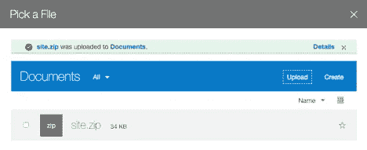

zip 文件上传后，以下对话框将显示导入操作前的摘要。

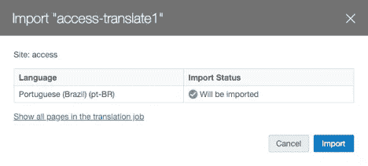

翻译导入完成后，您可以通过在站点的下拉菜单中选择语言并查看站点来测试翻译后的站点。

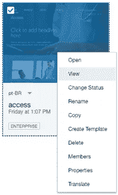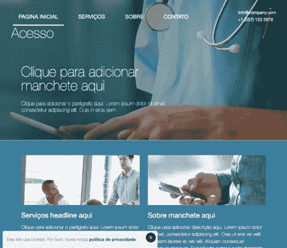

这是 19 . 1 . 3 Oracle Content and Experience(OCE)中多语言站点支持的一个简单示例。该功能使网站的翻译变得容易。

最后，语言服务提供商在翻译过程中发挥着重要作用。它们使翻译人员可以轻松地找到翻译状态，跟踪翻译工件和版本依赖，并提供其他翻译帮助。为了更好地利用多语言站点支持，Oracle 建议您在翻译过程中使用语言服务提供商。