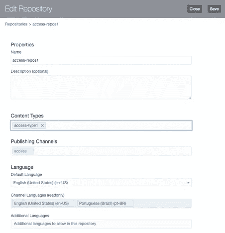
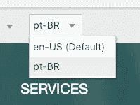
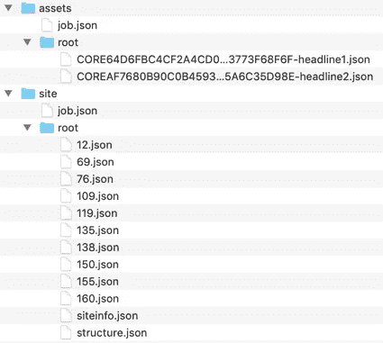
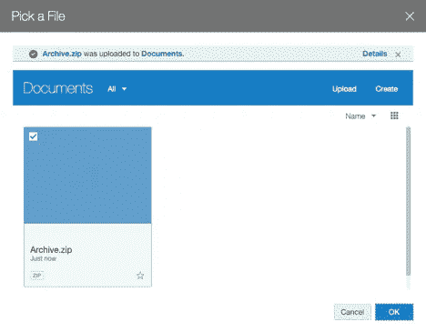
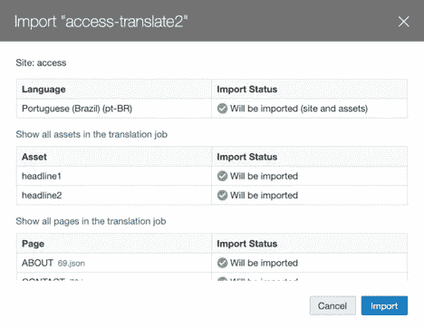

# 19.1.5 Oracle 内容和体验(OCE)中对站点+资产的多语言支持:第二部分

> 原文：<https://medium.com/oracledevs/multilingual-support-of-site-assets-in-19-1-5-oracle-content-and-experience-oce-part-ii-80cca9f16aef?source=collection_archive---------0----------------------->

在之前的一篇博客中，我们谈到了多语言网站支持。现在我们将讨论 19.1.5 Oracle 内容和体验(OCE)中对站点+资产的多语言支持。

站点和资产都使用相同的概念和用户界面来支持多语言。唯一的区别是被翻译的对象；分别使用站点工件(siteinfo.json、structure.json 和 pages json)和内容项。在 19 . 1 . 5 Oracle Content and Experience(OCE)中，您可以同时翻译站点和资产！

在[早先关于多语言站点支持的博客](/oracledevs/multilingual-sites-support-is-easy-in-19-1-3-oracle-content-and-experience-oce-b8f26fd250c6)中，我们从开箱即用的模板 access 创建了一个企业站点，名为 *access* 。该网站从英语(美国)翻译成葡萄牙语(巴西)。站点的页眉、页脚、描述和关键字在 siteinfo.json 中翻译，页面名称在 structure.json 中翻译，然后组件的字符串在页面的 json 中翻译。翻译被压缩并导入回 OCE。

对于这个博客，我们将继续在早期博客中创建的网站。目标是创建一个使用资产的网站，并使用 OCE 19.1.5 多语言支持进行翻译。我们将首先创建一个内容类型，并将其注册到存储库中。根据内容类型，我们将创建两个内容项目。然后我们将修改一个页面并插入一个内容列表来获取内容项。然后，我们将翻译网站和内容项目。最后，我们将测试翻译。

让我们从创建资产的内容类型开始。我们将创建一个名为 *access-type1* 的内容类型，并定义一个文本字段。

为这个名为 *headlin* e 的字段提供一个显示名称。其余的属性是默认属性。保存并关闭内容类型编辑器。

现在编辑已经创建的存储库， *access-repos1，*并指定新创建的内容类型， *access-type1* 。在存储库编辑器中保存。

如果您是从零开始练习，而不是使用在[早期博客](/oracledevs/multilingual-sites-support-is-easy-in-19-1-3-oracle-content-and-experience-oce-b8f26fd250c6)中创建的内容，请创建一个名为 *access-local1* 的本地化策略，其中包含必需的语言英语(美国)(en-US)和可选语言葡萄牙语(巴西)(pt-BR)。然后创建一个名为 *access-repos1* 的存储库，并指定新创建的内容类型。基于现成的模板 access 创建一个名为 *access、*的企业站点，使用 *access-repos1* 作为存储库，使用 *access-local1* 作为本地化策略。

创建内容类型后，我们就可以创建内容项了。在 Assets 下，选择 *access-repos1* 作为存储库。作为过滤器，选择*访问*频道，选择*英语(美国)(en-US)* 语言。

单击创建>创建新的内容项目。选择 *access-type1* ，输入 *headline1* 作为名称， *access* 作为目标频道。

在 *headline1* 的内容项编辑器中，键入“服务部门获得最佳网站支持”在标题字段中。保存并关闭内容项目编辑器。

创建另一个内容项目，内容类型为*访问类型 1* ，名称为*标题 2* ，目标频道为*访问*。

在 *headline2* 的内容项编辑器中，键入“支持范围包括 24/7 故障监控和加速响应”在标题字段中。保存并关闭内容项目编辑器。

内容项目已创建。让我们修改 *access* 站点的主页，并添加一个内容列表来获取内容项。首先，我们删除左边的段落组件。取而代之的是，放入一个内容列表组件。

打开内容列表设置，选择*访问类型 1* 作为内容类型。

关闭内容列表设置并保存网站更新。内容项目将被拉入。

如果您尝试编辑器中的语言选择器并切换到 pt-BR，内容列表不会呈现任何内容，因为内容项目没有翻译为葡萄牙语(巴西)。但是，如果您关注了之前的博客，那么它周围的标题和按钮组件已经被翻译了。

既然站点在功能上已经准备就绪。让我们开始翻译吧。基本的想法是在站点级别创建一个翻译工作，翻译站点和资产。选择*访问*站点，然后使用更多>翻译创建翻译作业。

在创建翻译作业对话框中，输入 *access-translate2* 作为名称，输入*葡萄牙语(巴西)(pt-BR)* 作为目标语言。对于翻译工作内容字段，如果只翻译网站(无资产)，您可以选择【仅 网站内容选项。因为我们有网站和要翻译的资产，所以选择*完成网站*选项。然后点击*创建*创建翻译作业。

创建翻译作业后，单击翻译作业查看作业列表。

从作业列表中，单击*访问-转换 2* 作业查看详细信息。

在翻译工作屏幕上，您将看到目标语言(站点)和目标语言(资产)状态。单击下载下载翻译包的 zip 文件。解压缩下载的 zip 文件，您将看到以下内容:

在 zip 文件中，将有两个顶层文件夹，*站点*和*资产*。*站点*文件夹有一个*根*文件夹，其中包含每种语言要复制和翻译的所有站点工件。例如，structure.json 文件包含所有要翻译的页面名称。*资产*文件夹有另一个*根*文件夹，其中包含了每种语言需要复制和翻译的所有资产工件。例如，有两个 json 文件代表站点使用的两个内容项。

我们将复制*根*文件夹及其内容，并为葡萄牙语将文件夹重命名为 *pt-BR* 。这就是我们最终得到的结果:

要翻译站点工件，您可以使用已经翻译好的 [pt-BR.zip](https://drive.google.com/open?id=1zZTvAQa7zqw9IkeiWQj6A0hAgvD9GA2X) 文件。可以下载 [pt-BR.zip](https://drive.google.com/open?id=1zZTvAQa7zqw9IkeiWQj6A0hAgvD9GA2X) ，解压到与站点*根*文件夹同级的*站点*文件夹下。

要翻译两个资产工件中的第一个，请打开 assets/pt-BR/CORE *-headline**1**。json 文件，进行以下更新，并保存文件。

变化

{"headline ":"服务部门获得了最佳网络支持网站奖。"}

到

{"headline ":"网络支持网站服务部门"}

要翻译两个资产工件中的第二个，请打开 assets/pt-BR/CORE *-headline**2**。json 文件，进行以下更新，并保存文件。

变化

{"headline ":"支持范围包括全天候故障监控和加速响应。"}

到

{"headline ":"一个支持合作伙伴，包括对 falhas 的 24/7 全天候监控和响应。"}

工件翻译完成后，将两个顶级文件夹*资产*和*站点*压缩成一个 zip 文件。zip 文件应该包含以下文件夹层次结构。zip 文件的名称可以是任意的。

生成翻译包 zip 文件后，将其导入 OCE。在翻译作业屏幕上，单击导入。

在“选择文件”对话框中，上传生成的 zip 文件(例如，Archive.zip)。单击“确定”选择 zip 文件。

将出现导入确认对话框。有关更多信息，您可以展开“资产”和“页面”部分。单击导入。

导入完成后，返回到站点构建器并编辑站点更新。使用语言选择器选择 *en-US* 并确认内容列表显示内容项目为英语。

使用语言选择器选择 *pt-BR* 并验证内容列表显示内容项目的葡萄牙语。

如果网站或资产不属于翻译包，会发生什么情况？例如，您可能已经在之前的博客中翻译了该站点，对于本练习，您只想翻译资产。在 OCE 中，我们允许导入站点或资产翻译。当导入确认出现时，您将收到一条关于缺少翻译的警告。您将能够部分导入(站点或资产)。但是，您将不能只导入某些页面或某些内容项目，而是必须导入所有页面或所有内容项目。

这是对 19 . 1 . 5 Oracle Content and Experience(OCE)中 Site +资产的多语言支持的快速浏览。

最后，语言服务提供商在翻译过程中发挥着重要作用。它们使翻译人员可以轻松地找到翻译状态，跟踪翻译工件和版本依赖，并提供其他翻译帮助。为了更好地利用多语言站点支持，Oracle 建议您在翻译过程中使用语言服务提供商。