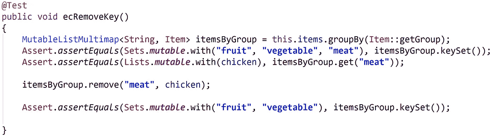
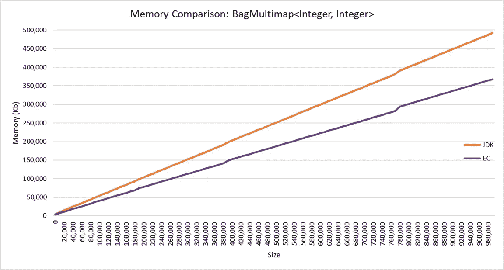

# 多地图——工作原理

> 原文：<https://medium.com/oracledevs/multimap-how-it-works-a3430f549d35?source=collection_archive---------0----------------------->

[https://www.eclipse.org/collections/](https://www.eclipse.org/collections/)

在我之前的博客中，我解释了 Eclipse 集合 [UnifiedMap](/oracledevs/unifiedmap-how-it-works-48af0b80cb37) 和 [UnifiedSet](/oracledevs/unifiedset-the-memory-saver-25b830745959) 是如何工作的。在这篇博客中，我们将看看[多值映射](https://github.com/eclipse/eclipse-collections/blob/master/eclipse-collections-api/src/main/java/org/eclipse/collections/api/multimap/Multimap.java)或 [Eclipse 集合](https://github.com/eclipse/eclipse-collections)中的多值映射。

根据 Map 的 [Javadoc，Map 是将键映射到值的对象。映射不能包含重复的键；每个键最多只能映射到一个值。但是，我们会遇到必须将多个值映射到一个键的情况。在需要将多个值映射到一个键的场景中，我们最终会创建一个只有一个键但却是值集合的映射。维护值集合的语义是很重要的，即。：](https://docs.oracle.com/javase/9/docs/api/java/util/Map.html)

1.  值列表将表现为一个列表:允许重复，保持顺序。
2.  值集将表现为一个集合:散列数据结构，包含唯一元素。
3.  值包将表现为一个[包](/oracledevs/unifiedset-the-memory-saver-25b830745959):散列数据结构，允许重复。

Eclipse Collections 为所有 3 种类型的值集合提供了多重映射:[list multimmap](https://www.eclipse.org/collections/javadoc/9.2.0/org/eclipse/collections/api/multimap/list/ListMultimap.html)、[set multimmap](https://www.eclipse.org/collections/javadoc/9.2.0/org/eclipse/collections/api/multimap/set/SetMultimap.html)(已排序，未排序)和 [BagMultimap](https://www.eclipse.org/collections/javadoc/9.2.0/org/eclipse/collections/api/multimap/bag/BagMultimap.html) (已排序，未排序)。[可变](https://www.eclipse.org/collections/javadoc/9.2.0/org/eclipse/collections/api/multimap/MutableMultimap.html)、[不可变](https://www.eclipse.org/collections/javadoc/9.2.0/org/eclipse/collections/api/multimap/ImmutableMultimap.html)、[同步](https://www.eclipse.org/collections/javadoc/9.2.0/org/eclipse/collections/impl/multimap/AbstractSynchronizedMultimap.html)以及所有这些多重映射的多读者变体在 Eclipse 集合中都是可用的。

让我们考虑如下的项目对象和项目数据集。项目数据集由三种水果、两种蔬菜和一种肉类组成。

Item.java

Item data set for tests.

让我们看看如何对项目列表进行分组:

1.  在 JDK 中，我们可以使用带有`Collectors.groupingBy()`的 streams API 来获得一个`Map<String, List<Item>>`。
2.  Eclipse Collections 提供了返回 Eclipse Collections `Multimap`的`groupBy()` API。因为我们在`MutableList`调用`groupBy()`，所以我们将得到`ListMultimap<String, Item>`。

JDK Map<String, List<Item>>

Eclipse Collections ListMultimap<String, Item>

我们需要使用接受目标值集合的重载方法来获得所需类型的多映射，因为 JDK 和 Eclipse 集合都有协变覆盖。协变覆盖契约确保 groupBy()操作:

1.  返回一个 ListMultimap
2.  返回一个 SetMultimap
3.  返回 BagMultimap。

让我们一起来看看:

JDK vs Eclipse Collections Multimap construction from top to bottom: ListMultimap, SetMultimap, BagMultimap.

**Eclipse 集合多映射架构:**

多地图由 UnifiedMap 备份，unified Map 是 Eclipse 集合中包含的内存效率更高的[地图](/oracledevs/unifiedmap-how-it-works-48af0b80cb37)。无冲突多地图的整体架构如下图所示，处理冲突的策略与 UnifiedMap 相同。

Eclipse Collections Multimap Architecture Schematic Diagram

**在 Eclipse Collections 可变 Multimap 中添加和删除元素:**

eclipse Collections mutulemultimemap 有一些变异操作，比如`put()`、`putAll()`、`remove()`、`removeAll()`。这些变异方法有几个有趣的方面，让我们逐一看看:

1.  `put()`、`putAll()`:当调用 Multimap 中不存在的密钥时，这些方法很有趣。Eclipse Collections 实现通过创建一个新的 Collection，然后添加密钥和值来处理这些情况。在下面的示例中，没有 key=beverage 的元素。当我们添加 key-value = beverage-milk 时，Eclipse Collections 内部将创建一个空的 List，然后添加到可变 Multimap。将值进一步添加到 key=beverage 时，新值将添加到列表中。在 JDK 实现 Map < K，List<V>的情况下，我们必须处理空列表的创建。

MutableMultimap.put() operation in Eclipse Collections.

2.`remove()`、`removeAll()`:当剔除结果为空集合时，这些方法都很有意思。Eclipse Collections 实现确保不存在没有非空集合的密钥。在为特定密钥移除最后一个值的情况下，该密钥也将被移除。这可确保 Multimap 仅包含那些具有非空值集合的密钥。

MutableMultimap.remove() operation in Eclipse Collections.

Eclipse Collections[Multimap](https://www.eclipse.org/collections/javadoc/9.2.0/org/eclipse/collections/api/multimap/Multimap.html)有一个丰富而直观的 API，专门用于帮助处理与 multi map 相关的迭代模式，例如`keyBag()`、`keySet()`、`forEachKey()`、`forEachValue()`、`forEachKeyValue()`、`forEachKeyMultiValues()`、`selectKeysValues()`、`rejectKeysValues()`、`selectKeysMultiValues()`、`rejectKeysMultiValues()`、`collectKeysValues()`、`collectValues()`等等。

**内存占用(数字越小越好)**

下面是 JDK 1.8 HashMap 和 Eclipse Collections Multimap 之间的一些内存占用比较。这显示了总的内存占用，包括数据结构的组成部分。

Memory Comparison: EC ListMultimap<Integer, Integer> and JDK HashMap<Integer, List<Integer>>

Memory Comparison: EC ListMultimap<String, String> and JDK HashMap<String, List<String>>

Memory Comparison: EC SetMultimap<Integer, Integer> and JDK HashMap<Integer, Set<Integer>>

Memory Comparison: EC SetMultimap<String, String> and JDK HashMap<String, Set<String>>

Memory Comparison: EC BagMultimap<Integer, Integer> and JDK HashMap<Integer, Map<Integer, Long>>

Memory Comparison: EC BagMultimap<String, String> and JDK HashMap<String, Map<String, Long>>

**总结:**

1.  Eclipse Collections 提供了以 List、Set 和 Bag 作为后台集合的多映射实现。
2.  Eclipse Collections 提供了一个直观的 API 来创建多地图。
3.  Eclipse Collections Multimap 有一个特定于 Multimap 的 API，它为您处理后台集合的初始化和回收。
4.  Eclipse Collections Multimap API 使用起来很直观，并且该 API 与 Maps 提供的 API 相似。
5.  与等效的 JDK 多映射实现相比，Eclipse 集合多映射始终具有较小的内存占用。Eclipse Collections SetMultimap 内存占用大约是 JDK SetMultimap 内存占用的 55%。

*表示支持* [*星美上 GitHub*](https://github.com/eclipse/eclipse-collections/stargazers) *。*

**Eclipse 集合资源:**
[Eclipse 集合](https://github.com/eclipse/eclipse-collections)自带[列表](https://www.eclipse.org/collections/javadoc/9.0.0/org/eclipse/collections/impl/list/mutable/FastList.html)、[集合](https://www.eclipse.org/collections/javadoc/9.0.0/org/eclipse/collections/impl/set/mutable/UnifiedSet.html)和[映射](https://www.eclipse.org/collections/javadoc/9.0.0/org/eclipse/collections/impl/map/mutable/UnifiedMap.html)的实现。它还拥有额外的数据结构，如[多重映射](https://www.eclipse.org/collections/javadoc/9.0.0/org/eclipse/collections/api/multimap/Multimap.html)、[包](https://www.eclipse.org/collections/javadoc/9.0.0/org/eclipse/collections/api/bag/Bag.html)和一个完整的原始集合层次结构。我们的每一个集合都有一个丰富的 API 用于通常需要的迭代模式。

1.  [网站](https://www.eclipse.org/collections/)
2.  [GitHub 上的源代码](https://github.com/eclipse/eclipse-collections)
3.  [投稿指南](https://github.com/eclipse/eclipse-collections/blob/master/CONTRIBUTING.md)
4.  [参考指南](https://github.com/eclipse/eclipse-collections/blob/master/docs/guide.md#eclipse-collections-reference-guide)