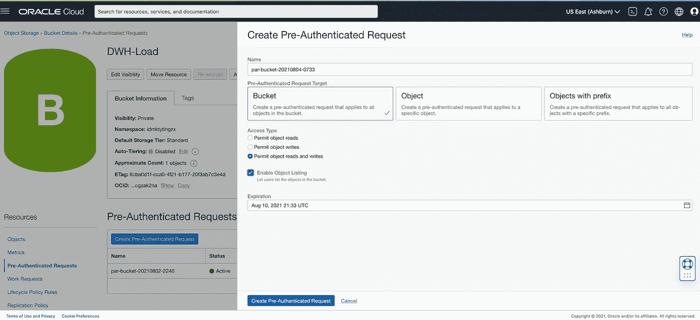

# 使用 cURL 将大文件多部分上传到 Oracle 云基础架构对象存储

> 原文：<https://medium.com/oracledevs/multipart-upload-a-large-file-to-oracle-cloud-infrastructure-object-storage-using-curl-8aa8d0021ff1?source=collection_archive---------0----------------------->


当您有大型文件要从本地或另一个云传输到 OCI 时，最好的方法是使用多部分上传。多部分上传有助于容纳对于单次上传操作来说太大的对象。OCI 现在支持直接从 cURL 进行多部分上传，而不是使用 SDK 或 oci-cli。通过预认证 URL (PAR ),您可以避免配置 API 密钥并与外部方共享。解析 URL 可以提供一种快速安全方式将文件上传到 OCI 对象存储。

在 OCI 上，上传对象的最大大小是 10 TiB，对象部分不能大于 50 GiB。强烈建议使用多部分上载来上载大于 100 MiB 的对象。您可以将文件分割成块，并从 curl 发起多部分上传。您负责创建要上传的零件。对象存储只是为剩下的步骤提供 API 操作。一旦上传了所有的部分，就需要一个最后的 POST 调用来组装文件。现在让我们看看这些步骤是什么:

## 1.在 Bucket 上创建解析 URL



PAR URL

*生成的 PAR URL:*

```
[https://objectstorage.us-ashburn-1.oraclecloud.com/p/OxZ47fcsRhQRxNqhPJzCpqvw23zqZQGV1L9nnLY-g3FzNgO223qo9mR77K2U1gpE/n/idmldytingzx/b/DWH-Load/o/](https://objectstorage.us-ashburn-1.oraclecloud.com/p/OxZ47fcsRhQRxNqhPJzCpqvw23zqZQGV1L9nnLY-g3FzNgO223qo9mR77K2U1gpE/n/idmldytingzx/b/DWH-Load/o/)
```

## 2.将大文件分成几部分

您可以使用任何操作系统实用程序将文件分成几部分。我们将在 Linux 上使用 *split* 把大文件**large _ random _ data . CSV**分成 250MB 的块

决定每个零件要使用的零件号。零件号的范围从 1 到 10，000。您不需要指定连续的编号，但是对象存储通过按升序排列零件号来构造对象。

```
split -b 250M -d large_random_data.csvls -ltrh x*-rw-rw-r — . 1 opc opc 250M Aug 2 22:56 x00
-rw-rw-r — . 1 opc opc 250M Aug 2 22:56 x01
-rw-rw-r — . 1 opc opc 250M Aug 2 22:56 x02
-rw-rw-r — . 1 opc opc 250M Aug 2 22:56 x03
-rw-rw-r — . 1 opc opc 250M Aug 2 22:56 x04
-rw-rw-r — . 1 opc opc 250M Aug 2 22:56 x05
-rw-rw-r — . 1 opc opc 250M Aug 2 22:56 x06
-rw-rw-r — . 1 opc opc 250M Aug 2 22:56 x07
-rw-rw-r — . 1 opc opc 50M Aug 2 22:56 x08
```

## 3.使用解析 URL 为 OCI 对象存储上的文件创建多部分上传

```
curl -X PUT -H “opc-multipart:true” [https://objectstorage.us-ashburn-1.oraclecloud.com/p/OxZ47fcsRhQRxNqhPJzCpqvw23zqZQGV1L9nnLY-g3FzNgO223qo9mR77K2U1gpE/n/idmldytingzx/b/DWH-Load/o/large_random_data.csv](https://objectstorage.us-ashburn-1.oraclecloud.com/p/OxZ47fcsRhQRxNqhPJzCpqvw23zqZQGV1L9nnLY-g3FzNgO223qo9mR77K2U1gpE/n/idmldytingzx/b/DWH-Load/o/large_random_data.csv)
```

**输出**

```
{
 “namespace”: “idmldytingzx”,
 “bucket”: “DWH-Load”,
 “object”: “large_random_data.csv”,
 “uploadId”: “7f878479–00e1–4630–23b6–683deac88a78”,
 “timeCreated”: “2021–08–03T21:10:59.273Z”,
 “storageTier”: “Standard”,
 “accessUri”: “/p/OxZ47fcsRhQRxNqhPJzCpqvw23zqZQGV1L9nnLY-g3FzNgO223qo9mR77K2U1gpE/n/idmldytingzx/b/DWH-Load/u/large_random_data.csv/id/7f878479–00e1–4630–23b6–683deac88a78/”
}
```

使用目标区域的访问 URI 和对象存储主机名来上传部件，并在 URI 的末尾指定部件号。例如，要上传包含 9 个部分的对象，请发出以下 PUT 命令

```
curl -X PUT — data-binary ‘[@x00](http://twitter.com/x00)’ [https://objectstorage.us-ashburn-1.oraclecloud.com/p/OxZ47fcsRhQRxNqhPJzCpqvw23zqZQGV1L9nnLY-g3FzNgO223qo9mR77K2U1gpE/n/idmldytingzx/b/DWH-Load/u/large_random_data.csv/id/7f878479-00e1-4630-23b6-683deac88a78/1](https://objectstorage.us-ashburn-1.oraclecloud.com/p/OxZ47fcsRhQRxNqhPJzCpqvw23zqZQGV1L9nnLY-g3FzNgO223qo9mR77K2U1gpE/n/idmldytingzx/b/DWH-Load/u/large_random_data.csv/id/7f878479-00e1-4630-23b6-683deac88a78/1)curl -X PUT — data-binary ‘[@x01](http://twitter.com/x01)’ [https://objectstorage.us-ashburn-1.oraclecloud.com/p/OxZ47fcsRhQRxNqhPJzCpqvw23zqZQGV1L9nnLY-g3FzNgO223qo9mR77K2U1gpE/n/idmldytingzx/b/DWH-Load/u/large_random_data.csv/id/7f878479-00e1-4630-23b6-683deac88a78/2](https://objectstorage.us-ashburn-1.oraclecloud.com/p/OxZ47fcsRhQRxNqhPJzCpqvw23zqZQGV1L9nnLY-g3FzNgO223qo9mR77K2U1gpE/n/idmldytingzx/b/DWH-Load/u/large_random_data.csv/id/7f878479-00e1-4630-23b6-683deac88a78/2)curl -X PUT — data-binary ‘[@x02](http://twitter.com/x02)’ [https://objectstorage.us-ashburn-1.oraclecloud.com/p/OxZ47fcsRhQRxNqhPJzCpqvw23zqZQGV1L9nnLY-g3FzNgO223qo9mR77K2U1gpE/n/idmldytingzx/b/DWH-Load/u/large_random_data.csv/id/7f878479-00e1-4630-23b6-683deac88a78/3](https://objectstorage.us-ashburn-1.oraclecloud.com/p/OxZ47fcsRhQRxNqhPJzCpqvw23zqZQGV1L9nnLY-g3FzNgO223qo9mR77K2U1gpE/n/idmldytingzx/b/DWH-Load/u/large_random_data.csv/id/7f878479-00e1-4630-23b6-683deac88a78/3)curl -X PUT — data-binary ‘[@x03](http://twitter.com/x03)’ [https://objectstorage.us-ashburn-1.oraclecloud.com/p/OxZ47fcsRhQRxNqhPJzCpqvw23zqZQGV1L9nnLY-g3FzNgO223qo9mR77K2U1gpE/n/idmldytingzx/b/DWH-Load/u/large_random_data.csv/id/7f878479-00e1-4630-23b6-683deac88a78/4](https://objectstorage.us-ashburn-1.oraclecloud.com/p/OxZ47fcsRhQRxNqhPJzCpqvw23zqZQGV1L9nnLY-g3FzNgO223qo9mR77K2U1gpE/n/idmldytingzx/b/DWH-Load/u/large_random_data.csv/id/7f878479-00e1-4630-23b6-683deac88a78/4)curl -X PUT — data-binary ‘[@x04](http://twitter.com/x04)’ [https://objectstorage.us-ashburn-1.oraclecloud.com/p/OxZ47fcsRhQRxNqhPJzCpqvw23zqZQGV1L9nnLY-g3FzNgO223qo9mR77K2U1gpE/n/idmldytingzx/b/DWH-Load/u/large_random_data.csv/id/7f878479-00e1-4630-23b6-683deac88a78/5](https://objectstorage.us-ashburn-1.oraclecloud.com/p/OxZ47fcsRhQRxNqhPJzCpqvw23zqZQGV1L9nnLY-g3FzNgO223qo9mR77K2U1gpE/n/idmldytingzx/b/DWH-Load/u/large_random_data.csv/id/7f878479-00e1-4630-23b6-683deac88a78/5)curl -X PUT — data-binary ‘[@x05](http://twitter.com/x05)’ [https://objectstorage.us-ashburn-1.oraclecloud.com/p/OxZ47fcsRhQRxNqhPJzCpqvw23zqZQGV1L9nnLY-g3FzNgO223qo9mR77K2U1gpE/n/idmldytingzx/b/DWH-Load/u/large_random_data.csv/id/7f878479-00e1-4630-23b6-683deac88a78/6](https://objectstorage.us-ashburn-1.oraclecloud.com/p/OxZ47fcsRhQRxNqhPJzCpqvw23zqZQGV1L9nnLY-g3FzNgO223qo9mR77K2U1gpE/n/idmldytingzx/b/DWH-Load/u/large_random_data.csv/id/7f878479-00e1-4630-23b6-683deac88a78/6)curl -X PUT — data-binary ‘[@x06](http://twitter.com/x06)’ [https://objectstorage.us-ashburn-1.oraclecloud.com/p/OxZ47fcsRhQRxNqhPJzCpqvw23zqZQGV1L9nnLY-g3FzNgO223qo9mR77K2U1gpE/n/idmldytingzx/b/DWH-Load/u/large_random_data.csv/id/7f878479-00e1-4630-23b6-683deac88a78/7](https://objectstorage.us-ashburn-1.oraclecloud.com/p/OxZ47fcsRhQRxNqhPJzCpqvw23zqZQGV1L9nnLY-g3FzNgO223qo9mR77K2U1gpE/n/idmldytingzx/b/DWH-Load/u/large_random_data.csv/id/7f878479-00e1-4630-23b6-683deac88a78/7)curl -X PUT — data-binary ‘[@x07](http://twitter.com/x07)’ [https://objectstorage.us-ashburn-1.oraclecloud.com/p/OxZ47fcsRhQRxNqhPJzCpqvw23zqZQGV1L9nnLY-g3FzNgO223qo9mR77K2U1gpE/n/idmldytingzx/b/DWH-Load/u/large_random_data.csv/id/7f878479-00e1-4630-23b6-683deac88a78/8](https://objectstorage.us-ashburn-1.oraclecloud.com/p/OxZ47fcsRhQRxNqhPJzCpqvw23zqZQGV1L9nnLY-g3FzNgO223qo9mR77K2U1gpE/n/idmldytingzx/b/DWH-Load/u/large_random_data.csv/id/7f878479-00e1-4630-23b6-683deac88a78/8)curl -X PUT — data-binary ‘[@x08](http://twitter.com/x08)’ [https://objectstorage.us-ashburn-1.oraclecloud.com/p/OxZ47fcsRhQRxNqhPJzCpqvw23zqZQGV1L9nnLY-g3FzNgO223qo9mR77K2U1gpE/n/idmldytingzx/b/DWH-Load/u/large_random_data.csv/id/7f878479-00e1-4630-23b6-683deac88a78/9](https://objectstorage.us-ashburn-1.oraclecloud.com/p/OxZ47fcsRhQRxNqhPJzCpqvw23zqZQGV1L9nnLY-g3FzNgO223qo9mR77K2U1gpE/n/idmldytingzx/b/DWH-Load/u/large_random_data.csv/id/7f878479-00e1-4630-23b6-683deac88a78/9)
```

## 4.要提交多部分上传，请使用带有访问 URI 的 POST 命令。例如:

```
curl -X POST [https://objectstorage.us-ashburn-1.oraclecloud.com/p/OxZ47fcsRhQRxNqhPJzCpqvw23zqZQGV1L9nnLY-g3FzNgO223qo9mR77K2U1gpE/n/idmldytingzx/b/DWH-Load/u/large_random_data.csv/id/7f878479-00e1-4630-23b6-683deac88a78/](https://objectstorage.us-ashburn-1.oraclecloud.com/p/OxZ47fcsRhQRxNqhPJzCpqvw23zqZQGV1L9nnLY-g3FzNgO223qo9mR77K2U1gpE/n/idmldytingzx/b/DWH-Load/u/large_random_data.csv/id/7f878479-00e1-4630-23b6-683deac88a78/)
```

您可以使用带有访问 URI 的 delete 命令删除未提交或失败的多部分上传的所有部分。例如:

```
curl -X DELETE [https://objectstorage.us-ashburn-1.oraclecloud.com/p/OxZ47fcsRhQRxNqhPJzCpqvw23zqZQGV1L9nnLY-g3FzNgO223qo9mR77K2U1gpE/n/idmldytingzx/b/DWH-Load/u/large_random_data.csv/id/7f878479-00e1-4630-23b6-683deac88a78/](https://objectstorage.us-ashburn-1.oraclecloud.com/p/OxZ47fcsRhQRxNqhPJzCpqvw23zqZQGV1L9nnLY-g3FzNgO223qo9mR77K2U1gpE/n/idmldytingzx/b/DWH-Load/u/large_random_data.csv/id/7f878479-00e1-4630-23b6-683deac88a78/)
```

## 5.获取对象列表

```
curl -X get <unique-par-url>curl -X GET [https://objectstorage.us-ashburn-1.oraclecloud.com/p/OxZ47fcsRhQRxNqhPJzCpqvw23zqZQGV1L9nnLY-g3FzNgO223qo9mR77K2U1gpE/n/idmldytingzx/b/DWH-Load/o/](https://objectstorage.us-ashburn-1.oraclecloud.com/p/OxZ47fcsRhQRxNqhPJzCpqvw23zqZQGV1L9nnLY-g3FzNgO223qo9mR77K2U1gpE/n/idmldytingzx/b/DWH-Load/o/)
```

确保上传完成后删除 par URL，或者出于安全目的创建一个有效期较短的 par URL。

## 参考文献:
_ _ _ _ _ _ _ _ _ _ _ _ _

[1][https://docs . Oracle . com/en-us/iaas/Content/Object/Tasks/using multipart uploads . htm](https://docs.oracle.com/en-us/iaas/Content/Object/Tasks/usingmultipartuploads.htm)
【2】[https://docs . Oracle . com/en-us/iaas/Content/Object/Tasks/usingpreauthenticatedrequests . htm](https://docs.oracle.com/en-us/iaas/Content/Object/Tasks/usingpreauthenticatedrequests.htm)