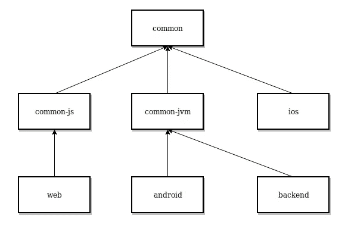

# 科特林的多平台本地开发

> 原文：<https://blog.kotlin-academy.com/multiplatform-native-development-in-kotlin-now-with-ios-a8546f436eec?source=collection_archive---------0----------------------->

> 本文更新于 2018 年 11 月 25 日。

想象一下，你不需要分别为 Android 和 iOS 实现相同的功能。现在想象一下，您可以在 Web 上重用这些代码。更进一步，想象一下你甚至可以与后端共享部分，例如，API 定义、实用程序或 DTO 对象。嗯，你可以，也不需要用 JavaScript 写任何东西。可以原生实现所有客户端:Kotlin 上的 Android 和 Swift 上的 iOS。你只需要使用 Kotlin 多平台功能。

如果你喜欢看，这里是我的 KotlinConf 演讲，我在这里谈到了这个话题。

# 怎么会？

JetBrains 展示了两个应用程序来展示 Kotlin/Native 的可能性:

*   Kotlin app ( [Play](https://play.google.com/store/apps/details?id=com.jetbrains.kotlinconf) 、 [iTunes](https://itunes.apple.com/us/app/kotlinconf/id1299196584?mt=8) 、 [Github](https://github.com/jetbrains/kotlinconf-app) )是一款真正的多平台应用！Server-site 在 Kotlin/JVM，Website 在 Kotlin/JS，Android 在 Kotlin/JVM，iOS 在 Kotlin/Native。每个模块都是原生编写的。
*   Spinner app ( [Play](https://play.google.com/store/apps/details?id=com.jetbrains.konan_activity2) ， [iTunes](https://itunes.apple.com/us/app/kotlinconf-spinner/id1291282375?mt=8) ，[Github](https://github.com/jetbrains/kotlinconf-spinner))——正在演示 Kotlin/Native 的可能性。包括服务器、iOS app、Android app。一切都在 Kotlin/Native！是的，这是可能的。

Kotlin/Native 团队取得的进步令人印象深刻！这两个应用程序都向前迈进了一大步，并且都展示了两种强大的方法。我相信在这次演讲之后，人们会更加认真地对待我关于平台和业务逻辑之间独立性的[假设](https://youtu.be/L634o_Rjly0?t=24m35s)。

在本文中，我们将集中讨论**第一种方法**,因为它更成熟，我认为它可能很快会用于商业项目。想象一下，一家公司已经拥有设计良好的 Android 应用程序，并希望拥有与之相当的 iOS。它可能很快就会发现应用这种方法是最简单的方法。他们应该已经编写并测试了所有的业务逻辑。他们只需要编写 iOS 视图和存储库。在设计良好的应用程序中，这只是工作的一小部分。

# 它是如何工作的？

多平台 Kotlin 项目由不同类型的模块组成。 [Kotlin 规范定义了以下类型的模块](https://kotlinlang.org/docs/reference/multiplatform.html):

*   一个*公共*模块包含不特定于任何平台的代码，以及没有实现平台相关 API 的声明。这些声明允许公共代码依赖于特定于平台的实现。
*   *平台*模块包含特定平台的公共模块中平台相关声明的实现，以及其他平台相关代码。平台模块总是单个公共模块的实现。
*   常规模块。这种模块以特定平台为目标，可以是平台模块的依赖项，也可以依赖于平台模块。

*(描述来自* [*规格*](https://kotlinlang.org/docs/reference/multiplatform.html) *)*

实际情况如何？我们来分析一下 KotlinConf 应用。

Folders on root of kotlinconf-app

我们可以发现:

*   所有平台都使用的单一通用模块
*   JS 和 JVM 的附加公共模块
*   iOS、Android、后端和 Web 平台模块

让我们逐一分析。

Modules dependency structure in kotlinconf-app. Diagram made in [https://www.draw.io](https://www.draw.io)

## 通用模块

KotlinConf 应用程序公共模块包括所有模块共享的元素。我们首先可以找到一个数据模型。在通用模块中定义它，而不是在 4 个不同平台的 4 个独立模块中定义它，这已经是一个很大的价值了:

另一个可以在那里找到的东西是一套用于`Date`表现的工具:

请注意，这段代码包含逻辑，并且由于它位于公共模块中，因此可以在所有平台中使用。另一个需要注意的重要事情是，Kotlin 没有自己的`Date`表示。每种语言都有不同的对象用来表示日期和时间。这就是为什么`Date`需要在公共模块中定义为 [*预期声明*](https://kotlinlang.org/docs/reference/multiplatform.html#platform-specific-declarations) :

Date.kt file from common module on kotlinconf-app

`expect`关键字意味着该元素需要在依赖于该公共模块的每个平台模块中具有`actual`实现。

> 注意到*旁边的菱形预期声明*？您可以使用它导航到相应的*实际申报*。

在这种情况下，实际的`Date`声明不依赖于特定的平台，如 Android 或 iOS，而是依赖于编程语言。虽然 Android 和后端都在 Kotlin/JVM 中，但合理的做法是创建一个模块，为它们提供*实际声明*。这就是如何定义 *common-js* 和 *common-jvm* 模块——以提供语言特定的`Date` *实际声明*。两个模块都只包含一个文件，其中的*实际声明* *与 Date.kt 文件中的预期声明*相对应。

JvmDate.kt file from common-jvm module on kotlinconf-app

JsDate.kt file from common-js module on kotlinconf-app

## Android、后端和 Web

Android 模块依赖于公共 jvm，因此它可以使用公共模块中的数据模型对象和`Date`。这是一个普通的 Android 项目，尽管它包含许多创新的 Kotlin 方法，如:

*   [Anko](https://github.com/Kotlin/anko) 视图定义的库用法
*   [用于并发的 Kotlin 协同程序](https://kotlinlang.org/docs/reference/coroutines.html)

注意，虽然使用了 Anko，但 Android 项目中没有定义布局，所以更多的代码可以用 Kotlin 而不是 xml 编写。

后端在 [Ktor](https://github.com/ktorio/ktor) 框架下开发。它依赖于公共 jvm 模块。它非常短，而 Ktor 非常简洁，后端逻辑也不复杂。

网站是使用 [Kotlin/JS 和 React 框架](https://github.com/jetbrains/create-react-kotlin-app)开发的。这意味着所有视图元素都是使用 Kotlin DSL 定义的，而不是 HTML。网站代表了不同于 Android 和 iOS 应用程序的逻辑，同时用于显示投票过程的实时信息。它使用 WebSockets 连接到服务器。此连接用于接收给定会话的投票更新。

## ios

iOS 实现无疑是这个项目的一个兴趣点。我必须说，我不能武断地描述它是如何工作的，但是让我们描述一下我们在这个模块中可以找到的一些元素。

首先，project 使用的是 iOS 库。它们位于*框架*文件夹中。

ructure of ios module on KotlinConf-app

您可以很容易地在项目中找到它们的用法。例如，下面是一个 [OMGHTTPURLRQ](https://github.com/mxcl/OMGHTTPURLRQ) 的用法:

It is function, written in Kotlin/Native that is used to get votes from API. It is using iOS library called [OMGHTTPURLRQ](https://github.com/mxcl/OMGHTTPURLRQ).

关于视图定义，我们可以找到*故事板*文件(描述视图外观的 *xml* 文件)。它们和图像一起位于 *konan* 文件夹中。

业务和表示逻辑在 Kotlin 中定义在 *src/main/kotlin* 下。对于熟悉 Kotlin、iOS 和二手库的人来说是可读的。

## 结论

毕竟我真的对 Kotlin/Native 的成熟印象深刻，虽然项目分析还不足以在 Kotlin 跳入 iOS 开发。尤其是那个项目缺乏用户指南，而且它所有的 iOS 配置文件都相当吓人。但毕竟你可以看到，应用的方法真的很成熟——我们可以使用 iOS 库和元素，如故事板或图像集。因此，在 iOS 中开发的解决方案也可以在这里使用，iOS 开发人员应该能够快速迁移到 Kotlin/Native。今天(2017 年 4 月 11 日)，我不会以这种方式开始编写 iOS 应用程序，但我开始了新的 Android 项目，我决定定义一个通用模块，在其中我将保留所有跨平台元素，如数据模型、用例、演示者、视图和存储库的接口。这样，当我认为 Kotlin/Native 中的 iOS 开发已经足够成熟，可以使用它时，我将能够轻松地添加 iOS 应用程序。看它现在的发展速度，我觉得很快就会发生。

关于整体结构，我认为多平台开发提供了更大的公共代码提取可能性。虽然 iOS 和 Android 应用程序有相似的业务逻辑，但我希望它位于公共模块中。公共模块也可以为网络和数据库库声明接口。有了好的设计，它可能包括网络 API 使用和数据库调用。是否应该在此应用程序中全部呈现？它不需要。应用程序应该显示多平台 Kotlin 开发的可能性，它完美地满足了这个目标。Kotlin 团队已经很忙了，所以多平台开发的好架构可以由我们 Kotlin 社区的 T2 提出。

想看更多这样的新闻，只要关注这个媒体或者[在推特上观察我](https://twitter.com/marcinmoskala)。如果你想补充点什么，可以在推特上评论或者提到我。我的昵称是 [@marcinmoskala](https://twitter.com/marcinmoskala) 。

如果你需要一些帮助，那么请记住[我愿意接受咨询](https://medium.com/@marcinmoskala/ive-just-opened-up-for-online-consultations-640349aaba55)。

喜欢的话记得**拍**。请注意，如果您按住鼓掌按钮，您可以留下更多的掌声。

