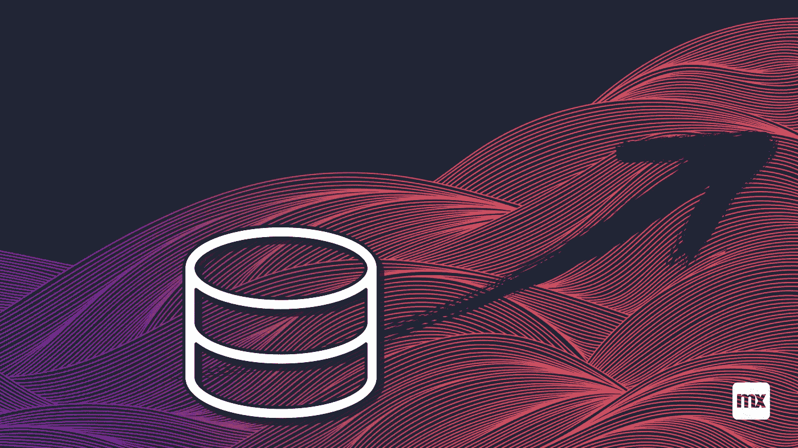
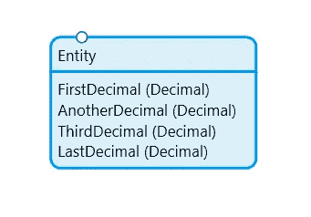
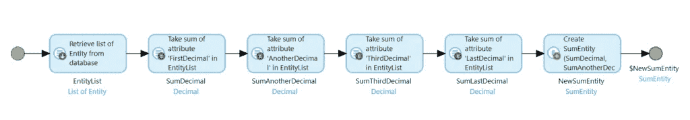
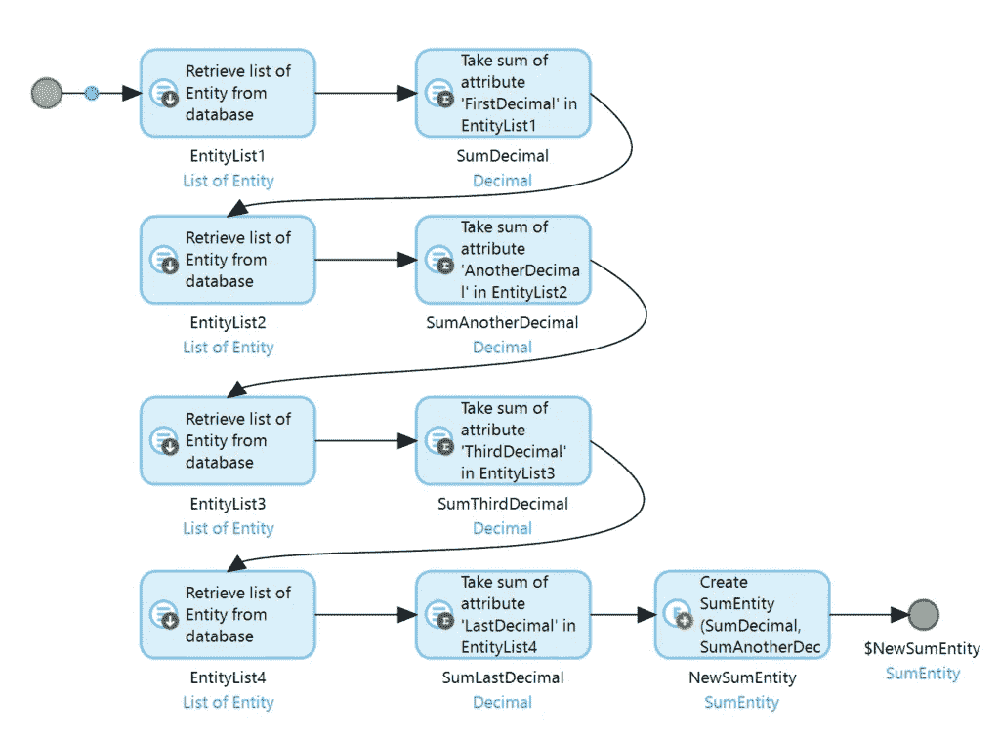
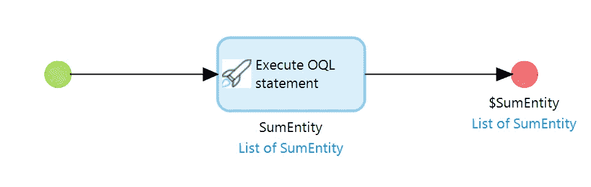
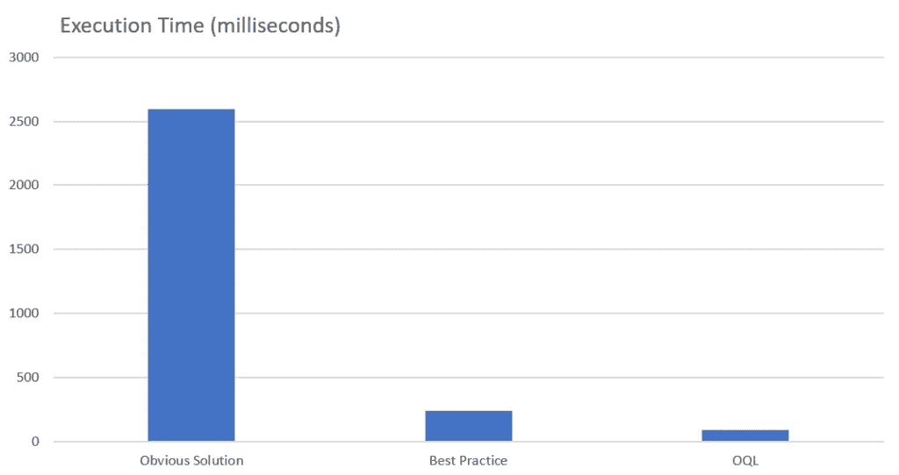
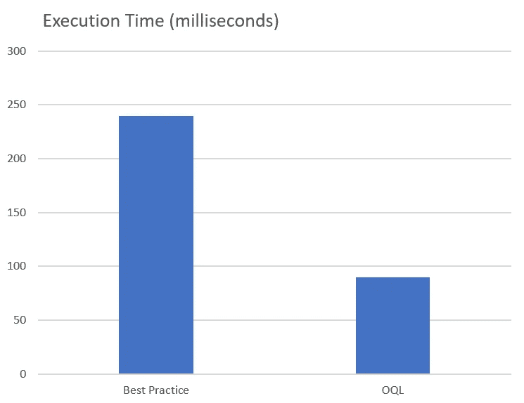

# 一个列表中有多个聚合？可以优化的。——门迪克斯和我

> 原文：<https://medium.com/mendix/multiple-aggregations-on-one-list-that-can-be-optimized-mendix-and-me-ad4de30e08a9?source=collection_archive---------1----------------------->



这篇文章是关于数据库查询的优化。更准确地说，是关于一种特殊类型的查询的优化，即聚合。

# Mendix 中的聚合

聚合是对数据库条目列表中某一列的值的计算。典型的聚合是求和、求平均值、寻找最大或最小的元素…

我们将查看聚合，我们实际上只对结果感兴趣，但不需要实际值或数据库条目。特别是，它还涉及到当您需要在同一个对象列表上进行多个聚合时，如何优化调用。

在 Mendix 中有一个“聚合列表”动作，我们可以用它在列表上执行这样的聚合。让我们考虑下面的数据模型。



我想要实现的目标是计算每个属性的所有记录的总和。


[https://www.mendix.com/pricing/](https://www.mendix.com/pricing/)

# 明显的解决方案

下面是解决这个问题的一个非常简单(并且有效)的方法。



在这个微流中，首先执行检索。在结果列表中，聚合现在是一个接一个地进行的。结果存储在 result 对象中。这工作完美无缺，结果是理想的。但是执行速度很差。在我的示例数据库中，执行这个微流大约需要 2500 毫秒。

这种解决方案的问题是列表首先从数据库加载到运行时。在那里它被聚集。但是，任何直接使用过数据库的人都知道，数据库本身可以执行聚合。数据库在这方面非常擅长。因此，我们希望有一种方法让数据库来完成这项工作。

# 最佳实践

上述解决方案的问题是，Mendix 仅在以下情况下优化聚合:首先，检索和聚合直接在一起；其次，不对列表执行任何其他操作(即使它“仅”是其他聚合)。因此，即使乍看起来更费力，更好的选择是对每个聚合进行专门的检索。相应的微流看起来像这样。



在这个微流中，相同的列表被一遍又一遍地检索，然后立即执行聚合。由于这些列表都没有被进一步使用，Mendix 优化了调用并直接在数据库上执行聚合。这些列表不会加载到运行时中。在那里只能找到聚合的结果。

在我的示例数据库中，这个微流的执行时间大约为 240 毫秒。因此，它比显而易见的解决方案快 10 倍。

但是为什么要进行 4 次数据库调用来得到一个结果呢？在数据库中，你可以在一次调用中处理所有的事情？没错。整个事情的最终优化正是利用了这一点。

# OQL 的速度更快

我们不得不承认，这个解决方案是用 Mendix 板工具做不到的。我们需要来自门迪克斯市场的 [OQL 模块](https://marketplace.mendix.com/link/component/66876)。在这个模块的帮助下，我们可以在数据库上执行 OQL 查询。这允许我们将所有的聚合放在一个数据库交互中。相应的微流如下所示。



是的，它实际上只有一个动作。其中执行了以下语句。

```
SELECT
  SUM(Entity.FirstDecimal) AS SumDecimal,
  SUM(Entity.AnotherDecimal) AS SumAnotherDecimal,
  SUM(Entity.ThirdDecimal) AS SumThirdDecimal,
  SUM(Entity.LastDecimal) AS SumLastDecimal
FROM
  MyFirstModule.Entity AS Entity
```

执行 OQL 语句动作在数据库上执行代码，并直接为我们创建一个结果对象。这里唯一需要注意的是，选择的别名必须与结果实体的属性名相匹配。

在我的示例数据库中，这个微流大约在 90 毫秒内执行。因此，在最佳实践和 OQL 变体之间，这又是一个相当大的性能跳跃。

# 结论

对于聚合，您至少应该始终使用 Mendix 最佳实践，并专门为一个聚合检索一个列表。只有这样，平台才会优化执行，让数据库来做工作。在某些情况下，尤其是对于许多记录或复杂的数据结构，使用 OQL 进一步优化会很有用。该图令人印象深刻地显示了执行速度的差异。



在这里，显而易见的解决方案的性能会有多差。当只比较这两者时，最佳实践和 OQL 解决方案之间的差异就变得更加明显了。



您还应该记住，所示的示例是一个非常简单的查询。数据库不需要执行任何复杂的连接。如果这些是必要的(在真实的例子中，它们几乎总是必要的),差异可能会显著得多。

一如既往，我希望你在尝试这个过程中获得很多乐趣。我也总是很高兴你的反馈-让我知道你的想法！

## 阅读更多

 [## 汇总列表- Studio Pro 9 指南| Mendix 文档

### 这种活性可用于微流和纳流。汇总清单活动可用于计算…

docs.mendix.com](https://docs.mendix.com/refguide/aggregate-list)  [## OQL - Studio Pro 9 指南| Mendix 文档

### Mendix 对象查询语言(OQL)是一种关系查询语言，就像 SQL 一样。OQL 的主要优势是…

docs.mendix.com](https://docs.mendix.com/refguide/oql)  [## 优化微流聚合- Studio Pro 9 操作指南| Mendix 文档

### 在某些应用中，有必要评估微流中的大型数据集(例如，用于报告目的)。如果全部…

docs.mendix.com](https://docs.mendix.com/howto/logic-business-rules/optimizing-microflow-aggregates) 

*原文于 2021 年 9 月 24 日* [*以德语发表 https://mendixamme . de*](https://mendixandme.de/index.php/2021/09/24/mehrere-aggregationen-auf-einer-liste-das-laesst-sich-optimieren/)*。*

*来自发布者-*

如果你喜欢这篇文章，你可以在我们的 [*中页*](https://medium.com/mendix) *找到更多喜欢的。对于精彩的视频和直播会话，您可以前往*[*MxLive*](https://www.mendix.com/live/)*或我们的社区*[*Youtube PAG*](https://www.youtube.com/c/MendixCommunity/community)*e .*

*希望入门的创客，可以注册一个* [*免费账号*](https://signup.mendix.com/link/signup/?source=direct) *，通过我们的* [*学苑*](https://academy.mendix.com/link/home) *即时获取学习。*

有兴趣更多地参与我们的社区吗？你可以加入我们的 [*Slack 社区频道*](https://join.slack.com/t/mendixcommunity/shared_invite/zt-hwhwkcxu-~59ywyjqHlUHXmrw5heqpQ) *或者想更多参与的人，看看加入我们的*[*Meet ups*](https://developers.mendix.com/meetups/#meetupsNearYou)*。*