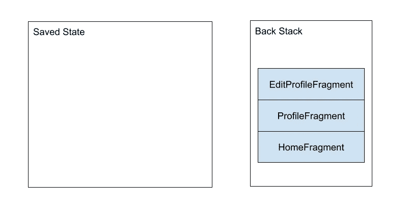
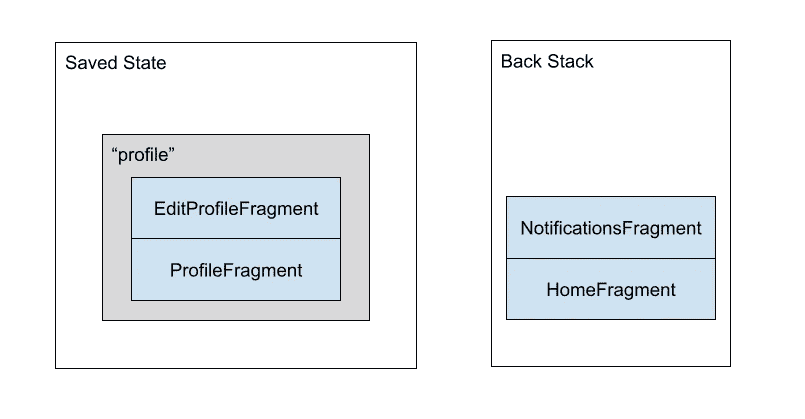
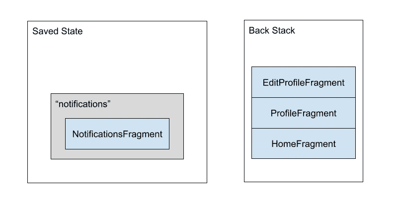

# 多个后堆栈

> 原文：<https://medium.com/androiddevelopers/multiple-back-stacks-b714d974f134?source=collection_archive---------0----------------------->


## 深入探究这一特性的真正内涵

如果“back stack”是一组屏幕，你可以通过系统的 back 按钮向后导航，“multiple back stacks”就是一堆这样的屏幕，对吗？嗯，这正是我们在[导航 2.4.0-alpha01](https://developer.android.com/jetpack/androidx/releases/navigation#2.4.0-alpha01) 和[片段 1.4.0-alpha01](https://developer.android.com/jetpack/androidx/releases/fragment#1.4.0-alpha01) 中添加的多 back stack 支持所做的！

# 系统后退按钮的乐趣

无论你使用的是 Android 新的手势导航系统还是传统的导航栏，用户返回的能力是 Android 用户体验的一个关键部分，正确地做到这一点是让你的应用程序感觉像生态系统的一个自然部分的重要部分。

在最简单的情况下，系统后退按钮只是完成您的活动。虽然在过去，您可能会试图覆盖活动的`onBackPressed()`方法来定制这种行为，但现在是 2021 年，这完全没有必要。相反，在`[OnBackPressedDispatcher](https://developer.android.com/reference/androidx/activity/OnBackPressedDispatcher)`中有[API 用于定制向后导航](https://developer.android.com/guide/navigation/navigation-custom-back)。这实际上是`[FragmentManager](https://developer.android.com/reference/androidx/fragment/app/FragmentManager)`和`[NavController](https://developer.android.com/reference/kotlin/androidx/navigation/NavController)`已经插入的同一个 API。

这意味着当你使用片段或导航时，他们使用`OnBackPressedDispatcher`来确保如果你使用他们的后台堆栈 API，系统的后退按钮可以反转你推到后台堆栈上的每一个屏幕。

多个后堆栈不会改变这些基本原则。系统返回按钮仍然是一个单向命令——“返回”。这对多后台堆栈 API 的工作方式有着深远的影响。

# 碎片中的多个背面堆栈

从表面上来看，[对多后台栈](https://developer.android.com/guide/fragments/fragmentmanager#multiple-back-stacks)的支持看似简单，但需要解释一下什么是“片段后台栈”。`FragmentManager`的后台堆栈不是由片段组成的，而是由片段事务组成的。特别是那些使用过`[addToBackStack(String name)](https://developer.android.com/reference/androidx/fragment/app/FragmentTransaction#addToBackStack(java.lang.String))` API 的。

这意味着当你用`addToBackStack()`来`commit()`一个片段事务时，`FragmentManager`将通过遍历和执行每个操作(T5)来执行事务。)，从而将每个片段移动到其预期的状态。然后将该事务作为其后台堆栈的一部分保存起来。

当您调用`popBackStack()`(直接调用或者通过`FragmentManager`与系统返回按钮的集成调用)时，片段返回堆栈中最顶层的事务被反转——一个添加的片段被移除，一个隐藏的片段被显示，等等。这使`FragmentManager`回到片段事务最初提交之前的状态。

> **注意**:我再怎么强调这一点也不为过，但是你绝对不应该用`addToBackStack()`和不在同一个`FragmentManager`中的事务来交错事务:你的后台堆栈上的事务并不知道非后台堆栈正在改变片段事务——当你提出一个更冒险的提议时，从那些事务下面交换东西会产生相反的结果。

这意味着`popBackStack()`是一个破坏性的操作:当事务被弹出时，任何添加的片段的状态都会被破坏。这意味着您将丢失视图状态，任何保存的实例状态，以及您附加到该片段的任何`ViewModel`实例都将被清除。这是 API 和新的`saveBackStack()`的主要区别。`saveBackStack()`执行与弹出事务相同的反转，但是它确保视图状态、保存的实例状态和`ViewModel`实例都被保存下来，不会被销毁。这就是`restoreBackStack()` API 如何在以后从保存的状态中重新创建那些事务及其片段，并有效地“重做”保存的所有内容。神奇！

不过，这并不是在没有偿还大量技术债务的情况下实现的。

# 分期偿还我们的技术债务

虽然片段总是保存[片段的视图状态](https://developer.android.com/guide/fragments/saving-state#view)，但是只有当活动的`onSaveInstanceState()`被调用时，片段的`onSaveInstanceState()`才会被调用。为了确保在调用`saveBackStack()`时保存实例状态，我们需要**也在[片段生命周期转换](https://developer.android.com/guide/fragments/lifecycle#states)的正确点**注入对`onSaveInstanceState()`的调用。我们不能过早调用它(当它还在`STARTED`的时候，你的片段不应该保存它的状态)，但是也不能太晚(你想在片段被销毁之前保存状态)。

这个需求启动了一个过程来[修复](https://issuetracker.google.com/139536619) `[FragmentManager](https://issuetracker.google.com/139536619)` [如何移动到状态](https://issuetracker.google.com/139536619)，以确保有一个地方管理将片段移动到其预期状态，并处理重入行为和进入片段的所有状态转换。

35 个变更和 6 个月的片段重组，结果是[延迟的片段被严重破坏](https://issuetracker.google.com/147749580)，导致延迟的事务被留在中间——没有实际提交，也没有实际未提交。经过 65 次修改，又过了 5 个月，我们已经完全重写了`FragmentManager`如何管理状态、延迟转换和动画的大部分内部内容。在我之前的博客文章中有更详细的介绍:

[](/androiddevelopers/fragments-rebuilding-the-internals-61913f8bf48e) [## 片段:重建内部

### 介绍:新的状态管理器

medium.com](/androiddevelopers/fragments-rebuilding-the-internals-61913f8bf48e) 

# 碎片中期待什么

随着技术债务的偿还(和一个更可靠、更容易理解的`FragmentManager`)，添加了`saveBackStack()`和`restoreBackStack()`的冰山一角 API。

如果你不使用这些新的 API，什么都不会改变:单个`FragmentManager`后台栈和以前一样工作。现有的`addToBackStack()` API 保持不变——您可以使用空的`name`或任何您想要的`name`。然而，当您开始查看多个 back stacks 时，这个`name`就有了新的重要性:这个名称是您将在`saveBackStack()`和`restoreBackStack()`中使用的片段事务的惟一键。

这在示例中可能更容易看到。假设您已经向活动添加了一个初始片段，然后完成了两个事务，每个事务都有一个`replace`操作:

```
// This is the initial fragment the user sees
fragmentManager.commit {
  setReorderingAllowed(true)
  replace<HomeFragment>(R.id.fragment_container)
}// Later, in response to user actions, we’ve added two more
// transactions to the back stack
fragmentManager.commit {
  setReorderingAllowed(true)
  replace<ProfileFragment>(R.id.fragment_container)
  addToBackStack(“profile”)
}fragmentManager.commit {
  setReorderingAllowed(true)
  replace<EditProfileFragment>(R.id.fragment_container)
  addToBackStack(“edit_profile”)
}
```

这意味着我们的`FragmentManager`看起来像:



FragmentManager state after three commits

假设我们想换出我们的概要文件回栈，并换到通知片段。我们将调用`saveBackStack()`,后跟一个新事务:

```
fragmentManager.saveBackStack("profile")fragmentManager.commit {
  setReorderingAllowed(true)
  replace<NotificationsFragment>(R.id.fragment_container)
  addToBackStack("notifications")
}
```

现在我们添加了`ProfileFragment`的交易和添加了`EditProfileFragment`的交易已经保存在`"profile"` 键下。那些片段已经完全保存了它们的状态，并且`FragmentManager`正在保持它们的状态以及事务状态。重要的是:那些片段实例不再存在于内存或`FragmentManager`中——它只是状态(以及以`ViewModel`实例形式的任何非配置状态):



FragmentManager state after we’ve saved the profile back stack and added one more commit

交换回来非常简单:我们可以对我们的`"notifications"`事务和`restoreBackStack()`事务进行同样的`saveBackStack()`操作:

```
fragmentManager.saveBackStack(“notifications”)fragmentManager.restoreBackStack(“profile”)
```

这两个堆栈实际上交换了位置:



FragmentManager state after swapping the two stacks

这种维护单个活动后台堆栈并在其上交换事务的方式确保了`FragmentManager`和系统的其余部分总是对点击系统后退按钮时实际应该发生的事情有一致的看法。事实上，这种逻辑完全没有改变:它仍然像以前一样从片段堆栈中弹出最后一个事务。

这些 API 是有意最小化的，尽管它们有潜在的影响。这使得在这些构建块之上构建您自己的结构成为可能，同时避免任何保存片段视图状态、保存的实例状态和非配置状态的攻击。

当然，如果你不想在这些 API 之上构建你自己的结构，你也可以使用我们提供的那个。

# 通过导航将多个 back stacks 带到任何屏幕类型

[导航组件](https://developer.android.com/guide/navigation/)从一开始**就被构建为一个通用运行时，它对视图、片段、可组合组件或者任何其他类型的屏幕或者你可能在活动中实现的‘目的地’一无所知。相反，`[NavHost](https://developer.android.com/reference/kotlin/androidx/navigation/NavHost)` [接口](https://developer.android.com/reference/kotlin/androidx/navigation/NavHost)的一个实现负责添加一个或多个`[Navigator](https://developer.android.com/reference/kotlin/androidx/navigation/Navigator)`实例，使**知道如何与特定类型的目的地交互。****

这意味着与片段交互的逻辑完全封装在`navigation-fragment`工件及其`FragmentNavigator`和`DialogFragmentNavigator`中。类似地，与 Composables 交互的逻辑在完全独立的`navigation-compose`工件及其`ComposeNavigator`中。这种抽象意味着，如果你想单独用 Composables 来构建你的应用程序，当你使用导航组合时，你不会被迫加入任何对片段的依赖。

这种级别的分离意味着导航中实际上有两层到多个后台堆栈:

*   保存组成`NavController`后台堆栈的各个`[NavBackStackEntry](https://developer.android.com/reference/kotlin/androidx/navigation/NavBackStackEntry)`实例的状态。这是`NavController`的责任。
*   保存与每个`NavBackStackEntry`相关联的任何`Navigator`特定状态(例如，与`FragmentNavigator`目的地相关联的片段)。这是`Navigator`的责任。

特别注意`Navigator`没有**更新以支持保存其状态的情况。虽然底层的`Navigator` API 被完全重写以支持保存状态(您应该覆盖它的`navigate()`和`popBackStack()`API 的新重载，而不是以前的版本)，但是即使`Navigator`没有更新，`NavController`也会保存`NavBackStackEntry`状态(向后兼容性在 Jetpack 世界中是一件大事！).**

> PS:这个新的`Navigator` API 还通过附加一个充当迷你`NavController`的`[TestNavigatorState](https://developer.android.com/reference/kotlin/androidx/navigation/testing/TestNavigatorState)`来使测试你自己的定制`Navigator`更加容易。

如果你只是在你的应用中使用导航，那么`Navigator`层更多的是一个实现细节，而不是你需要直接交互的东西。简单地说，我们已经完成了将`FragmentNavigator`和`ComposeNavigator`转移到新的`Navigator`API 所需的工作，这样它们就可以正确地保存和恢复它们的状态；在那个层次上你不需要做任何工作。

# 在导航中启用多个后台堆栈

如果你正在使用`[NavigationUI](https://developer.android.com/guide/navigation/navigation-ui)`，我们的一组固执己见的助手来连接你的`NavController`到材质视图组件，你会发现默认情况下**为菜单项**，`BottomNavigationView`(现在是`NavigationRailView`！)，还有`NavigationView`。这意味着使用`navigation-fragment`和`navigation-ui`的常见组合*将只工作*。

`NavigationUI`API 是有目的地构建在导航中可用的其他公共 API 之上的，确保您可以为您想要的定制组件精确地构建自己的版本。支持保存和恢复后台堆栈的 API 也不例外，导航 XML 中的`NavOptions`、`navOptions` Kotlin DSL 以及`popBackStack()`的重载中的新 API 允许您指定是希望 pop 操作保存状态，还是希望 navigate 操作恢复一些以前保存的状态。

例如，在 Compose 中，任何全局导航模式(无论是底部导航条、导航条、抽屉，还是你能想到的任何东西)都可以使用与我们展示的[集成底部导航](https://developer.android.com/jetpack/compose/navigation#bottom-nav)相同的技术，并用`saveState`和`restoreState`属性调用`navigate()`:

```
onClick = {
  navController.navigate(screen.route) {
    // Pop up to the start destination of the graph to
    // avoid building up a large stack of destinations
    // on the back stack as users select items
    popUpTo(navController.graph.findStartDestination().id) {
      saveState = true
    }

    // Avoid multiple copies of the same destination when
    // reselecting the same item
    launchSingleTop = true // Restore state when reselecting a previously selected item
    restoreState = true
  }
}
```

# 保存您的状态，保存您的用户

对用户来说，最令人沮丧的事情之一就是丢失他们的状态。这就是为什么片段在[保存状态](https://developer.android.com/guide/fragments/saving-state)上有一整页的原因之一，也是为什么我很高兴更新每一层以支持多个后台堆栈的原因之一:

*   片段(即，根本不使用导航组件):这是通过使用`saveBackStack`和`restoreBackStack`的新`FragmentManager`API 进行的选择加入更改。
*   核心导航运行时:为`restoreState`和`saveState`添加了新的`NavOptions`方法，并添加了一个新的`popBackStack()`重载，该重载也接受一个`saveState`布尔值(默认为`false`)。
*   使用片段导航:现在`FragmentNavigator`利用新的`Navigator`API，通过使用导航运行时 API 将导航运行时 API 正确地翻译成片段 API。
*   `NavigationUI`:现在`onNavDestinationSelected()`、`NavigationBarView.setupWithNavController()`、`NavigationView.setupWithNavController()`默认使用新的`restoreState`、`saveState`、`NavOptions`、T18 弹出后栈。这意味着，在升级 Navigation 2.4.0-alpha01 或更高版本后，每个使用这些`**NavigationUI**`**API 的应用程序都将获得多个后台堆栈，而不会有任何代码更改。**

如果你想看看更多使用这个 API 的例子，看看`NavigationAdvancedSample`(新更新的，没有任何`NavigationExtensions`代码需要支持多个后台堆栈):

[](https://github.com/android/architecture-components-samples/tree/master/NavigationAdvancedSample) [## Android/架构-组件-示例

### 本示例展示了遵循导航原则的底部导航视图的行为。固定开始…

github.com](https://github.com/android/architecture-components-samples/tree/master/NavigationAdvancedSample) 

对于导航合成，考虑一下 Tivi:

[](https://github.com/chrisbanes/tivi) [## chrisbanes/tivi

### 这不是官方的谷歌产品，Tivi 是一个正在进行的跟踪 Android 应用程序的电视节目，它连接到…

github.com](https://github.com/chrisbanes/tivi) 

如果您确实遇到了任何问题，请确保使用官方的问题跟踪器对[碎片](https://issuetracker.google.com/issues/new?component=460964)或[导航](https://issuetracker.google.com/issues/new?component=409828)进行 bug 归档，我们一定会查看的！