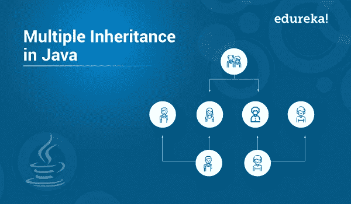

# 如何在 Java 中实现多重继承？

> 原文：<https://medium.com/edureka/multiple-inheritance-in-java-a996c26143ac?source=collection_archive---------5----------------------->



本文将帮助您实现一个用 Java 无法实现的概念。我指的是 Java 中的多重继承。本文将涉及以下几点:

*   Java 中的多重继承
*   抽样程序
*   没有歧义的多重继承

所以让我们从这篇 Java 多重继承的文章开始，

# Java 中的多重继承

面向对象编程为用户提供了多重继承的特性，其中一个类可以继承多个父类的属性。更简单地说，多重继承意味着一个类扩展多个类。

java 编程语言无法直接利用这一特性。这可以通过使用接口间接实现。

继续这篇 Java 中的多重继承文章，

# 抽样程序

在下面的例子中，我们有两个界面:摩托车和自行车。摩托车界面由属性速度组成。方法是 totalDistance()。循环接口由属性距离()和方法速度()组成。

这两个接口都由 TwoWheeler 类实现。

```
**interface** MotorBike
{
**int** speed=50;
**public** **void** totalDistance();
}
**interface** Cycle
{
**int** distance=150;
**public** **void** speed();
}
**public** **class** TwoWheeler **implements** MotorBike,Cycle
{
**int** totalDistance;
**int** avgSpeed;
**public** **void** totalDistance()
{
totalDistance=speed*distance;
System.out.println("Total Distance Travelled : "+totalDistance);
}
**public** **void** speed()
{
**int** avgSpeed=totalDistance/speed;
System.out.println("Average Speed maintained : "+avgSpeed);
}
**public** **static** **void** main(String args[])
{
TwoWheeler t1=**new** TwoWheeler();
t1.totalDistance();
t1.speed();
}
}
```

**输出**

总行程:7500

保持的平均速度:150

上面给出的程序避免了歧义，即使使用类而不是接口。但是，Java 不支持。当两个类中有相同的方法时，编译器无法决定调用哪个方法。使用接口可以避免这种模糊性，因为默认情况下接口的方法是抽象的。

继续这篇 Java 中的多重继承文章，

# 没有歧义的多重继承

```
**interface** InterfaceOne
{
**public** **void** disp();
}
**interface** InterfaceTwo
{
**public** **void** disp();
}
**public** **class** Main **implements** InterfaceOne,InterfaceTwo
{
@Override
**public** **void** disp()
{
System.out.println("display() method implementation");
}
**public** **static** **void** main(String args[])
{
Main m = **new** Main();
m.disp();
}
}
```

**输出**

display()方法实现

Main 方法实现两个接口，即 InterfaceOne 和 InterfaceTwo。它执行起来没有任何歧义。

让我们看另一个例子来更好地理解多重继承:

```
interface Sing
{
default void singRock(){
System.out.println(“I am singing rock”);
}
}
interface Dance
{
default void danceSlow(){
System.out.println(“I am dancing slow!”);
}
}
public class Human implements Sing, Dance
{
public static void main(String[] args)
{
Human h = new Human();
h.singRock();
h.danceSlow();
}
}
```

**输出**

我在唱摇滚

我跳得很慢！

***因此，通过本文讨论的方法可以实现多重继承。***

这样，我们就结束了这篇关于“Java 中的多重继承”的文章。我希望你发现这个博客信息丰富，增加了你的知识价值。
如果你想查看更多关于人工智能、DevOps、道德黑客等市场最热门技术的文章，你可以参考 [Edureka 的官方网站。](https://www.edureka.co/blog/?utm_source=medium&utm_medium=content-link&utm_campaign=multiple-inheritance-in-java)

请留意本系列中的其他文章，它们将解释 Java 的各个方面。

> *1。* [*面向对象编程*](/edureka/object-oriented-programming-b29cfd50eca0)
> 
> *2。* [*继承 Java 中的*](/edureka/inheritance-in-java-f638d3ed559e)
> 
> *3。*[*Java 中的多态性*](/edureka/polymorphism-in-java-9559e3641b9b)
> 
> *4。*[*Java 中的抽象*](/edureka/java-abstraction-d2d790c09037)
> 
> *5。* [*Java 字符串*](/edureka/java-string-68e5d0ca331f)
> 
> *6。* [*Java 数组*](/edureka/java-array-tutorial-50299ef85e5)
> 
> *7。* [*Java 集合*](/edureka/java-collections-6d50b013aef8)
> 
> *8。* [*Java 线程*](/edureka/java-thread-bfb08e4eb691)
> 
> *9。*[*Java servlet 简介*](/edureka/java-servlets-62f583d69c7e)
> 
> *10。* [*Servlet 和 JSP 教程*](/edureka/servlet-and-jsp-tutorial-ef2e2ab9ee2a)
> 
> *11。*[*Java 中的异常处理*](/edureka/java-exception-handling-7bd07435508c)
> 
> *12。* [*Java 教程*](/edureka/java-tutorial-bbdd28a2acd7)
> 
> *13。* [*Java 面试题*](/edureka/java-interview-questions-1d59b9c53973)
> 
> *14。* [*Java 程序*](/edureka/java-programs-1e3220df2e76)
> 
> *15。* [*科特林 vs Java*](/edureka/kotlin-vs-java-4f8653f38c04)
> 
> *16。* [*依赖注入使用 Spring Boot*](/edureka/what-is-dependency-injection-5006b53af782)
> 
> *17。* [*堪比 Java 中的*](/edureka/comparable-in-java-e9cfa7be7ff7)
> 
> *18。* [*十大 Java 框架*](/edureka/java-frameworks-5d52f3211f39)
> 
> *19。* [*Java 反射 API*](/edureka/java-reflection-api-d38f3f5513fc)
> 
> *20。*[*Java 中的前 30 个模式*](/edureka/pattern-programs-in-java-f33186c711c8)
> 
> *21。* [*核心 Java 备忘单*](/edureka/java-cheat-sheet-3ad4d174012c)
> 
> *22。*[*Java 中的套接字编程*](/edureka/socket-programming-in-java-f09b82facd0)
> 
> 23。 [*Java OOP 备忘单*](/edureka/java-oop-cheat-sheet-9c6ebb5e1175)
> 
> *24。*[*Java 中的注释*](/edureka/annotations-in-java-9847d531d2bb)
> 
> *25。*[*Java 库管理系统项目*](/edureka/library-management-system-project-in-java-b003acba7f17)
> 
> 26。 [*爪哇树木*](/edureka/java-binary-tree-caede8dfada5)
> 
> *27。*[*Java 中的机器学习*](/edureka/machine-learning-in-java-db872998f368)
> 
> 28。 [*顶级数据结构&Java 中的算法*](/edureka/data-structures-algorithms-in-java-d27e915db1c5)
> 
> *29。* [*Java 开发者技能*](/edureka/java-developer-skills-83983e3d3b92)
> 
> 30。 [*前 55 名 Servlet 面试问题*](/edureka/servlet-interview-questions-266b8fbb4b2d)
> 
> *31。*[](/edureka/java-exception-handling-7bd07435508c)*[*顶级 Java 项目*](/edureka/java-projects-db51097281e3)*
> 
> **32。* [*Java 字符串备忘单*](/edureka/java-string-cheat-sheet-9a91a6b46540)*
> 
> **33。*[*Java 中的嵌套类*](/edureka/nested-classes-java-f1987805e7e3)*
> 
> **34。* [*Java 集合面试问答*](/edureka/java-collections-interview-questions-162c5d7ef078)*
> 
> **35。*[*Java 中如何处理死锁？*](/edureka/deadlock-in-java-5d1e4f0338d5)*
> 
> **36。* [*你需要知道的 50 个 Java 合集面试问题*](/edureka/java-collections-interview-questions-6d20f552773e)*
> 
> **37。*[*Java 中的字符串池是什么概念？*](/edureka/java-string-pool-5b5b3b327bdf)*
> 
> **38。*[*C、C++和 Java 有什么区别？*](/edureka/difference-between-c-cpp-and-java-625c4e91fb95)*
> 
> *39。[*Java 中的回文——如何检查一个数字或字符串？*](/edureka/palindrome-in-java-5d116eb8755a)*
> 
> *40。 [*你需要知道的顶级 MVC 面试问答*](/edureka/mvc-interview-questions-cd568f6d7c2e)*
> 
> **41。*[*Java 编程语言十大应用*](/edureka/applications-of-java-11e64f9588b0)*
> 
> **42。* [*陷入僵局*](/edureka/deadlock-in-java-5d1e4f0338d5)*
> 
> *43。[*Java 中的平方和平方根*](/edureka/java-sqrt-method-59354a700571)*
> 
> *44。[*Java 中的类型转换*](/edureka/type-casting-in-java-ac4cd7e0bbe1)*
> 
> *45。[*Java 中的运算符及其类型*](/edureka/operators-in-java-fd05a7445c0a)*
> 
> **46。*[*Java 中的析构函数*](/edureka/destructor-in-java-21cc46ed48fc)*
> 
> **47。*[*Java 中的二分搜索法*](/edureka/binary-search-in-java-cf40e927a8d3)*
> 
> *48。[*Java 中的 MVC 架构*](/edureka/mvc-architecture-in-java-a85952ae2684)*
> 
> **49。* [*冬眠面试问答*](/edureka/hibernate-interview-questions-78b45ec5cce8)*

**原载于 2019 年 8 月 14 日*[*https://www.edureka.co*](https://www.edureka.co/blog/multiple-inheritance-in-java/)*。**