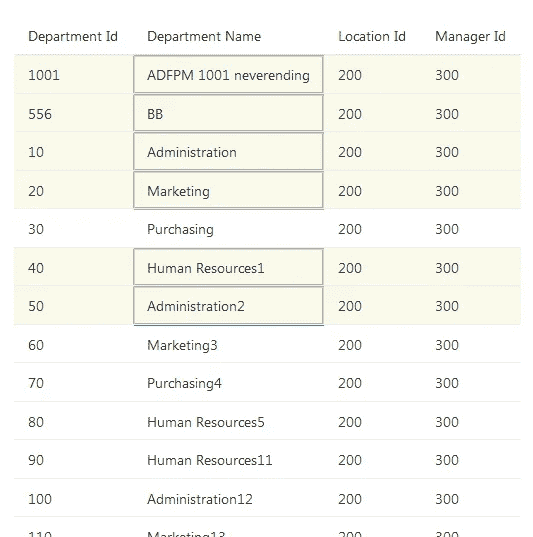
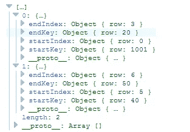
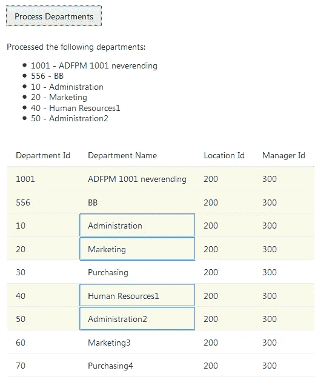

# 使用 Oracle JET 4.0 在 ojTable 中选择多行

> 原文：<https://medium.com/oracledevs/multiple-row-selection-in-ojtable-using-oracle-jet-v4-86707ebef73c?source=collection_archive---------0----------------------->

我本来是用 JET 的 v3 写的这篇博文，就在我要发表的时候，v4 发布了。因此，我更新了它，以配合 v4 的更新。如果有人想看 v3 的内容，请联系我们！

本文将概述在 Oracle JET 应用程序中从 ojTable 中检索行选择信息所需的步骤。在本文中使用的例子中，我使用的是来自 [Oracle Cookbook](http://www.oracle.com/webfolder/technetwork/jet/jetCookbook.html?component=table&demo=basicTable) 的基本 ojTable，该书目前在最新发布的 Oracle JET 第 4 版上。

假设您已经设置了 ojTable，首先在页面上创建一个按钮，该按钮将用于调用所选行上需要的操作，例如:

**查看**

```
<oj-button id='button1' on-click='[[buttonClick]]'>Process Departments</oj-button>
```

**viewModel**

```
this.buttonClick = function () {
   // Our process code will go here
}
```

看下面的截图，这里我们选择了两大块的行；0 到 3 (4 行)和 5 到 6(两行):



Table selection of rows 0–3 and 5–6

要输出选中的行，只需绑定到表，如下所示:

```
// Get the selected rows from the table
   var getSelectedRows = document.getElementById('table').selection;
```



Output of getSelectedRows

现在我们知道了如何获取选中的行索引，我们需要包含按钮点击逻辑来查找选中的数据并处理它。

在视图模型中全局创建一个可观察数组:

```
self.selectedDepartments = ko.observableArray();
```

然后将以下逻辑添加到 buttonClick 函数中:

```
this.buttonClick = function () { // Get the selected rows from the table
   var getSelectedRows = document.getElementById('table').selection; // Ensure the selected departments array is clear
   self.selectedDepartments.removeAll() // Loop through the selected rows
   $.each(getSelectedRows, function (key, value) { // Retrieve the table row data
     var itemModel = self.datasource.data; // Loop through the row data between the start and end indexes
     for (var n = value.startIndex.row; n <= value.endIndex.row;     ++n) {
       if (itemModel.length > 0) {
           var modelObject = itemModel[n] // Add the selected departments to an array
          self.selectedDepartments.push({
            depId: modelObject.DepartmentId,
            depName: modelObject.DepartmentName,
            locId: modelObject.LocationId,
            mngId: modelObject.ManagerId
          });
       } } }); /* Here you can use the contents of self.selectedDepartments to  process actions on the selected rows. */ console.log(self.selectedDepartments);}
```

所有选中的行数据都存储在`self.selectedEmployees`中，可以根据需要进行处理。

对于我的示例，我没有任何流程逻辑，所以当我的按钮被单击时，我刚刚输出了 selectedEmployees 数组的内容:



Output of selected rows

# **参考文献**

*   基础 ojTable Cookbook:[http://www . Oracle . com/web folder/tech network/jet/jet Cookbook . html？component = table&demo = basic table](http://www.oracle.com/webfolder/technetwork/jet/jetCookbook.html?component=table&demo=basicTable)
*   ojTable 选择属性:[http://docs . Oracle . com/middleware/jet 400/jet/reference-jet/OJ . OJ table . html # selection](http://docs.oracle.com/middleware/jet400/jet/reference-jet/oj.ojTable.html#selection)

# **延伸阅读**

在 Oracle Jet 中使用箭头键进行行选择—[https://medium . com/@ andrewpbennett 92/Oracle-Jet-table-row-selection-using-arrow-keys-EB 8 cf 8d 5f 30 a](/@andrewpbennett92/oracle-jet-table-row-selection-using-arrow-keys-eb8cf8d5f30a)

# 附录

**查看代码**

```
<oj-button id='button1' on-click='[[buttonClick]]'>Process Departments</oj-button><br><br><span data-bind="visible: selectedDepartments().length">Processed the following departments:</span><ul data-bind="foreach: selectedDepartments()"><li><span data-bind="text: depId"> </span> -<span data-bind="text: depName"> </span></li></ul><br><oj-table id='table' aria-label='Departments Table' selection-mode='{"row": "multiple", "column": "multiple"}'  data='[[datasource]]' columns-default.sortable='disabled' columns='[{"headerText": "Department Id","field": "DepartmentId"},{"headerText": "Department Name","field": "DepartmentName"},{"headerText": "Location Id","field": "LocationId"},{"headerText": "Manager Id","field": "ManagerId"}]'></oj-table>
```