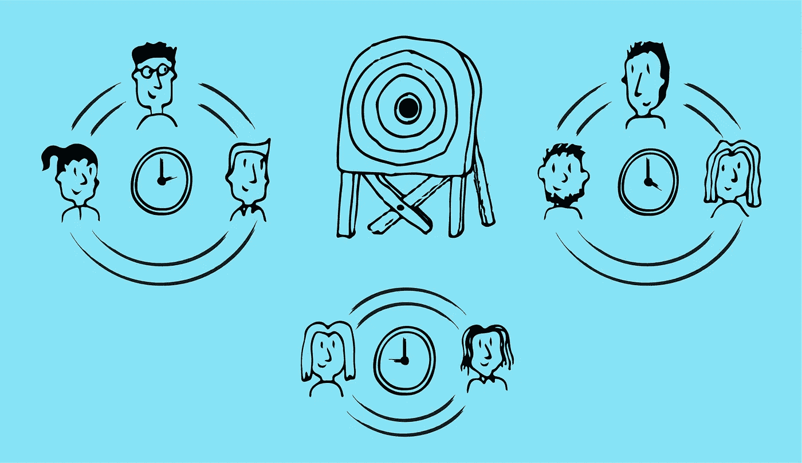

# 多个团队，多种声音，一个目标

> 原文：<https://medium.com/globant/multiple-teams-multiple-voices-one-goal-3e727a275920?source=collection_archive---------0----------------------->

Multiple teams, one target

在我作为设计师的第一份工作中，我很幸运，有一个很好的资深导师和一直支持我的同事，但我没有意识到在一个所有人都在同一间屋子里的公司里会容易得多。我们有销售团队、产品和开发团队，无论我们是否在一起工作，他们都很容易接近。我主要与开发团队一起工作，这是一个发送设计，然后去找开发人员并说‘如果有任何不清楚的地方，请告诉我’的例子。我记得当时在想:“这就是良好沟通的极限吗？”

快进到现在，我是一家拥有 5000 名员工、跨越多个时区和国家的公司的一员。这是我从与世界各地不同团队的合作中学到的(并且还在继续学习)。

单口相声
这听起来显而易见，但却常常被遗忘。在房间里走一走，互相告诉对方你正在做什么。站立展示每个团队成员的透明度/可见性，并确保任何问题在成为被遗忘的问题之前能够被标记出来。早上做第一件事是一个好习惯，但是如果你的团队有一半人在南美会怎么样呢？嗯，简单地说，你必须做两件事，这对于避免以后的客户困惑是至关重要的。

我在纽约做一个项目，我们做了一个“谁在房间里”的站立，然后是与客户的站立，因为他们早上没有时间。但我们在布宜诺斯艾利斯有另一个团队，他们几个小时都不会醒，所以我们没有他们也站了起来。我们没有意识到的是，在客户会议中，讨论了一些我们认为很容易解决的技术问题。我们在后来与团队的其他成员一起站起来时发现了这一点，但没有客户。这导致我们不得不再次和客户谈话，告诉他们这个令人失望的消息。我知道不理想！始终确保整个团队都在同一页上。首先做内部站立，然后是客户站立，也称为“预站立”

**建立对话/关系** 在一个艰难漫长的项目结束时，你通常会喜欢上你的团队(至少我是这样)，知道自己从开始到现在已经走了多远是一种很棒的感觉。但最难的部分是当你开始一个新项目时立即投入运作，并以某种方式立即让你感觉到你们都是联系在一起的，你们都相处得很好，你们都知道到底发生了什么。但是我们都知道事情不是那样开始的，尤其是在多支球队的情况下。我经常和不同的技术团队一起开始一个新项目，所以我们做的第一件事就是在 Slack 上建立一个小组。这成为任何交流的必去之地，很快你就可以在友好的交谈中谈论大问题，而不会听起来像机器人或强迫。在 Google hangouts 上加入单口相声，你就会开始理解人们的工作方式、他们的期望以及你如何高效地为客户提供服务。当所有团队同时工作时，你可能一天只有两三个小时。让它有价值！

**允许公开反馈** 另一个挑战是管理位于另一个国家的客户，并处理不断增长的事务列表，以确保他们与您的工作保持同步。在每周末总结你所做的有助于客户和内部团队，但是对于多个利益相关者呢？当我在做一个保险项目时，客户团队分散在欧洲各地。我们通常在伦敦有一个核心项目团队，有一两个主要的利益相关者，我们向他们汇报工作。然而，在这个项目中，我们与欧洲各地的 20 多个利益相关方打交道，这意味着任何时候我们分享任何东西都必须通过 Webex 与大量受众进行，这证明了收集反馈的困难。谢天谢地，我的同事想出了一个反馈表，可以很容易地分享。她用谷歌表格列出了一系列问题，在我们展示了我们的发现后，利益相关者有时间填写他们的答案。这防止了 webex 会议期间不可控制的中断，并允许人们思考他们真正想说的话。这是有效的，客户觉得自己参与了想法和结果的形成。

**向习惯于这种** 的团队学习与分散的团队合作自然需要时间才能做好，但我开始意识到，有很多人已经习惯了。很容易认为其他团队有他们自己的问题，我们应该专注于我们的问题，但是当你在一个时间紧迫的艰难项目上时，最好是寻求建议。在最近的一个项目中，包括重新设计网站和开发新的应用程序，我们有两个设计团队。英国团队为网站设定了标准，印度团队负责基于网络标准的应用程序设计。为了协调我们的设计、变化和思考过程，我们与印度团队每周组织两次会议。当然，由于主要的时差，没有时间讨论团队之间的变化，项目会有进展。值得庆幸的是，印度团队创建了一个 Google sheets 文档，他们在那里张贴问题，我们在上面留下答案。这解决了时差问题，给我们留下了一个活的聚合工作空间，我们可以给出实时反馈，也可以自己问任何问题。讨论更好地协作的最佳方法很重要，因为您可能习惯的方法可能并不总是适用于其他方。

当与远程团队合作变得困难时，请记住最初让你们走到一起的一件事:完成这个项目，如果做得好，会让客户满意，并帮助他们的客户，这可能会带来另一个项目。