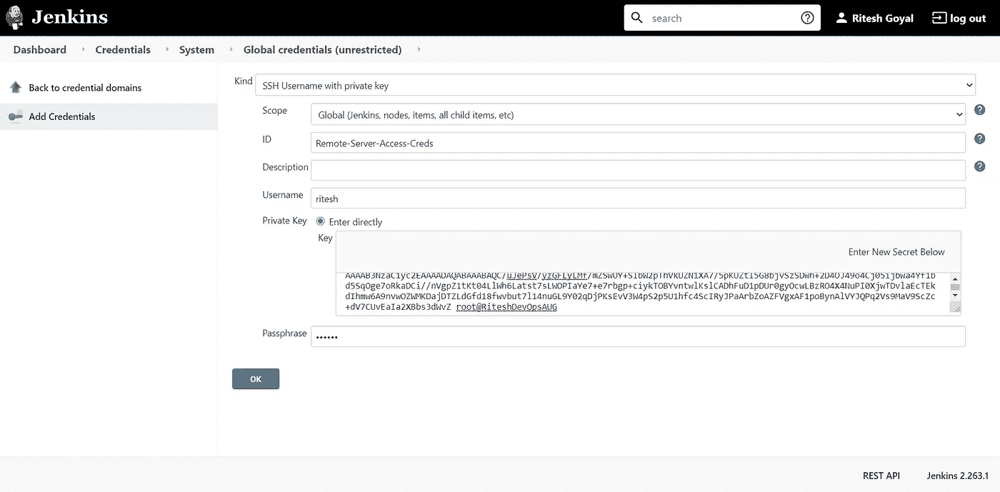
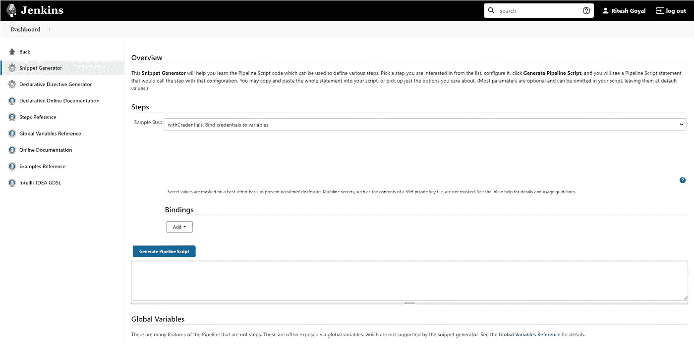
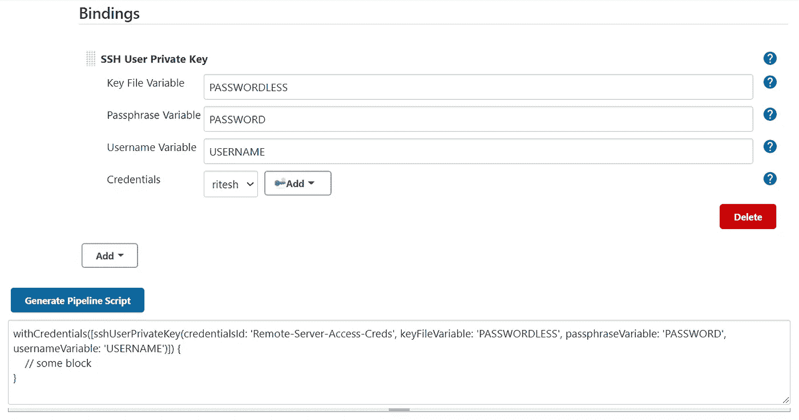
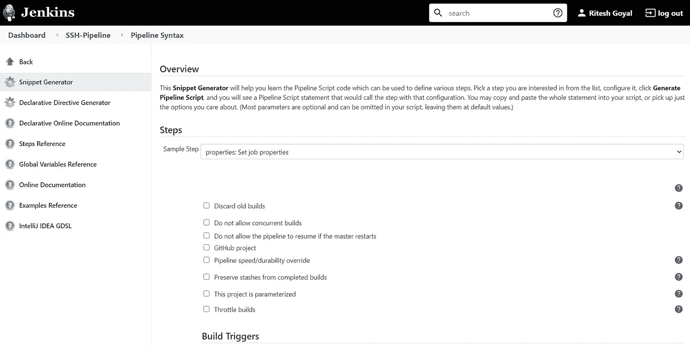
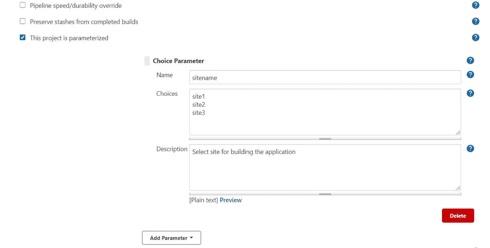
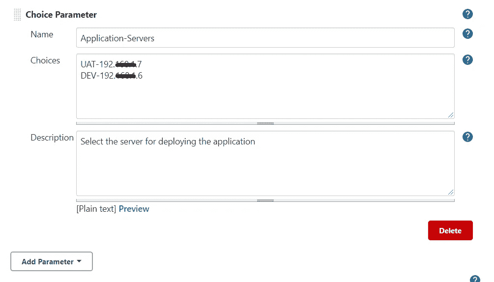
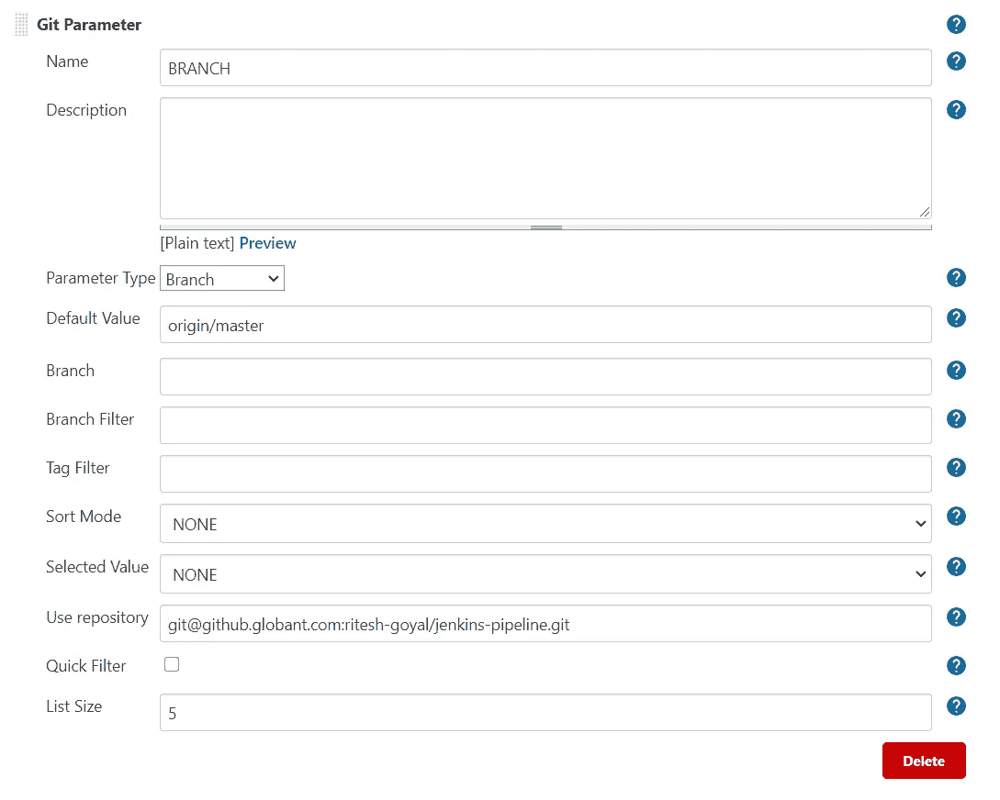
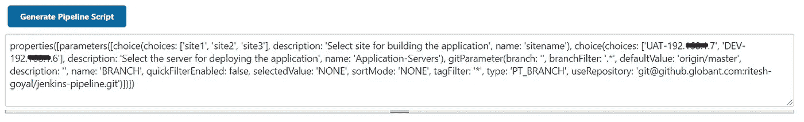
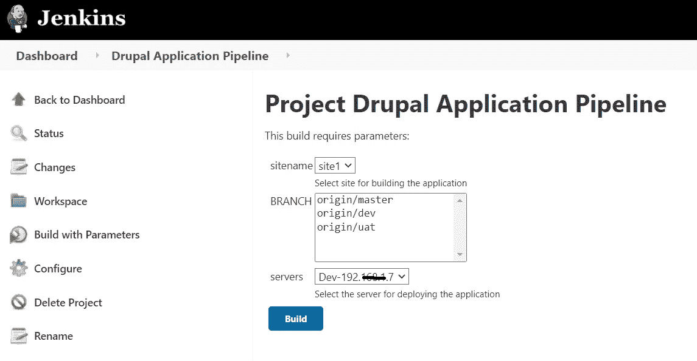
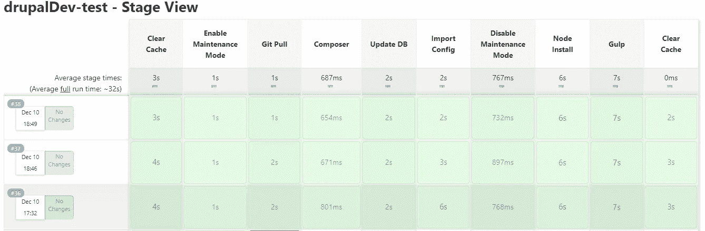

# 使用 Jenkins 进行基于多站点 Drupal 的应用程序部署

> 原文：<https://medium.com/globant/multisite-drupal-based-application-deployment-using-jenkins-7735dd23f00a?source=collection_archive---------0----------------------->

# **简介**

在本文中，您将学习如何通过 Jenkins 使用 SSH 协议在远程应用服务器上构建和部署多站点 Drupal 应用程序。您还将学习如何在运行时从 GitHub 存储库中获取分支以进行代码构建。

Drupal multisite 特性是大型组织的有效解决方案，这些组织通常需要不止一个网站，而是一组相关的网站，易于管理。Drupal multisite 已经在教育网站、政府网站、企业网站等中流行起来。多个站点组合在同一个 Drupal 安装中，这是 Drupal 多站点特性的基本要素。不是一个网站，你有一个网站的集合，这些网站是从一个地方创建、管理、部署和更新的，因为它们共享一个代码库。每个多站点都有自己的数据库、配置、文件和基本域或 URL。关于多站点 Drupal 应用程序设置，请参考[链接](https://www.drupal.org/docs/multisite-drupal/set-up-a-multisite)。

Jenkins 是一个流行的开源工具，用于执行持续集成和构建自动化。Jenkins 在整个生命周期中管理和控制软件交付过程，包括构建、文档、测试、打包、阶段、部署、静态代码分析等等。你有没有想过为什么詹金斯如此受欢迎，尤其是在最近几年？其受欢迎的主要因素之一是詹金斯管道的灵活性，如果你正在寻找这样的詹金斯管道教程，这个博客是你的首选。

# **本文涵盖以下要点**

1.背景
2。主要部分
3。先决条件
4。假设
5。遵循
6 的步骤。优点
7。缺点 8。结论
9。参考

# **1。背景**

今天，你们中的许多人在多站点 Drupal 应用程序的自动化部署中面临问题，因此导致了手动干预。在手动部署过程中，您最终可能会在命令执行中出错。在本文中，您将学习如何自动化 Drupal 多站点应用程序部署过程。

# **2。主要部分**

管道是由管道插件(以前称为“工作流”)支持的 Jenkins 作业，使用简单的文本脚本构建，这些脚本使用基于 Groovy 编程语言的管道 DSL(特定领域语言)。Groovy 语言提供的大多数功能对脚本管道的用户都是可用的，这意味着它可以是一个非常有表现力和灵活的工具，用它可以创作连续的交付管道。

脚本化管道从 Jenkins 文件的顶部向下连续执行，像 Groovy 或其他语言中的大多数传统脚本一样，提供流控制，因此依赖于 Groovy 表达式。

# **3。先决条件**

对于下面的这篇文章，先决条件是必需的:

*   对 Jenkins 管道的基本了解
*   SSH 协议如何工作
*   Git 和 GitHub 的基础知识
*   使用 drush(**Dru**pal**sh**ell)命令编译、构建和部署 Drupal 应用程序的知识。

# **4。假设**

4.1 对于这篇文章，我们假设你已经用默认的推荐插件安装了 Jenkins，在此之上我们需要从 Jenkins 插件管理器安装下面的插件。

*   SSH 管道插件
*   Git 参数插件

4.2 在本文中，我们将参考以下服务器进行理论解释和命令执行-

*   Jenkins 服务器— 192.x.x.5
*   Jenkins 端口—使用 HTTP 协议的 8080
*   Drupal 应用程序开发服务器— 192.x.x.6
*   Drupal 应用程序 UAT 服务器— 192.x.x.7

4.3 本文中讨论的 Drupal 应用程序有如下 3 个站点示例:

*   site1.com
*   site2.com
*   site3.com

因此，所有网站的源代码基础(即业务逻辑)都是相同的，唯一的区别是用户界面，我们有不同的主题。为了构建基于主题的应用程序，我们在 Jenkins pipeline 中使用了输入选择参数。

4.4 一般来说，我们可以有 3 个应用程序环境，即开发(开发)、UAT/阶段(用户验收测试)和生产(生产/现场)，根据本文，我们应该从 Jenkins 服务器连接到所有应用程序环境。

4.5 远程 Drupal 应用程序上的应用程序目录结构假定为

对于父目录— /var/www/multisites/web/

对于基于多站点功能的自定义主题文件夹-

*   /var/www/multi sites/web/themes/custom/site 1
*   /var/www/multi sites/web/themes/custom/site 2
*   /var/www/multi sites/web/themes/custom/site 3

4.6 Drupal 应用程序特定依赖项的安装被认为是由系统/基础架构管理员完成的。

# **5。要遵循的步骤**

下面是我们将在本文中讨论的实现分类列表:

5.1 为远程服务器配置无密码访问的步骤。

5.2 添加参数化作业的属性

5.3 SSH 管道插件和支持的详细信息

5.4 准备执行命令。

5.5 完整的管道结构

## **5.1 为远程服务器配置无密码访问的步骤**

*   为了配置 Jenkins 服务器和远程应用服务器之间的无密码访问，我们需要配置公钥-私钥对认证。

命令:

使用以下命令在 Jenkins 服务器上生成公钥-私钥

```
ssh-keygen
```

在密钥生成期间检查说明，并输入密码短语

```
Enter the passphrase
```

创建密钥后，将公钥从 Jenkins 服务器复制到远程应用服务器

```
ssh-copy-id -i id_rsa.pub ritesh@192.x.x.6ssh-copy-id -i id_rsa.pub ritesh@192.x.x.7
```

*   一旦在 Jenkins 服务器和远程应用服务器之间设置了无密码连接，然后在 Jenkins 中配置私钥。要添加凭据，请遵循以下步骤:

打开 Jenkins 网址:http://192 . x . x . 5:8080/credentials/store/system/

***注意:您可以输入您的 Jenkins IP 和各自的端口。***

*   单击要添加凭据的域。默认情况下会有全局凭证，所以单击它。
*   在左侧，单击添加凭据。如需更多详细信息，请查看以下截图:



Add credentials with username and private key

现在，一旦我们添加了凭证，我们就需要将它与 Jenkins 管道绑定。

*   创建一个 Jenkins 管道，假设我们已经创建了一个名为 **Drupal 应用程序管道**的管道项目
*   项目创建后，点击 url:

http://[192 . x . x . 5:8080](http://192.168.1.5:8080/credentials/store/system/)/job/Drupal 应用程序管道/管道-语法/

***注意:在上面的 url 中 Drupal 应用管道是项目的名称。您可以输入您的 Jenkins IP 和各自的端口。***

*   打开管道代码段生成器，并选择 withCredentials:将凭据绑定到变量



Create code snippet for withCredentials

*   从样本步骤中选择**和**选项，并填写如下截图所示的详细信息。



Bind credentials with variables

*   完成上述步骤后，复制生成的管道语法并准备以下管道结构:

```
node {withCredentials([sshUserPrivateKey(credentialsId: ‘Remote-Server-Access-Creds’, keyFileVariable: ‘PASSWORDLESS’, passphraseVariable: ‘PASSWORD’, usernameVariable: ‘USERNAME’)]) {//Some code block}}
```

## 5.2 **添加参数化作业的属性**

parameters 指令提供了触发管道时应该提供的参数列表。这些用户指定参数的值通过 params 对象可用于管道步骤。

该参数可以是以下类型之一

*   线
*   文本
*   布尔代数学体系的
*   选择
*   密码

在这篇文章中，我们将涵盖选择参数，我们也将涵盖 Git 参数，这是从' Git 参数插件'派生的。我们将使用如下三个参数:

1.  **选择参数**:用于定义应用的多个站点名，配置的参数值是静态的。
2.  **选择参数**:用于显示需要编译、构建和部署代码的应用服务器的数量。为了简化，我们将使用“主机名-服务器名”。所有配置的参数值将是静态的。

示例:

UAT

开发-192.x.x.6

要生成选择参数片段，请遵循以下步骤:

*   对于管道代码段生成器，请点击以下 url:

打开詹金斯网址:[http://192 . x . x . 5:8080/credentials/store/system/](http://192.168.1.5:8080/credentials/store/system/)

***注意:您可以输入您的 Jenkins IP 和各自的端口。***



*   从示例步骤中选择“属性:设置作业属性”。
*   勾选选项“**该项目已参数化**，这将显示添加参数的各种选项。
*   选择选择参数并填写详细信息，如下图所示:



Add multiple site name as parameter

*   接下来，为远程应用服务器添加另一个选择参数。



Add multiple server type with IP

3. **Git 参数**:该参数将用于在运行时获取 GitHub 分支的所有列表，并显示以供选择。您只能选择一个分支，因为它将是类型选择参数。

*   要生成 git 参数片段，请按照下面的屏幕截图输入详细信息:



*   现在，我们已经在管道片段生成器中添加了所有三个参数，因此单击代码的“生成管道脚本”按钮。



Pipeline snippet for three properties

至此，Jenkins 管道将如下所示:

```
*node {*withCredentials([sshUserPrivateKey(credentialsId: ‘Remote-Server-Access-Creds’, keyFileVariable: ‘PASSWORDLESS’, passphraseVariable: ‘PASSWORD’, usernameVariable: ‘USERNAME’)]) {properties([parameters([choice(choices: [‘site1’, ‘site2’, ‘site3’], description: ‘Select site for building the application’, name: ‘sitename’), choice(choices: [‘UAT-192.x.x.7’, ‘DEV-192.x.x.6’], description: ‘Select the server for deploying the application’, name: ‘Application-Servers’), gitParameter(branch: ‘’, branchFilter: ‘.*’, defaultValue: ‘origin/master’, description: ‘’, name: ‘BRANCH’, quickFilterEnabled: false, selectedValue: ‘NONE’, sortMode: ‘NONE’, tagFilter: ‘*’, type: ‘PT_BRANCH’, useRepository: ‘[git@github.globant.com](mailto:git@github.globant.com):ritesh-goyal/jenkins-pipeline.git’)])])// .. Some code block ..}}
```

## 5.3**SSH 管道插件和支持的详细信息**

*   SSH 管道步骤使用远程(map)设置，然后在远程节点上执行命令。一旦命令被执行，它就会返回输出。它在内部使用 Groovy SSH 的库。
*   以下是远程地图设置示例。

```
def remote = [:]remote.name = <Name of the server i.e., UAT / DEV / Prod>remote.host = <Hostname or IP address of the server>remote.allowAnyHosts = trueremote.user = <User-ID for server login>remote.identityFile = Passwordlessremote.passphrase = <Password for private-key>
```

*   为了在远程服务器上执行命令，我们将使用管道插件中的 sshCommand 步骤。

```
sshCommand remote: remote, command: "for i in {1..5}; do echo -n \"Loop \$i \"; date ; sleep 1; done"
```

*   因此，从上面的命令中，我们了解到它使用远程(地图)设置配置，然后执行定义的命令。

## 5.4 **准备执行**的命令

1.  为了在远程 drupal 应用服务器上执行命令，我们将使用下面用 groovy 编写的 Jenkins 管道语法来准备命令，并将它们存储在变量中
2.  在 Jenkins 脚本化管道中定义变量时，使用的语法是— **def**

*   定义用于从选择参数中捕获用户输入的站点变量。

```
 site = params.sites.trim()String[] server = params.servers.trim().split("-");
```

*   定义 *branchname* 变量，用于在运行时使用 Git 参数插件列表获取分支。插件获取“原点/UAT”*、*“原点/开发”中的名称..etc 格式。为此，我们需要更改“原点/UAT”——>“UAT”，所以我们使用 replaceAll 函数。

```
branchname = params.BRANCH.trim()def branch = params.BRANCH.trim().replaceAll("origin/","")
```

*   设置远程服务器上 Drupal 应用程序的默认路径

```
def defaultPath = "cd /var/www/multisites/web/"
```

*   我们将定义主题文件夹，并将设置特定站点的自定义主题的路径，以便基于该站点构建和部署应用程序。

```
def themesfolderif ( site == 'site1') {themesfolder = "${defaultPath}themes/custom/site1"} else if(site == 'site2') {themesfolder = "${defaultPath}themes/custom/site2"} else {themesfolder = "${defaultPath}themes/custom/site3"}
```

*   以下命令清除远程应用服务器上的缓存。站点名称来自 choice 参数。

```
def cacheClear = "${defaultPath}; drush -l ${site} cr"
```

*   启用应用程序的维护模式

```
def enableMaintenance = "${defaultPath}; drush -l ${site} sset system.maintenance_mode 1"
```

*   从远程应用服务器上的 git 存储库中提取源代码

```
def gitpull = "${defaultPath}; git pull origin ${branch}"
```

*   我们需要在 composer.json 配置文件旁边安装 composer 实用程序。标准情况下，composer.json 配置放在默认路径之前的一个文件夹中。对于这一步，请确保您的路径。

```
def composer = "${defaultPath}../; composer install"
```

*   执行数据库查询

```
def updateDB = "${defaultPath}; drush -l ${site} updb -y"
```

*   导入应用程序的迁移配置

```
def importConfig = "${defaultPath}; drush -l ${site} cim -y"
```

*   禁用应用程序的维护模式

```
def disableMaintenance = "${defaultPath}; drush -l ${site} sset system.maintenance_mode 0"
```

*   使用 npm 实用程序在应用程序的特定站点(即站点 1、站点 2、站点 3)目录中安装节点

```
def nodeInstall = "${themesfolder}; npm install"
```

*   在应用程序的特定站点(即站点 1、站点 2、站点 3)目录中执行 gulp 命令

```
def gulp = "${themesfolder}; gulp"
```

## 5.5 **完整的管道结构**

到目前为止，我们已经看到了 Drupal 应用程序的 CI/CD 管道所需的 Jenkins 管道的各种组件。让我们来看看整个 Jenkins 脚本管道代码，不同的阶段有不同的命令要在远程 Drupal 应用程序上执行。要查看完整的管道代码，请参考公开发布的 GitHub URL [(多站点 Drupal 应用程序 Jenkins 项目)](https://github.com/Ritesh-globant/multi-site-drupal-application-jenkins-project/blob/main/Jenkinsfile)。

对于管道执行，单击 Jenkins 项目中的“使用参数构建”选项，并遵循界面中所示的步骤。



*   选择要为其构建 Drupal 站点的站点名称。
*   选择您想要签出并构建 Drupal 应用程序的分支名称。这里所有的分支都是在运行时获取的。
*   选择要部署 Drupal 应用程序的服务器。
*   单击 Build 按钮，以便触发管道。

管道的执行输出如下所示:



Output of the Job

***注意:所有的命令(如上图所示)都在终端服务器上执行，终端服务器是在管道执行时作为参数选择的。***

# **6。优点**

*   这个管道将帮助您通过 SSH 协议执行多个远程命令。
*   SSH 命令的执行是安全的，因为我们使用的是在 Jenkins 中预先配置的密码私有密钥。
*   它将帮助您在管道运行时获取和选择 Git 分支。与多分支詹金斯管道项目相比，它提供了更好的控制。
*   拥有多个站点的 Drupal 应用程序可以通过这个管道有效地处理。

# **7。缺点**

*   由于参数化构建，需要手动触发管道，因为用户需要选择分支名称、要部署的服务器和构建应用程序的站点。

# **8。结论**

*   使用这个管道，您可以使用 SSH 协议在远程服务器上编译、构建和部署您的多站点 Drupal 应用程序。
*   我们可以使用文章中所示的插件在运行时获取 git 分支，并选择特定的服务器进行部署。
*   Drupal 命令也可以被类似应用程序或用例的其他命令所替代。

# **9。参考文献**

*   [https://www.jenkins.io/doc/book/pipeline/syntax/#parameters](https://www.jenkins.io/doc/book/pipeline/syntax/#parameters)
*   [https://plugins.jenkins.io/git-parameter/](https://plugins.jenkins.io/git-parameter/)
*   https://github.com/jenkinsci/ssh-steps-plugin#Configuration