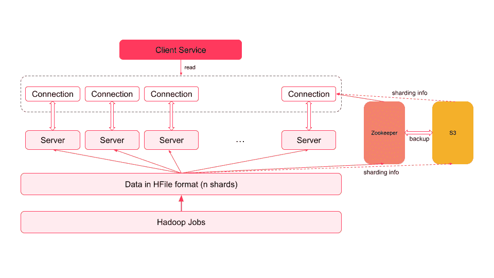

# muscle——Airbnb 派生数据的键值存储

> 原文：<https://medium.com/airbnb-engineering/mussel-airbnbs-key-value-store-for-derived-data-406b9fa1b296?source=collection_archive---------1----------------------->

**Airbnb 如何构建持久、高可用性和低延迟的键-值存储引擎，以访问来自离线和流媒体活动的派生数据。**

**By:** [钱德拉穆里](http://linkedin.com/in/chandramoulir)，[寿言郭](http://linkedin.com/in/shouyan-guo)，[俞希金](http://linkedin.com/in/yuxijin)

# 介绍

在 Airbnb 中，许多在线服务需要访问派生数据，这些数据是通过 Spark 等大规模数据处理引擎或 Kafka 等流媒体事件计算的数据，并离线存储。这些服务需要高质量的衍生数据存储系统，具有强大的可靠性、可用性、可扩展性和延迟保证，以服务在线流量。例如，user profiler 服务存储和访问 Airbnb 上的实时和历史用户活动，以提供更个性化的体验。

在这篇文章中，我们将讨论我们如何利用大量开源技术，包括 [HRegion](https://hbase.apache.org/devapidocs/org/apache/hadoop/hbase/regionserver/HRegion.html) 、 [Helix](https://helix.apache.org/) 、 [Spark](https://spark.apache.org/) 、 [Zookeeper](https://zookeeper.apache.org/) 和 [Kafka](https://kafka.apache.org/) 来为数百个 Airbnb 产品和平台用例构建可扩展的低延迟键值商店。

# Airbnb 的衍生数据

在过去的几年里，Airbnb 发展并增强了我们对衍生数据服务的支持，从推出定制解决方案的团队转移到名为 muscle 的多租户存储平台。这一演变可以概括为三个阶段:

**第一阶段(2015 年 1 月):统一只读键值存储(HFileService)**

在 2015 年之前，Airbnb 内部没有满足四个关键要求的统一键值存储解决方案:

1.  扩展到 Pb 级数据
2.  高效批量加载(批量生成和上传)
3.  低延迟读取(< 50 毫秒 p99)
4.  可供多个客户使用的多租户存储服务

此外，现有的解决方案都不能满足这些要求。 [MySQL](https://www.mysql.com/) 不支持批量加载， [Hbase](https://hbase.apache.org/) 的大规模批量加载(distcp)不是最佳和可靠的，RocksDB 没有内置的水平分片，我们没有足够的 C++专业知识来构建支持 RocksDB 文件格式的批量加载管道。

于是我们构建了 HFileService，内部使用了[HFile](http://devdoc.net/bigdata/hbase-0.98.7-hadoop1/book/hfilev2.html#:~:text=HFile%20is%20a%20low%2Dlevel,to%20write%20those%20inline%20blocks.)(Hadoop h base 的构建块，基于 Google 的 SSTable):

*Fig. 1: HFileService Architecture*

1.  服务器经过分片和复制，以解决可扩展性和可靠性问题
2.  碎片的数量是固定的(相当于批量加载作业中 Hadoop reducers 的数量),服务器到碎片的映射存储在 Zookeeper 中。我们通过手动更改 Zookeeper 中的映射来配置映射到特定 shard 的服务器数量
3.  一个日常的 Hadoop 任务将离线数据转换为 HFile 格式，并上传到 S3。每台服务器都将自己分区的数据下载到本地磁盘，并删除旧版本的数据
4.  不同的数据源由主键划分。客户端通过计算主键的散列值并以碎片总数为模来确定其请求应该到达的正确碎片。然后查询 Zookeeper 以获得拥有这些碎片的服务器列表，并向其中一个服务器发送请求

**第二阶段(2015 年 10 月):存储实时数据和衍生数据(Nebula)**

虽然我们构建了一个支持高效批量装载和低延迟读取的多租户键值存储，但它也有缺点。例如，它不支持点、低延迟写入，并且对存储数据的任何更新都必须通过每日批量加载作业。随着 Airbnb 的发展，对低延迟访问实时数据的需求越来越大。

因此，Nebula 被构建为在单个系统中支持批量更新和实时数据。它内部使用 DynamoDB 存储实时数据，使用 S3/HFile 存储批量更新数据。Nebula 引入了基于时间戳的版本控制机制作为版本控制机制。对于读取请求，将从 HFileService 中的动态表列表和静态快照中读取数据，并基于时间戳合并结果。

为了最大限度地减少在线合并操作，Nebula 还安排了每天运行的 spark 作业，并将 DynamoDB 数据的快照与 HFileService 的静态快照合并。Zookeeper 用于协调动态表的写可用性、被标记为 ready 的快照以及过时表的丢弃。

Fig. 2: Nebula Architecture

**第 3 阶段(2018 年):可扩展和低延迟的键值存储引擎(muslet)**

在第 3 阶段，我们构建了一个支持实时读写和批量更新数据的系统，并提供了基于时间戳的冲突解决方案。然而，仍有改进的机会:

1.  向外扩展的挑战:随着数据增长，在 Zookeeper 中手动编辑分区映射很麻烦，或者通过添加额外的节点来横向扩展系统以增加流量也很麻烦
2.  在峰值写入流量下提高读取性能
3.  高维护开销:我们需要同时维护 HFileService 和 DynamoDB
4.  低效的合并过程:随着我们的总数据变得越来越大，合并 DynamoDB 和 HFileService 每日增量更新的过程变得非常缓慢。DynamoDB 中的每日更新数据仅为 HFileService 中基线数据的 1–2%。但是，我们每天将完整的快照(总数据大小的 102%)重新发布回 HFileService

为了解决这些缺点，我们想出了一个新的键值存储系统，叫做**musle**。

1.  我们引入了 Helix 来管理集群中的分区映射
2.  我们利用 Kafka 作为复制日志，将写入复制到所有副本，而不是直接写入 muscle 存储
3.  我们使用 HRegion 作为 muscle 存储节点中唯一的存储引擎
4.  我们构建了一个 Spark 管道，将数据从数据仓库直接加载到存储节点

让我们在下面的段落中更详细地讨论一下。

Fig. 3: Mussel Architecture

**用 Helix 管理分区**

在 muscle 中，为了使我们的集群更具可伸缩性，我们将碎片的数量从 HFileService 中的 8 个增加到了 1024 个。在 muscle 中，数据通过主键的散列划分到这些碎片中，所以我们引入了 Apache Helix 来管理这些逻辑碎片。Helix 自动管理逻辑碎片到物理存储节点的映射。每个 muscle 存储节点可以保存多个逻辑碎片。每个逻辑碎片都在多个 muscle 存储节点上复制。

**卡夫卡式的无领导复制**

由于 muscle 是一个读取量很大的商店，所以我们采用了无领导架构。读取请求可以由具有相同逻辑碎片的任何 Mussel 存储节点提供服务，这增加了读取的可伸缩性。在写入路径中，我们需要考虑以下几点:

1.  我们希望平滑写入流量，以避免对读取路径的影响
2.  因为我们在每个分片中没有领导节点，所以我们需要一种方法来确保每个 Mussel 存储节点以相同的顺序应用写请求，以便不同节点之间的数据是一致的

为了解决这些问题，我们在这里引入了 Kafka 作为预写日志。对于写请求，它将首先异步写入 Kafka，而不是直接写入 muscle 存储节点。Kafka 主题有 1024 个分区，每个分区属于 Mussel 中的一个逻辑片。每个贻贝存储节点将轮询来自 Kafka 的事件，并将更改应用到其本地存储。由于碎片之间没有主从关系，这种配置允许分区内正确的写入顺序，从而确保一致的更新。这里的缺点是它只能提供最终的一致性。但是，考虑到派生的数据用例，为了确保可用性和分区容差，在一致性上做出妥协是可以接受的。

**在一个存储引擎中支持读取、写入和压缩**

为了降低管理 DynamoDB 的硬件成本和操作负载，我们决定将其移除，并扩展 HFileService 作为唯一的存储引擎来同时服务于实时和离线数据。为了更好地支持读写操作，我们使用了 [HRegion](https://hbase.apache.org/1.1/apidocs/org/apache/hadoop/hbase/regionserver/HRegion.html) 而不是 [Hfile](https://hbase.apache.org/devapidocs/org/apache/hadoop/hbase/io/hfile/HFile.html) 。HRegion 是一个全功能的键值存储，具有 MemStore 和 BlockCache。在内部，它使用日志结构的合并(LSM)树来存储数据，并支持读写操作。

HRegion 表包含列族，列族是列的逻辑和物理分组。列族中有列限定符，它们是列。柱族包含带有时间戳版本的柱。列只有在被插入时才存在，这使得 HRegion 成为一个稀疏数据库。我们将客户数据映射到 HRegion，如下所示:

通过这种映射，对于读取查询，我们能够支持:

1.  用主键查找数据的点查询
2.  通过扫描辅助关键字上的数据进行前缀/范围查询
3.  查询最新数据或特定时间范围内的数据，因为写入 Mussel 的实时和离线数据都有时间戳

因为我们在 Mussel 中有超过 4000 个客户端表，所以每个用户表都映射到 HRegion 中的一个列族，而不是它自己的表，以减少元数据管理层的可伸缩性挑战。此外，由于 HRegion 是一个基于列的存储引擎，每个列族都存储在一个单独的文件中，因此可以独立地读/写它们。

对于写请求，它使用来自 Kafka 的写请求，并调用 HRegion put API 直接写数据。对于每个表，它还可以支持定制最大版本和 TTL(生存时间)。

当我们用 HRegion 处理写请求时，另一件要考虑的事情是压缩。需要运行压缩来清理已删除或已达到最大版本或最大 TTL 的数据。同样，当 HRegion 中的 MemStore 达到一定大小时，它会被刷新到磁盘的 StoreFile 中。压缩会将这些文件合并在一起，以减少磁盘寻道并提高读取性能。然而，另一方面，当压缩运行时，它会导致更高的 cpu 和内存使用率，并阻止写入以防止 JVM (Java 虚拟机)堆耗尽，这会影响集群的读写性能。

这里，我们使用 Helix 将每个逻辑碎片的 Mussel 存储节点标记为两种类型的资源:在线节点和批处理节点。例如，如果一个逻辑片有 9 个 Mussel 存储节点，其中 6 个是在线节点，3 个是批处理节点。在线和批量的关系是:

1.  它们都服务于写请求
2.  只有在线节点为读取请求提供服务，我们对在线节点上的压缩进行了速率限制，以获得良好的读取性能
3.  Helix 安排在线节点和批处理节点之间的每日轮换。在上面的示例中，它将 3 个在线节点移动到批处理，并将 3 个批处理节点移动到在线，这样这 3 个新的批处理节点就可以执行全速主压缩来清理旧数据

有了这一改变，现在我们能够用一个存储引擎同时支持读取和写入。

**支持从数据仓库进行批量加载**

我们支持两种类型的通过[气流](https://airflow.apache.org/)从数据仓库到 muscle 的批量装载管道:合并类型和替换类型。合并类型意味着合并来自数据仓库的数据和来自先前写操作的带有旧时间戳的数据。替换意味着从数据仓库导入数据，并删除所有带有以前时间戳的数据。

我们利用 Spark 将数据仓库中的数据转换成 HFile 格式，并上传到 S3。每个 muscle 存储节点下载文件，并使用 HRegion bulkLoadHFiles API 将这些 HFiles 加载到列族中。

有了这个批量加载管道，我们可以每天只将增量数据加载到集群中，而不是完整的数据快照。在迁移之前，用户配置文件服务每天需要将大约 4TB 的数据加载到集群中。之后，它只需要加载大约 40–80GB，大大降低了成本并提高了群集的性能。

# 结论和下一步措施

在过去的几年里，Airbnb 在为我们的工程师提供高质量的衍生数据存储方面取得了很大进展。最新的键值存储 muscle 在 Airbnb 中被广泛使用，并已成为任何基于键值的应用程序的基础构建块，具有强大的可靠性、可用性、可伸缩性和性能保证。自从引入以来，在 muscle 中创建了大约 4000 个表，在我们的生产集群中存储了大约 130TB 的数据，而没有复制。muscle 一直在可靠地为大量读取、写入和批量加载请求提供服务:例如，我们最大的集群 muscle-general 已经实现了> 99.9%的可用性，平均读取 QPS > 800k，平均写入 QPS > 35k，平均 P95 读取延迟小于 8 毫秒。

尽管 muscle 可以很好地服务于我们当前的用例，但仍有许多改进的机会。例如，我们期待为我们的客户提供写后读一致性。我们还希望基于集群中的流量实现自动扩展和重新分区。我们期待着尽快分享更多的细节。

# 感谢

muscle 是 Airbnb 仓储团队的合作成果，团队成员包括: [Calvin Zou](http://linkedin.com/in/calvinzou) 、 [Dionitas Santos](linkedin.com/in/dionitas) 、 [Ruan Maia](http://linkedin.com/in/ruan-maia-367281161) 、 [Wonhee Cho](http://linkedin.com/in/wonheec) 、[王小谋](linkedin.com/in/xiaomou-wang-5880b537)、[张艳菡](linkedin.com/in/yanhan-zhang-724088a4)。

有兴趣在 Airbnb 仓储团队工作吗？看看这个角色:[员工软件工程师，分布式存储](https://careers.airbnb.com/positions/3029584/)