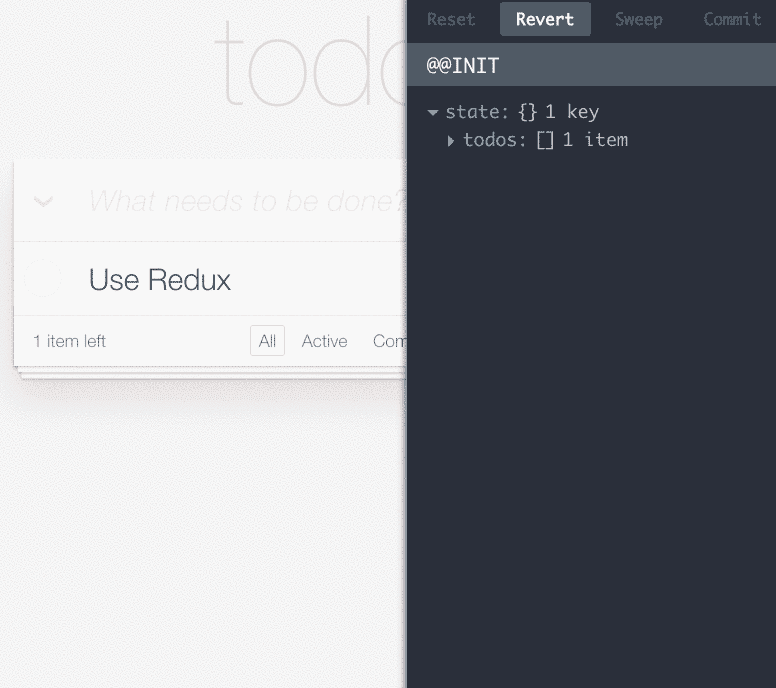

# 一定要看看让其他开发工具相形见绌的 JavaScript 开发工具

> 原文：<https://medium.com/javascript-scene/must-see-javascript-dev-tools-that-put-other-dev-tools-to-shame-aca6d3e3d925?source=collection_archive---------1----------------------->


Tools — Josep Ma. Rosell (CC BY 2.0)

> “JavaScript 不适合大型应用，因为它甚至不能识别变量的类型，它不适合重构。”~很多非常困惑的人

当我开始研究 JavaScript 时，只有一个浏览器很重要:网景。它完全占据了主导地位，直到微软开始将 IE 与操作系统一起发布。在那个年代，JavaScript 的开发者工具很弱的说法其实是对的。

但是很长一段时间以来都不是这样，今天，JavaScript 拥有我见过的任何语言中最好的开发工具生态系统。

注意，我说的不是“最好的 IDE”。如果您正在寻找一个统一整个开发工具体验的中央 IDE，请查看微软的 Visual Studio for C#。与 Unity 一起度过美好时光。我自己不使用它，但是我从我信任的人那里听说它非常可靠。

我用过 C++和虚幻游戏引擎。第一次尝试时，我意识到 web 平台开发工具还有很长的路要走。

但是从那时起，我们已经走过了很长的路，我们现在在 JS 中使用的工具使花哨的 IDE 自动完成看起来像一个婴儿咀嚼玩具。特别是，JavaScript 的运行时工具在我所知的任何其他语言中都没有对手。

> " JavaScript 拥有我见过的所有语言中最好的开发工具生态系统."

## 什么是开发工具？

开发者工具是一个软件集合，它让开发者的生活变得更加轻松。传统上，我们认为它们主要是 IDE、linter、编译器、调试器和分析器。

但是 JavaScript 是一种动态语言，随着它的动态特性而来的是对更多运行时开发工具的需求。JavaScript 绝对有这种能力。

出于本文的目的，我将包括运行时工具，甚至一些增强运行时开发人员可见性和调试的库。开发工具和库之间的界限开始变得模糊。令人震惊的结果。

## **TL；DR 快速列表:**

*   [原子](https://atom.io/) & [原子](https://atom.io/packages/atom-ternjs)
*   [Chrome 开发工具](https://developer.chrome.com/devtools)
*   [页面速度洞察](https://developers.google.com/speed/pagespeed/insights/)
*   [火狐开发者版](https://www.mozilla.org/en-US/firefox/developer/)
*   [浏览器同步](http://www.browsersync.io/)
*   [TraceGL](https://github.com/traceglMPL/tracegl)
*   [节点检查调试器](#f19f)
*   [ESLint](http://eslint.org/)
*   [rtype](https://github.com/ericelliott/rtype)(spec)&[rfx](https://github.com/ericelliott/rfx)(库)**警告:**这些是未完成的开发者预览。
*   [巴别塔](http://babeljs.io)
*   [green keeper . io](http://greenkeeper.io/)&[updtr](https://github.com/peerigon/updtr)
*   [反应](https://facebook.github.io/react/)
*   [Webpack](https://webpack.github.io/) + [热模块更换](https://github.com/webpack/docs/wiki/list-of-plugins)
*   [Redux](http://redux.js.org/)+[Redux DevTools](https://github.com/gaearon/redux-devtools)

## 关于工具

你的开发生活将围绕两件事:编辑器和运行环境(例如，浏览器、平台和设备)。

编辑:我开始我的开发生涯时使用的是大型的、大规模集成的 IDE，比如 Borland IDE、Microsoft Visual Studio、Eclipse 和 WebStorm。在我看来，这其中最好的是 **WebStorm** 和 **Visual Studio** 。

但是我厌倦了那些 ide 带来的臃肿，所以在过去的几年里，我用更精简的编辑器完成了我的大部分编码。主要是崇高的文字，不过我最近换成了 [**原子**](https://atom.io/) 。您还会希望 [atom-ternjs](https://atom.io/packages/atom-ternjs) 启用 JavaScript 智能感知特性。阅读[“Atom 中的超级 JavaScript 开发”](/@satya164/supercharged-javascript-development-in-atom-ea034e22eabc#.a2b8sthbw)获得大量优秀的 Atom 插件。

您可能还想看看 Visual Studio 代码。一个更精简的 Visual Studio，适合喜欢 Sublime Text 和 Atom 等最小可插拔编辑器的人。

我还使用 vim 从终端进行快速编辑。

当我开始为 web 编程时，我想念集成调试器，但是 Chrome 和 FireFox 团队已经将运行时调试提升到了一个全新的水平。今天，似乎每个人都知道 Chrome 的 DevTools 以及如何单步调试代码，但是你知道它在高级性能&内存分析和审计方面有很好的特性吗？你用过火焰图表或者支配者视图吗？

说到绩效审计，你还需要了解 [PageSpeed Insights](https://developers.google.com/speed/pagespeed/insights/) :

除了这些优点之外，还有一些很酷的实时编辑 CSS 的特性，非常酷的特性可以帮助你编辑动画。了解你的 Chrome 开发工具。你不会后悔的。

为了不被超越，FireFox 有一个专门为开发者设计的浏览器。[火狐开发者版](https://www.mozilla.org/en-US/firefox/developer/):

browser sync:[browser sync](http://www.browsersync.io/)是一种通过同时控制几个浏览器来测试你的响应布局的好方法。换句话说，您可以使用 Browsersync CLI 在桌面、平板电脑和手机上打开您的应用程序。

你可以告诉它监视文件，并在文件改变时自动重新加载同步的浏览器。滚动、点击和表单交互等操作也将在不同设备之间同步，因此您可以轻松测试您的应用程序工作流，并确保任何地方都显示正确。

TraceGL: [TraceGL](https://github.com/traceglMPL/tracegl) 是一个运行时调试工具，它可以让你实时观察软件中所有的函数调用，而不是一步一步地手动调试你的代码。它超级强大，极其有用。

**节点检查调试器:**最新的 Node v6.x.x 稳定版本内置了一个支持 Chrome 的节点检查风格调试器。有了它，你可以连接到正在运行的节点进程，并使用 Chrome 的 DevTools 单步调试你的代码。

为了在 Babel 中使用它，我使用了下面的 *`debug.js`* 脚本:

```
require('babel-core/register');
require('./index');
```

要启动调试器，请执行以下操作:

```
node --inspect source/debug.js
```

很管用。

林挺:到目前为止，ESLint 是我用过的所有语言中最好的 linter。我喜欢它胜过 JSHint，也胜过 JSLint 很多。如果你不确定用什么，别担心，用 ESLint。为什么这么酷？

*   非常可配置—每个选项都可以启用和禁用。它们甚至可以接受参数。
*   创建自己的规则。你有你自己的风格惯例想要在你的团队中实施吗？可能有这样的规则，但是如果没有，你可以自己写。
*   支持插件——使用一些特殊的语法？ES6+还是 JavaScript 未来版本的实验性特性？没问题。React 的紧凑 UI 组件的 JSX 语法？没问题。你自己的实验性 JavaScript 语法扩展？没问题。

**类型支持:** JavaScript 具有松散的类型，这意味着你不必注释你所有的类型。在用 C++和 Java 这样的语言注释了很多年之后，当我开始使用 JavaScript 时，我立刻感觉到肩上的认知负荷减轻了。类型注释会在源文件中产生噪音。没有它们，函数往往更容易理解。

与普遍的看法相反， **JavaScript 确实有类型**，但是 JavaScript 类型**没有类型化变量，而是值**。可以使用类型推断来识别和预测变量类型(这就是 Atom TernJS 插件的用途)。

也就是说，类型注释和签名声明确实有用:它们为开发人员提供了很好的文档。它们还可以为 JavaScript 引擎和编译器创建者提供一些重要的性能优化。作为一名构建应用程序的 JavaScript 程序员，您不应该担心性能提升。把这留给引擎和规范团队吧。

但是我最喜欢类型注释的一点是运行时类型反射，以及使用它可以启用的运行时开发工具。要了解这些工具会是什么样子，请阅读[“编程的未来:WebAssembly 和 JavaScript 之后的生活”](http://www.sitepoint.com/future-programming-webassembly-life-after-javascript/)。

多年来，我使用 JSDoc 进行注释、文档和类型推断。但是我厌倦了它笨拙的局限性。感觉是为另一种语言写的，后来挤进了 JavaScript(确实如此)。

我还对 TypeScript 的结构类型解决方案印象深刻。

尽管 TypeScript 有问题:

*   它不是标准的 JavaScript——选择使用 TypeScript 意味着选择使用 TypeScript 编译器和工具生态系统——通常选择不使用符合 JavaScript 标准的解决方案。
*   它是基于阶级的。不适合 JavaScript 的原型和对象组合。
*   它还没有提供一个运行时解决方案……他们正在使用新 JavaScript **Reflect** API 的实验性特性来解决这个问题，但是接下来你就要依赖非常实验性的规范特性了，这些特性可能会也可能不会出现在规范中。

出于这些原因，我开始了(目前尚未完成的)rtype T1 和 T2 rfx T3 项目。 **rtype** 是一个函数和接口签名的规范，旨在为已经了解 JavaScript 的读者提供自我文档。rfx 是一个库，用来包装你的 JS 函数和对象，以便添加类型元数据。它还可以选择添加自动运行时类型检查。我正积极地与人们合作来改进 rtype 和 rfx。欢迎您的贡献。

请记住，他们还很年轻，而且几乎肯定会在短期内发生突破性的变化。

Babel: [Babel](http://babeljs.io/) 是一个编译器，它允许你在你的 JavaScript 代码中使用 ES6+、JSX 等尚未支持的特性。它的工作原理是将你的代码转换成等价的 ES5。一旦您开始使用它，我预测您会很快对新语法上瘾，因为 ES6 为该语言提供了一些真正有价值的语法补充，如析构赋值、默认参数值、rest 参数和 spread、简洁的对象文字，等等…请查看[“如何将 ES6 用于通用 JavaScript 应用程序”](/javascript-scene/how-to-use-es6-for-isomorphic-javascript-apps-2a9c3abe5ea2)了解详细信息。

**green keeper . io:**[green keeper](http://greenkeeper.io/)监控您的项目依赖关系，并自动打开您的项目的拉取请求。确保您已经连接了一个 CI 解决方案来自动测试拉请求。如果测试通过，只需点击“合并”，就大功告成了。如果他们失败了，你可以手动挖掘并找出需要修复的地方，或者直接关闭 PR。

如果你喜欢亲身实践的方法，请查看 [**updtr**](https://github.com/peerigon/updtr) 。我建议您在第一次启用 Greenkeeper 之前对您的 repo 运行 updtr。

Webpack: [Webpack](https://webpack.github.io/) 将模块和依赖项捆绑成浏览器的静态资产。它启用了许多真正有趣的功能，如热模块替换，这使您在浏览器中的实时代码在您更改文件时自动更新，而无需重新加载页面。热模块替换是实现真正持续的实时开发者反馈循环的第一步。如果你没有使用它，你应该使用它。要快速入门，请查看 [**Universal React 样板文件**](https://github.com/cloverfield-tools/universal-react-boilerplate) 项目中的 webpack 配置。

**React:** 这个有点牵强，因为 [React](https://facebook.github.io/react/) 严格来说并不是一个开发者工具。它与 UI 库有更多的共同点。可以把 React 看作现代的 jQuery:一种处理 DOM 的简单方法。但是反应不止于此。它实际上是一个 UI 抽象层，将您从 DOM 中抽象出来。事实上，React 的目标远不止 DOM，包括原生移动 UI API(iOS&Android)、WebGL、canvas 等等。网飞用它来瞄准他们自己的电视设备 Gibbon 渲染 API。

那么，为什么我把它列在开发人员工具中呢？因为 React 的抽象层被一些伟大的开发人员工具用来实现未来令人惊叹的开发人员工具，具有热加载(无需页面刷新即可更新您的实时运行代码)、时间旅行等特点…请继续阅读！

**Redux+Redux dev tools:**Redux 是一个应用状态管理库，灵感来源于 React/Flux 架构和来自函数式编程的纯函数概念。开发人员工具列表中的另一个库？没错。原因如下:

Redux 和 Redux DevTools 实现了针对实时运行代码的真正下一级调试交互。它可以让你对你的应用程序中已经执行的操作有非常好的、可以理解的了解:



它甚至允许您使用时间旅行调试功能在时间中来回穿梭。以下是滑块视图的外观:


## **结论**

JavaScript 拥有我见过的所有语言中最丰富的开发工具。如您所见，这更像是一个拼凑而成的 IDE 环境，但我们正处于 JavaScript 开发的寒武纪大爆发时期。在未来，我们可能会看到更具凝聚力的集成开发工具产品。与此同时，我们可以一窥编程的未来。

我预测，随着 JavaScript 更深入地进入统一应用程序状态和不变性，我们将看到更多的实时编程功能上线(这些功能支持 Redux DevTools 中的时间旅行调试)。

我还认为，随着时间的推移，我们正在构建的应用程序和我们用来构建它的开发环境之间的界限将会变得模糊。例如，虚幻游戏引擎将蓝图编辑集成到游戏引擎本身，允许开发人员和设计人员从运行的游戏内部构建复杂的行为。我认为，随着时间的推移，我们将开始在 web 和本地移动应用程序中看到这些功能。

据我所知，JavaScript 的林挺、运行时监控和时间旅行调试功能在任何语言中都是无与伦比的，但我们可以做更多的事情来与虚幻引擎 4 的 Blueprint system 等工具相媲美。我迫不及待地想知道接下来会发生什么。

# [跟随 Eric Elliott 学习 JavaScript】](https://ericelliottjs.com/)

*   在线课程+定期网络广播
*   软件测试
*   JavaScript 的两大支柱(原型 OO +函数式编程)
*   通用 JavaScript
*   结节
*   反应

***Eric Elliott*** *著有* [*【编程 JavaScript 应用】*](http://pjabook.com) *(O'Reilly)，以及* [*【学习 JavaScript 通用 App 开发用节点，ES6，&*](https://leanpub.com/learn-javascript-react-nodejs-es6/)*。他曾为****Adobe Systems*******尊巴健身*******华尔街日报*******ESPN*******BBC****等顶级录音师贡献过软件经验*****

**他大部分时间都在旧金山湾区和世界上最美丽的女人在一起。**