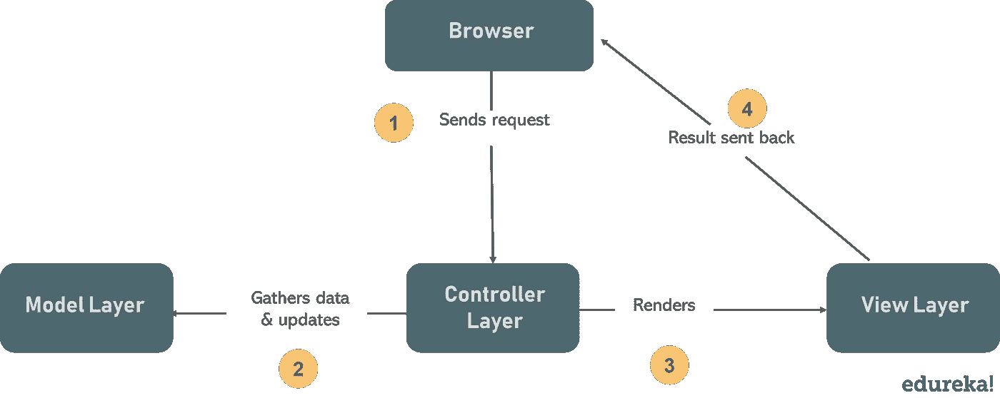

# 如何用 Java 实现 MVC 架构？

> 原文：<https://medium.com/edureka/mvc-architecture-in-java-a85952ae2684?source=collection_archive---------4----------------------->


在 web 开发领域，模型-视图-控制器是当今 Web 编程世界中讨论最多的设计模式之一。MVC 架构最初包含在两个主要的 web 开发框架中——Struts 和 Ruby on Rails。在本文中，让我们探索一下 Java 中的 MVC 架构。

本文将涉及的主题如下:

*   Java 中的 MVC 架构是什么？
*   MVC 架构的优势
*   演示:用 Java 实现 MVC

在我们真正进入 MVC 架构的技术细节之前，您需要了解一些概念。

*   ***设计模式*** ，在软件工程中，是一种解决软件设计时常见问题的技术。
*   ***设计模型，*** 指定你使用什么类型的架构来解决问题或者设计模型。
*   有两种 ***类型的设计模型*** : *模型 1 架构*，*模型 2(MVC)架构。*

# Java 中的 MVC 架构是什么？

基于 MVC 架构的模型设计遵循 MVC 设计模式，它们在设计软件时将应用程序逻辑从用户界面中分离出来。顾名思义，MVC 模式有三层，它们是:

*   ***模型*** —代表应用的业务层
*   ***视图*** —定义应用程序的演示
*   ***控制器*** —管理应用程序的流程



在 Java 编程环境中，模型由简单的 Java 类组成，视图显示数据，控制器由 servlets 组成。这种分离导致用户请求被如下处理:

1.  客户机上的浏览器向服务器上的控制器发送页面请求
2.  控制器执行调用模型的动作，从而响应请求检索它需要的数据
3.  然后，控制器将检索到的数据提供给视图
4.  视图被呈现并发送回客户机供浏览器显示

出于多种原因，将软件应用程序分成这三个不同的组件是一个好主意。让我们来看看这些是什么。

# Java 中 MVC 架构的优势

在开发应用程序时，MVC 架构为程序员提供了许多优势，包括:

*   多个开发人员可以同时使用三个层(模型、视图和控制器)
*   提供改进的可伸缩性，补充了应用程序的增长能力
*   由于组件之间的依赖程度很低，所以很容易维护
*   一个模型可以被多个视图重用，这提供了代码的可重用性
*   采用 MVC 使应用程序更具表现力，更容易理解
*   应用程序的扩展和测试变得很容易

现在你知道为什么 MVC 是 web 编程世界中最流行的设计模式了。但是，如果您还在努力理解 MVC 的概念，不要担心。我们将深入挖掘每一层，并借助示例程序了解它们的用途。

# 用 Java 实现 MVC

为了实现基于 MVC 设计模式的 web 应用程序，我们将创建

*   ***课程类*** ，即充当*模型层*
*   ***CourseView 类*** ，定义了表示层(*视图层*)
*   ***course controller 类*** ，作为*控制器*

现在，让我们逐一探索这些层。

## 模型层

在 MVC 设计模式中，模型是定义系统业务逻辑的数据层，也代表应用程序的状态。对象在数据库中检索和存储模型的状态。通过这一层，我们将规则应用于数据，数据最终代表了我们的应用程序所管理的概念。现在，让我们使用*课程类创建一个模型。*

```
**package** MyPackage;
**public** **class** Course {
       **private** String CourseName;
       **private** String CourseId;
       **private** String CourseCategory;
       **public** String getId() {
       **return** CourseId;
       }
       **public** **void** setId(String id) {
       **this**.CourseId = id;
       } **public** String getName() {
      **return** CourseName;
      }
      **public** **void** setName(String name) {
      **this**.CourseName = name;
      } **public** String getCategory() {
      **return** CourseCategory;
      } **public** **void** setCategory(String category) {
      **this**.CourseCategory = category;
      }
      }
```

代码易于理解，不言自明。它包括获取/设置课程详细信息的功能。

## 视图层

MVC 设计模式的这一层表示应用程序或用户界面的输出。它显示控制器从模型层获取的数据，并在用户需要时将数据呈现给用户。它从控制器接收所有需要的信息，不需要直接与业务层交互。让我们使用 *CourseView 类创建一个视图。*

```
**package** MyPackage;**public** **class** CourseView {
       **public** **void** printCourseDetails(String CourseName, String CourseId,  String CourseCategory){
       System.out.println("Course Details: ");
       System.out.println("Name: " + CourseName);
       System.out.println("Course ID: " + CourseId);
      System.out.println("Course Category: " + CourseCategory);
     }
    }
```

这段代码只是将值打印到控制台。接下来我们有 web 应用程序的控制器。

## 控制器层

控制器就像是模型和视图之间的接口。它从视图层接收用户请求并处理它们，包括必要的验证。然后，请求被发送到模型进行数据处理。一旦它们被处理，数据再次被发送回控制器，然后显示在视图上。让我们创建一个充当控制器的*course controller 类*。

```
**package** MyPackage;**public** **class** CourseController {
       **private** Course model;
       **private** CourseView view; **public** CourseController(Course model, CourseView view){
        **this**.model = model;
        **this**.view = view;
       } **public** **void** setCourseName(String name){
       model.setName(name);
       } **public** String getCourseName(){
      **return** model.getName();
       } **public** **void** setCourseId(String id){
      model.setId(id);
       } **public** String getCourseId(){
      **return** model.getId();
        } **public** **void** setCourseCategory(String category){
      model.setCategory(category);
       } **public** String getCourseCategory(){
     **return** model.getCategory();
        }
     **public** **void** updateView(){
     view.printCourseDetails(model.getName(), model.getId(),     model.getCategory());
        }
     }
```

粗略地看一下代码，我们会发现这个控制器类只负责调用模型来获取/设置数据，并基于此更新视图。现在让我们看看所有这些是如何联系在一起的。

## 主 Java 类

我们姑且称这个类为“MVCPatternDemo.java”。查看下面的代码。

```
**package** MyPackage;**public** **class** MVCPatternDemo {
       **public** **static** **void** main(String[] args) { //fetch student record based on his roll no from the database
       Course model  = retriveCourseFromDatabase(); //Create a view : to write course details on console
       CourseView view = **new** CourseView(); CourseController controller = **new** CourseController(model, view);
     controller.updateView(); //update model data
     controller.setCourseName("Python");
     System.out.println("nAfter updating, Course Details are as follows");
     controller.updateView(); } **private** **static** Course retriveCourseFromDatabase(){
     Course course = **new** Course();
     course.setName("Java");
     course.setId("01");
     course.setCategory("Programming");
     **return** course;
   }
}
```

上面的类从 Further 获取课程数据，它还调用用户用来输入一组值的函数。然后，它将这些值推送到课程模型中。然后，它初始化我们在本文前面创建的视图。 *CourseController* 类，并将其绑定到*课程*类和*课程视图*类。然后，作为控制器一部分的 *updateView()* 方法更新控制台上的课程细节。查看下面的输出。

**输出**

```
Course Details:
Name: Java
Course ID: 01
Course Category: Programming
After updating, Course Details are as follows
Course Details:
Name: Python
Course ID: 01
Course Category: Programming
```

MVC 架构为你的代码提供了一个全新层次的模块化，这使得它更具可读性和可维护性。这就把我们带到了本文的结尾。希望你清楚已经与你分享的一切。

这就把我们带到了高级 Java 教程博客的结尾。我希望你发现这个博客信息丰富，增加了你的知识价值。
如果你想查看更多关于人工智能、DevOps、道德黑客等市场最热门技术的文章，你可以参考 [Edureka 的官方网站。](https://www.edureka.co/blog/?utm_source=medium&utm_medium=content-link&utm_campaign=mvc-architecture-in-java)

请留意本系列中的其他文章，它们将解释 Java 的各个方面。

> *1。* [*面向对象编程*](/edureka/object-oriented-programming-b29cfd50eca0)
> 
> *2。* [*继承 Java 中的*](/edureka/inheritance-in-java-f638d3ed559e)
> 
> *3。*[*Java 中的多态性*](/edureka/polymorphism-in-java-9559e3641b9b)
> 
> *4。*[*Java 中的抽象*](/edureka/java-abstraction-d2d790c09037)
> 
> *5。* [*Java 字符串*](/edureka/java-string-68e5d0ca331f)
> 
> *6。* [*Java 数组*](/edureka/java-array-tutorial-50299ef85e5)
> 
> *7。* [*Java 集合*](/edureka/java-collections-6d50b013aef8)
> 
> *8。* [*Java 线程*](/edureka/java-thread-bfb08e4eb691)
> 
> *9。*[*Java servlet 简介*](/edureka/java-servlets-62f583d69c7e)
> 
> *10。* [*Servlet 和 JSP 教程*](/edureka/servlet-and-jsp-tutorial-ef2e2ab9ee2a)
> 
> *11。*[*Java 中的异常处理*](/edureka/java-exception-handling-7bd07435508c)
> 
> 12。 [*Java 教程*](/edureka/java-tutorial-bbdd28a2acd7)
> 
> *13。* [*Java 面试题*](/edureka/java-interview-questions-1d59b9c53973)
> 
> *14。* [*Java 程序*](/edureka/java-programs-1e3220df2e76)
> 
> 15。 [*科特林 vs Java*](/edureka/kotlin-vs-java-4f8653f38c04)
> 
> 16。 [*依赖注入使用 Spring Boot*](/edureka/what-is-dependency-injection-5006b53af782)
> 
> 17。 [*堪比 Java 中的*](/edureka/comparable-in-java-e9cfa7be7ff7)
> 
> *18。* [*十大 Java 框架*](/edureka/java-frameworks-5d52f3211f39)
> 
> *19。* [*Java 反射 API*](/edureka/java-reflection-api-d38f3f5513fc)
> 
> 20。[*Java 中的 30 大模式*](/edureka/pattern-programs-in-java-f33186c711c8)
> 
> *21。* [*核心 Java 备忘单*](/edureka/java-cheat-sheet-3ad4d174012c)
> 
> *22。*[*Java 中的套接字编程*](/edureka/socket-programming-in-java-f09b82facd0)
> 
> *23。* [*Java OOP 备忘单*](/edureka/java-oop-cheat-sheet-9c6ebb5e1175)
> 
> *24。*[*Java 中的注释*](/edureka/annotations-in-java-9847d531d2bb)
> 
> *25。*[*Java 中的库管理系统项目*](/edureka/library-management-system-project-in-java-b003acba7f17)
> 
> *26。*[*Java 中的树*](/edureka/java-binary-tree-caede8dfada5)
> 
> *27。*[*Java 中的机器学习*](/edureka/machine-learning-in-java-db872998f368)
> 
> *28。* [*顶级数据结构&Java 中的算法*](/edureka/data-structures-algorithms-in-java-d27e915db1c5)
> 
> *29。* [*Java 开发人员技能*](/edureka/java-developer-skills-83983e3d3b92)
> 
> 三十岁。 [*前 55 名 Servlet 面试问题*](/edureka/servlet-interview-questions-266b8fbb4b2d)
> 
> 31。 [](/edureka/java-exception-handling-7bd07435508c)[*顶级 Java 项目*](/edureka/java-projects-db51097281e3)
> 
> *32。* [*Java 字符串备忘单*](/edureka/java-string-cheat-sheet-9a91a6b46540)
> 
> 33。[*Java 中的嵌套类*](/edureka/nested-classes-java-f1987805e7e3)
> 
> 34。 [*Java 集合面试问答*](/edureka/java-collections-interview-questions-162c5d7ef078)
> 
> *35。*[*Java 中如何处理死锁？*](/edureka/deadlock-in-java-5d1e4f0338d5)
> 
> *36。* [*你需要知道的 50 大 Java 合集面试问题*](/edureka/java-collections-interview-questions-6d20f552773e)
> 
> *37。*[*Java 中的字符串池是什么概念？*](/edureka/java-string-pool-5b5b3b327bdf)
> 
> 38。[*C、C++和 Java 有什么区别？*](/edureka/difference-between-c-cpp-and-java-625c4e91fb95)
> 
> 39。[*Java 中的回文——如何检查一个数字或字符串？*](/edureka/palindrome-in-java-5d116eb8755a)
> 
> *40。* [*你需要知道的顶级 MVC 面试问答*](/edureka/mvc-interview-questions-cd568f6d7c2e)
> 
> *41。*[*Java 编程语言的十大应用*](/edureka/applications-of-java-11e64f9588b0)
> 
> *42。*[*Java 中的死锁*](/edureka/deadlock-in-java-5d1e4f0338d5)
> 
> *43。*[*Java 中的平方和平方根*](/edureka/java-sqrt-method-59354a700571)
> 
> *44。*[*Java 中的类型转换*](/edureka/type-casting-in-java-ac4cd7e0bbe1)
> 
> *45。*[*Java 中的运算符及其类型*](/edureka/operators-in-java-fd05a7445c0a)
> 
> *46。*[*Java 中的析构函数*](/edureka/destructor-in-java-21cc46ed48fc)
> 
> *47。* [*爪哇*二分搜索法](/edureka/binary-search-in-java-cf40e927a8d3)
> 
> 48。[*Java 中的 MVC 架构*](/edureka/mvc-architecture-in-java-a85952ae2684)
> 
> *49。* [*冬眠面试问答*](/edureka/hibernate-interview-questions-78b45ec5cce8)

*原载于 2019 年 8 月 2 日 https://www.edureka.co**T21*[。](https://www.edureka.co/blog/mvc-architecture-in-java/)