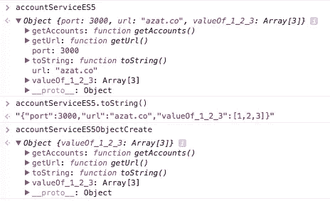
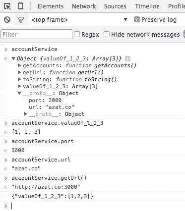
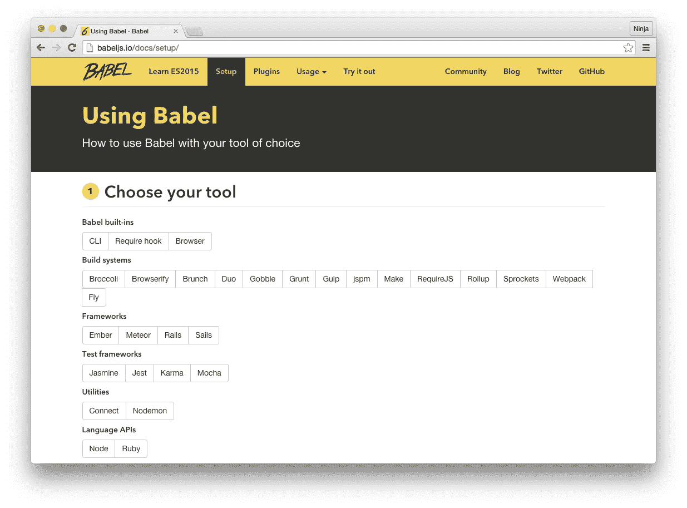

# 我最喜欢的 12 项 ES6/ES2015 功能

> 原文：<https://medium.com/capital-one-tech/my-12-favorite-es6-es2015-features-76e70397fee0?source=collection_archive---------0----------------------->


你知道 ES6 是什么吗？这是一个新的 JavaScript 标准！如果你是一名尚未使用 ES6(官方名称为 ES2015 或 ECMAScript 2015)的企业 JavaScript 开发人员，那么请继续升级你的技能，这是该语言自 2009 年以来的第一次重大更新。这篇文章将向您快速介绍 ES6 的 12 个特性，这个标准正在改变世界上最流行的编程语言——JavaScript。

排名不分先后，这里列出了我最喜欢的 12 个 ES6 特性，每个企业开发人员都应该知道:

1.  默认参数
2.  静止和伸展参数
3.  模板文字
4.  多行字符串
5.  解构分配
6.  增强的对象文字
7.  箭头功能
8.  承诺
9.  块范围的构造:Let 和 Const
10.  班级
11.  模块
12.  为了理解

过去，许多企业开发人员怀疑 JavaScript 是否可以作为一种可行的编程语言；而是偏爱 Java、Python 或 C++等语言。公平地说，早期的 JavaScript 有它的[怪癖](http://archive.oreilly.com/pub/a/javascript/excerpts/javascript-good-parts/bad-parts.html)，但是 ES6 代表了 JavaScript 的重大进步。

让我们看看语言的历史——那些不知道历史的人不能创造它。简短的 JavaScript 时间表:

**1995 年:** JavaScript 在网景公司诞生为 LiveScript

**1997 年:** ECMAScript 标准由欧洲计算机制造商协会制定

1999 年: ES3 问世，IE5 风靡一时

2000 年至 2005 年:XMLHttpRequest(又名 AJAX)在 Outlook Web Access (2000 年)和 Oddpost (2002 年)、Gmail (2004 年)和 Google Maps (2005 年)等应用程序中广受欢迎

**2009:** ES5 出来了(这是我们大多数人现在用的)带有 *forEach，Object.keys，Object.create* (专门为[道格拉斯·克洛克福特](http://www.crockford.com/))和标准 JSON

**2015:**ES6/ecmascript 2015 出来修复了 ES5 很多有问题的部分

2016 年: ES7 即将面世

JavaScript 历史课已经讲得够多了，让我们进入编码的正题，更深入地了解这次 ES6 更新和我最喜欢的 12 个 JavaScript 新特性。

## 1.ES6 中的默认参数

当我们编写模块时，我们需要考虑参数被省略的情况。换句话说，好的模块必须足够智能，能够拥有参数的默认值。在 ES5 中，您可以编写类似下面的代码，它使用逻辑 OR (||):

```
var getAccounts = function(limit) {
  var limit = limit || 10
  ...
}

var link = function (height, color, url) {
    var height = height || 50
    var color = color || 'red'
    var url = url || 'http://capitalone.io'
    ...
}
```

除了边缘情况之外，这些语句工作得很好。例如，如果值为 0 —因为在 JavaScript 中 0 是 falsy 条件默认为硬编码的值，而不是成为值本身，这在某些情况下可能是您所希望的。当然，谁需要 0 作为值(#sarcasmfont)，所以我们只是忽略了这个缺陷，使用逻辑 OR 反正…

或者可能事件一个 if/else 条件来检查未定义的值:

```
var getAccounts = function(limit) {
  if (typeof limit == 'undefined')  limit = 10
  ...
}
```

不再有了！在 ES6 中，我们可以将默认值放在函数的签名中，如下所示:

```
var getAccounts = function(limit = 10) {
  ...
}
var link = function(height = 50, color = 'red', url = 'http://capitalone.io') {
  ...
}
```

这不仅使用了更少的代码行，而且增加了可读性。顺便说一句，这个语法类似于 Ruby 和 Python！

## 2.ES6 中的静止和伸展参数

如果你曾经使用或编写过一个带有变量甚至无限数量参数的 JavaScript 函数，你就会知道*参数*对象。该对象包含传递给函数的所有参数。问题是这个*自变量*对象不是一个真正的数组。如果你想显式地使用像*排序*或*映射*这样的函数，你必须把它转换成一个数组。例如，这个请求函数使用 *call()* 转换*参数*:

```
function request(url, options, callback){
  var args = Array.prototype.slice.call(arguments, f.length);
  var url = args[0]
  var callback = args[2]
  // …
}
```

那么在 ES6 中有没有更好的方法来访问数组形式的无限数量的参数呢？是啊！这是 rest 参数语法，用省略号定义。例如，这是带有 rest 参数*回调*的 ES6 函数签名，回调成为带有其余参数的数组:

```
function(url, options, ...callbacks) {
  var callback1 = callbacks[0]
    var callback2 = callbacks[2]
  // ...
}
```

注意:在 rest 数组中，第一个参数是没有名字的，例如，回调是在索引 0 处，而不是像 ES5 的*参数*中那样在索引 2 处。此外，在 rest 参数后放置其他命名参数将导致一个**语法错误**。rest 参数是对 JavaScript 的一个很好的修饰，因为它取代了不是真正数组的 *arguments* 对象。

在 ES5 中，如果你想使用一个数组作为函数的参数，你必须使用 *apply()* 函数:

```
function request(url, options, callback) { 
  // ...
}
var requestArgs = ['http://capitalone.io', {...}, function(){...}]
request.apply(null, requestArgs)
```

现在，在 ES6 中，我们可以使用 spread 参数，这些参数在语法上与 rest 参数相似，因为它们使用省略号:

```
function request(url, options, callback) { 
  // ...
}
var requestArgs = ['http://capitalone.io', {...}, function(){...}]
request(...requestArgs)
```

ES6 开发人员可以在以下情况下使用 spread 运算符:

*   函数调用如上所示
*   数组文字，例如 *array2 = […array1，x，y，z]*
*   解构(本文的第五部分)
*   *new* 函数调用(构造函数)，例如 *var d = new Date(…dates)*
*   *push()* 调用，例如 *arr1.push(…arr2)*

spread 运算符的语法与 rest 参数类似，但 rest 用于函数定义/声明，spread 用于调用和文字。它们让开发人员不必输入额外的命令性代码，因此了解和使用它们是一项很好的技能。

## 3.ES6 中的模板文字

模板文字(或者在其他语言中称为插值)是一种在混合了一些文本的字符串中输出变量的方式，通常在用户界面中。在 ES5 中，我们必须像这样断弦。

```
var name = 'Your name is ' + first + ' ' + last + '.'
var url = 'http://localhost:3000/api/messages/' + id
```

幸运的是，在 ES6 中，我们可以在反勾字符串中使用新的语法 *${NAME}* :

```
var name = `Your name is ${first} ${last}.`
var url = `http://localhost:3000/api/messages/${id}`
```

这很简洁，让开发人员一眼就能看到字符串的最终结果，而不是试图评估连接表达式。

ES6 字符串模板很好，但是如果您使用字符串模板和内联代码标记，语法将在 Markdown 文档中引起冲突，(因为在 Markdown 中，内联代码也由反勾号标记)。顺便说一下，CoffeeScript 有一个我认为更好的解决方案，当它插入双终止字符串时(类似于 Ruby):

```
var name = "Your name is #{first} #{last}."
var url = "http://localhost:3000/api/messages/#{id}"
```

插值很好，但是如何在 JavaScript 中处理多行文本呢？

## 4.ES6 中的多行字符串

另一个有趣的语法糖衣是多行字符串。在 ES5 中，我们不得不使用这些方法中的一种，而且很难看。带串联:

```
var roadPoem = 'Then took the other, as just as fair,\n\t'
    + 'And having perhaps the better claim\n\t'
    + 'Because it was grassy and wanted wear,\n\t'
    + 'Though as for that the passing there\n\t'
    + 'Had worn them really about the same,\n\t'
```

或者用转义斜杠:

```
var fourAgreements = 'You have the right to be you.\n\
    You can only be you when you do your best.'
```

在 ES6 中，只需按如下方式使用反斜线:

```
var roadPoem = `Then took the other, as just as fair,
    And having perhaps the better claim
    Because it was grassy and wanted wear,
    Though as for that the passing there
    Had worn them really about the same,`

var fourAgreements = `You have the right to be you.
    You can only be you when you do your best.`
```

如果您必须在 JavaScript 代码中使用大量文本，多行字符串是一个有用的补充。

## 5.ES6 中的析构赋值

与多行字符串相比，析构可能是一个更难理解的概念，因为在幕后有一些魔法在起作用……假设你有简单的赋值，其中键 *userId* 和 *accountNumber* 是变量 *userId* 和 *accountNumber* :

```
var data = $('body').data(), // data has properties 
userId and accountNumber   userId = data.userId,   accountNumber = data.accountNumber
```

变量名和对象属性名相同的其他赋值示例:

```
var json = require('body-parser').json

var body = req.body, // body has username and password
  username = body.username,
  password = body.password
```

在 ES6 中，我们可以用这些语句替换上面的 ES5 代码:

```
var { userId, accountNumber} = $('body').data() 

var {json} = require('body-parser')

var {username, password} = req.body
```

这也适用于数组。疯了！

```
var [col1, col2]  = $('.column'),
  [line1, line2, line3, , line5] = file.split('\n')
```

适应[析构赋值语法](http://www.2ality.com/2015/01/es6-destructuring.html)可能需要一些时间，但这仍然是一个甜蜜的糖衣。

## 6.ES6 中增强的对象文字

在 ES6 中，你可以用对象文字做的事情是惊人的！我们从 ES5 中 JSON 的美化版本发展到了 ES6 中类似类的东西。

在企业开发中，代码模块化很重要，因为项目更大，有更多的活动部分。使用增强的对象文字，您可以创建加载了功能的真正强大的对象。

下面是一个典型的 ES5 对象文字，带有一些方法和属性:

```
var serviceBase = {port: 3000, url: 'azat.co'},
    getAccounts = function(){return [1,2,3]}

var accountServiceES5 = {
  port: serviceBase.port,
  url: serviceBase.url,
  getAccounts: getAccounts,
  toString: function() {
    return JSON.stringify(this.valueOf())
  },
  getUrl: function() {return "http://" + this.url + ':' + this.port},
  valueOf_1_2_3: getAccounts()
}
```

如果我们想更花哨，我们可以通过使用*对象使其成为原型来继承*service base*。create*方法:

```
var accountServiceES5ObjectCreate = Object.create(serviceBase)
var accountServiceES5ObjectCreate = {
  getAccounts: getAccounts,
  toString: function() {
    return JSON.stringify(this.valueOf())
  },
  getUrl: function() {return "http://" + this.url + ':' + this.port},
  valueOf_1_2_3: getAccounts()
}
```

我知道，*accountservices 5 object create*和*accountservices 5*并不完全相同，因为一个对象(*accountservices 5*)将具有 *__proto__* 对象中的属性，如下图所示:



但是为了这个例子，让我们认为它们是相似的。在 ES6 对象文字中，我们可以使用简写来赋值。例如，*getAccounts:**getAccounts*，就变成了 *getAccounts* 。

我们还可以在 *__proto__* 属性中设置原型(但不是' *__proto__ 【T9 ')。例如， *serviceBase* 就是一个原型:*

```
var serviceBase = {port: 3000, url: 'azat.co'},
    getAccounts = function(){return [1,2,3]}
var accountService = {
    __proto__: serviceBase,
    getAccounts,
```

此外，我们可以调用 super 并拥有动态键。例如， *toString()* 方法通过调用 *super.valueOf()* 返回一个 JSON 对象作为字符串，而 *valueOf_1_2_3* 是一个动态属性名:

```
toString() {
     return JSON.stringify((super.valueOf()))
    },
    getUrl() {return "http://" + this.url + ':' + this.port},
    [ 'valueOf_' + getAccounts().join('_') ]: getAccounts()
};
console.log(accountService)
```



这是对传统对象文字的一个很好的增强，因为开发人员可以打包更多的逻辑，比 ES5 对象做更多的事情！

## 7.ES6 中的箭头功能

这可能是我等待最多的功能。我喜欢 CoffeeScript 的[胖箭头](http://webapplog.com/understanding-fat-arrows-in-coffeescript)。现在我们在 ES6 中有它们。

粗箭头令人惊奇，因为它们会使您的 *this* 行为正常，即 *this* 将具有与函数上下文中相同的值——它不会像每次创建闭包时通常发生的那样发生变化。这种行为是 JavaScript 最糟糕的部分之一，经常会给初学这门语言的开发人员带来很多困惑。在 ES6 中使用箭头功能可以让我们停止使用那个 *=这个*或者 *self =这个*或者*_ 这个=这个或者。【绑定(本)】T31。*

例如，ES5 中的这段代码很难看，因为您可能会忘记用 *_this* 将上下文转移到闭包:

```
var _this = this
$('.btn').click(function(event){
  _this.sendData()
})
```

由于冗长， *bind()* 或 *call()* 方法也好不到哪里去。但是看看这个漂亮的 ES6 代码:

```
$('.btn').click((event) =>{
  this.sendData()
})
```

可悲的是，ES6 委员会认为借用 CoffeeScript 的细箭头太过了，并留给我们一个冗长的旧*函数*代替。([coffee script 中的瘦箭头](https://www.udemy.com/coffeescript/?couponCode=a)的工作方式类似于 ES5 和 ES6 中的常规*函数*)。

下面是另一个例子，我们使用*调用*将上下文传递给 ES5 中的 *logUpperCase()* 函数:

```
var logUpperCase = function() {
  var _this = this

  this.string = this.string.toUpperCase()
  return function () {
    return console.log(_this.string)
  }
}

logUpperCase.call({ string: 'es6 rocks' })()
```

而在 ES6 中，我们不需要跟 *_this* :

```
var logUpperCase = function() {
  this.string = this.string.toUpperCase()
  return () => console.log(this.string)
}

logUpperCase.call({ string: 'es6 rocks' })()
```

请注意，您可以在 ES6 中将旧的*功能*与 *= >* 混合搭配。当一个箭头函数和一行语句一起使用时，它就变成了一个表达式；即。它将隐式地*返回*那条语句的结果。如果你有不止一行，那么你需要显式地使用 return。

这个 ES5 代码从*消息*数组中创建一个数组:

```
var ids = ['5632953c4e345e145fdf2df8','563295464e345e145fdf2df9']
var messages = ids.map(function (value) {
  return "ID is " + value // explicit return
});
```

在 ES6 中将变成这样:

```
var ids = ['5632953c4e345e145fdf2df8','563295464e345e145fdf2df9']
var messages = ids.map(value => `ID is ${value}`) // implicit return
```

注意，我使用了字符串模板。CoffeeScript 的另一个特色…我喜欢它们！

括号 *()* 对于箭头函数签名中的单个参数是可选的。然而，当使用多个参数时，您将需要它们。在 ES5 中，代码有带显式返回的*函数*:

```
var ids = ['5632953c4e345e145fdf2df8', '563295464e345e145fdf2df9'];
var messages = ids.map(function (value, index, list) {
  return 'ID of ' + index + ' element is ' + value + ' ' // explicit return
});
```

现在，这里是 ES6 中的代码的一个更有说服力的版本，参数周围有括号和隐式返回:

```
var ids = ['5632953c4e345e145fdf2df8','563295464e345e145fdf2df9']
var messages = ids.map((value, index, list) => `ID of ${index} element is ${value} `) // implicit return
```

胖箭不是很棒吗？使用它们。

## 8.ES6 中的承诺

承诺一直是一个有争议的发展话题，尤其是在较大的组织中，很难就共同的方法达成一致。其中一个原因是 promise 实现使用了稍微不同的语法——Q、bluebird、deferred.js、vow、avow 和 jquery deferred 等等。另一个原因是，一些软件工程师说，“我们不需要承诺，可以使用异步、生成器、回调等。”

幸运的是，随着 ES6 增加了标准的*承诺*实现，争论有可能会平息下来！

让我们考虑一个相当简单的延迟异步执行的例子，使用 *setTimeout()* :

```
setTimeout(function(){   console.log('Yay!') }, 1000)
```

我们可以在 ES6 中重写这段代码，并承诺:

```
var wait1000 =  new Promise(function(resolve, reject) {
  setTimeout(resolve, 1000)
}).then(function() {
  console.log('Yay!')
})
```

或使用 ES6 箭头功能:

```
var wait1000 =  new Promise((resolve, reject)=> {
  setTimeout(resolve, 1000)
}).then(()=> {
  console.log('Yay!')
})
```

到目前为止，我们已经将代码行数从 3 行增加到 5 行，但没有任何明显的好处。没错，确实看起来违反直觉。如果我们在 *setTimeout()* 回调中有更多的嵌套逻辑，好处就来了。例如，这个 ES5 代码有两个嵌套的回调:

```
setTimeout(function(){
  console.log('Yay!')
  setTimeout(function(){
    console.log('Wheeyee!')
  }, 1000)
}, 1000)
```

它可以重写为 ES6 承诺，如下所示:

```
var wait1000 =  ()=> 
  new Promise((resolve, reject)=> {
    setTimeout(resolve, 1000)
  })

wait1000()
    .then(function() {
        console.log('Yay!')
        return wait1000()
    })
    .then(function() {
        console.log('Wheeyee!')
    });
```

正如您所观察到的，当我们重构回调时，代码组织发生了变化——仅将代码重构为带有承诺的代码。

这篇文章没有提到的另一个好处是——承诺也有一个失败一网打尽的回调，这是一个很好的特性。看看这个帖子，了解更多关于承诺的信息:[*ES6 承诺介绍*](http://jamesknelson.com/grokking-es6-promises-the-four-functions-you-need-to-avoid-callback-hell) 。

## 9.块范围的构造:Let 和 Const

你可能已经看到了 ES6 代码中奇怪的发音 *let* 。这不仅仅是一个糖衣功能。它更加复杂，并且为变量声明增加了更多的逻辑。

*let* 是一个新的*变量*，它允许开发者将变量的范围扩大到块。我们用花括号来定义块。在 ES5 中，块没有对变量做任何事情，如下所示:

```
function calculateTotalAmount (vip) {
  var amount = 0
  if (vip) {
    var amount = 1
  }
  { // more crazy blocks!
    var amount = 100
    {
      var amount = 1000
      }
  }  
  return amount
}

console.log(calculateTotalAmount(true))
```

在上面的代码中，结果将是 1000。哇！那是一个非常糟糕的错误。在 ES6 中，我们使用 *let* 将范围限制到块。然后变量的作用域是函数。

```
function calculateTotalAmount (vip) {
  var amount = 0 // probably should also be let, but you can mix var and let
  if (vip) {
    let amount = 1 // first amount is still 0
  } 
  { // more crazy blocks!
    let amount = 100 // first amount is still 0
    {
      let amount = 1000 // first amount is still 0
      }
  }  
  return amount
}

console.log(calculateTotalAmount(true))
```

在这段代码中，值为 0，因为 *if* 块也有 *let* 声明。如果它什么都没有( *amount=1* )，那么表达式应该是 1。

到了 *const* ，事情就好办了；它只是防止重新赋值，而且它也是块范围的，就像 *let* 一样。为了演示，这里有多个常量，代码运行良好，因为 *const* 语句属于不同的块:

```
function calculateTotalAmount (vip) {
  const amount = 0  
  if (vip) {
    const amount = 1 
  } 
  { // more crazy blocks!
    const amount = 100 
    {
      const amount = 1000
      }
  }  
  return amount
}

console.log(calculateTotalAmount(true))
```

依我拙见，*让*和 *const* 把语言复杂化了。没有它们，我们只有一种行为，现在有多种情况需要考虑。；-(对于来自 Java 等语言的 JavaScript 新手来说， *const* 和 *let* 提供了一个新的内置防护层来防止一些不可预测的行为。

## 10.ES6 中的类别

如果你喜欢面向对象编程(OOP)，那么你会喜欢这个特性。这使得在 ES6 中编写类，并从它们继承，就像喜欢评论脸书一样简单。

在 ES5 中，至少可以说类的创建和使用是困难的。没有关键字*类*(被保留，但什么也没做)。除此之外，许多继承模式，如[伪经典](http://javascript.info/tutorial/pseudo-classical-pattern)、[经典](http://www.crockford.com/javascript/inheritance.html)、[功能性](http://javascript.info/tutorial/factory-constructor-pattern)都增加了混乱，给 JavaScript 开发者之间激烈的分歧火上浇油。

我不会给你演示如何用 ES5 写一个类，因为有很多模式。让我们马上来看看 ES6 的例子。我可以告诉你，ES6 类将使用原型，而不是函数工厂方法。我们有一个 *classbaseModel* ，在其中我们可以定义一个构造函数和一个 *getName()* 方法:

```
class baseModel {
  constructor(options = {}, data = []) { // class constructor
        this.name = 'Base'
    this.url = 'http://azat.co/api'
        this.data = data
    this.options = options
    }

    getName() { // class method
        console.log(`Class name: ${this.name}`)
    }
}
```

注意，我对选项和数据使用了默认的参数值。此外，方法名不再需要有单词 *function* 或冒号(:)。另一个大的区别是你不能分配属性*这个。以与方法相同的方式命名*，也就是说，你不能在与方法相同的缩进层次上说*名*。要设置属性的值，只需在构造函数中赋值。

*AccountModel* 将用*类名继承 *baseModel* 扩展 PARENT_NAME* :

```
class AccountModel extends baseModel {
    constructor(options, data) {
```

要调用父构造函数，可以毫不费力地调用带有参数的 *super()* :

```
super({private: true}, ['32113123123', '524214691']) // Call the parent method with super
      this.name = 'Account Model'
      this.url +='/accounts/'
    }
```

如果您想变得更有趣，您还可以设置一个这样的 getter，将 *accountsData* 作为属性:

```
get accountsData() { // Calculated attribute getter
      // ... make XHR
     return this.data
    }
}
```

那么在*所有这些工作*之后，你实际上如何使用这个类 abracadabra 呢？这就像骗一个三岁的孩子相信圣诞老人一样容易。使用*新的*操作数:

```
let accounts = new AccountModel(5)
accounts.getName()
console.log('Data is %s', accounts.accountsData)
```

如果您想知道，输出是:

```
Class name: Account Model
Data is %s 32113123123,524214691
```

当然，[类存在于 CoffeeScript](http://webapplog.com/coffeescript-fundamentals-the-better-javascript/) 和更老的 JavaScript 标准中，所以它们不是全新的。然而，在 ES6 中，使用类变得更加容易，这对于企业开发人员来说尤其重要，因为他们通常在跨多个团队的大型项目中工作(因此代码需要模块化)。

## 11.ES6 中的模块

您可能知道，在 ES6 之前的 JavaScript 中没有本地模块支持。人们想出了 AMD、RequireJS、CommonJS 和其他变通办法，但它们仅仅是变通办法和黑客。对于 ES6，现在有内置模块，带有*输入*和*输出*操作数。

在 ES5 中，你可以使用 life 的 *< script >* 标签，或者 AMD 这样的库，而在 ES6 中，你可以使用 *export* 来公开你的类。因为我是 Node.js 的人，所以我将使用 CommonJS 来解决这个问题，common js 也是 Node.js 语法。通过[浏览器绑定器](http://browserify.org/)在浏览器上使用 CommonJS 非常简单。假设我们在 ES5 *module.js* 中有 *port* 变量和 *getAccounts* 方法:

```
module.exports = {
  port: 3000,
  getAccounts: function() {
    ...
  }
}
```

在 ES5 *main.js* 中，我们会要求(*‘模块’*)依赖关系:

```
var service = require('module.js')
console.log(service.port) // 3000
```

在 ES6 中，我们将使用*导出*和*导入*。例如，这是我们在 ES6 *module.js 文件*中的库:

```
export var port = 3000
export function getAccounts(url) {
  ...
}
```

在导入器 ES6 文件 *main.js* 中，我们使用*import { name } from‘my-module’*语法。例如，我们可以从名为 module 的模块中导入对象/方法 *port* 和 *getAccounts* :

```
import {port, getAccounts} from 'module'
console.log(port) // 3000
```

或者我们可以在 *main.js* 中将所有东西作为变量 *service* 导入:

```
import * as service from 'module'
console.log(service.port) // 3000
```

注意，浏览器对 ES6 模块的本地支持不会很快到来(至少在撰写本文时是这样)，所以你需要像 [jspm](http://jspm.io/) 这样的东西来利用 ES6 模块。

有关 ES6 模块的更多信息和示例，请看一下[这篇文章](http://exploringjs.com/es6/ch_modules.html)。记住，无论如何，要写模块化的 JavaScript！

## 12.ES6 中对…的理解

这里有一个关于 ES5 的问题:当我们想要使用它的键来迭代对象时，我们需要首先用 *Object.keys()* 提取那些键。例如:

```
var books = ['Pro Express.js', 'React Quickly', 'Full Stack JavaScript'] 
books.author = 'Azat'
Object.keys(books).forEach(function (element, index) {
    console.log(books[element], element); // prints 'Pro Express.js', 'React Quickly', 'Full Stack JavaScript', 'Azat' 
    console.log(books[index], index);   // prints 'Pro Express.js', 'React Quickly', 'Full Stack JavaScript', undefined
});
```

*forEach* 的另一个问题是你需要编写 word *函数*。但是 ES6 里有更好的说法！语句的*for……代替了*的标准*和 *forEach* ，除了*中的*for……和* over values 中的*for……外，与*中的*for……类似。*

使用前面代码片段的数据 *(books)* ，我们可以使用中的*for…和键或者使用*中的*for…进行迭代:*

```
for (let key in books){
  console.log(books[key])
}
```

输出密钥:

```
Pro Express.js
React Quickly
Full Stack JavaScript
Azat
```

而的*将与以下值一起工作:*

```
for (let book of books){
  console.log(book)
}
```

的…的*输出:*

```
Pro Express.js
React Quickly
Full Stack JavaScript
```

请注意，的……的*输出会忽略 key *author* 的值，就像数组上的 *forEach* 一样:*

```
books.forEach(function (element, index) {
    console.log(element); // Pro Express.js, React Quickly, Full Stack JavaScript
    console.log(index);   // 0, 1, 2
});
```

我个人使用理解的经验是它们增加了代码的可读性。这对于企业应用程序中的代码维护至关重要。

## 今天如何使用 ES6(巴别塔)

ES6 已经完成，但并非所有浏览器都完全支持(例如 [ES6 Firefox 支持](https://developer.mozilla.org/en-US/docs/Web/JavaScript/New_in_JavaScript/ECMAScript_6_support_in_Mozilla))。今天要用 ES6，就去弄个 [Babel](https://babeljs.io/) 这样的编译器。您可以将它作为独立工具运行，也可以将其与您的构建系统一起使用。有 Babel [插件](http://babeljs.io/docs/setup)用于 Grunt、Gulp 和 Webpack。



这里有一个吞咽的例子。安装插件:

```
$ npm install --save-dev gulp-babel
```

在 *gulpfile.js* 中，定义一个任务构建，该任务构建采用 *src/app.js* 并将其编译到 *build* 文件夹中:

```
var gulp = require('gulp'),
  babel = require('gulp-babel')

gulp.task('build', function () {
  return gulp.src('src/app.js')
    .pipe(babel())
    .pipe(gulp.dest('build'))
})
```

## Node.js 和 ES6

对于 Node.js，可以用构建工具编译 Node.js 文件，或者使用独立的 Babel 模块 *babel-core* 。要安装它，创建一个全新的文件夹，并在其中创建一个 *package.json* 文件:

```
$ mkdir babel-test
$ cd babel-test
$ npm init
```

然后使用 npm v3.x 安装 Babel v6.6.5 CLI 工具和[es 2015 插件](https://babeljs.io/docs/plugins/preset-es2015):

```
$ npm install --save-dev babel-cli@6.6.5
$ npm install --save-dev babel-preset-es2015@6.6.0
```

创建一个配置文件*。带有 ES2015 预设的 babelrc* (这与 v6.x 中的 tos v5.x 不同):

```
$ echo '{ "presets": ["es2015"] }' > .babelrc
```

现在你可以通过运行本地巴别塔模块来编译 *src* 文件夹中的文件。输出将在 *lib* 文件夹中:

```
$ ./node_modules/.bin/babel src -d lib
```

## 其他 ES6 功能和资源

还有许多其他值得注意的 ES6 特性，您可能会使用，也可能不会使用(至少不会马上使用)，排名不分先后:

1.  新的数学、数字、字符串、数组和对象方法
2.  二进制和八进制数字类型
3.  标志
4.  尾部呼叫
5.  发电机
6.  像 Map 和 Set 这样的新数据结构

对于那些无法停止学习 ES6 的高材生来说——就像有些人在第一个薯片之后就停不下来一样(就再来一个！)—以下是进一步阅读的清单:

1.  [ES6/ES2015 备忘单](https://github.com/azat-co/cheatsheets/tree/master/es6)
2.  [*理解 ECMAScript 6* 尼古拉斯·扎卡斯著](https://leanpub.com/understandinges6)
3.  [*探索 ES6* 阿克塞尔·劳施迈尔博士](https://leanpub.com/exploring-es6)

*欲了解更多关于 Capital One 的 API、开源、社区活动和开发人员文化的信息，请访问我们的一站式开发人员门户网站 DevExchange。*[【https://developer.capitalone.com/】T21](https://developer.capitalone.com/)