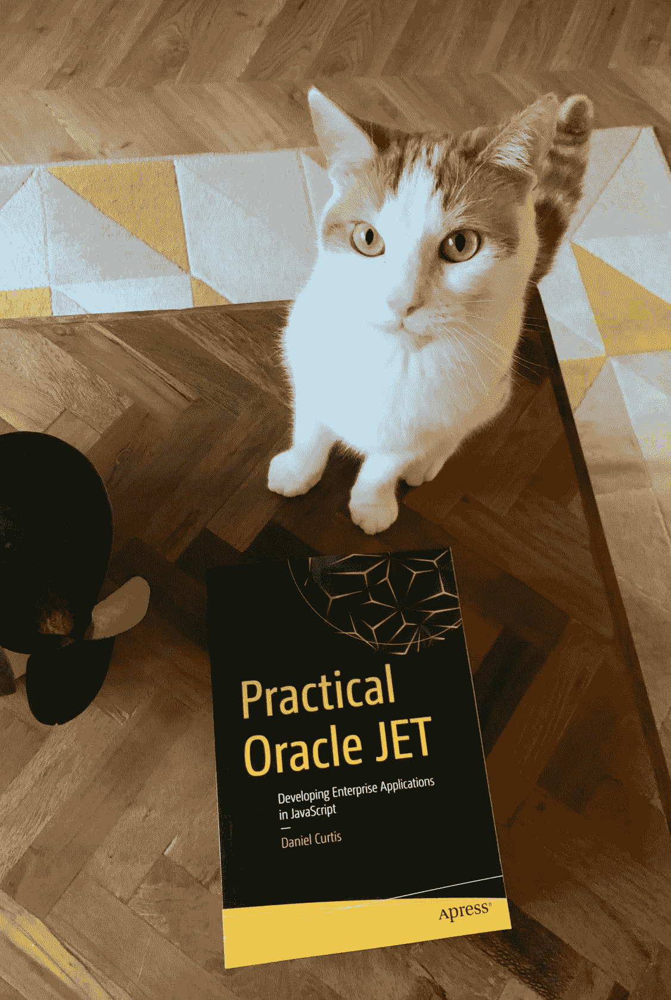

# 我的实用 Oracle JET 与 press 的创作经验

> 原文：<https://medium.com/oracledevs/my-authoring-experience-of-practical-oracle-jet-with-apress-89efb045b74b?source=collection_archive---------0----------------------->

就在一年多前，我刚刚在纽约的布鲁克林餐厅吃完早餐，我的编辑打电话给我，给我一份出书合同。我曾和一家出版社谈过要写一本关于 Oracle JET 的书，那时我决定用接下来的 8 个月来写作。这也是为什么我已经很久没有在这里发表文章了，我真的没有多余的时间把任何博客文章放在一起。

经常有人问我最初是如何开始写这本书的，过程是怎样的，我是否会再写一本书。所以我想我应该写一点我的经历。

在早期阶段，Apress 的一位编辑(Jonathan Gennick)联系我，问我是否有兴趣写一本关于 Oracle JET 的书。我想了一会儿，起初我犹豫要不要去做，部分是因为自信，部分是因为承诺。最后，我决定试一试，因为我觉得这不会比写一篇大学论文更难，是吗？

我去和一位已经写了一本书的主管聊天(参见:[Design Principles——Process driven Architectures Using Oracle BPM and SOA Suite 12c](https://www.amazon.co.uk/dp/B017MYI6W0/ref=cm_sw_r_tw_dp_U_x_Y7v7CbAAXC4QX)),了解更多关于写作的体验以及我需要投入多少时间。他警告我这需要多少时间，我很天真地拒绝了，认为 ***不会比*** 坏。

它确实占用了我大量的空闲时间(包括写作时的身体时间和不写作时的精神时间)，肯定比我最初预期的要多。我认为这是我将传递给任何新作者的关键要点之一——不要低估它所花费的时间。如果知道我会失去多少个晚上和周末，我还会这样做吗？也许吧，是的，但是保持我所有的交付给出版商的东西和设定我自己的截止日期是我坚持下去的动力。

> 实用 Oracle JET 介绍了使用 Oracle JET 开发功能性应用程序的过程。到本书结束时，您将已经使用工具包捆绑的各种不同组件构建了一个支持票系统，包括列表、输入和可视化。
> 
> 从阅读本书和使用示例中获得的技能使您能够构建自己的应用程序，并进一步理解更高级的主题。现已上市，您可以在[www.practicaloraclejet.co.uk](http://www.practicaloraclejet.co.uk)了解更多信息

在开发过程的早期，我就决定在写书的同时开发应用程序。我决定这样做的原因是因为我想让读者感觉他们是在构建一个真正的应用程序。赋予这本书真实的项目感觉不仅能更好地保持读者的兴趣，还能让读者习惯真实的项目问题，比如构建期间的返工。我想展示在应用程序中使功能和组件可重用是多么容易，所以当读者在实际项目中遇到潜在的可重用场景时，他们应该感到这样做很舒服，而不是重复代码。

这种写作方式给我带来了很多问题。尽管我尽了最大努力去计划，我还是不得不回去重写旧的章节，以适应书中后来的变化。有几次，我在过程的后期发现了一个 bug，需要我回去重新写一些已经起草和评审过的章节。尽管有这些令人头痛的问题，我还是要说，采取我所采取的方法是值得的。

这个项目的时机也很不幸，因为 JET 6 是在我写了大约 70%的时候发布的，考虑到 JET 6 是一个相当重要的升级，我决定确保它被包括在内。这又一次需要返工，最终延误了最终草案的提交。任何技术书籍的变化率都会导致版本问题，JavaScript 也不例外(也许更糟)。记者们非常通融，我预先警告过他们 JET 6 的发布可能会推迟这本书，他们对此没有异议。

自从我提交这本书的最后几章已经过去 5 个多月了，所以我有一些时间来思考它。我很高兴我做到了，我学到了难以置信的东西，这迫使我对技术的理解达到了一个我可能无法做到的程度。我会向任何第一次考虑写作的人推荐这本书，只要你对这个主题充满热情，并且在几年后这本书可能完成并上架时，你也可能对它充满热情。

至于第二本书。现在简短的回答是不。我有一些想法，但我认为我需要暂停写作，同时探索其他兴趣，并有一些时间反思和获得更多关于这本书的反馈。随着 Oracle JET 的 6 个月发布，将有更多的内容需要探索，并且可能需要考虑对现有书籍的修改。由于代码可以在 [publishers GitHub](https://github.com/Apress/practical-oracle-jet) 上获得，我将在那里发布任何修改。

如果你想和我取得联系，并对这本书有任何疑问，请在推特上给我发消息:@ danneh150

**订单现在从**开始:

亚马逊(英国)——[https://www.amazon.co.uk/dp/1484243455/](https://www.amazon.co.uk/dp/1484243455/)

亚马逊(美国)——[https://www . Amazon . com/Practical-Oracle-JET-Developing-Applications/DP/1484243455](https://www.amazon.com/Practical-Oracle-JET-Developing-Applications/dp/1484243455)

阿普瑞斯(英国)——【https://www.apress.com/gb/book/9781484243459 

美国—[https://www.apress.com/us/book/9781484243459](https://www.apress.com/us/book/9781484243459)