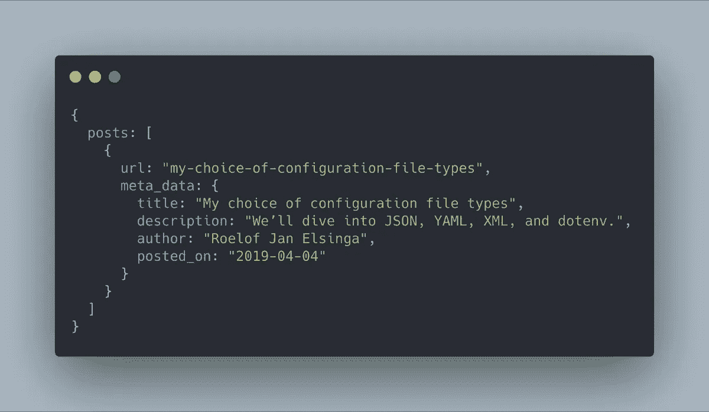
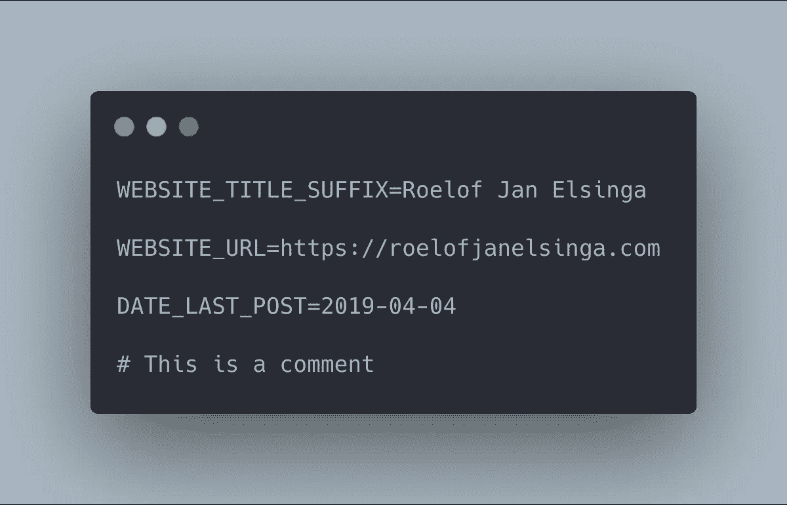

# 如何为您的项目选择正确的配置文件类型

> 原文：<https://medium.com/quick-code/my-choice-of-configuration-file-types-e8f135ca8bfe?source=collection_archive---------4----------------------->

## 了解和学习可用于在 workspace 中设置项目的不同配置文件类型。

配置，有人爱也有人恨。您可以用它来改变应用程序的行为，并根据您的需要进行定制。当这是复杂的午餐时，如果没有文档，你会感到沮丧。那么，如何为此选择使用哪种文件类型呢？这个问题没有简单的答案，所以让我稍微分解一下。在这篇文章中，我将重点介绍四种不同的文件类型，我已经使用并将用于这些类型的任务。这些文件类型是 JSON、YAML、XML 和 dotenv。

# JSON

我要强调的第一个文件类型是 JSON。如果你需要在不同的编程语言，甚至不同的应用程序之间共享数据，JSON 是非常受欢迎的。它是现代 API 之间数据传输的首选方法。它很紧凑，易于阅读，所有主要的编程语言都可以毫无问题地解析它。这是一个非常简单的快速入门方法。

然而，使用 JSON 也有缺点:不能在 JSON 文件或 JSON 结构中使用注释。这意味着您需要为您的数据结构编写文档。无论如何，写文档是一件好事，但是你没有机会澄清数据本身中的任何数据。

对于非常简单的配置和设置，我会使用 JSON 文件，您希望能够快速解析它们，而不需要太多的努力。

JSON 配置的例子可以在这篇文章的顶部找到。

# YAML

YAML 是 XML 的一个紧凑但可读的版本，它允许对象和数组。如果您习惯于 JSON，这将非常有用，因为您可以在两种文件格式中模拟相同的数据结构。与 JSON 不同，您实际上可以在配置文件中使用注释，允许内联文档、可能的配置选项，并且为开发人员带来更加无缝的体验。

当然，一切好的东西也有缺点。并不是所有的编程语言都支持解析文件。大多数语言，如果不是所有语言，都有额外的库，您可以安装这些库来解析这些文件。所以当你想使用 YAML 时，你不会完全束手无策，但是你的编程语言不支持它。对于编写适当格式的文件，它也有一个相当陡峭的学习曲线。如果你习惯于 C 语言，这将是一个困难的转变。像 Python 一样，YAML 需要适当缩进才能正常工作。如果您意外地以不同于解析预期的方式缩进了一行，它可能会将所选的属性分配给父对象或子对象。

对于更复杂的配置，我会使用 YAML。它能够包含注释，但仍然很紧凑，允许您快速编写新内容并记录下来。然而，我不会将它用于简单的配置，因为要让它工作起来需要一点努力。

# 可扩展标记语言

XML，这种许多人喜欢立即抛弃的标记语言。"这太过时了，把它从我面前拿开！"。然而，因为它已经存在了一段时间，它被证明是非常可靠的，这也有助于在许多语言中包含它的解析器。很多语言要么有内置的解析器，要么有可以从中提取数据的扩展和库。它还允许注释，所以如果您愿意，可以内嵌所有需要的文档。它看起来像 HTML，比 JSON 或 YAML 更容易理解。

也有一些日期。配置文件比 JSON 或 YAML 要大得多。如果你没有很多数据或者你不想和任何人分享，这不是问题。因此，根据您的情况，文件大小可能相关，也可能不相关。XML 解析器比 JSON 或 YAML 更难使用。每次我必须用 PHP 解析数据时，我都有点被解析器的复杂性所淹没。过一会儿你就会明白为什么会这样，所以会变得更好。XML 文件对于编写合适的 XML 来说有一个相当陡峭的学习曲线。一个简单的错误就可能使整个 XML 文件失效。查看示例并对此进行实验将会很有用。

我会将 XML 用于简单的数据结构，但也可以用于非常复杂的数据结构。创建层次结构并向其自身添加属性非常简单。大多数语言都有本地解析器，所以您可以马上开始使用。您可以根据自己的意愿将这些文件变得简单或困难。它不会是可读性最强的数据，但是如果你习惯了 HTML，你就会明白是怎么回事了。

# Dotenv

Dotenv 或。env 是迄今为止你能想到的最简单的配置文件。从技术上讲，这些文件是作为特定环境的配置文件使用的，但是您可以用它所包含的值来改变许多行为。Dotenv 文件通常特定于单个环境，不应该保存在版本控制中。您可以在 dotenv 文件中使用注释，但是由于您很可能不会与其他任何人共享这些注释，所以这是为了您自己的利益，而不是为了其他人。这种类型的配置有一个非常简单的键值格式。

使用 dotenv 文件进行配置有一些缺点。第一个是所有的键必须是唯一的，所有的值都是一个简单的字符串。所以没有办法用这个保存对象或者数组。另一个缺点是你不应该在版本控制中添加这个。这意味着您可以在每个环境中拥有完全不同的配置。这听起来很糟糕，但也是它的优势之一。

Dotenv 文件不应该用于任何复杂的配置。它应该用于配置到外部服务的连接，保存用户名和密码，并用于跟踪当前的应用程序环境。这就是它的伟大之处，但没有比这更复杂的了。

# 您的首选配置文件类型是什么？

如果您正在寻找一种存储任何复杂配置的好方法，请选择前三种中的一种。如果你想跟踪简单的数据，选择一个 dotenv 文件。您是否使用任何其他文件类型进行配置？如果是这样，为什么要专门使用这种文件类型？我很想听听你对这个问题的看法！让我知道你用什么来配置你的应用程序。

发布时间:2019 年 4 月 4 日

*最初发表于*[T5【https://roelofjanelsinga.com】](https://roelofjanelsinga.com/articles/my-choice-of-configuraton-file-types)*。*