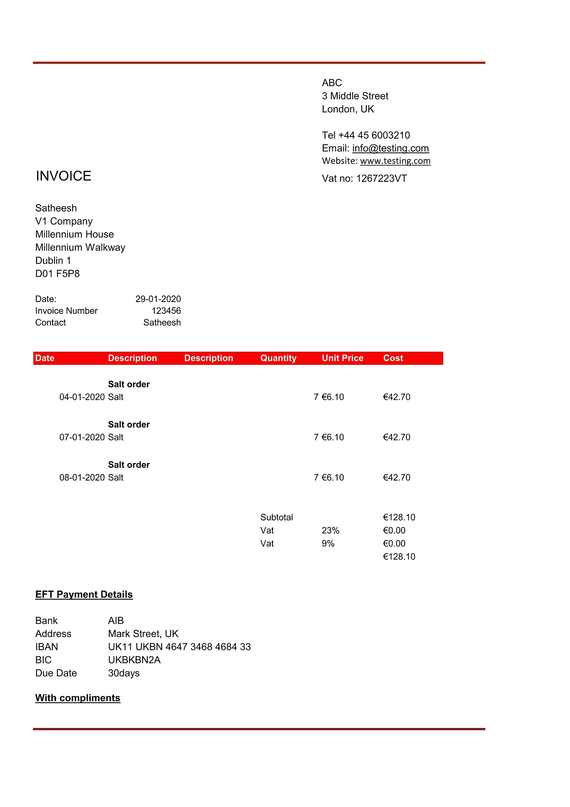
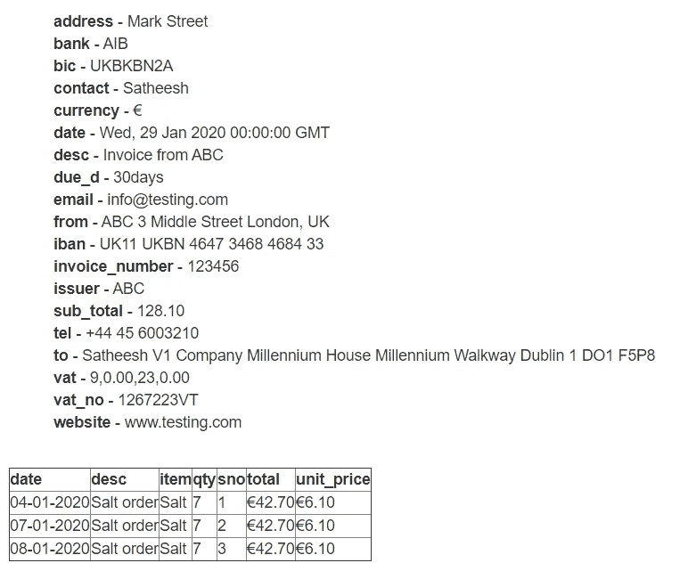

# 我在 Python 中使用 invoice2data 提取发票数据的经验

> 原文：<https://medium.com/version-1/my-experience-extracting-invoice-data-using-invoice2data-in-python-1c6450fa001f?source=collection_archive---------0----------------------->


Photo by [Lukas Blazek](https://unsplash.com/@goumbik?utm_source=medium&utm_medium=referral) on [Unsplash](https://unsplash.com?utm_source=medium&utm_medium=referral)

我是一名技术顾问，自 2019 年 8 月以来一直作为 Version 的 [1 创新实验室](https://www.version1.com/innovation/)的一部分工作。创新实验室通过创建 **POC(概念证明)**和 **POV(价值证明)**为客户开发创新解决方案，以证明客户问题的解决方案，并扩展到真实客户问题的解决方案。

我有机会在创新实验室提取发票数据，在那里我遇到了从模板发票的定义字段中提取数据的**[**invoice 2 data**](https://pypi.org/project/invoice2data/)**python 包**。**

# **什么是 invoice2data？**

**invoice2data 由 Invoice-X 创建，能够使用模板系统从 pdf 中提取结构化数据。invoice2data 最适合文本 PDF，但也可以使用不同的 OCR 库作为 PDF 发票的数据提取器。**

# **我的经历**

**如其网站所述，invoice2data 的主要步骤如下:**

> **支持您的会计流程的模块化 Python 库。在 Python 2.7 和 3.4+上测试。主要步骤:**
> 
> **使用不同的技术从 PDF 文件中提取文本，如`pdftotext`、`pdfminer`或 OCR—`tesseract`、`tesseract4`或`gvision`(谷歌云视觉)。**
> 
> **使用基于 YAML 的模板系统在结果中搜索正则表达式**
> 
> **将结果保存为 CSV、JSON 或 XML，或者重命名 PDF 文件以匹配内容**

**当使用 invoice2data 时，我遇到了一个问题，我无法从自定义 regex 提取多行文本数据，也无法将多行文本数据提取到自定义 regex 来读取复杂的表。为了解决这个问题，我想到了一个定制 invoice2data 的想法，用坐标来定义区域裁剪。我还扩展了当前模板以适应定制配置。定义的自定义字段在下面的 YAML 模板中。这是用于提取数据的示例发票和使用的模板。**

## **样品发票**

****

## **Yaml 模板**

```
*# -*- coding: utf-8 -*-* issuer: ABC
file: ''
fields:
  tel: 'Tel (\+\w+(?:[ -)(]\w\w+)*)'
  email: 'Email:[ ]+(\w+@\w+.\w+)'
  website: 'Website:[ ]+(\w+.\w+.\w+)'
  vat_no: 'Vat no:[ ]+(\w+)'
  date: 'Date:[ ]+(\d{2}[/-]\d{2}[/-]\d{4})'
  invoice_number: 'Invoice Number[ ]+(\w+)'
  contact: 'Contact[ ]+(\w+)'
  bank: 'Bank\s+(\w+(?:[ ]\w\w+)*)'
  address: 'Address\s+(\w+(?:[ ,]\w\w+)*)'
  iban: 'IBAN\s+(\w+(?:[ ]\w\w+)*)'
  bic: 'BIC\s+(\w+)'
  due_d: 'Due Date\s+(\w+)'
  sub_total: 'Subtotal\s+(\d+.\d+)'
  vat: 'Vat\s+(\d+)%\s+(\d+.\d+)'
keywords:
- ABC
- 3 Middle Street
- London, UK
custom:
  items:
  - name: 'to'
    area: (135, 878, 686, 349)
  - name: 'from'
    area: (1398, 325, 489, 197)
  regex:
    line: \s+(?P<desc>(\w+(?:[ ]\w\w+)*))\s+(?P<date>(\d{2}[-]\d{2}[-]\d{4}))\s+(?P<item>(\w+))\s+(?P<qty>(\d+))\s+(?P<unit_price>[€ ](\d+.\d+))\s+(?P<total>[€ ](\d+.\d+))\n
required_fields:
  - tel
options:
  currency: €
  date_formats:
    - '%d-%m-%Y'
  remove_whitespace: False
  languages:
    - en
  replace:
    - ['‘', '']
    - ['[', '']
    - ['€', '']decimal_separator: '.'
```

## **输出**

****

**当输入图像的分辨率改变时，模板中定义的坐标将会不同。invoice2data 数据定制已考虑到这一点。**

*****为了进一步增强功能，*** [***机器学习***](https://www.version1.com/it-service/innovation-labs/artificial-intelligence/) ***都可以用来移除模板。*****

## **结论**

**我强烈建议使用 Invoice2data 进行发票处理，只要您没有对发票模板进行太多更改。Invoice2data 提供了添加自定义插件的能力，这非常适合我们自己的特定需求。然而，为了创建发票模板，invoice2data 需要良好的正则表达式技能。**

# **了解更多信息**

***创新实验室自 2018 年以来一直在行动，并以成功协作的形式拥有许多成功案例* ***【价值证明(POV)****。我们热衷于在没有现有客户和新客户的情况下吸引更多客户，以展示最新技术如何为他们的业务增加价值。要了解第 1 版* *中* ***创新的更多信息，请访问我们的* [*这里*](http://www.version1.com/innovation) *。*****