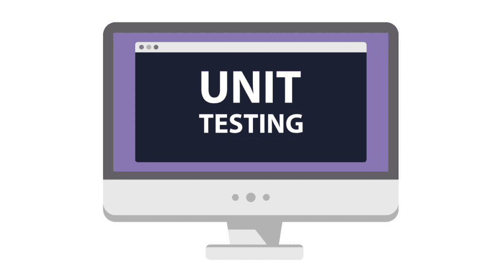
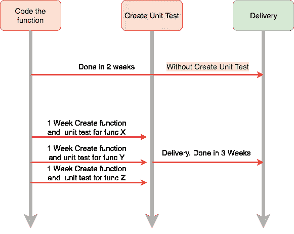
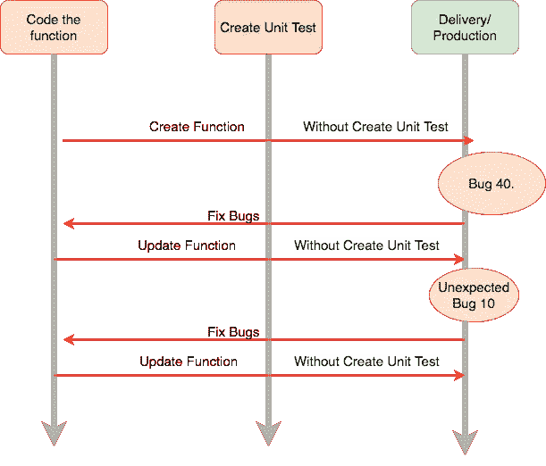
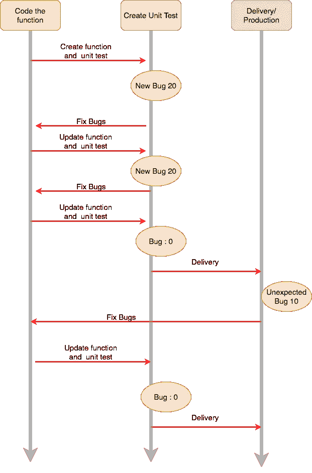

# 我对单元测试的真实看法

> 原文：<https://medium.easyread.co/my-honest-opinion-about-unit-testing-84eee5e893ad?source=collection_archive---------0----------------------->

## 这是我对软件工程中单元测试的真实看法



Unit testing taken from google images search

想象现在你在厨房里。你要做一个煎蛋卷。然后，你必须先准备好工具，一个炉子，一个锅，炒勺，一把刀等。然后，你还必须有需要，如鸡蛋，胡椒，盐等。

那么，让我们做一个新的。当制作这个新的时，你必须遵循这些步骤，不能遗漏任何一件事。

*   将两个鸡蛋打入搅拌碗中。确保鸡蛋处于良好状态
*   搅拌鸡蛋 10 分钟。
*   用半茶匙盐和胡椒调味。不多也不少
*   将煎锅放在 60 度的 T2 炉上，加热融化黄油。等待 3 分钟。
*   将搅拌好的鸡蛋倒入煎锅。等待 **2 分钟。**
*   确保搅拌好的鸡蛋加热。不再有液体。
*   端上煎蛋卷。

然后，当你开始做的时候，你会这样做

*   在将鸡蛋倒入搅拌碗之前，你会敲碎鸡蛋，如果你发现一个腐烂的鸡蛋，那么你会选择另一个鸡蛋。这是一种预期行为
*   当你搅拌鸡蛋不到 1 分钟时，搅拌的鸡蛋会不均匀。如果是这样，你将再次搅拌。这是一种预期行为
*   当你往搅拌好的鸡蛋里倒入 2 茶匙盐时，鸡蛋就会变咸。如果太咸了，你会再加一个鸡蛋来减少咸味。这是一种预期行为
*   当你在 100 摄氏度的锅上煮鸡蛋时，它会被烤焦。你必须降低温度。

所有预期行为，已经涵盖。当你完成了上面的所有步骤，你就完成了对每个功能/步骤/方法/单元的测试。因此，当一个简单的错误像太多的盐一样发生时，我们已经知道如何在我们的步骤/函数/方法/单元中处理它。这就是单元测试的用途。

# 涵盖了标准(预期)行为

单元测试将引导你了解一个函数的预期(标准)行为。举个例子，我们有标准的(预期的)行为来煮鸡蛋，你需要一个 60 度的锅。

好吧，别提煎蛋卷了。假设我们有一个简单的围棋函数

```
func Login(username, password string) error{
 if len(password) < 6 {
   return NewErrNotValidPassword
 }
 user,err:= DB.getUserFromDB(username){
 if err != nil {
    return NewErrInternalServerError
  } if user == nil {
    return NewErrUserNotExist
  } if user.Password != password {
    return NewErrWrongPassword
  }

  // Login Successs
  return nil
}
```

然后我们在这里对这个函数进行单元测试*(只是一个例子)

```
func TestLoginSuccess(){
 username:="lolcats"
 password:= "youknowhoiam" mockDB:= new(mockDB)
 mockDB.On("getUserFromDB", username).ShouldReturn(user,nil) err:= Login(username,password)
 assert.NoError(err)
}func TestPasswordNotValid(){
 username:="lolcats"
 password:= "you" // Less than 6 char
 err:= Login(username,password)
 assert.Error(err)
 assert.Equal(err , NewErrNotValidPassword)
}func TestUserNotExist(){
 username:="tamvansek"
 password:= "youknowhoiam" mockDB:= new(mockDB)
 mockDB.On("getUserFromDB", username).
 ShouldReturn(nil,nil) // DB return empty err:= Login(username,password)
 assert.Error(err)
 assert.Equal(err , NewErrUserNotExist)
}func TestWrongPassword(){
 username:="lolcats"
 password:= "wrongPassword" mockDB:= new(mockDB)
 mockDB.On("getUserFromDB", username).ShouldReturn(user,nil) err:= Login(username,password)
 assert.NoError(err)
 assert.Equal(err,NewErrWrongPassword)}
```

如果你寻找单元测试，我们必须知道每一个分支的预期行为。如果密码少于 6 个字符，则应该是错误的。如果你的测试显示没有发现错误，那么你的月经一定有问题

# 增加额外的开发时间



在对我们的功能创建单元测试时，我们需要更多的额外时间。因为我们必须为每个单元函数创建所有的测试。因为相反我们只是创建和思考逻辑，我们还增加了额外的工作来创建测试的覆盖范围。如果使用 TDD 方法，将需要更长的时间。

但关键是，当你的产品已经发布到产品中时，它的缺陷会更少。

# 减少生产中的错误/缺陷

当你在没有创建单元测试的情况下编写你的系统时，你当然可以更快地发布它。但是，之后你的用户可能会在使用它之后发现太多的错误。



Without Unit Testing

如果您创建了单元测试，请进行比较



Using Unit test

当你没有经过测试就写代码时，你的用户会发现 50 个错误。这会让你的用户发疯，对你的应用程序感到不舒服。与使用 test 相比，您用户只会发现 10 个错误。

从煎蛋卷的角度来说。想象一下，你要用 100 个鸡蛋的预算做 50 个煎蛋卷。从这 100 个鸡蛋中，有 1 个是腐烂的鸡蛋。然后，你在没有检查鸡蛋质量的情况下烹饪它，你没有为每一步做单元测试。你只需把它们倒进去，不要盖住错误/腐败的鸡蛋。当你完成后，你把它交付给生产，交付给你的客户。你知道你的客户会怎么样，对吗？

## 结论

单元测试是一件好事，它会提高你的产品质量。在我目前的公司，当编写一些新功能时，需要为每个功能添加单元测试。

但有时候，那样做太无聊了。就好像创建测试是一项新的大任务。

有一天，我很高兴，因为我的功能完成了。嗯，我的假设这个功能在那个时候会很好用。但是，即使它可以工作，我仍然需要添加更多的测试，以涵盖那里的每个分支。然后，我觉得…“搞什么鬼。真是高潮杀手”。我必须再次添加测试。该死的。所以，无聊。

但是它增加了我对工作的信心。我将更多地关注另一个测试，如集成测试，真正的数据库，真正的服务。

如果你认为这本书值得一读，给我一个👏
也在你的推特、脸书等上分享，这样其他人也能读到这个

[](https://blog.pairworking.com/advices-to-junior-programmer-e8e582273303) [## 基于观点:给初级程序员的建议

### 我对初级程序员如何生存的真实看法

blog.pairworking.com](https://blog.pairworking.com/advices-to-junior-programmer-e8e582273303) [](https://blog.pairworking.com/why-you-should-care-about-squash-and-merge-in-git-675856bf66b0) [## 为什么您应该关心 Git 中的挤压和合并

### 让你的历史更加清晰易读

blog.pairworking.com](https://blog.pairworking.com/why-you-should-care-about-squash-and-merge-in-git-675856bf66b0) [](https://hackernoon.com/developing-backend-for-targeted-push-notification-6b605c522c29) [## 开发后端:目标推送通知

### 我们如何在 Kurio 开发后端定向推送通知服务的故事。

hackernoon.com](https://hackernoon.com/developing-backend-for-targeted-push-notification-6b605c522c29)