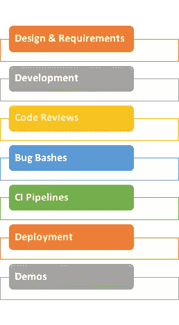
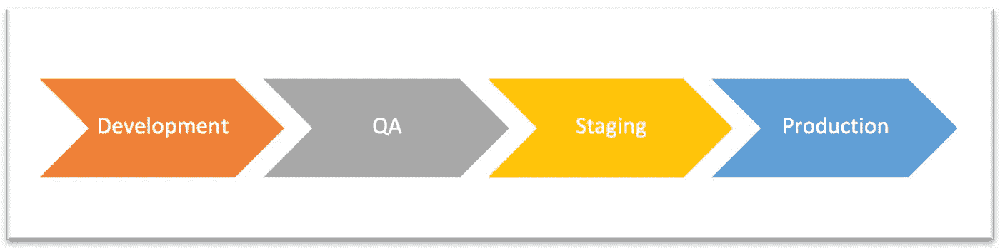
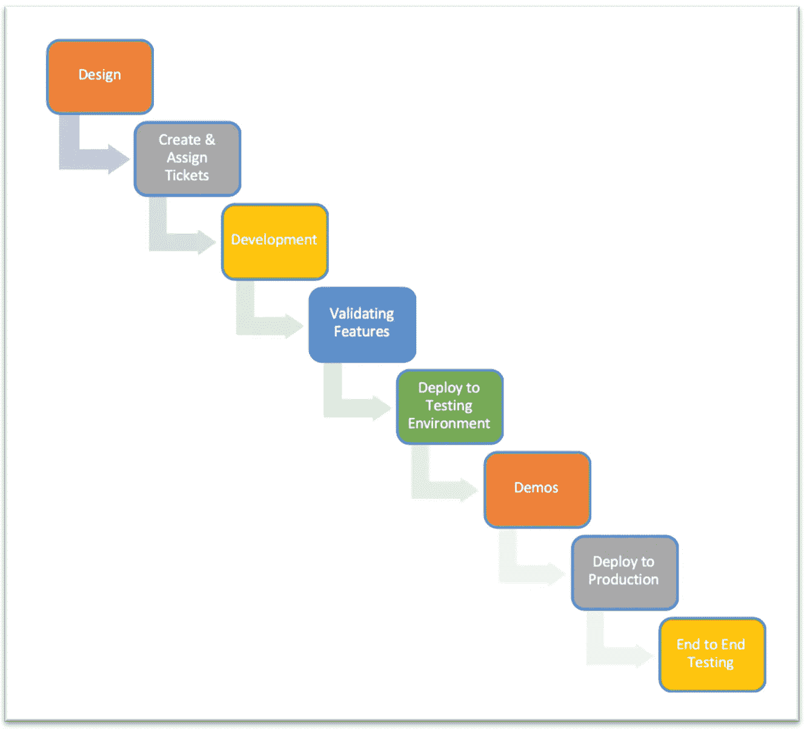

# 我在沃尔玛全球技术公司的时间旅行

> 原文：<https://medium.com/walmartglobaltech/my-journey-through-time-at-walmart-global-tech-e9af531c366f?source=collection_archive---------2----------------------->

大约 4 年前，当我接到沃尔玛招聘团队的电话时，我正在参加我的一个硕士讲座，这就是我与沃尔玛全球技术的旅程的开始。作为一名硕士生，在没有工作经验的情况下获得实习机会既艰难又关键。实习会给我的简历增加一些行业经验，并帮助我在某个地方找到一份全职工作。但我的目标是为自己选择正确的实习机会，在那里我不仅可以学习和获得行业经验，还有机会将这个实习机会转化为全职工作，因此，我选择了沃尔玛。

在我的实习结束后，我接受了邀请，成为沃尔玛的一名全职员工，从那以后已经三年半了。我觉得这个时机对我来说是相当完美的，来分享我从学生到实习生再到全职员工的经历。我将谈论我学到的东西，我面临的挑战，以及我的经历中的关键收获。

# **我在实习项目中学到的东西**

> **实习的动手性质**

促使我选择沃尔玛参加实习项目的最重要因素之一是我要做的工作的动手性质。当我说动手时，我指的是在沃尔玛的多个团队中使用的真实生产工具的一部分。该工具是 Expo，沃尔玛内部构建的 A/B 测试工具。这不是我必须做的附带项目，它最终可能不会被任何人使用。这是真的。在 Expo 工具 UI 上工作时，我创建了一个健康仪表板，它将显示 A/B 测试在 24 小时内的健康状况。这对于最终用户监控他们的测试以了解其性能非常有用。

如果你问我想从这次实习中得到什么？我会说是一次完整的经历。我惊喜地发现我得到了大部分。我不仅写代码，还参与了其他团队流程(日常活动，例如:设计评审、CI-CD 流程、演示),这让我对端到端的实际工作有了全面的了解。这让我从整体上了解了端到端的实际工作方式。

> **最新&最伟大的技术**

谁不想使用最新最棒的技术呢？我确实做了。在我实习期间，expo 前端代码是在一个叫做 lazojs 的框架上用 BackboneJS(这是一个老掉牙的版本)编写的，这个框架使用的是过时的 MVC 模式架构。然而，我有机会在 ReactJS 上工作，它更像是单页应用程序，基于组件，并与现有的代码库集成。首先，我从 ReactJS 中学到了一些新的令人兴奋的东西，然后用这些知识实现了一个我可以拥有的新特性。

> **其他技能&知识**

甚至在实习的时候，我就参加了单口相声，给团队提供最新消息&还被邀请参加团队会议。我在大学时研究过整个科技行业团队使用的敏捷方法，但这是我第一次参与其中。此外，这让我明白了如何为一个特定的团队量身定制，像积分这样的事情对不同的团队来说可能意味着不同。在 Expo 中，我们使用定制版本的 scrum，这对于我们来说非常有效。我的建议不仅被采纳，而且我总是被鼓励不断提出新的想法。这让我觉得我是团队的一部分。

几乎每隔一周，我们就有演讲者，有些来自沃尔玛的领导层，有些来自沃尔玛的工程师，谈论他们一直在做的酷项目，并分享他们在沃尔玛工作的经验。这确实在我决定加入沃尔玛成为全职员工的过程中发挥了很小的作用。

实习结束时，我有机会向整个卡尔斯巴德办事处展示我的工作，我写了一份报告，介绍我在这段时间里所取得的成就。

# 到目前为止，我在全职工作中学到的东西

> **了解工具&流程**

快进到我成为沃尔玛的全职员工。甚至在我深入代码库之前，我必须了解团队的日常工作。从晨会、回顾和冲刺规划开始(如果这是冲刺的开始),向我们工具的用户群进行团队演示并安排部署(如果有)。

下一个明显的步骤是开始深入代码库以理解流程和特性。同时，理解工具如何工作以及如何端到端设置也很重要(相信我，这不是一天的工作)。在这里，帮助我的几件重要的事情是阅读大量的文档，并与我的团队交谈以更好地理解事情。

**Process Encapsulating a Tool**

我们的团队拥有端到端的 Expo 工具。从技术角度理解端到端的工作很重要，但从端到端的流程角度理解它也很重要。每一个用某种技术构建的工具都被一个过程所封装，以使其工作。

其中一些本身就是流程，如 CI 渠道和部署流程。例如，Expo 有多个测试环境，如开发、QA 和 Staging，还有一个生产环境。

**CI-CD Pipeline Flow**

> **提高技术&沟通技巧**

由于我们拥有端到端的工具，我们的团队由前端、后端和边缘网络团队组成。我开始在团队中担任前端工程师，对 BackboneJS & lazojs 来说我还是新手。我还尝试了一点，帮助后端团队学习一些 Lua 和 Golang。

快进到去年，我们开始在 ReactJS 中重写 Expo 工具前端&一个名为 Saber 的内部框架。是时候转向更新的技术体系了。这帮助我增加了一项新技能。

当你在团队中工作时，沟通是非常重要的。我所说的交流不仅仅是指与你的同事进行基本的闲聊。沟通还包括准确更新您的工作状态，在需要时寻求帮助，召开设计会议和代码审查，在讨论会议和最重要的书面文档中提问。我的意思是我们在骗谁，不是所有人都喜欢写这些长文档，但不幸的是这是真的，它们真的很重要。

> **成长**

> 你不会在一天内成长。你从小处着手，然后在此基础上不断发展。

当我刚刚开始从事 Expo 代码库的工作时，我的第一个 sprint 任务是一些 bug 修复。这是在代码基础上起步的好方法，因为它允许你调试和理解代码。然后，我开始开发较小的功能或大功能的一部分。虽然我觉得，当我开始承担大功能并从头到尾拥有它们时，我的成长开始加速。随着我的信心和经验的增长，我开始在一个 sprint 中同时开发多个特性。

**Owning Feature End-to-End**

我成长的另一部分是跨团队工作。我有机会用几周的时间开发一个叫 Tango 的不同工具，我选择把它作为对自己的挑战，这样它可以帮助我成长。这个项目有一个陡峭的学习曲线，因为我在一个严格的时间表上工作。此外，新工具、新代码库、新流程和新人。这教会了我如何快速适应变化。

最后但同样重要的是，在例会期间直接与客户互动，通过松散的渠道支持小组倾听他们的担忧，有时也联系特定的客户，这帮助我确定了他们的痛点。这导致了对他们的帮助，提出解决他们问题的想法，并致力于一些创新项目。

# 实习期间面临的挑战

在我们深入探讨工作中的各种挑战之前，我想补充一个问题，许多学生和其他寻找工作机会的人都问过我这个问题:

> *“你获得更多面试电话的策略是什么？”*

你申请的越多，得到面试电话的机会就越多。即使这是真的，我自己的策略是我有一份通用的简历来申请大量的职位空缺。但是对于那些与我的技能相匹配的，我会根据工作要求来定制我的简历。现在让我们来看看一些挑战。

> **最初的挑战**

许多阅读这篇博客的人可能已经有了大量的经验，但是你们中的一些人可能刚刚开始或者刚刚进入这个领域。我在沃尔玛的实习是我第一份完整的技术性工作。在此之前，作为工作的一部分，我在大学校园里从事小型技术项目。即使你没有经验，你仍然可以用你的知识和设定正确的期望带来很多好处。

如上所述，我曾参与一个项目，创建了一个包含一系列功能的仪表板，但是是在一个较新的技术堆栈(ReactJS)中，并且还将它与现有的技术堆栈集成在一起。因此，挑战不仅仅是为一个我并不完全熟悉的工具创建一系列功能，还要用我自己或团队中的任何人以前都没有用过的更新的技术栈来完成。因为学习曲线有点陡，所以需要更多的时间来开始一些实现。结果，最后我没能完成列表中的所有功能。后来，我和我的导师都意识到，对于给定的时间框架，期望值有点高。那么，为了应对这种挑战，你会怎么做呢？

有些问题你可能想问自己，并在开始时与你的导师/经理讨论，例如:

*   你从这次经历中得到了什么？
*   这个实习的范围是什么？
*   团队中是否有人具备在需要时提供帮助的技术专长？
*   对你的期望是什么，在给定的时间框架内现实的目标是什么？

在开始时，似乎很难得到所有的正确答案，但是你越早得到答案越好。

> **复杂结构**

虽然我在课程工作中参与了多个项目，但对我来说，进入沃尔玛并为 Expo 工作就像进入了一个完全不同的体验。回到大学后，与或多或少与我处于同一水平的队友一起进行团队项目。在沃尔玛，与首席工程师、经理和不同级别、担任不同角色的人一起工作，是一种不同的场景。

在大学里做项目并没有太多复杂的结构。课程项目没有真正的工业级项目大。通常，项目要么按照功能划分，要么按照前端和后端任务划分。你在小团队中工作，通常每个人都是开发人员。教授可能会给你的团队分配项目，提出要求，并在项目完成后评估项目，给你的团队打分。在这个项目的发展过程中，教授可能会提供一些或没有持续的反馈。这种结构是相当线性的，因为你可能只有一个参考点，没有很多变量。

然而，在行业环境中工作，尤其是在像沃尔玛这样的大公司，你的团队结构很复杂。比如 Expo 团队，分为前端团队、后端团队、数据洞察团队。我们遵循敏捷方法，并贯穿项目/功能的整个生命周期。这涉及许多不同角色的不同人员，例如帮助与客户沟通并定义需求的项目和产品经理，致力于创建适当的架构和设计的架构师，帮助设计前端体验的 UX 设计师，致力于实现的开发人员以及提供反馈的最终客户。

由于结构的复杂性，结识新朋友，了解他们在团队中的角色，了解他们，理解结构和流程可能具有挑战性，尤其是如果这是你的第一份工作。这可能会让你觉得有点格格不入，但不要担心太多，专注于采取小步骤，并开放地接受这种激烈的环境变化。还要记住雇佣你的团队了解你来自哪里，你的背景是什么，所以不要害怕提问。

> **时间不多**

通常大多数实习项目为期 2-3 个月。在这段时间里，你被期望发挥出你的最佳水平，展示你的才华，适应环境，实现对团队有价值的东西。再一次，我想强调大学项目工作和作为实习一部分的项目工作的区别。这两种情况都有截止日期，但场景是不一样的。

当从事与课程相关的项目时，你手头有更多的时间(大部分学期)，即 5-6 个月。你逐步建立项目。学期开始时，更多的是学习技术，通过较小的作业练习来提高你的技能。然后你开始在整个学期中一点一点地实施。你可以向你的教授咨询，如果你有问题，甚至可以向班上的其他小组咨询。在这里，课程工作的目的是让你学到更多的东西。

另一方面，当你在沃尔玛这样的公司实习时，期望更高，时间范围更短。当你开始理解这个过程的时候，你必须同时学习和实施。你正在处理比平常多得多的事情。在这一点上，不仅仅是学习，你还需要在实习结束时有一个有价值的最终产品。如果你正在做一个大项目的一部分，你通常没有足够的时间从头到尾了解事情。因此，事情的范围要小得多，你可能对全局没有概念。

# **全职期间面临的挑战**

在一次成功的实习经历后，我最终获得了沃尔玛全球技术公司的一份全职工作。显然，快乐是我经历的第一件事，但接下来还有新的挑战等待着我。

> **势不可挡的开始**

对我来说，在同一个团队(Expo)开始全职工作要容易一点，因为我了解我将要共事的人。但是，如果大学项目是一维的，而实习更像是三维的，那么我会说全职是四维或五维的。另一个主要区别是，在实习期间，你被“期望”去做这份工作，但在全职期间，你要对你所做的所有工作“负责”。

当你在大学做一个项目时，这个过程非常简单。你组建一个小团队(3-4 人)，提出一个项目想法，让你的教授批准它，进行一次设计和架构工作，每个人做他们的开发，你合并代码，一旦完成某些功能(通常没有太多的 PR 审查过程)，一旦项目完成，你向你的教授演示它以获得分数。

即使在实习期间，你与人的互动也大多局限于你的团队。您对该工具的理解可能仅限于您正在实现的功能，您可能不会接触到整个端到端的流程。

但是当你投入到你的全职工作中时，会有更多的东西需要吸收。在像沃尔玛这样的大公司，你不仅要了解你的工具端到端，还要了解整个系统中的其他工具是如何与它交互的，以及有哪些依赖关系。在完成任务时，你可能需要接触正确的人，并跨团队工作。现在，由于你是团队的全职成员，你必须理解并参与封装工具的过程。这个过程周复一周地重复着。对我来说，一开始确实感觉很有挑战性，因为可能会有很多东西需要吸收，尤其是如果这是你第一份像我这样的全职工作。

> **缺乏适当的沟通**

我们中的许多人(包括我自己)认为我们有很好的沟通技巧，我们应该不会有问题，以适应完美。这也是我出错的地方。个人层面的沟通与专业层面的沟通有很大不同。让我分享一些缺乏沟通会导致问题或误解的场景。

*   **缺乏与客户的沟通**:多个客户提出了一个问题，他们提到他们无法使用 Expo 工具。我进行了调查和调试，发现这不是我们这边的问题，而是我们的外部依赖服务的问题。我与他们一起创建了一个票证来解决这个问题。在整个过程中，我没有有效地将问题的状态反馈给我们的最终用户。因此，他们不断通过其他渠道联系。如果我及时与他们进行了广泛的沟通，那么他们就不必联系我们了。
*   **缺乏与团队的沟通**:我正在做一个世博会专题，需要前端和后端工作。在 sprint 的第一周，我开始处理 UI 标签。现在，我已经完成了我的 UI 工作，正在等待后端更改和数据，以便测试 UI 更改。在 sprint 的第二周，我联系了后端团队，了解到他们还没有开始修改。所以现在我被屏蔽了。如果我在 sprint 开始时与后端团队进行了有效的沟通，他们可能会对他们的任务进行不同的优先级排序，我也不会被阻止。
*   **与团队领导** / **经理 *:*** 缺乏沟通继续上面的例子，我与后端团队一起工作，等待将要做出的改变。我们最终发现需要比以前更多的后端更改，这将花费更多的时间。通常在 sprint 结束时，领导/经理为即将到来的 sprint 计划任务。我的经理拿出了他关于新 sprint 任务的计划，这时我告诉他，以前的计划还没有完成，将会延期，因为还需要更多的更改和测试。这让他陷入了困境，因为他已经承诺在计划会议期间完成某些任务。如果我让他了解这方面的最新情况，他会在计划过程中获得所有需要的信息。

你总是会经历更多这样的情况，这将帮助你提高你的沟通技巧。

# 关键要点

根据我几年的经验和我学到的无数东西，这里有一些关键的见解，可能会对你的职业生涯有所帮助:

*   ***适应迅速*** :你职业生涯中的事情会在某个时刻发生变化。试着快速适应这些变化，因为没有其他人在等着你跟上速度。
*   *:你很容易迷失在日复一日的工作中，当你要进入下一个阶段时，你可能会意识到你与经理的期望相差甚远。因此，经常与导师/经理一起工作，了解你做得好的地方和你可以改进的地方。*
*   ****文档*** :文档的重要性永远不能被削弱。当你接触新事物时，阅读大量现有的文档。如果你正在实现一些新的东西，写文档供你和其他人将来参考。*
*   ***不要感到停滞不前，在一件事情上花费大量时间，不要害怕向你的队友和/或经理寻求帮助。此外，永远试着帮助你的客户团队。***
*   ****沟通*** :沟通过度总比沟通不足好。这种沟通可以有不同的目的:向客户演示、与团队讨论阻碍因素、向团队通报日常进展以及与经理讨论你的绩效。*
*   ****我的例行公事*** :我的团队遵循敏捷方法，我们每两周进行一次冲刺。在计划会议之前，我会与我的经理讨论我的门票及其积分。我为我的票证创建子任务。在 sprint 开始时，我通常首先处理优先级较高的票证。每个子任务完成后，我会发出 PR 进行审核。说到我的日常工作，在一天开始的时候，我会花一些时间来决定和计划我当天要完成的事情。试着让我的经理了解我的最新进展，在一天结束时，我会花些时间分析这一天是怎么过的。*
*   ****不要只做“常规的”*** :如果你打算提高自己，挑战自己，考虑更上一层楼，重要的是不要只做常规任务。尝试创新，或者至少在创新项目中有所贡献，这会让你与众不同。*

*对你即将加入的公司感到兴奋，并意识到挑战。但是不要被它们压倒。就像一段感情，会有起有落。你付出的努力越多，从另一端得到的积极回应就越多。我认为我在与沃尔玛的关系中做出了明智的选择。*