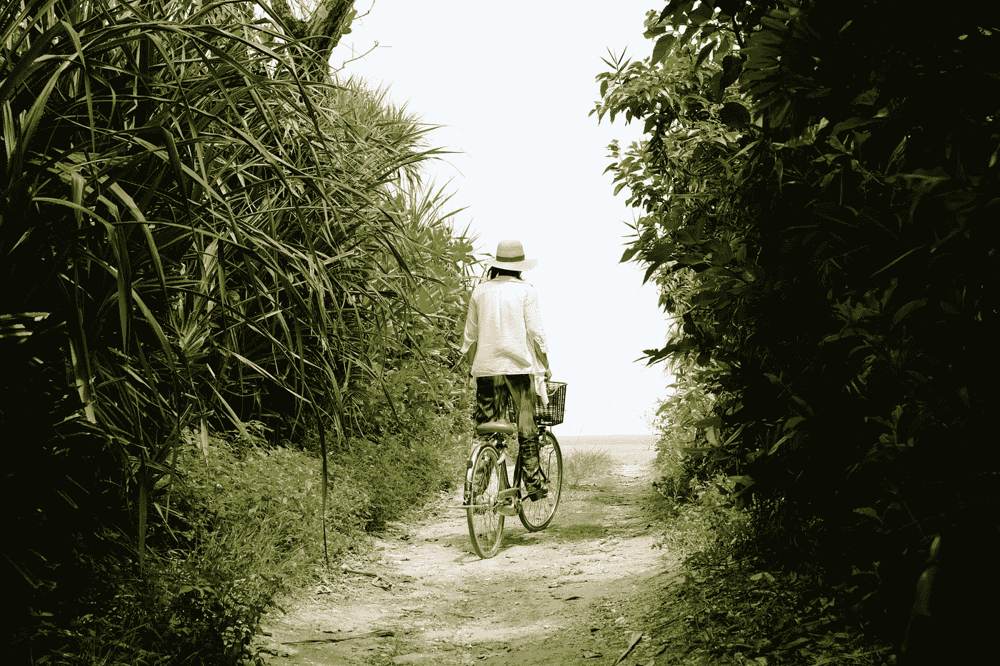
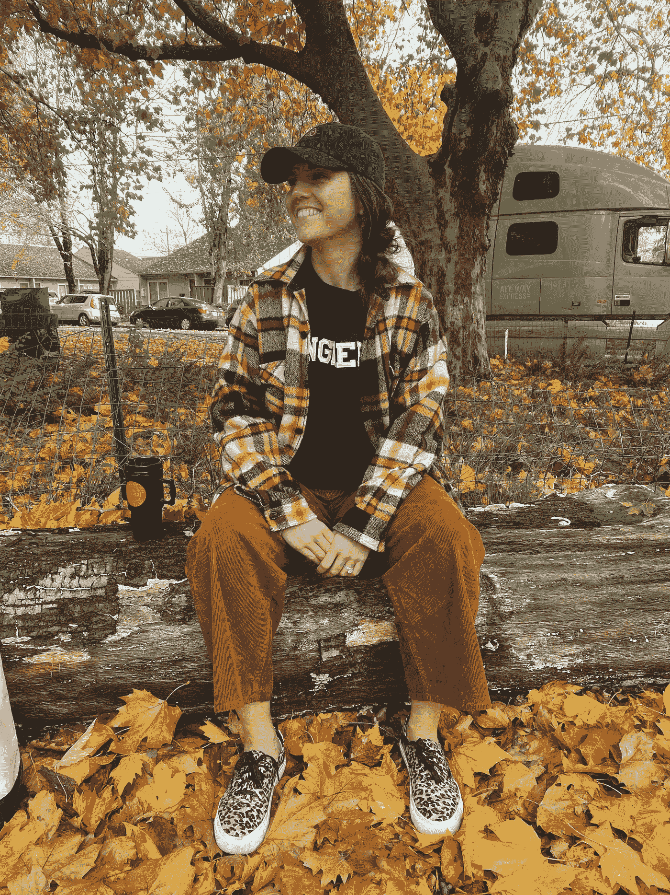

# 我的 Airbnb 之旅——伊丽莎白·庞塞

> 原文：<https://medium.com/airbnb-engineering/my-journey-to-airbnb-elizabeth-ponce-c7bb96299bfe?source=collection_archive---------1----------------------->

打造一条通往 Airbnb 技术职位的道路

伊丽莎白·庞塞

*许多 Airbnb 人都知道 Elizabeth，因为她是一名社区建设者和领导者 Airbnb 技术边缘化性别资源小组的全球联合领导者，以及许多令人惊叹的活动，如我们全公司的狗总裁选举。人们可能不知道的是，自 2017 年加入 Airbnb 以来，伊丽莎白一直在经历一段不可思议的旅程。她开始是一名客户支持专家，花了几年时间发展深厚的技术技能，现在是 BizTech 团队的系统工程师。*

*Elizabeth 在职业生涯的后期发现了软件工程。她的第一个学士学位是冲突解决。当波特兰办公室提供了一个内部的 Web 开发入门课程时，Elizabeth 报了名，认为一些关于互联网的基本知识会对她的角色有用。相反，这门课让她走上了获得第二个计算机科学学士学位的道路(同时继续在 Airbnb 全职工作！).*

这是伊丽莎白的故事，用她自己的话说:

# 作为客户支持专员加入 Airbnb

在 Airbnb 之前，我是一名社区组织者，领导和扩大青年发展项目，也是一名自行车修理工。我在非营利组织和教学领域有很多丰富的经验，但我已经准备好开始新的篇章。一个朋友给我发了一份 Airbnb 客户支持职位的招聘信息。我过去是 Airbnb 的客人和主人，所以我认识到我的个人和职业经历会对社区有所帮助。

很快，我就对这家公司试图为面试者精心打造的体验以及他们想为谁招聘留下了深刻的印象。但我从未想象过 Airbnb 为我准备的旅程。

# 改变了一切的午餐和学习课程

2018 年，我们波特兰办公室的工程师举办了为期八周的网络开发入门课程，作为“午餐和学习”系列。在客户支持部门，你可以每季度花一定的时间来学习和发展，所以我申请用这些时间来上这门课。我把它看做是一门 CPR 课程:对我的工作来说必不可少的知识，但希望我永远不会用到它。

我想可能在那堂课的第一个小时内——建立一个 Hello World，学习 HTTP 的基础知识——我就想，什么？互联网就是这样拼起来的？不需要什么特别的资质，做个网站就可以了？

那门课开启了我大脑的新部分。这让我明白工程不是人们生来就知道的东西。相反，这就像跑马拉松，或者诊断自行车。你可以通过大量的实践建立一套技能，除了这套技能之外，还有理论和技术、流程和工具。

这让我开始了学习之旅。我参加了一些 Codeacademy 课程和活动，然后在晚上和周末参加了一个 JavaScript 训练营。但是我仍然想要更多。就好像有人给了我一个工具包，现在我想了解一下管道工程。这让我走上了攻读计算机科学第二个学士学位的轨道，我称之为“朝七晚十一”的工作。

# 向技术角色过渡

在 Airbnb，我专注于应用我所学的计算机科学概念。在客户支持中，这意味着在调试问题上与工程团队紧密合作。然后我转到了信任团队，该团队负责帐户安全和内容完整性。为了进行威胁检测和分析，我用 SQL 编写查询，查看日志，并获得技术分析师经验。我还与 CSIRT 团队和我们的 InfoSec 团队一起工作，这真的很令人兴奋和有趣。

一路上，我不断地问问题，挨家挨户敲门。我听说过这样的事情，你需要一个学位，你需要一个实习，你需要做 X，Y，Z 来进入一个技术角色。但我看到，当你要求的是一个好主意时，人们希望一起找到解决方案。对于一个在客户支持部门工作的人来说，学习我们的主人和客人的 360 度旅程，成为一名工程师并帮助解决我们的技术问题是一个很好的主意。

我从未停止探索什么是可能的，我最终遇到了工程领导者，他们说，让我们实现它吧。Airbnb 的人理解我想做的事情，他们的支持让我感到很惊讶。今年夏天，我转为全职工程师。

# 作为工程师的头 90 天

我早上醒来，关掉闹钟，我想:我是个工程师！每一部分都超级刺激。我拥有我正在构建的东西，我可以让专家与我合作并给我反馈。这是一个创造性的发展循环，永无止境，不断改进。

我现在的角色非常独特，我在公司基础架构内的所有子团队中轮岗，因此我可以全面了解我们面临的技术挑战。我的第一个项目与我在学校做的任何事情都不一样:我学习了 Terraform，并使用 Golang 在云计算环境中进行开发；我们大规模应用配置，并以资源优化和自动化为设计理念。我也从未让任何人看我的代码并给我反馈。任何时候我收到反馈都是一份礼物，我甚至在我的个人资料上有一个谷歌表单，专门供人们匿名提供(或者不提供！)反馈。代码审查太棒了！和一位建筑师一起为我的项目做计划，并了解我们的内部系统是如何整合在一起的，这真是太棒了。

这比我想象的要好。这远远超出了我对“工程师是做什么的”的任何想法事实上，我有一个非常不同的生活经历和专业领域，这给了我一个新的视角，我可以结合我的技术技能来应用。

# 金泰科技

当我开始这趟旅程时，我没有任何对计算机感兴趣的朋友。因此，我在波特兰办公室成立了一个工程女性小组，最终发展成为一个新的小组，GemTech，它包括了所有在技术岗位上代表性不足的性别及其盟友。这个社区对我来说非常重要，让我可以联系、提问和分享我的经验。

例如，我记得我第一次计算机科学课的期中考试不及格，我以为我永远不会成为一名工程师——直到我和人们交谈并了解到这是一种非常正常的经历。我想分享的是，你不一定要在某件事情上很棒才能开始。生活还在继续——你可能需要休息一下，或者休假一段时间，这就是我在疫情期间照顾我妈妈所做的。但是如果你有好奇心，有灵感，有意愿去做，你就可以一直保持成长。

有兴趣在 Airbnb 和伊丽莎白一起工作吗？看看这些角色:

[*高级工程经理，BI 战略&数据工程*](https://grnh.se/d5c21f4e1us)

[*员工数据工程师*](https://grnh.se/36da4e251us)

[*高级安全工程师*](https://grnh.se/469a8e9b1us)